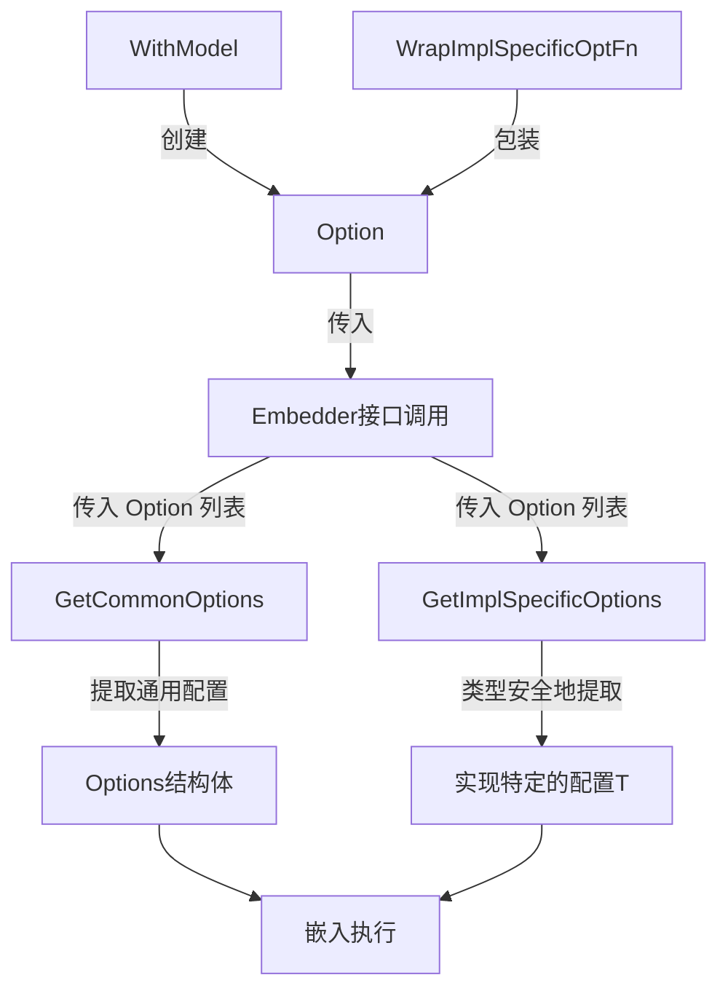

# embedding_options 模块技术深度解析

## 1. 模块概述与问题解决

embedding_options 模块是组件系统中专门为嵌入（embedding）操作设计的配置选项管理模块。它解决了一个核心问题：**如何在保持接口简洁性的同时，支持通用配置和特定实现的扩展配置**。

在传统的嵌入接口设计中，我们通常会面临两个极端：
- 要么接口过于简单，只支持最基本的参数，无法满足不同实现的特殊需求
- 要么接口参数泛滥，充斥着各种特定实现的细节，导致接口难以理解和使用

embedding_options 采用了"通用选项 + 实现特定选项"的分离设计模式，提供了一个优雅的解决方案。

## 2. 核心心智模型

想象 embedding_options 模块就像是一个**可扩展的配置信封系统**：
- `Options` 是信封上的标准收件信息栏——所有人都能理解的通用字段
- `Option` 是可以贴在信封上的便签——既有标准便签（如 `WithModel`），也可以是自定义便签（实现特定的选项）
- `GetCommonOptions` 和 `GetImplSpecificOptions` 就像是两个分拣员——分别负责处理标准信息和自定义便签

这种设计的核心理念是：**让通用配置在编译时就能被验证，同时为特殊需求保留动态扩展的灵活性**。

## 3. 架构与数据流程



### 架构解析：

1. **双层配置提取机制**：
   - 调用方传入 `Option` 列表，这些选项可能同时包含通用选项和实现特定选项
   - 系统分别通过 `GetCommonOptions` 和 `GetImplSpecificOptions` 提取各自需要的配置
   - 两者互不干扰，通用配置处理不知道实现特定配置的存在，反之亦然

2. **组件角色**：
   - `Options`：通用配置容器，目前仅包含 `Model` 字段
   - `Option`：配置选项的统一载体，内部通过两个字段分别处理通用和特定配置
   - `WithModel`：标准构造函数，创建设置模型名称的选项
   - `WrapImplSpecificOptFn`：扩展机制，用于包装实现特定的选项函数
   - `GetCommonOptions`：通用配置提取器
   - `GetImplSpecificOptions`：类型安全的特定配置提取器

## 4. 核心组件深度解析

### 4.1 Options 结构体

```go
type Options struct {
    // Model is the model name for the embedding.
    Model *string
}
```

**设计意图**：
- 这是嵌入操作的通用配置集合，目前只包含 `Model` 字段，体现了**最小可用原则**
- 采用指针类型 `*string` 而非值类型，是为了区分"未设置"和"设置为空值"两种状态
- 字段设计保持精简，只有真正所有实现都需要的配置才会放在这里

**使用场景**：
- 当你需要设置或获取嵌入模型名称时使用
- 作为 `GetCommonOptions` 的输入/输出，承载通用配置

### 4.2 Option 结构体

```go
type Option struct {
    apply func(opts *Options)
    implSpecificOptFn any
}
```

**设计意图**：
这是整个模块的核心设计——一个**双轨制的选项载体**：
- `apply` 字段：用于处理通用配置的函数，签名固定为 `func(*Options)`
- `implSpecificOptFn` 字段：用于存储实现特定配置的函数，类型为 `any`，提供最大灵活性

这种设计使得一个 `Option` 实例可以同时（或单独）携带通用配置和特定配置，但在实际使用中，通常一个 `Option` 只负责其中一种。

**内部机制**：
- 当调用 `GetCommonOptions` 时，只会使用 `apply` 字段
- 当调用 `GetImplSpecificOptions` 时，只会使用 `implSpecificOptFn` 字段，并通过类型断言确保安全

### 4.3 WithModel 函数

```go
func WithModel(model string) Option {
    return Option{
        apply: func(opts *Options) {
            opts.Model = &model
        },
    }
}
```

**设计意图**：
- 标准的函数式选项构造器，遵循 Go 语言的常见模式
- 通过闭包捕获 `model` 参数，在调用 `apply` 时设置到 `Options` 中
- 注意这里直接取了参数的地址，依赖 Go 的闭包变量捕获机制

**使用示例**：
```go
opts := embedding.GetCommonOptions(nil, embedding.WithModel("text-embedding-3-small"))
// opts.Model 现在指向 "text-embedding-3-small"
```

### 4.4 GetCommonOptions 函数

```go
func GetCommonOptions(base *Options, opts ...Option) *Options {
    if base == nil {
        base = &Options{}
    }

    for i := range opts {
        opt := opts[i]
        if opt.apply != nil {
            opt.apply(base)
        }
    }

    return base
}
```

**设计意图**：
- 提供默认值支持：通过 `base` 参数可以传入带有默认值的配置
- 安全处理：即使 `base` 为 `nil` 也能正常工作
- 顺序应用：按照传入顺序依次应用选项，后面的选项会覆盖前面的

**内部流程**：
1. 初始化基础配置（如果未提供）
2. 遍历所有选项
3. 对每个选项，检查是否有 `apply` 函数
4. 如果有，调用该函数修改基础配置
5. 返回最终的配置

**使用示例**：
```go
// 方式1：从零开始
opts := embedding.GetCommonOptions(nil, embedding.WithModel("model1"))

// 方式2：使用默认值
defaultModel := "default-model"
baseOpts := &embedding.Options{Model: &defaultModel}
opts := embedding.GetCommonOptions(baseOpts, embedding.WithModel("override-model"))
// 结果 Model 为 "override-model"
```

### 4.5 WrapImplSpecificOptFn 函数

```go
func WrapImplSpecificOptFn[T any](optFn func(*T)) Option {
    return Option{
        implSpecificOptFn: optFn,
    }
}
```

**设计意图**：
这是模块的**扩展门户**，允许具体的嵌入实现定义自己的选项，同时保持与通用接口的兼容性。

- 使用泛型 `T` 确保类型安全
- 将实现特定的函数包装成标准的 `Option` 类型
- 只设置 `implSpecificOptFn` 字段，不设置 `apply` 字段

**为什么这样设计**：
如果没有这个函数，每个实现都需要定义自己的选项类型，导致接口碎片化。通过这种包装，所有实现都可以使用统一的 `Option` 类型。

### 4.6 GetImplSpecificOptions 函数

```go
func GetImplSpecificOptions[T any](base *T, opts ...Option) *T {
    if base == nil {
        base = new(T)
    }

    for i := range opts {
        opt := opts[i]
        if opt.implSpecificOptFn != nil {
            optFn, ok := opt.implSpecificOptFn.(func(*T))
            if ok {
                optFn(base)
            }
        }
    }

    return base
}
```

**设计意图**：
这是实现特定配置的**类型安全提取器**，核心特点是：
- 泛型函数，支持任意类型的配置结构 `T`
- 通过类型断言 `opt.implSpecificOptFn.(func(*T))` 安全地提取配置
- 忽略不匹配的选项，不会因为选项类型不匹配而报错

**内部机制**：
1. 初始化基础配置（如果未提供）
2. 遍历所有选项
3. 对每个选项，检查是否有 `implSpecificOptFn`
4. 尝试将其断言为 `func(*T)` 类型
5. 如果断言成功，调用该函数修改基础配置
6. 返回最终的配置

**关键点**：
- 类型断言失败时会静默跳过，这是**故意设计**的，允许在同一个选项列表中混合多个实现的特定选项
- 这种设计使得一个选项列表可以被多个不同的实现使用，每个实现只会提取自己关心的选项

## 5. 依赖关系分析

### 5.1 被谁依赖（上游）

embedding_options 模块主要被以下组件依赖：

1. **[Embedder 接口](embedding_and_prompt_interfaces.md)**：
   - 接口定义：`EmbedStrings(ctx context.Context, texts []string, opts ...Option) ([][]float64, error)`
   - 所有嵌入器实现都需要接受 `Option` 列表作为参数

2. **[embedding_callback_extra](embedding_callback_extra.md)**：
   - 回调输入输出中包含配置信息，与选项系统协同工作

### 5.2 依赖谁（下游）

embedding_options 模块是一个相对独立的基础模块，不依赖其他复杂组件，只使用 Go 标准库。

### 5.3 数据契约

**输入契约**：
- `Option` 列表可以包含任意组合的通用选项和实现特定选项
- `GetCommonOptions` 的 `base` 参数可以为 `nil`，表示从零开始
- `GetImplSpecificOptions` 的 `base` 参数可以为 `nil`，会自动创建零值实例

**输出契约**：
- `GetCommonOptions` 总是返回非 `nil` 的 `*Options`
- `GetImplSpecificOptions` 总是返回非 `nil` 的 `*T`
- 选项按照传入顺序应用，后传入的选项覆盖先传入的选项

## 6. 设计决策与权衡

### 6.1 双轨制设计 vs 单轨继承

**决策**：采用了"通用选项 + 实现特定选项"的双轨制设计，而不是让实现特定选项继承通用选项。

**原因**：
- 嵌入操作的通用配置非常少（目前只有 `Model`），继承体系带来的收益不大
- 双轨制更加灵活，允许一个选项列表被多个实现使用，每个实现提取自己需要的部分
- 避免了继承体系可能带来的"脆弱基类"问题

**权衡**：
- ✅ 优点：灵活性高，解耦好，扩展简单
- ❌ 缺点：调用方可能会传入对特定实现毫无意义的选项（但会被安全忽略）

### 6.2 指针字段 vs 值字段

**决策**：`Options` 中的 `Model` 字段使用 `*string` 而非 `string`。

**原因**：
- 在 Go 中，值类型的零值是有意义的（空字符串），无法区分"用户没有设置"和"用户设置为空"
- 使用指针可以明确表达三种状态：未设置（nil）、设置为空值（指向空字符串）、设置为非空值

**权衡**：
- ✅ 优点：语义清晰，能表达更多状态
- ❌ 缺点：使用稍显繁琐，需要注意 nil 检查

### 6.3 静默忽略不匹配选项 vs 报错

**决策**：`GetImplSpecificOptions` 在遇到类型不匹配的选项时会静默忽略，而不是返回错误。

**原因**：
- 允许在同一个选项列表中混合多个实现的特定选项
- 支持"选项透传"模式——上游组件可以收集所有选项，下游组件各自提取需要的
- 符合 Go 的"容错"设计哲学，尽量让程序正常运行

**权衡**：
- ✅ 优点：灵活性极高，组合性好
- ❌ 缺点：错误的选项类型不会立即被发现，可能导致调试困难

**缓解措施**：
- 在实现的构造函数或初始化阶段进行配置验证
- 提供良好的文档，说明哪些选项是有效的

### 6.4 函数式选项 vs 结构体选项

**决策**：采用函数式选项模式，而不是直接传递配置结构体。

**原因**：
- 这是 Go 社区广泛接受的模式，具有良好的可读性
- 支持可选参数，不需要为每个参数组合定义构造函数
- 向后兼容性好——添加新选项不会破坏现有代码

**权衡**：
- ✅ 优点：可读性好，扩展性强，向后兼容
- ❌ 缺点：比直接传递结构体稍微多一些运行时开销（可以忽略不计）

## 7. 使用指南与最佳实践

### 7.1 基本使用（通用选项）

```go
// 创建嵌入器（伪代码）
embedder := NewOpenAIEmbedder(apiKey)

// 使用 WithModel 选项
embeddings, err := embedder.EmbedStrings(
    ctx,
    []string{"hello world"},
    embedding.WithModel("text-embedding-3-small"),
)
```

### 7.2 实现特定选项的定义与使用

假设你正在实现一个自定义的嵌入器，需要支持一些特殊选项：

```go
// 步骤1：定义你的特定配置结构体
type MyEmbedderOptions struct {
    BatchSize    int
    Timeout      time.Duration
    UseCache     bool
}

// 步骤2：定义设置这些选项的函数
func WithBatchSize(size int) embedding.Option {
    return embedding.WrapImplSpecificOptFn(func(opts *MyEmbedderOptions) {
        opts.BatchSize = size
    })
}

func WithTimeout(timeout time.Duration) embedding.Option {
    return embedding.WrapImplSpecificOptFn(func(opts *MyEmbedderOptions) {
        opts.Timeout = timeout
    })
}

// 步骤3：在你的嵌入器实现中提取这些选项
func (e *MyEmbedder) EmbedStrings(ctx context.Context, texts []string, opts ...embedding.Option) ([][]float64, error) {
    // 提取通用选项
    commonOpts := embedding.GetCommonOptions(nil, opts...)
    
    // 提取特定选项（带默认值）
    myOpts := embedding.GetImplSpecificOptions(&MyEmbedderOptions{
        BatchSize: 32,
        Timeout:   30 * time.Second,
        UseCache:  true,
    }, opts...)
    
    // 使用配置进行处理...
    return e.doEmbed(ctx, texts, commonOpts, myOpts)
}

// 步骤4：用户使用
embeddings, err := embedder.EmbedStrings(
    ctx,
    texts,
    embedding.WithModel("my-model"),
    WithBatchSize(64),
    WithTimeout(60*time.Second),
)
```

### 7.3 最佳实践

1. **总是提供默认值**：
   ```go
   // ✅ 好的做法
   myOpts := embedding.GetImplSpecificOptions(&MyEmbedderOptions{
       BatchSize: 32,  // 默认值
   }, opts...)
   
   // ❌ 避免的做法
   myOpts := embedding.GetImplSpecificOptions(nil, opts...)
   // 然后在代码中检查零值，容易出错
   ```

2. **命名一致性**：
   - 选项构造函数使用 `WithXxx` 格式
   - 配置结构体字段使用导出的驼峰命名

3. **配置验证**：
   在提取选项后进行验证：
   ```go
   if myOpts.BatchSize <= 0 {
       return nil, fmt.Errorf("batch size must be positive, got %d", myOpts.BatchSize)
   }
   ```

4. **文档说明**：
   在实现的文档中明确说明支持哪些选项，包括通用选项和实现特定选项。

## 8. 边缘情况与陷阱

### 8.1 选项覆盖顺序

**陷阱**：后传入的选项会覆盖先传入的选项，这可能导致意外行为。

```go
opts := embedding.GetCommonOptions(
    nil,
    embedding.WithModel("model-1"),
    embedding.WithModel("model-2"),  // 这个会生效
)
// opts.Model 是 "model-2"
```

**注意**：这是有意设计的行为，但使用时需要注意顺序。

### 8.2 闭包变量捕获

**陷阱**：在循环中创建选项时要小心闭包变量捕获问题。

```go
// ❌ 错误的做法
models := []string{"model1", "model2", "model3"}
var opts []embedding.Option
for _, m := range models {
    opts = append(opts, embedding.WithModel(m))  // 所有闭包都捕获同一个 m 变量
}
// 最终所有选项可能都设置为 "model3"

// ✅ 正确的做法
for _, m := range models {
    m := m  // 创建循环内的局部变量
    opts = append(opts, embedding.WithModel(m))
}
```

### 8.3 类型不匹配被静默忽略

**陷阱**：如果你使用了错误类型的实现特定选项，它会被静默忽略，不会报错。

```go
// 假设这里有两个不同的嵌入器实现
embedder1 := NewEmbedder1()
embedder2 := NewEmbedder2()

// 创建选项列表，包含 embedder2 的选项
opts := []embedding.Option{
    embedding.WithModel("common-model"),
    WithEmbedder2SpecificOption("value"),  // 这个对 embedder1 无效
}

// 在 embedder1 中使用
embeddings, err := embedder1.EmbedStrings(ctx, texts, opts...)
// 不会报错，但 WithEmbedder2SpecificOption 会被忽略
```

**缓解**：在开发阶段添加调试日志，记录哪些选项被应用了。

### 8.4 nil 指针解引用

**陷阱**：虽然 `GetCommonOptions` 总是返回非 nil 的 `*Options`，但其中的字段可能是 nil。

```go
opts := embedding.GetCommonOptions(nil)  // 没有传入任何选项
// opts.Model 是 nil

// ❌ 危险的做法
model := *opts.Model  // 会 panic

// ✅ 安全的做法
var model string
if opts.Model != nil {
    model = *opts.Model
} else {
    model = "default-model"
}
```

## 9. 与其他模块的关系

embedding_options 模块是组件系统中选项设计模式的一个实例，类似的模式也应用在其他组件中：

- [model_options_and_callbacks](model_options_and_callbacks.md)：模型组件的选项系统，设计几乎完全相同
- [tool_options_and_utilities](tool_options_and_utilities.md)：工具组件的选项系统
- [retriever_indexer_options_and_callbacks](retriever_indexer_options_and_callbacks.md)：检索器和索引器的选项系统

这种一致性设计使得整个系统的学习曲线更加平缓，一旦理解了 embedding_options，就能快速理解其他组件的选项系统。

## 10. 总结

embedding_options 模块是一个看似简单但设计精妙的配置管理模块。它通过"通用选项 + 实现特定选项"的双轨制设计，在保持接口简洁的同时提供了极大的灵活性。

关键要点：
1. **分离关注点**：通用配置和实现特定配置分离处理
2. **类型安全**：通过泛型和类型断言确保类型安全
3. **灵活组合**：允许选项列表被多个实现使用
4. **向后兼容**：函数式选项模式确保良好的向后兼容性

对于新贡献者，理解这个模块的设计理念将帮助你更好地使用和扩展整个组件系统。
