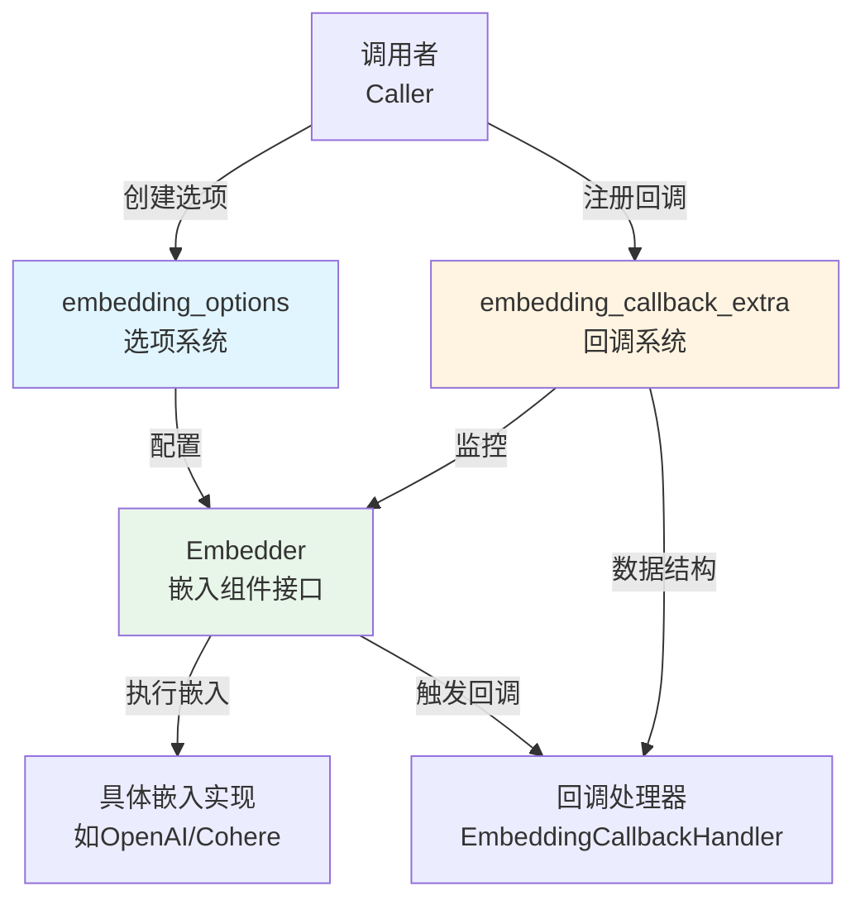

# Embedding Options & Callbacks (向量化配置与回调)

## 模块概述

`embedding_options_and_callbacks` 模块是一个专门为嵌入式组件设计的配置和回调系统。想象一下，如果你在构建一个需要将文本转换为向量表示的系统（比如语义搜索或推荐系统），你需要一种灵活的方式来配置嵌入模型并监控其执行过程——这正是这个模块要解决的问题。

这个模块在整个架构中扮演着**配置提供者和事件观察者**的角色：它不直接执行嵌入计算，而是为嵌入组件提供标准化的选项定义和回调数据结构，使得不同的嵌入实现可以以统一的方式被配置和监控。

### 为什么这个模块很重要？

在实际的生产环境中，嵌入组件通常涉及以下问题：
1. **多模型支持**：不同的嵌入模型（OpenAI、Cohere、本地模型等）有不同的参数和特性
2. **成本控制**：嵌入操作通常按 token 计费，需要追踪使用量
3. **可观测性**：需要监控嵌入操作的性能、错误率和延迟
4. **灵活性**：不同的应用场景需要不同的配置（如不同的向量维度、编码格式等）

这个模块通过提供统一的选项机制和回调系统，优雅地解决了这些问题。

## 核心组件解析

本模块分为两个主要子模块，每个子模块都有详细的文档：
- [embedding_options](embedding_options.md)：选项系统的详细实现
- [embedding_callback_extra](embedding_callback_extra.md)：回调系统的详细实现

### 1. 选项系统 (Options)

选项系统是模块的核心配置机制，采用了函数式选项模式。

#### `Options` 结构体
```go
type Options struct {
    Model *string
}
```

这个结构体定义了嵌入组件的通用配置选项。目前只包含 `Model` 字段，但设计上可以轻松扩展。

#### `Option` 结构体
```go
type Option struct {
    apply func(opts *Options)
    implSpecificOptFn any
}
```

这是一个巧妙的设计，它同时支持：
- **通用选项**：通过 `apply` 函数修改 `Options` 结构体
- **实现特定选项**：通过 `implSpecificOptFn` 存储类型安全的特定实现选项

#### 关键方法

- **`WithModel(model string) Option`**：设置嵌入模型名称的便捷函数
- **`GetCommonOptions(base *Options, opts ...Option) *Options`**：从选项列表中提取通用选项
- **`WrapImplSpecificOptFn[T any](optFn func(*T)) Option`**：包装实现特定的选项函数
- **`GetImplSpecificOptions[T any](base *T, opts ...Option) *T`**：提取实现特定的选项

这种设计的优势在于**扩展性和向后兼容性**：新的通用选项可以添加到 `Options` 结构体而不破坏现有代码，同时不同的嵌入实现可以拥有自己特定的配置。

### 2. 回调系统 (Callback Extra)

回调系统定义了嵌入组件执行过程中产生的事件数据结构，用于监控、日志记录和性能分析。

#### 核心数据结构

**`TokenUsage`**：记录令牌使用情况
```go
type TokenUsage struct {
    PromptTokens     int
    CompletionTokens int
    TotalTokens      int
}
```

**`Config`**：记录嵌入配置
```go
type Config struct {
    Model          string
    EncodingFormat string
}
```

**`ComponentExtra`**：组件额外信息，组合了配置和令牌使用情况
```go
type ComponentExtra struct {
    Config     *Config
    TokenUsage *TokenUsage
}
```

**`CallbackInput`**：回调输入数据
```go
type CallbackInput struct {
    Texts  []string
    Config *Config
    Extra  map[string]any
}
```

**`CallbackOutput`**：回调输出数据
```go
type CallbackOutput struct {
    Embeddings [][]float64
    Config     *Config
    TokenUsage *TokenUsage
    Extra      map[string]any
}
```

#### 转换函数

- **`ConvCallbackInput(src callbacks.CallbackInput) *CallbackInput`**：将通用回调输入转换为嵌入特定的回调输入
- **`ConvCallbackOutput(src callbacks.CallbackOutput) *CallbackOutput`**：将通用回调输出转换为嵌入特定的回调输出

这些函数支持多种输入类型的自动转换，增强了系统的灵活性。

## 架构设计与数据流

### 模块架构图



### 设计思想

这个模块的设计体现了两个重要的软件工程原则：

1. **关注点分离**：选项定义与嵌入逻辑分离，回调数据结构与实际回调处理分离
2. **开闭原则**：对扩展开放，对修改关闭——可以轻松添加新选项而不破坏现有代码

### 数据流

当嵌入组件被调用时，数据流向如下：

1. **选项应用阶段**：
   - 调用者创建 `Option` 列表（例如 `WithModel("text-embedding-ada-002")`）
   - 嵌入组件使用 `GetCommonOptions` 和 `GetImplSpecificOptions` 提取配置
   - 配置被应用到嵌入模型

2. **回调触发阶段**：
   - 嵌入开始前，创建 `CallbackInput` 并通过回调系统发送
   - 嵌入执行过程中，可能发送中间状态更新
   - 嵌入完成后，创建 `CallbackOutput` 包含结果、令牌使用情况等信息并发送

3. **回调处理阶段**：
   - 回调处理器（如 `EmbeddingCallbackHandler`）接收回调
   - 使用 `ConvCallbackInput` 和 `ConvCallbackOutput` 转换数据
   - 执行日志记录、监控、性能分析等操作

## 设计决策与权衡

### 1. 函数式选项模式 vs 配置结构体

**选择**：函数式选项模式

**原因**：
- 提供了更好的向后兼容性——添加新选项不会破坏现有代码
- 允许可选参数的灵活组合
- 支持实现特定选项而不污染通用接口

**权衡**：
- 代码稍微复杂一些
- 需要更多的辅助函数

### 2. 双重选项系统（通用 + 实现特定）

**选择**：同时支持通用选项和实现特定选项

**原因**：
- 通用选项确保了不同嵌入实现的一致性
- 实现特定选项允许充分利用各嵌入服务的独特功能
- 避免了最小公分母问题

**权衡**：
- 增加了一定的复杂性
- 需要用户理解两种选项的区别

### 3. 回调数据结构的类型安全

**选择**：使用类型断言进行转换，同时提供便捷的转换函数

**原因**：
- 保持与通用回调系统的兼容性
- 提供类型安全的访问方式
- 支持多种输入类型的自动转换

**权衡**：
- 类型断言在运行时才会失败
- 需要文档清楚说明支持的类型

## 与其他模块的关系

### 依赖关系

- **被依赖**：[embedding_and_prompt_interfaces](embedding_and_prompt_interfaces.md) - 嵌入组件接口使用这些选项和回调结构
- **依赖**：[Callbacks System](callbacks_system.md) - 基于通用回调系统构建
- **被使用**：[Flow Retrievers](flow_retrievers.md), [Flow Indexers](flow_indexers.md) - 这些模块中的嵌入组件会使用这些选项和回调

### 在更大架构中的位置

这个模块是整个组件选项和回调框架的一部分，与以下模块并列：
- [model_options_and_callbacks](model_options_and_callbacks.md) - 模型组件的选项和回调
- [tool_options_and_utilities](tool_options_and_utilities.md) - 工具组件的选项和工具
- [retriever_indexer_options_and_callbacks](retriever_indexer_options_and_callbacks.md) - 检索器和索引器的选项和回调
- [prompt_options_and_callbacks](prompt_options_and_callbacks.md) - 提示模板的选项和回调
- [document_options_and_callbacks](document_options_and_callbacks.md) - 文档处理的选项和回调

这些模块共同构成了一个统一的组件配置和监控框架，使得不同类型的组件可以以一致的方式被配置和监控。

### 交互示例

当检索器使用嵌入组件时：

1. 检索器创建嵌入选项（如 `WithModel("text-embedding-ada-002")`）
2. 检索器配置回调处理器（如 `EmbeddingCallbackHandler`）
3. 检索器调用嵌入组件的 `Embed` 方法，传入选项
4. 嵌入组件处理选项并执行嵌入
5. 嵌入组件触发回调，传递 `CallbackInput` 和 `CallbackOutput`
6. 回调处理器接收并处理这些回调数据

## 实际使用示例

### 示例 1: 基本嵌入配置

```go
import (
    "context"
    "github.com/cloudwego/eino/components/embedding"
)

func BasicEmbeddingExample(embedder embedding.Embedder) error {
    ctx := context.Background()
    texts := []string{"hello world", "goodbye world"}
    
    // 配置嵌入模型
    embeddings, err := embedder.EmbedStrings(ctx, texts, 
        embedding.WithModel("text-embedding-3-small"))
    
    if err != nil {
        return err
    }
    
    // 使用嵌入向量...
    _ = embeddings
    return nil
}
```

### 示例 2: 结合默认值的选项配置

```go
func WithDefaultsExample(embedder embedding.Embedder, userOpts ...embedding.Option) error {
    ctx := context.Background()
    texts := []string{"hello world"}
    
    // 设置默认选项
    defaultModel := "text-embedding-3-small"
    baseOpts := &embedding.Options{
        Model: &defaultModel,
    }
    
    // 合并用户选项
    finalOpts := embedding.GetCommonOptions(baseOpts, userOpts...)
    
    // 这里 finalOpts.Model 会是用户指定的模型，或者默认值
    embeddings, err := embedder.EmbedStrings(ctx, texts, userOpts...)
    
    // ...
    _ = finalOpts
    _ = embeddings
    return err
}
```

### 示例 3: 实现自定义嵌入器的选项处理

```go
// CustomEmbedder 是一个自定义嵌入器实现
type CustomEmbedder struct {
    defaultModel string
}

// CustomOptions 是自定义嵌入器的特定选项
type CustomOptions struct {
    Timeout    time.Duration
    BatchSize  int
    RetryCount int
}

// WithCustomTimeout 创建自定义超时选项
func WithCustomTimeout(d time.Duration) embedding.Option {
    return embedding.WrapImplSpecificOptFn(func(opts *CustomOptions) {
        opts.Timeout = d
    })
}

// WithBatchSize 创建批处理大小选项
func WithBatchSize(size int) embedding.Option {
    return embedding.WrapImplSpecificOptFn(func(opts *CustomOptions) {
        opts.BatchSize = size
    })
}

// EmbedStrings 实现 Embedder 接口
func (e *CustomEmbedder) EmbedStrings(ctx context.Context, texts []string, opts ...embedding.Option) ([][]float64, error) {
    // 提取通用选项
    commonOpts := embedding.GetCommonOptions(nil, opts...)
    
    // 确定使用的模型
    model := e.defaultModel
    if commonOpts.Model != nil {
        model = *commonOpts.Model
    }
    
    // 提取特定选项，设置默认值
    customOpts := embedding.GetImplSpecificOptions(&CustomOptions{
        Timeout:    30 * time.Second,
        BatchSize:  100,
        RetryCount: 3,
    }, opts...)
    
    // 创建回调输入
    callbackInput := &embedding.CallbackInput{
        Texts: texts,
        Config: &embedding.Config{
            Model: model,
        },
    }
    
    // ... 这里执行实际的嵌入逻辑，使用 customOpts 中的配置 ...
    
    // 模拟结果
    embeddings := make([][]float64, len(texts))
    for i := range texts {
        embeddings[i] = []float64{0.1, 0.2, 0.3} // 示例向量
    }
    
    // 创建回调输出
    callbackOutput := &embedding.CallbackOutput{
        Embeddings: embeddings,
        Config: &embedding.Config{
            Model: model,
        },
        TokenUsage: &embedding.TokenUsage{
            PromptTokens: len(texts) * 5, // 估算
            TotalTokens:  len(texts) * 5,
        },
    }
    
    return embeddings, nil
}
```

### 示例 4: 使用回调处理器监控嵌入操作

```go
import (
    "context"
    "log"
    "time"
    
    "github.com/cloudwego/eino/callbacks"
    "github.com/cloudwego/eino/components/embedding"
    "github.com/cloudwego/eino/utils/callbacks/template"
)

func EmbeddingWithCallbacksExample(embedder embedding.Embedder) error {
    // 创建回调处理器
    handler := &template.EmbeddingCallbackHandler{
        OnStart: func(ctx context.Context, runInfo *callbacks.RunInfo, input *embedding.CallbackInput) context.Context {
            log.Printf("[Embedding] Starting to embed %d texts", len(input.Texts))
            if input.Config != nil {
                log.Printf("[Embedding] Model: %s", input.Config.Model)
            }
            // 可以在 ctx 中存储开始时间
            return context.WithValue(ctx, "start_time", time.Now())
        },
        OnEnd: func(ctx context.Context, runInfo *callbacks.RunInfo, output *embedding.CallbackOutput) context.Context {
            // 计算耗时
            if startTime, ok := ctx.Value("start_time").(time.Time); ok {
                duration := time.Since(startTime)
                log.Printf("[Embedding] Completed in %v", duration)
            }
            
            log.Printf("[Embedding] Generated %d embeddings", len(output.Embeddings))
            if output.TokenUsage != nil {
                log.Printf("[Embedding] Token usage - Prompt: %d, Total: %d", 
                    output.TokenUsage.PromptTokens, 
                    output.TokenUsage.TotalTokens)
            }
            
            return ctx
        },
        OnError: func(ctx context.Context, runInfo *callbacks.RunInfo, err error) context.Context {
            log.Printf("[Embedding] Error occurred: %v", err)
            return ctx
        },
    }
    
    // 注意：实际使用时，需要将回调处理器注册到回调管理器中
    // 这里只是展示回调处理器的结构和用法
    
    // 执行嵌入操作
    ctx := context.Background()
    texts := []string{"hello world", "goodbye world"}
    embeddings, err := embedder.EmbedStrings(ctx, texts, embedding.WithModel("text-embedding-3-small"))
    
    if err != nil {
        return err
    }
    
    _ = embeddings
    return nil
}
```

## 最佳实践与注意事项

### 最佳实践

1. **始终提供默认值**：使用 `GetCommonOptions` 和 `GetImplSpecificOptions` 时，传入带有默认值的基础选项

2. **类型安全的实现特定选项**：使用 `WrapImplSpecificOptFn` 包装实现特定选项，确保类型安全

3. **合理使用回调**：回调应该轻量级，避免在回调中执行耗时操作

4. **错误处理**：在使用 `ConvCallbackInput` 和 `ConvCallbackOutput` 后，检查返回值是否为 nil

### 注意事项

1. **选项顺序**：后面的选项会覆盖前面的选项，注意选项的顺序

2. **nil 指针处理**：`Options` 中的字段是指针，使用前检查是否为 nil

3. **回调数据的可变性**：回调数据结构中的字段可能被修改，避免在多个地方共享同一个实例

4. **性能考虑**：虽然回调系统很有用，但过多的回调可能会影响性能，根据需要选择合适的回调级别

## 总结

`embedding_options_and_callbacks` 模块是一个精心设计的配置和回调系统，为嵌入组件提供了灵活、可扩展的支持。它的函数式选项模式和双重选项系统使得配置既统一又灵活，而回调系统则为监控和日志记录提供了标准化的数据结构。

理解这个模块的设计思想和使用方法，将帮助你更好地构建和使用基于嵌入的系统，无论是语义搜索、推荐系统还是其他需要向量表示的应用。
