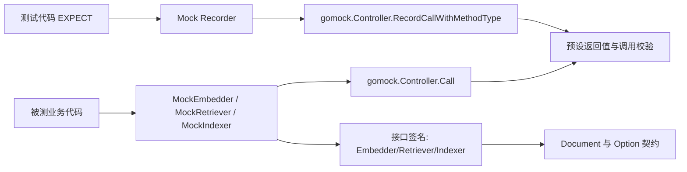

# embedding_retrieval_indexing_mocks

`embedding_retrieval_indexing_mocks` 模块本质上是“向量检索链路的测试替身工厂”：它不负责真的做 embedding、检索或索引，而是把 `Embedder`、`Retriever`、`Indexer` 这三个核心能力替换成可编排、可断言的 GoMock 对象。这样做的意义在于，把测试从“依赖外部向量库和数据状态的慢、脆、不稳定集成验证”，转成“针对调用契约的快速、确定性单元验证”。如果把真实 RAG 基础设施比作一套真实仓储系统，这个模块就是可编程的“模拟仓库 + 进出库摄像头”：你不需要真的搬货，只需要验证系统有没有按约定下单、入库、出库。

## 架构角色与数据流

从架构位置看，这个模块是 **测试层的接口替身（test double adapter）**，它贴着接口边界工作，帮助上层业务代码验证“调用行为”而不是“底层算法正确性”。



理解这张图的关键是把流程分成两条并行轨道：

第一条是“执行轨道”：被测代码像调用真实组件一样调用 `EmbedStrings`、`Retrieve`、`Store`，mock 方法会把入参打包后转发给 `gomock.Controller.Call`，然后从 controller 返回的结果中做类型断言并返回给被测代码。

第二条是“声明轨道”：测试代码通过 `EXPECT()` 拿到 recorder，然后调用同名 recorder 方法（例如 `MockRetrieverMockRecorder.Retrieve`）去注册期望；注册动作最终落到 `gomock.Controller.RecordCallWithMethodType`。执行轨道和声明轨道在 gomock controller 汇合，形成“调用是否发生、参数是否匹配、返回什么”的统一裁决。

这个双轨模型是本模块最重要的心智模型：**mock 实例负责转发调用，recorder 负责声明契约，controller 负责仲裁**。

## 模块解决的问题：为什么不能用“朴素方案”

在 embedding/retrieval/indexing 场景里，朴素测试通常会直接接真实实现：真实 embedding 服务、真实向量库、真实索引写入。问题是这会引入三类噪声。

其一是环境噪声。网络、服务可用性、索引状态、并发写入都会让测试结果非确定。其二是性能噪声。一次检索链路跑完常常比纯内存调用慢一个或多个数量级。其三是诊断噪声。测试失败时你很难区分是业务编排错了，还是外部服务波动。

这个模块的设计洞察是：在单元测试层，你真正想验证的是“是否按接口契约调用”，例如是否调用了 `Retriever.Retrieve(ctx, query, opts...)`，是否给了正确 query，是否正确处理了错误返回；你并不想在这里验证向量检索召回质量。于是该模块把接口行为冻结成可编排对象，让测试聚焦于契约层。

## 组件深潜

### `MockEmbedder` 与 `MockEmbedderMockRecorder`

`MockEmbedder` 是 `Embedder` 接口的 mock，实现的方法是：

- `EmbedStrings(ctx context.Context, texts []string, opts ...embedding.Option) ([][]float64, error)`

内部机制非常标准化：先 `m.ctrl.T.Helper()` 标记测试辅助栈帧，再把固定参数 `ctx/texts` 与可变参数 `opts...` 合并成 `[]any`，调用 `m.ctrl.Call(m, "EmbedStrings", varargs...)`，最后把返回值解包成 `[][]float64` 和 `error`。

`MockEmbedderMockRecorder` 是与之配套的“期望声明器”。它的 `EmbedStrings(ctx, texts any, opts ...any) *gomock.Call` 不执行业务逻辑，只记录期望调用签名。这里使用 `reflect.TypeOf((*MockEmbedder)(nil).EmbedStrings)` 将方法类型显式绑定到 recorder 注册中，保证 gomock 能做正确的方法匹配。

`NewMockEmbedder(ctrl *gomock.Controller)` 与 `EXPECT()` 是配套入口：前者注入 controller 并建立 recorder，后者暴露 recorder 给测试代码。

### `MockRetriever` 与 `MockRetrieverMockRecorder`

这一组与上面模式完全同构，只是接口换成检索语义：

- `Retrieve(ctx context.Context, query string, opts ...retriever.Option) ([]*schema.Document, error)`

这里的返回值 `[]*schema.Document` 把检索契约绑定到文档模型上，意味着上层测试可以直接构造文档切片验证后续逻辑（比如重排、拼 prompt、去重策略），而不用搭建真实检索后端。

recorder 侧的 `Retrieve(ctx, query any, opts ...any)` 同样负责注册调用预期，而不是执行检索。

### `MockIndexer` 与 `MockIndexerMockRecorder`

索引 mock 对应接口方法：

- `Store(ctx context.Context, docs []*schema.Document, opts ...indexer.Option) ([]string, error)`

这个签名里的 `[]string` 是文档入库后的 ID 列表，mock 可以让测试精确控制“成功返回哪些 ID”以及“何时返回错误”，从而验证上层组件对索引结果的处理分支。

结构上仍然保持统一套路：mock 方法负责 `ctrl.Call` 转发，recorder 方法负责 `RecordCallWithMethodType` 记录。

## 依赖与契约分析

这个模块本身很“薄”，但它紧贴几个关键契约。

它直接依赖 `go.uber.org/mock/gomock` 的 `Controller` 机制，这是模块最核心的运行时。离开 gomock controller，这些类型只是空壳结构体。

它在类型层依赖三个接口契约：

- `Embedder.EmbedStrings`（见 [knowledge_and_prompt_interfaces](knowledge_and_prompt_interfaces.md)）
- `Retriever.Retrieve`
- `Indexer.Store`

同时它还绑定了两个数据合同：

- `schema.Document`（见 [document_schema](document_schema.md)）作为检索和索引方法的输入/输出载体
- 各组件的 `Option` 可变参数（见 [embedding_retriever_indexer_options_and_callbacks](embedding_retriever_indexer_options_and_callbacks.md)）

关于“谁调用它”：从代码形态看，它是典型测试辅助代码（文件头 `Code generated by MockGen. DO NOT EDIT.`），通常由测试文件创建并注入到被测对象中。当前给定源码片段没有直接展示具体 `depended_by` 测试组件，因此这里不臆测具体调用方名称。

## 设计决策与权衡

这个模块最显著的设计选择是 **生成代码而不是手写 fake**。优点是接口一旦变化，重新执行 mockgen 即可同步签名，减少人工维护漂移；缺点是可读性较低、行为不具语义（只是在转发）。在这个场景里这是合理权衡，因为它的目标是“契约一致性”，不是“可解释业务逻辑”。

第二个选择是 **统一采用 variadic 参数打包到 `[]any`**。这让 `opts ...Option` 能无缝进入 gomock 调用记录；代价是返回值解包依赖运行时类型断言，若测试配置返回类型错误，问题会在执行阶段暴露。

第三个选择是 **每个接口单独一套 Mock + Recorder 类型**，而不是一个通用反射 mock。这样做牺牲了一点代码体积，换来强签名和更清晰的 IDE/编译期提示，适合 Go 生态的静态类型习惯。

## 使用方式与示例

下面是一个典型用法，展示如何在测试里声明期望并注入 mock（示例只使用源码中真实存在的方法名）。

```go
ctrl := gomock.NewController(t)
defer ctrl.Finish()

embedder := embedding.NewMockEmbedder(ctrl)
retr := retriever.NewMockRetriever(ctrl)
indexer := indexer.NewMockIndexer(ctrl)

embedder.EXPECT().
    EmbedStrings(gomock.Any(), []string{"hello"}).
    Return([][]float64{{0.1, 0.2}}, nil)

retr.EXPECT().
    Retrieve(gomock.Any(), "hello").
    Return([]*schema.Document{{ID: "d1", Content: "c1"}}, nil)

indexer.EXPECT().
    Store(gomock.Any(), gomock.Any()).
    Return([]string{"id-1"}, nil)
```

实际项目中，你会把这些 mock 作为依赖注入给被测服务，然后让 `ctrl.Finish()` 在测试结束时校验“声明过的调用是否都发生、参数是否匹配”。

## 新贡献者最该注意的点（坑位）

第一，**不要手改生成文件**。这三个文件都带有 `Code generated by MockGen. DO NOT EDIT.`，手工修改会在下次生成时丢失，也容易造成团队分支冲突。接口变化后应更新生成命令产物。

第二，**可变参数匹配是高频坑**。`opts ...Option` 在 mock 中会被逐个 append 到 `[]any`。如果你在测试里对 option 精确匹配，顺序和数量都必须一致；否则建议使用更宽松的 matcher。

第三，**返回值类型必须严格正确**。例如 `EmbedStrings` 期望 `[][]float64`，`Retrieve` 期望 `[]*schema.Document`，`Store` 期望 `[]string`。如果 `Return(...)` 填错类型，会在 mock 解包处失败。

第四，**`context.Context` 通常不做值匹配**。多数场景下使用 `gomock.Any()` 更稳妥，除非你的测试目标就是校验 context 传播。

第五，**这个模块不提供业务语义**。它不会模拟真实 embedding 维度规则、向量相似度、索引一致性。若你需要验证这些能力，应转向集成测试而不是在这里加逻辑。

## 与其他文档的关系

要理解这些 mock 所贴合的“真实接口面”，建议配合阅读：

- [knowledge_and_prompt_interfaces](knowledge_and_prompt_interfaces.md)
- [embedding_retriever_indexer_options_and_callbacks](embedding_retriever_indexer_options_and_callbacks.md)
- [document_schema](document_schema.md)
- [document_pipeline_mocks](document_pipeline_mocks.md)（同类 mock 模块，可对比风格）
