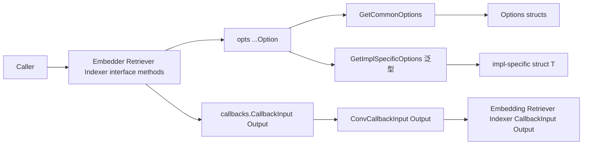

# embedding_retriever_indexer_options_and_callbacks

`embedding_retriever_indexer_options_and_callbacks` 这个模块本质上是在给 RAG 管线的三段核心能力（Embedding、Retriever、Indexer）提供统一“控制面”和“观测面”：控制面通过 `Option`/`Options` 管理调用参数，观测面通过 callback payload 管理运行时输入输出。它看起来只是一些结构体和小函数，但它解决的是一个很现实的问题：如果没有这层统一抽象，不同实现会各自定义参数、各自定义回调载荷，调用方和回调系统就会被迫写大量类型判断和胶水代码，最终让系统在扩展时变脆。

## 这个模块解决了什么问题

在 RAG 系统里，`Embedder`、`Retriever`、`Indexer` 通常来自不同供应商或不同存储后端。它们表面上都是“一个接口方法 + 一些可选参数”，但工程上有两个长期痛点。

第一个痛点是“参数既有共性又有实现差异”。比如检索都会需要 `TopK`、`ScoreThreshold`，但某些实现还会需要私有 DSL 或特殊字段。直接把所有字段堆进一个巨大 struct，会让接口持续膨胀；只用 `map[string]any`，又会失去类型提示、可读性和演进安全。这里采用的解法是双层 option：共通参数走 `apply`，实现私有参数走 `implSpecificOptFn`。

第二个痛点是“回调系统是通用协议，但业务想要强类型语义”。`callbacks` 层只知道 `callbacks.CallbackInput/CallbackOutput`，而具体组件关心的是 `[]string`、`[]*schema.Document`、`[][]float64` 这类领域类型。这个模块用 `ConvCallbackInput`/`ConvCallbackOutput` 把通用载荷桥接回组件语义载荷，避免每个 handler 重复写 type switch。

一句话总结：它不是执行检索/索引/向量化的模块，而是把这三者的**调用契约和观测契约标准化**。

## 心智模型：同一条“插线板”上的两种插头

可以把这个模块想象成机房里的标准插线板。

`Option` 是插头适配器：一类插头是标准电压（`apply`，写入 `Options` 里的通用字段），另一类是设备厂商私有插头（`implSpecificOptFn`，通过泛型提取）。调用侧只看到统一的 `opts ...Option`，实现侧可以按自己设备类型提取需要的配置。

`CallbackInput`/`CallbackOutput` 则像配电监控面板：无论原始信号是“简化值”（如 `string`、`[]string`、`[]string IDs`）还是完整结构体，它都会尽量转换为组件专属结构体，给观察系统稳定、可解析的语义。

用这个模型看代码会很清晰：**Option 负责“怎么配”，Callback extra 负责“怎么看”**。

## 架构与数据流



从调用链看，`components.embedding.interface.Embedder` 暴露 `EmbedStrings(ctx, texts, opts ...Option)`；`Retriever` 暴露 `Retrieve(ctx, query, opts ...Option)`；`Indexer` 暴露 `Store(ctx, docs, opts ...Option)`。这三个方法都把“可选参数”统一为变长 `Option` 列表。实现方通常会在方法内部先调用 `GetCommonOptions` 聚合共通字段，再调用 `GetImplSpecificOptions[T]` 聚合实现私有字段。

从观测链看，回调系统传入的是 `callbacks.CallbackInput/Output`。本模块的 `ConvCallbackInput`/`ConvCallbackOutput` 会做类型分流：如果已经是强类型结构体则直接返回；如果是简化输入（例如 embedding 的 `[]string`、retriever 的 `string`、indexer 的 `[]*schema.Document`），则包装成对应 callback struct。最终，这些强类型 payload 会被 `EmbeddingCallbackHandler`、`RetrieverCallbackHandler`、`IndexerCallbackHandler` 这类模板 handler 消费。

需要强调的是：这里的“依赖图热点”在 option 聚合和 callback 转换两个点，因为它们会出现在每次组件调用的公共路径上。

## 组件深潜

### Embedding 侧：`components.embedding.option`

`Options` 目前只定义了 `Model *string`。指针而不是值类型的意义在于区分“未设置”和“显式设置为空字符串/零值”。这对默认值继承非常关键。

`Option` 有两个槽位：`apply func(*Options)` 与 `implSpecificOptFn any`。`WithModel` 通过闭包写入 `opts.Model`。`GetCommonOptions` 会按顺序执行 `apply`，因此同字段多次设置时是“后者覆盖前者”。这是一种刻意选择：保持语义直观、实现简单，不做冲突检测。

`WrapImplSpecificOptFn[T]` 与 `GetImplSpecificOptions[T]` 形成一个泛型扩展点。你可以把私有参数函数塞入统一 `Option` 列表，再在具体实现里按 `T` 类型提取。类型不匹配会被忽略，不会报错。

### Embedding 回调：`components.embedding.callback_extra`

这里定义了五个核心结构体：`CallbackInput`、`CallbackOutput`、`Config`、`TokenUsage`、`ComponentExtra`。设计意图很明显：把“输入文本”“输出向量”“调用配置”“token 计量”“附加扩展字段”拆成可组合信息块，而不是塞进一个大而杂的对象。

`ConvCallbackInput` 支持两种来源：`*CallbackInput` 与 `[]string`。`ConvCallbackOutput` 支持 `*CallbackOutput` 与 `[][]float64`。这说明系统允许“完整语义调用”和“轻量值调用”并存。

### Retriever 侧：`components.retriever.option`

`Options` 体现了检索域关注点：`Index`、`SubIndex`、`TopK`、`ScoreThreshold`、`Embedding embedding.Embedder`、`DSLInfo map[string]any`。这里最值得注意的是 `Embedding` 字段：Retriever 显式依赖 `embedding.Embedder`，意味着某些检索实现可以在检索时自行向量化 query，而不要求上游先做 embedding。

`WithIndex`、`WithSubIndex`、`WithTopK`、`WithScoreThreshold`、`WithEmbedding`、`WithDSLInfo` 都是简单闭包写入。`GetCommonOptions`/`WrapImplSpecificOptFn`/`GetImplSpecificOptions` 与 embedding 侧保持同构，这种跨组件一致性降低了学习成本。

### Retriever 回调：`components.retriever.callback_extra`

`CallbackInput` 里包含 `Query`、`TopK`、`Filter`、`ScoreThreshold` 和 `Extra`；`CallbackOutput` 里是 `Docs []*schema.Document` 和 `Extra`。这使得回调既能记录核心检索参数，也能记录结果文档。

`ConvCallbackInput` 接受 `*CallbackInput` 或 `string`（字符串被视作 query）；`ConvCallbackOutput` 接受 `*CallbackOutput` 或 `[]*schema.Document`。这种设计非常实用：最小调用路径只需 query string，但观测层仍可拿到结构化对象。

### Indexer 侧：`components.indexer.option`

`Options` 只有两个字段：`SubIndexes []string` 和 `Embedding embedding.Embedder`。这个简洁度反映了 indexer 的责任边界：它主要关心“写到哪些子索引”和“是否/如何做向量化”。

`WithSubIndexes` 与 `WithEmbedding` 写入配置，`GetCommonOptions` 和 impl-specific 提取机制与其他组件完全一致。

### Indexer 回调：`components.indexer.callback_extra`

`CallbackInput` 是 `Docs []*schema.Document`，`CallbackOutput` 是 `IDs []string`，并都带 `Extra`。这非常契合索引操作本质：输入是文档批次，输出是存储后标识。

`ConvCallbackInput` 支持 `*CallbackInput` 或 `[]*schema.Document`；`ConvCallbackOutput` 支持 `*CallbackOutput` 或 `[]string`。

## 依赖关系分析

这个模块自身依赖非常克制，但关键耦合点清晰。

它调用的外部契约主要有三类。第一类是 `callbacks` 包，通过 `ConvCallbackInput/Output` 对接通用回调协议。第二类是 `schema.Document`，用于 retriever/indexer 回调输出输入的文档类型。第三类是 `components.embedding.interface.Embedder`，它被 retriever/indexer 的 `Options` 直接引用，形成“检索/索引可内嵌向量化能力”的组合关系。

谁依赖它？所有实现 `Embedder`、`Retriever`、`Indexer` 接口的方法都在签名层依赖这些 `Option` 类型。回调模板层（如 `EmbeddingCallbackHandler`、`RetrieverCallbackHandler`、`IndexerCallbackHandler`）在类型层直接依赖对应 callback payload。换句话说，这个模块是横向标准件：它不主导业务流程，但它定义了流程中的参数和观测数据协议。

隐含合同也很重要。比如 `GetImplSpecificOptions[T]` 的“类型不匹配即忽略”是一个软合同：调用方和实现方必须在约定层保证 `T` 一致，否则参数会静默失效。

## 设计取舍与原因

这里最核心的取舍是“统一体验”对“强约束”的优先级。

统一点体现在三组件都使用同构的 `Option` 机制与同构的 callback 转换函数，这让调用方和框架层可复用大量逻辑。代价是 impl-specific 扩展使用 `any + type assertion`，编译期不能完全兜底。

另一个取舍是“容错”对“严格失败”的优先级。所有 `ConvCallbackInput/Output` 在未知类型时返回 `nil`，而不是 panic 或 error。这样做对跨层兼容更友好，尤其在多种触发路径并存时，但也要求 handler 编写者显式处理 `nil`。

再一个取舍是“可表达未设置语义”对“字段简洁”的优先级。诸如 `Model *string`、`TopK *int`、`ScoreThreshold *float64` 都是为了保留默认继承能力；这增加了判空负担，但在配置合并场景是正确的工程选择。

## 使用方式与示例

```go
// Embedding: common option
vectors, err := emb.EmbedStrings(ctx, []string{"a", "b"},
    embedding.WithModel("text-embedding-3-large"),
)

// Embedding: impl-specific option
vectors, err = emb.EmbedStrings(ctx, []string{"a"},
    embedding.WrapImplSpecificOptFn(func(o *MyEmbeddingOption) {
        o.TimeoutMs = 3000
    }),
)
```

```go
// Retriever options
res, err := r.Retrieve(ctx, "what is eino", 
    retriever.WithTopK(5),
    retriever.WithScoreThreshold(0.7),
    retriever.WithEmbedding(emb),
    retriever.WithDSLInfo(map[string]any{"route": "hybrid"}),
)
```

```go
// Indexer options
ids, err := idx.Store(ctx, docs,
    indexer.WithSubIndexes([]string{"faq", "manual"}),
    indexer.WithEmbedding(emb),
)
```

```go
// callback payload conversion
func onRetrieverStart(in callbacks.CallbackInput) {
    ri := retriever.ConvCallbackInput(in)
    if ri == nil {
        return
    }
    // use ri.Query / ri.TopK / ri.ScoreThreshold
}
```

## 新贡献者最该警惕的点

第一，`GetCommonOptions` 会原地修改传入 `base`。如果你把同一个 `base` 跨请求复用，尤其在并发场景，会出现数据污染。

第二，`GetImplSpecificOptions[T]` 的失败是静默的。类型不匹配不会报错，配置会悄悄失效。新增 impl-specific option 时应配套单测验证提取成功。

第三，`ConvCallbackInput/Output` 也可能返回 `nil`。如果你的 callback handler 没做判空，容易出现空指针；如果做了判空但没日志，可能出现“观测悄然丢失”。

第四，`WithDSLInfo` 接收的是 `map[string]any` 引用，不会深拷贝。如果后续调用方继续修改该 map，行为会受共享可变状态影响。

第五，`Options` 的“后写覆盖前写”是默认行为。组合多个 option 来源（默认配置、租户覆盖、请求级覆盖）时，顺序本身就是语义。

## 参考阅读

- [model_options_and_callback_extras](model_options_and_callback_extras.md)：对比 model 侧相同设计模式（Option 双通道 + callback payload）。
- [tool_options_callback_and_function_adapters](tool_options_callback_and_function_adapters.md)：对比 tool 侧如何处理 option 与 callback。
- [model_and_tool_interfaces](model_and_tool_interfaces.md)：查看接口层如何暴露 `opts ...Option` 风格契约。
- [component_introspection_and_callback_switch](component_introspection_and_callback_switch.md)：理解回调模板与组件类型分发。

从架构角色上看，这个模块是一个“协议稳定器”：它不负责算法结果，但它决定了调用方如何传参、框架如何观测、实现如何扩展。对长期演进来说，这类模块的设计质量通常直接决定系统是否能持续扩展而不碎裂。