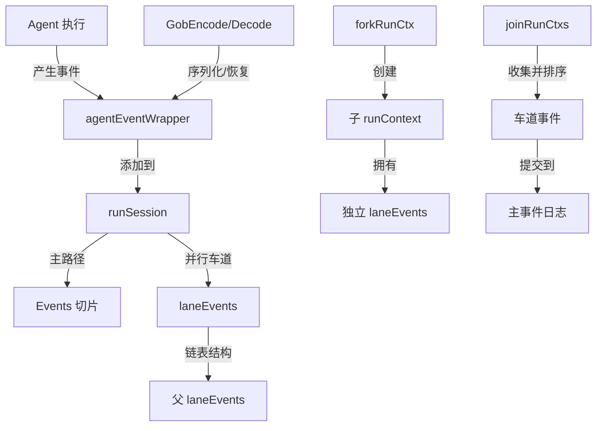

# Event System Module 技术深度解析

## 1. 模块概述

event_system 模块是 ADK（Agent Development Kit）框架中的核心组件，专注于智能体（Agent）执行过程中的事件管理、状态追踪和并发控制。它解决了在复杂多智能体系统中几个关键问题：

**问题空间：**
- 如何在智能体执行过程中统一记录和管理各类事件（输出、动作、错误）？
- 如何在支持流式输出的同时，保证事件可以被正确序列化和恢复？
- 如何处理多智能体并行执行场景下的事件顺序问题？
- 如何支持智能体执行的 checkpointing 和恢复机制？

**核心洞察：**
该模块采用了"事件包装器"模式和"车道事件"机制，将智能体执行过程中的所有信息统一封装为事件，同时通过巧妙的并发设计，既保证了并行执行的效率，又确保了事件顺序的正确性。

## 2. 核心架构与心智模型

### 2.1 整体架构



### 2.2 心智模型

可以将 event_system 想象成一个**版本控制系统**，其中：

- **runSession** 像是一个代码仓库，存储着整个执行过程的"历史记录"和"当前状态"
- **agentEventWrapper** 像是一个个提交（commit），封装了每个智能体执行的完整信息
- **laneEvents** 像是分支（branch），允许并行的智能体在各自的分支上工作
- **joinRunCtxs** 像是分支合并，将并行执行的结果按时间顺序合并回主线
- **GobEncode/Decode** 像是仓库的序列化和克隆，支持状态的持久化和恢复

这种设计使得整个系统既支持高效的并行执行，又能保证事件的正确排序和状态的可恢复性。

## 3. 核心组件深度解析

### 3.1 agentEventWrapper

**核心作用：** 事件的统一包装器，是整个事件系统的核心数据结构。

**设计亮点：**

```go
type agentEventWrapper struct {
    *AgentEvent
    mu                  sync.Mutex
    concatenatedMessage Message
    TS                  int64
    StreamErr           error
}
```

1. **嵌入式 AgentEvent**：通过嵌入 `*AgentEvent`，既保持了对原始事件的访问，又能添加额外的元数据和功能。

2. **concatenatedMessage**：专门用于处理流式输出。当流式输出结束时，完整的拼接消息会被存储在这里，以便在序列化时重建流。

3. **TS（时间戳）**：记录事件创建的纳秒级时间戳，这是解决多智能体并行执行时事件排序问题的关键。

4. **StreamErr**：记录流处理过程中的错误，防止对流的重复消费导致的错误。

**序列化设计：**

```go
func (a *agentEventWrapper) GobEncode() ([]byte, error) {
    if a.concatenatedMessage != nil && a.Output != nil && 
       a.Output.MessageOutput != nil && a.Output.MessageOutput.IsStreaming {
        // 将拼接后的消息重建为数组流，确保序列化后可以恢复
        a.Output.MessageOutput.MessageStream = 
            schema.StreamReaderFromArray([]Message{a.concatenatedMessage})
    }
    // ... 序列化逻辑
}
```

这里的设计非常巧妙：它将已经完成的流式输出在序列化时转换为基于数组的流，这样反序列化后仍然可以像读取原始流一样读取完整消息，同时避免了序列化实际流对象的复杂性。

### 3.2 runSession

**核心作用：** 管理一次完整运行的所有状态，包括事件日志和会话值。

```go
type runSession struct {
    Values    map[string]any
    valuesMtx *sync.Mutex

    Events     []*agentEventWrapper
    LaneEvents *laneEvents
    mtx        sync.Mutex
}
```

**关键机制：**

1. **双模式事件存储**：
   - 主路径执行：直接使用 `Events` 切片，需要加锁保护
   - 并行车道执行：使用 `LaneEvents` 链表结构，无锁写入

2. **会话值管理**：
   - 通过 `Values` 映射存储任意会话数据
   - 使用独立的 `valuesMtx` 保护，提高并发性能

3. **事件获取策略**：
   ```go
   func (rs *runSession) getEvents() []*agentEventWrapper {
       // 如果没有车道事件，直接返回主事件切片
       if rs.LaneEvents == nil {
           // ... 加锁返回
       }
       
       // 否则，合并主事件和所有车道事件
       // ... 合并逻辑
   }
   ```

### 3.3 laneEvents

**核心作用：** 支持并行执行的无锁事件收集机制。

```go
type laneEvents struct {
    Events []*agentEventWrapper
    Parent *laneEvents
}
```

**设计亮点：**

1. **链表结构**：通过 `Parent` 指针形成链表，支持嵌套的并行执行场景
2. **无锁写入**：每个车道有自己的 `Events` 切片，并行执行时无需加锁
3. **延迟合并**：事件只在 `joinRunCtxs` 时才合并到主线，减少了锁竞争

### 3.4 上下文管理机制

#### 3.4.1 forkRunCtx - 并行分支创建

```go
func forkRunCtx(ctx context.Context) context.Context {
    // 复制父会话，但创建新的 LaneEvents
    childSession := &runSession{
        Events:    parentRunCtx.Session.Events, // 共享已提交历史
        Values:    parentRunCtx.Session.Values, // 共享值映射
        valuesMtx: parentRunCtx.Session.valuesMtx,
    }
    
    // 创建新的车道事件
    childSession.LaneEvents = &laneEvents{
        Parent: parentRunCtx.Session.LaneEvents,
        Events: make([]*agentEventWrapper, 0),
    }
    
    // ...
}
```

**设计意图：**
- 共享已提交的历史事件和会话值，避免不必要的复制
- 为每个分支创建独立的 `LaneEvents`，实现无锁并行写入
- 通过链表结构保持分支的父子关系

#### 3.4.2 joinRunCtxs - 并行分支合并

```go
func joinRunCtxs(parentCtx context.Context, childCtxs ...context.Context) {
    // 1. 收集所有车道的新事件
    newEvents := unwindLaneEvents(childCtxs...)
    
    // 2. 按时间戳排序
    sort.Slice(newEvents, func(i, j int) bool {
        return newEvents[i].TS < newEvents[j].TS
    })
    
    // 3. 提交到父上下文
    commitEvents(parentCtx, newEvents)
}
```

**关键设计：**

1. **时间戳排序**：通过 `TS` 字段确保来自不同并行分支的事件能按实际发生顺序排列
2. **批量提交**：一次性合并和排序所有事件，减少锁竞争
3. **优化单分支情况**：当只有一个分支时，跳过排序步骤，直接提交

## 4. 数据流程分析

### 4.1 常规执行流程

1. **初始化**：`initRunCtx` 创建初始的 `runContext` 和 `runSession`
2. **事件产生**：智能体执行过程中产生 `AgentEvent`
3. **事件包装**：`addEvent` 创建 `agentEventWrapper` 并添加时间戳
4. **事件存储**：根据是否在并行车道，选择添加到 `Events` 或 `LaneEvents`
5. **事件消费**：通过 `getEvents` 获取完整的事件序列

### 4.2 并行执行流程

```
主上下文
    |
    |-- forkRunCtx --> 子上下文 1 (laneEvents A) --\
    |                                                 |-- 并行执行
    |-- forkRunCtx --> 子上下文 2 (laneEvents B) --/
    |
    |-- joinRunCtxs
         |
         |-- unwindLaneEvents (收集事件)
         |
         |-- 按 TS 排序
         |
         |-- commitEvents (提交到主事件日志)
```

### 4.3 序列化/恢复流程

1. **序列化**：
   - `GobEncode` 检查是否有拼接后的消息
   - 如果有，将其重建为数组流
   - 序列化整个 `agentEventWrapper`

2. **恢复**：
   - `GobDecode` 反序列化数据
   - 重建的流可以像普通流一样读取完整消息

## 5. 设计决策与权衡

### 5.1 时间戳排序 vs 顺序依赖

**选择**：使用时间戳（TS）对并行事件进行排序

**原因**：
- 无需在并行分支间建立复杂的顺序依赖关系
- 实现简单，性能开销小
- 符合实际执行的时间顺序

**权衡**：
- 依赖系统时间的准确性
- 极短时间内发生的事件可能存在微小的顺序不确定性

### 5.2 车道事件链表 vs 扁平结构

**选择**：使用链表结构组织车道事件

**原因**：
- 支持嵌套的并行场景
- 无需预先知道并行深度
- 内存效率高，只在需要时分配

**权衡**：
- 合并时需要遍历链表
- 代码复杂度稍高

### 5.3 流式消息的序列化策略

**选择**：将拼接后的完整消息重建为数组流

**原因**：
- 避免了序列化实际流对象的复杂性
- 保持了流接口的一致性
- 支持从 checkpoint 恢复后继续读取消息

**权衡**：
- 需要额外存储拼接后的消息
- 内存占用稍高

### 5.4 锁策略：主路径加锁 vs 车道无锁

**选择**：主路径事件使用互斥锁，车道事件无锁写入

**原因**：
- 主路径可能有多个写入者，需要同步
- 车道事件只有一个写入者，无需锁
- 减少了并行执行时的锁竞争

**权衡**：
- 需要额外的合并步骤
- 代码复杂度增加

## 6. 使用指南与最佳实践

### 6.1 会话值管理

```go
// 设置会话值
adk.AddSessionValue(ctx, "user_id", "12345")

// 获取会话值
userID, ok := adk.GetSessionValue(ctx, "user_id")

// 批量设置
adk.AddSessionValues(ctx, map[string]any{
    "key1": "value1",
    "key2": "value2",
})
```

**注意事项**：
- 会话值会被序列化，因此只能存储可序列化的类型
- 避免在会话值中存储大量数据，以免影响序列化性能

### 6.2 并行执行中的事件处理

当使用并行工作流时，系统会自动处理事件的收集和排序：

```go
// 框架内部会自动处理
// 1. 为每个并行分支创建独立的 laneEvents
// 2. 收集所有分支的事件
// 3. 按时间戳排序
// 4. 合并到主事件日志
```

**最佳实践**：
- 确保智能体执行的重要操作都有对应的事件
- 避免在并行分支间依赖事件的处理顺序
- 利用时间戳机制来正确理解事件的先后关系

### 6.3 自定义事件处理

虽然 event_system 主要由框架内部使用，但可以通过回调机制获取事件：

```go
// 框架会在适当的时机调用回调，传递事件信息
// 可以在回调中处理自定义逻辑，如日志记录、监控等
```

## 7. 边缘情况与注意事项

### 7.1 流错误处理

当处理流式输出时，需要注意 `StreamErr` 字段：
- 它会记录流处理过程中的错误
- 防止对已消费流的重复读取
- 与重试机制配合，`WillRetryError` 类型的错误表示会重试

### 7.2 时间戳精度

事件的时间戳使用纳秒级精度：
- 在大多数情况下足够准确
- 但不应依赖它来实现极高精度的事件排序逻辑
- 同一智能体内部的事件顺序通过添加顺序保证

### 7.3 嵌套并行场景

系统支持嵌套的并行执行：
- 每个层级都会有自己的 laneEvents 链表
- 合并时会正确处理所有层级的事件
- 深度嵌套可能会影响合并性能

### 7.4 序列化限制

当使用 checkpointing 功能时：
- 确保所有存储在会话值和事件中的数据都是可序列化的
- 避免存储包含不可序列化字段的结构体
- 流式输出会被转换为数组流，确保可以序列化

## 8. 与其他模块的关系

- **[adk.runner](adk_runner.md)**：使用 event_system 来管理智能体执行的事件和状态
- **[adk.interface](adk_interface.md)**：定义了 `AgentEvent`、`AgentInput`、`AgentOutput` 等核心类型
- **[schema.stream](schema_stream.md)**：提供了流处理的基础设施，用于流式输出的管理
- **[compose.graph](compose_graph.md)**：可能在并行工作流执行中使用 event_system 的功能

## 9. 总结

event_system 模块通过精巧的设计，解决了多智能体系统中的事件管理、并发控制和状态恢复问题。它的核心价值在于：

1. **统一的事件抽象**：将智能体执行的所有信息封装为事件
2. **高效的并发处理**：通过车道事件机制实现无锁并行写入
3. **正确的事件排序**：利用时间戳确保并行事件的正确顺序
4. **完善的序列化支持**：巧妙地处理流式输出的序列化问题
5. **灵活的状态管理**：提供会话值机制存储自定义状态

这些设计使得 event_system 成为 ADK 框架中支持复杂多智能体系统的关键基础设施。
