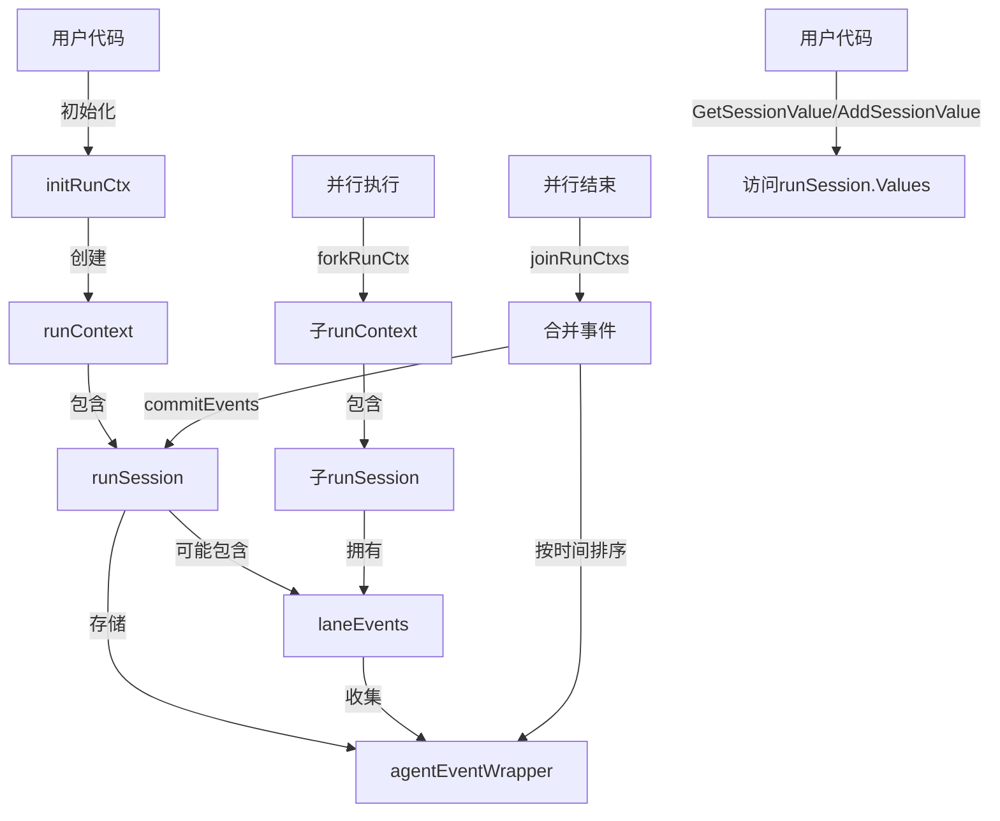

# execution_context 模块深度解析

## 1. 问题与动机

在多代理系统和工作流引擎中，一个核心挑战是如何在复杂的执行路径中管理状态、事件和上下文信息。想象一下：你有一个由多个代理组成的系统，它们可以并行执行、顺序执行，甚至可以嵌套调用。在这样的系统中，你需要：

- **追踪执行路径**：知道当前在哪个代理中，以及如何到达这里的
- **收集事件**：记录所有代理产生的事件，并保持正确的时间顺序
- **共享状态**：在执行过程中安全地存储和检索会话级数据
- **支持并行**：在并行执行时隔离事件，合并时保持正确顺序
- **支持恢复**：能够序列化状态以便从检查点恢复

天真的解决方案可能是使用全局变量或简单的上下文传递，但这在并行执行、嵌套调用和需要恢复的场景下会迅速崩溃。`execution_context` 模块就是为了解决这些问题而设计的。

## 2. 核心抽象与心智模型

把 `execution_context` 想象成一个**飞行数据记录器**：

- **`runContext`** 是整个记录器，它知道飞行的起点（`RootInput`）和飞行路线（`RunPath`）
- **`runSession`** 是记录器的数据存储舱，保存着所有关键数据
- **`agentEventWrapper`** 是每个数据点，带有精确的时间戳，确保事件顺序正确
- **`laneEvents`** 是并行飞行时的独立记录器，最后合并时按时间排序

这个模块的核心洞察是：**通过上下文传递（context propagation）和结构化的事件管理，在保持隔离性的同时实现状态共享**。

## 3. 架构与数据流



### 数据流说明：

1. **初始化**：调用 `initRunCtx` 创建根 `runContext`，包含新的 `runSession`
2. **正常执行**：代理通过 `addEvent` 添加事件到主事件列表
3. **并行分支**：调用 `forkRunCtx` 创建子上下文，子上下文有自己的 `laneEvents`
4. **事件收集**：并行分支中的事件添加到各自的 `laneEvents` 中
5. **合并**：调用 `joinRunCtxs` 收集所有并行分支的事件，按时间戳排序后提交
6. **状态访问**：通过 `GetSessionValue`/`AddSessionValue` 访问共享状态

## 4. 核心组件深度解析

### 4.1 `runContext` - 执行上下文的根容器

```go
type runContext struct {
    RootInput *AgentInput  // 根输入，整个执行的起点
    RunPath   []RunStep    // 执行路径，记录如何到达当前位置
    Session   *runSession  // 会话数据，核心状态存储
}
```

**设计意图**：
- `RootInput` 保存整个执行的原始输入，便于调试和恢复
- `RunPath` 记录执行历史，对于理解当前上下文和错误追踪至关重要
- `Session` 是实际的状态持有者，通过指针共享，避免不必要的复制

**关键方法**：
- `isRoot()`: 检查是否是根上下文，用于决定是否设置 `RootInput`
- `deepCopy()`: 创建深拷贝，用于分支执行时隔离路径但共享会话

### 4.2 `runSession` - 会话状态管理器

```go
type runSession struct {
    Values      map[string]any    // 会话级键值对
    valuesMtx   *sync.Mutex       // 保护 Values 的互斥锁
    Events      []*agentEventWrapper  // 主事件列表
    LaneEvents  *laneEvents       // 并行分支的事件（如果有）
    mtx         sync.Mutex        // 保护 Events 的互斥锁
}
```

**设计意图**：
- `Values` 使用单独的互斥锁 `valuesMtx`，因为状态访问比事件添加更频繁
- `Events` 和 `LaneEvents` 的分离是处理并行执行的关键
- 当 `LaneEvents` 非空时，表示当前在并行分支中，事件先写入本地

**关键方法**：
- `addEvent()`: 智能地添加事件到正确的位置（主列表或分支列表）
- `getEvents()`: 构建完整的事件视图，合并主列表和所有分支的事件
- `addValue`/`getValue`: 线程安全的状态访问方法

### 4.3 `agentEventWrapper` - 带时间戳的事件包装器

```go
type agentEventWrapper struct {
    *AgentEvent
    mu                  sync.Mutex
    concatenatedMessage Message
    TS                  int64  // 纳秒级时间戳
    StreamErr           error  // 流错误缓存
}
```

**设计意图**：
- `TS` 是整个事件排序机制的核心，确保并行事件合并后顺序正确
- `concatenatedMessage` 用于序列化时重建完整消息，支持检查点恢复
- `StreamErr` 缓存流错误，避免重复消费已经出错的流

**序列化特殊处理**：
```go
func (a *agentEventWrapper) GobEncode() ([]byte, error) {
    if a.concatenatedMessage != nil && a.Output != nil && 
       a.Output.MessageOutput != nil && a.Output.MessageOutput.IsStreaming {
        // 如果是流式消息，用拼接好的完整消息替换流
        a.Output.MessageOutput.MessageStream = schema.StreamReaderFromArray(
            []Message{a.concatenatedMessage})
    }
    // ... 编码逻辑
}
```

这个设计非常巧妙：在序列化时，将流式消息替换为已拼接的完整消息，确保检查点恢复时不会丢失数据。

### 4.4 `laneEvents` - 并行分支的事件容器

```go
type laneEvents struct {
    Events []*agentEventWrapper  // 本分支的事件
    Parent *laneEvents            // 父分支（形成链表）
}
```

**设计意图**：
- 使用链表结构支持嵌套的并行分支
- 每个分支只写自己的 `Events`，无锁操作，提高并行性能
- 合并时通过遍历链表收集所有分支的事件

## 5. 关键操作流程

### 5.1 并行执行与事件合并

```go
// 1. 分叉
childCtx1 := forkRunCtx(parentCtx)
childCtx2 := forkRunCtx(parentCtx)

// 2. 在子上下文中并行执行...
// 每个子上下文的事件都会写入自己的 laneEvents

// 3. 合并
joinRunCtxs(parentCtx, childCtx1, childCtx2)
```

**内部流程**：
1. `forkRunCtx` 创建新的 `runSession`，共享 `Values` 但有自己的 `laneEvents`
2. 并行执行时，每个分支的事件写入本地 `laneEvents.Events`，无锁
3. `joinRunCtxs` 调用 `unwindLaneEvents` 收集所有分支的事件
4. 按 `TS` 时间戳排序
5. `commitEvents` 将排序后的事件写入父上下文

**性能考量**：
- 分叉时复制的是 `runSession` 结构体，但共享 `Values` 和 `valuesMtx`
- 并行执行时事件写入无锁，只有合并时才需要锁
- 单分支优化：如果只有一个分支，直接合并，跳过排序

### 5.2 事件添加的智能路由

```go
func (rs *runSession) addEvent(event *AgentEvent) {
    wrapper := &agentEventWrapper{AgentEvent: event, TS: time.Now().UnixNano()}
    
    // 如果在并行分支中，写入本地 laneEvents（无锁）
    if rs.LaneEvents != nil {
        rs.LaneEvents.Events = append(rs.LaneEvents.Events, wrapper)
        return
    }
    
    // 否则写入主事件列表（有锁）
    rs.mtx.Lock()
    rs.Events = append(rs.Events, wrapper)
    rs.mtx.Unlock()
}
```

这个设计体现了**对常见路径的优化**：主路径需要锁（因为可能有多个分支合并），但并行分支内是无锁的（因为只有该分支在写）。

## 6. 设计决策与权衡

### 6.1 共享 Values vs 复制 Values

**决策**：`Values` 在分叉时共享，使用互斥锁保护。

**权衡**：
- ✅ 优点：所有分支看到一致的状态，内存效率高
- ❌ 缺点：状态写入需要锁，可能成为瓶颈

**为什么这样设计**：在多代理系统中，共享状态是常见需求，而读多写少的模式使互斥锁的成本可接受。

### 6.2 事件链表 vs 扁平结构

**决策**：使用 `laneEvents` 链表收集并行事件，合并时才排序。

**权衡**：
- ✅ 优点：并行写入无锁，性能好；支持任意深度的嵌套并行
- ❌ 缺点：合并时需要遍历链表和排序，有一定开销

**为什么这样设计**：并行执行通常比合并更频繁，优化写入路径更重要。

### 6.3 时间戳排序 vs 依赖追踪

**决策**：使用纳秒级时间戳 `TS` 排序并行事件。

**权衡**：
- ✅ 优点：简单、直观，不需要追踪事件依赖
- ❌ 缺点：在极端情况下（同一纳秒产生多个事件）可能顺序不准确；时钟回拨会有问题

**为什么这样设计**：对于大多数应用场景，纳秒级精度足够，而且实现简单。如果需要严格的因果顺序，可能需要额外的机制（如 Lamport 时钟）。

## 7. 依赖关系

### 7.1 被谁调用

- **[ADK Runner](adk_runner.md)**：主要使用者，负责初始化和管理执行上下文
- **[Compose Graph Engine](compose_graph_engine.md)**：在并行工作流中使用 `forkRunCtx` 和 `joinRunCtxs`
- **各种 Agent 实现**：通过公共 API（`GetSessionValue`、`AddSessionValue` 等）访问上下文

### 7.2 调用谁

- **[Schema Core Types](schema_core_types.md)**：使用 `schema.Message` 和 `schema.StreamReaderFromArray`
- **[ADK Agent Interface](adk_agent_interface.md)**：使用 `AgentEvent`、`AgentInput` 等类型

## 8. 使用指南与最佳实践

### 8.1 公共 API 使用

```go
// 在 Agent 中访问会话状态
func MyAgent(ctx context.Context, input *AgentInput) (*AgentOutput, error) {
    // 读取状态
    if val, ok := GetSessionValue(ctx, "key"); ok {
        // 使用 val
    }
    
    // 写入状态
    AddSessionValue(ctx, "key", "value")
    
    // 批量写入
    AddSessionValues(ctx, map[string]any{
        "key1": "value1",
        "key2": "value2",
    })
    
    // 获取所有状态
    allValues := GetSessionValues(ctx)
    
    // ...
}
```

### 8.2 隔离嵌套多代理系统

```go
// 当在一个 Agent 内部使用另一个多代理系统时，应该隔离上下文
func ParentAgent(ctx context.Context, input *AgentInput) (*AgentOutput, error) {
    // 清除运行上下文，隔离内部多代理系统
    innerCtx := ClearRunCtx(ctx)
    
    // 在隔离的上下文中运行内部多代理系统
    output, err := innerMultiAgent.Run(innerCtx, innerInput)
    
    // ...
}
```

## 9. 陷阱与注意事项

### 9.1 并行分支中的状态修改

**陷阱**：虽然 `Values` 是线程安全的，但如果你存储的是引用类型（如 map、slice），修改它们的内容不是线程安全的。

```go
// 错误示例
AddSessionValue(ctx, "map", map[string]string{})
// ... 在并行分支中
m, _ := GetSessionValue(ctx, "map")
m.(map[string]string)["key"] = "value"  // 非线程安全！

// 正确示例：使用互斥锁保护引用类型的修改
type SafeMap struct {
    sync.Mutex
    Data map[string]string
}
```

### 9.2 事件顺序的准确性

**陷阱**：依赖事件的绝对时间顺序在极端情况下可能不准确。

**注意**：如果需要严格的因果顺序，应该在事件中包含额外的依赖信息，而不仅仅依赖 `TS`。

### 9.3 序列化限制

**陷阱**：存储在 `Values` 中的值必须是 gob-可序列化的，否则检查点恢复会失败。

**注意**：避免存储不可序列化的类型（如函数、通道），或者为它们实现自定义的 GobEncode/GobDecode 方法。

### 9.4 忘记合并分支

**陷阱**：如果调用了 `forkRunCtx` 但没有调用 `joinRunCtxs`，分支中的事件会丢失。

**注意**：始终确保分叉的上下文最终被合并，即使发生错误（使用 defer）。

## 10. 总结

`execution_context` 模块是一个精巧的状态和事件管理系统，它通过以下设计解决了多代理系统中的复杂问题：

1. **上下文传播**：通过 Go 的 context 机制传递状态
2. **智能事件路由**：主路径和并行分支使用不同的事件收集策略
3. **时间戳排序**：简单有效的并行事件合并方案
4. **共享与隔离平衡**：状态共享但事件隔离，兼顾便利性和性能
5. **序列化友好**：支持检查点恢复，考虑了流式消息的特殊情况

这个模块的设计展示了如何在复杂性和实用性之间找到平衡——它不是最通用的解决方案，但对于多代理工作流这个特定场景，它是高效且优雅的。
