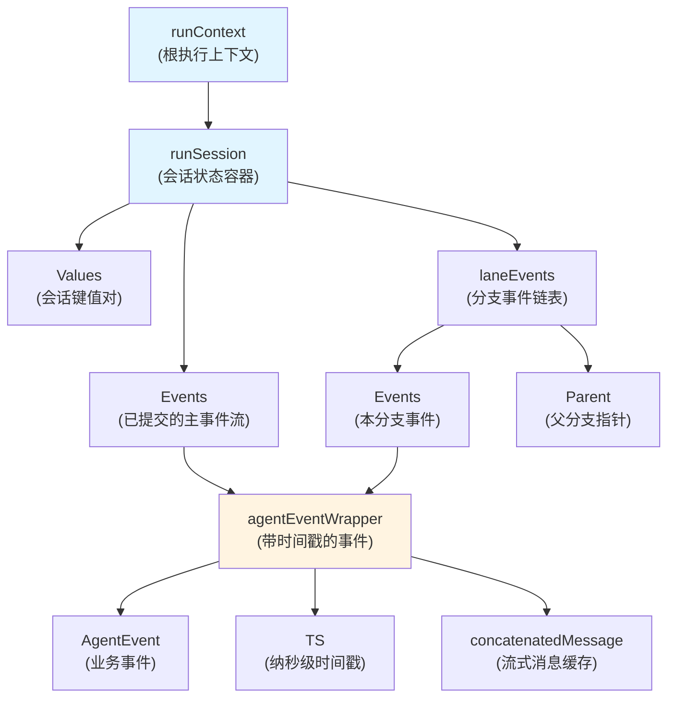

# 执行上下文管理 (execution_context_management)

## 1. 核心问题：为什么需要这个模块？

在复杂的多代理系统和流式工作流中，存在三个核心挑战：
- **上下文隔离与共享的平衡**：子代理执行时需要独立的事件日志，但最终要合并到主流程；
- **并行执行的时序一致性**：多个并行分支产生的事件需要按时间戳正确排序；
- **中断后可恢复性**：系统需要持久化足够的状态，以便在中断后恢复执行。

传统的上下文传递方式（如简单的 context.WithValue）无法满足这些需求：要么隔离过度导致数据丢失，要么共享过多导致并发安全问题。`execution_context_management` 模块的核心洞察是：**将运行时状态分为 "已提交的历史" 和 "进行中的分支"，通过结构化的事件日志和会话值管理，实现既安全又灵活的上下文传递**。

## 2. 架构与数据流

### 2.1 核心架构图



### 2.2 核心组件角色

| 组件 | 角色 | 关键职责 |
|------|------|----------|
| `runContext` | 上下文根容器 | 持有根输入、执行路径和会话状态 |
| `runSession` | 会话状态管理器 | 管理已提交事件、会话值和分支事件 |
| `laneEvents` | 分支事件容器 | 以链表形式存储进行中的分支事件 |
| `agentEventWrapper` | 事件装饰器 | 为业务事件添加时间戳和流式缓存 |

### 2.3 关键数据流

#### 顺序执行流
1. **初始化**：`initRunCtx` 创建根 `runContext` 和 `runSession`
2. **事件记录**：代理执行时通过 `addEvent` 将事件追加到主 `Events` 切片（带锁保护）
3. **路径更新**：`updateRunPathOnly` 为顺序执行的代理累积执行历史

#### 并行执行流
1. **分叉**：`forkRunCtx` 为每个并行分支创建独立的 `runSession`，共享已提交历史但拥有独立的 `laneEvents`
2. **执行**：各分支在自己的 `laneEvents` 中无锁追加事件
3. **合并**：`joinRunCtxs` 从各分支收集事件、按时间戳排序、然后提交到父上下文

## 3. 核心组件深度解析

### 3.1 runSession：会话状态的核心

`runSession` 是整个模块的核心，它巧妙地将状态分为两部分：
- **稳定的已提交历史**：`Events` 切片（带 `mtx` 保护）
- **动态的进行中状态**：`LaneEvents` 链表（无锁，分叉后私有）

这种设计使得：
- 主流程执行时可以安全地追加事件（通过锁）
- 并行分支可以无锁地记录事件（在自己的 `laneEvents` 中）
- 合并时只需遍历分支链表并排序

```go
type runSession struct {
    Values    map[string]any      // 会话级键值对（共享）
    valuesMtx *sync.Mutex         // 保护 Values 的锁
    
    Events     []*agentEventWrapper  // 已提交的主事件流
    LaneEvents *laneEvents            // 当前分支的事件链表
    mtx        sync.Mutex             // 保护 Events 的锁
}
```

### 3.2 laneEvents：分支事件的链表结构

`laneEvents` 采用链表设计是一个关键选择：
- 每个分叉创建新的链表节点，指向父节点
- 读取时从叶子节点向上遍历，收集所有分支事件
- 合并后，这些分支事件被提交到父级，链表被丢弃

这种方式既保证了并行分支的隔离性，又能在合并时重建完整的事件历史。

### 3.3 agentEventWrapper：事件的增强容器

`agentEventWrapper` 不仅仅是简单的事件包装器，它解决了两个重要问题：

1. **时序确定性**：通过 `TS` 字段（纳秒级时间戳）确保并行事件的正确排序
2. **流式消息的可恢复性**：`concatenatedMessage` 缓存了已聚合的流式消息，在序列化时将其替换 `MessageStream`，确保中断后可以恢复

```go
func (a *agentEventWrapper) GobEncode() ([]byte, error) {
    // 如果有缓存的聚合消息且是流式输出，替换流为缓存的消息
    if a.concatenatedMessage != nil && a.Output != nil && 
       a.Output.MessageOutput != nil && a.Output.MessageOutput.IsStreaming {
        a.Output.MessageOutput.MessageStream = 
            schema.StreamReaderFromArray([]Message{a.concatenatedMessage})
    }
    // ... 序列化逻辑
}
```

### 3.4 关键函数解析

#### forkRunCtx：创建并行分支上下文

这个函数展示了模块的核心设计思想：
```go
func forkRunCtx(ctx context.Context) context.Context {
    // ... 获取父上下文
    
    // 创建新会话：共享已提交历史，但有独立的 LaneEvents
    childSession := &runSession{
        Events:    parentRunCtx.Session.Events,  // 共享只读历史
        Values:    parentRunCtx.Session.Values,    // 共享值映射
        valuesMtx: parentRunCtx.Session.valuesMtx,
    }
    
    // 创建新的分支事件节点，指向父分支
    childSession.LaneEvents = &laneEvents{
        Parent: parentRunCtx.Session.LaneEvents,
        Events: make([]*agentEventWrapper, 0),
    }
    
    // ... 创建并返回新上下文
}
```

注意这里的权衡：
- `Events` 和 `Values` 被共享，避免了深拷贝的开销
- 但 `LaneEvents` 是新的，确保分支隔离
- `Values` 的访问仍受 `valuesMtx` 保护，保证并发安全

#### joinRunCtxs：合并并行分支

合并过程分为三个清晰的步骤：
1. **收集**：从每个子上下文的叶子 `laneEvents` 中提取事件
2. **排序**：按时间戳对所有事件排序，确保时序正确
3. **提交**：将排序后的事件追加到父上下文的适当位置（主事件流或父分支）

这种设计确保了即使事件在不同分支中并行产生，最终的事件日志也是按时间顺序排列的。

## 4. 设计决策与权衡

### 4.1 链表 vs 切片：为什么 laneEvents 用链表？

| 维度 | 链表 | 切片 |
|------|------|------|
| 分叉开销 | 低（只需创建新节点） | 高（需拷贝） |
| 合并时遍历 | 需要从叶到根遍历 | 直接访问 |
| 内存局部性 | 差 | 好 |

**选择链表的原因**：在并行工作流中，分叉操作比合并操作频繁得多，且分叉时通常不知道最终需要多少空间。链表在分叉时的低开销使其成为更优选择。

### 4.2 共享 vs 复制：为什么 Values 共享而 LaneEvents 新建？

- **Values 共享**：会话值通常需要在整个执行过程中共享，且访问频率适中，用锁保护是可接受的
- **LaneEvents 新建**：分支事件是高度写入局部化的，无锁写入的性能收益超过了合并时的排序成本

### 4.3 时间戳排序的精度与成本

使用纳秒级时间戳确保了事件排序的精确性，但：
- 它假设系统时钟是单调递增的（在大多数现代系统中成立）
- 它不处理极端情况下的时钟回拨（模块未对此进行防护）

## 5. 使用指南与最佳实践

### 5.1 公共 API 使用

```go
// 在代理执行中添加会话值
adk.AddSessionValue(ctx, "user_id", "12345")

// 获取所有会话值
values := adk.GetSessionValues(ctx)

// 清除运行上下文（用于嵌套多代理隔离）
isolatedCtx := adk.ClearRunCtx(ctx)
```

### 5.2 内部扩展点

如果你在框架内部工作，需要理解以下函数：
- `initRunCtx`：初始化根执行上下文
- `forkRunCtx` / `joinRunCtxs`：管理并行分支
- `updateRunPathOnly`：更新顺序执行路径
- `getSession` / `getRunCtx`：访问内部状态

### 5.3 常见陷阱

1. **不要在并行分支中直接修改共享的 Values 而不考虑锁**：虽然 `Values` 受 `valuesMtx` 保护，但如果你取出一个复杂对象（如 map）并修改它，这不会受到保护
2. **不要假设事件在分支内的顺序与合并后的顺序完全一致**：合并时会按全局时间戳重新排序
3. **在自定义代理中使用嵌套多代理时，记得调用 `ClearRunCtx`**：否则外部的执行上下文会泄漏到内部

## 6. 与其他模块的关系

- **依赖**：
  - [Schema Core Types](schema_core_types.md)：`Message`、`StreamReader` 等类型
  - [ADK Agent Interface](adk_agent_interface.md)：`AgentEvent`、`RunStep` 定义
  - [Internal Utilities](internal_utilities.md)：可能使用的内部工具

- **被依赖**：
  - [ADK Runner](adk_runner.md)：使用此模块管理执行上下文
  - [ADK ChatModel Agent](adk_chatmodel_agent.md)：在代理执行中使用会话值和事件
  - [Flow Multi-Agent Host](flow_multi_agent_host.md)：利用分叉/合并功能管理并行代理

## 7. 总结

`execution_context_management` 模块是一个精巧的状态管理解决方案，它通过以下核心思想解决了复杂工作流中的上下文问题：
- **分离已提交历史和进行中状态**：既保证安全，又提高性能
- **链表结构的分支事件**：低开销的分叉，灵活的合并
- **带时间戳的事件包装**：确保并行事件的时序一致性
- **会话值的共享与隔离平衡**：满足常见用例，同时提供扩展点

这个模块是框架内部的基础设施，大多数应用开发者不会直接使用它，但理解它的设计对于构建可靠的多代理系统至关重要。
