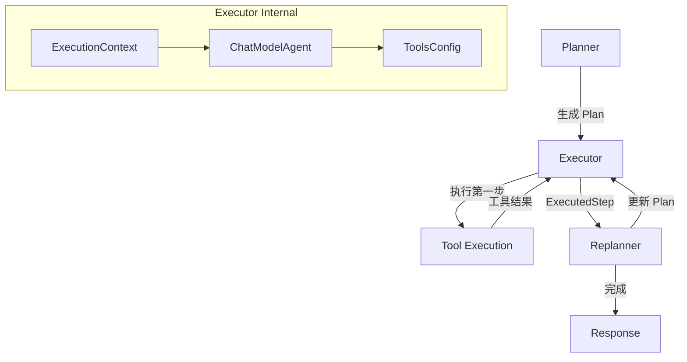

# Executor Component 深度解析

## 1. 模块概述

**Executor Component** 是 Plan-Execute-Replan 架构模式中的核心执行组件，负责将规划阶段生成的抽象步骤转化为具体的可执行操作。

### 问题背景
在构建能够完成复杂任务的智能代理系统时，我们面临一个关键挑战：如何让代理既能理解高层次的规划指令，又能执行具体的工具调用和操作。如果直接让规划器生成工具调用序列，会导致规划过于细碎且难以调整；如果让执行器完全自主决策，又可能偏离原始规划目标。

Executor Component 的设计正是为了解决这个张力——它作为规划与执行之间的桥梁，接收结构化的规划步骤，使用工具调用能力完成具体任务，并将执行结果反馈给重新规划阶段。

### 核心价值
- 将抽象的"做什么"转化为具体的"怎么做"
- 提供工具调用能力和执行环境
- 维护执行上下文和状态
- 支持迭代执行和自我修正

---

## 2. 架构与数据流

### 2.1 整体架构图



### 2.2 数据流向

Executor Component 的工作流程可以分为以下几个阶段：

1. **上下文接收阶段**
   - 从会话上下文中获取用户输入（`UserInputSessionKey`）
   - 获取当前执行计划（`PlanSessionKey`）
   - 获取已执行步骤历史（`ExecutedStepsSessionKey`）

2. **输入构建阶段**
   - 使用 `GenModelInputFn` 将执行上下文格式化
   - 通过 `ExecutorPrompt` 模板构建模型输入
   - 包含：原始目标、当前计划、已完成步骤、待执行步骤

3. **执行决策阶段**
   - `ChatModelAgent` 接收构建好的输入
   - 基于待执行步骤决定调用哪些工具
   - 执行工具调用并收集结果

4. **结果输出阶段**
   - 将执行结果存储在会话中（`ExecutedStepSessionKey`）
   - 输出格式化的执行记录供 Replanner 使用

---

## 3. 核心组件深度解析

### 3.1 ExecutorConfig

```go
type ExecutorConfig struct {
    // Model 是执行器使用的聊天模型，必须支持工具调用
    Model model.ToolCallingChatModel

    // ToolsConfig 指定执行器可用的工具集
    ToolsConfig adk.ToolsConfig

    // MaxIterations 定义 ChatModel 生成周期的上限
    // 如果超过此限制，代理将以错误终止
    // 可选，默认值为 20
    MaxIterations int

    // GenInputFn 生成执行器的输入消息
    // 可选，如果未提供，将使用 defaultGenExecutorInputFn
    GenInputFn GenModelInputFn
}
```

**设计意图**：
- 明确分离了"思考能力"（Model）和"行动能力"（ToolsConfig）
- 通过 `MaxIterations` 防止无限循环，提供了安全边界
- 允许自定义输入生成逻辑，保持灵活性

### 3.2 ExecutionContext

```go
type ExecutionContext struct {
    UserInput     []adk.Message
    Plan          Plan
    ExecutedSteps []ExecutedStep
}
```

**设计意图**：
- 封装了执行器需要的所有上下文信息
- 作为 `GenModelInputFn` 的统一输入类型
- 使执行决策基于完整的历史和当前状态

### 3.3 NewExecutor 函数

```go
func NewExecutor(ctx context.Context, cfg *ExecutorConfig) (adk.Agent, error) {
    // ... 配置和包装逻辑 ...
    
    return adk.NewChatModelAgent(ctx, &adk.ChatModelAgentConfig{
        Name:          "executor",
        Description:   "an executor agent",
        Model:         cfg.Model,
        ToolsConfig:   cfg.ToolsConfig,
        GenModelInput: genInput,
        MaxIterations: cfg.MaxIterations,
        OutputKey:     ExecutedStepSessionKey,
    })
}
```

**关键设计决策**：
1. **组合而非继承**：Executor 不是重新实现 Agent 接口，而是包装 `ChatModelAgent`
2. **闭包捕获上下文**：通过闭包将会话值传递给 `GenModelInput`
3. **输出键约定**：使用 `OutputKey` 将结果写入特定的会话键

**为什么这样设计？**
- 利用已有的 `ChatModelAgent` 的成熟能力（工具调用、多轮对话、流式输出）
- 保持 Executor 的简洁性，专注于"执行规划步骤"这个单一职责
- 便于测试和替换底层实现

### 3.4 defaultGenExecutorInputFn

```go
func defaultGenExecutorInputFn(ctx context.Context, in *ExecutionContext) ([]adk.Message, error) {
    planContent, err := in.Plan.MarshalJSON()
    if err != nil {
        return nil, err
    }

    return ExecutorPrompt.Format(ctx, map[string]any{
        "input":          formatInput(in.UserInput),
        "plan":           string(planContent),
        "executed_steps": formatExecutedSteps(in.ExecutedSteps),
        "step":           in.Plan.FirstStep(),
    })
}
```

**设计意图**：
- 将结构化数据格式化为自然语言提示
- 强调当前要执行的**第一步**，引导模型聚焦
- 提供完整的历史上下文，帮助模型做出明智决策

---

## 4. 依赖分析

### 4.1 输入依赖

| 依赖组件 | 用途 | 契约要求 |
|---------|------|---------|
| `model.ToolCallingChatModel` | 提供推理和工具调用能力 | 必须支持工具调用，能理解结构化提示 |
| `adk.ToolsConfig` | 定义可用工具集 | 工具必须有明确的输入输出schema |
| `Plan` 接口 | 提供执行计划 | 必须能序列化为JSON，能提供FirstStep() |

### 4.2 输出契约

Executor 产生的输出约定：

1. **会话输出**：通过 `ExecutedStepSessionKey` 存储执行结果字符串
2. **事件输出**：通过 `adk.AgentEvent` 流式输出执行过程
3. **结构输出**：产生 `ExecutedStep` 结构体供 Replanner 使用

### 4.3 被依赖关系

Executor Component 主要被：
- [Plan-Execute 主模块](planexecute.md) 作为工作流的一部分调用
- 自定义 Agent 实现作为执行子组件

---

## 5. 设计决策与权衡

### 5.1 采用 ChatModelAgent 作为基础

**决策**：Executor 内部使用 `ChatModelAgent` 而不是重新实现 Agent 接口

**权衡**：
| 优点 | 缺点 |
|------|------|
| 代码复用，利用成熟的工具调用逻辑 | 增加了一层间接性 |
| 自动获得流式输出、重试等能力 | 对底层行为的控制受限 |
| 与其他 Agent 组件保持一致的行为 | 调试时需要理解多层实现 |

**为什么这样选择**：
在这个场景下，Executor 的核心价值在于"如何理解规划并构建提示"，而不是"如何调用工具"。复用 `ChatModelAgent` 让我们可以专注于前者。

### 5.2 会话状态管理

**决策**：使用 adk 的会话机制（SessionKey）在组件间传递状态

**替代方案**：
- 直接在函数参数中传递所有状态
- 使用自定义的上下文键

**权衡**：
会话机制提供了标准化的状态传递方式，但也造成了隐式依赖——Executor 依赖于上游组件已经设置好的特定会话键。

**缓解措施**：
代码中使用了明确的 panic 来检测缺失的会话值，虽然激进但能在开发早期发现问题。

### 5.3 只执行第一步

**决策**：Executor 只执行 `Plan.FirstStep()`，然后立即交回给 Replanner

**替代方案**：
- 让 Executor 执行多个步骤直到遇到障碍
- 让 Executor 自主决定何时交回控制权

**权衡**：
| 单步执行 | 多步执行 |
|---------|---------|
| 更细粒度的控制，可在每步后调整 | 效率更高，减少协调开销 |
| 更易于理解和调试 | 需要 Executor 有更强的自主判断能力 |
| Replanner 可以及时纠正方向 | 可能在错误方向上走得更远 |

**为什么选择单步执行**：
Plan-Execute-Replan 模式的核心优势就是能够频繁反思和调整。单步执行最大化了这种优势，特别适合不确定性高、需要频繁调整的任务。

---

## 6. 使用指南与最佳实践

### 6.1 基本配置

```go
executor, err := NewExecutor(ctx, &ExecutorConfig{
    Model:         myToolCallingModel,
    ToolsConfig:   myToolsConfig,
    MaxIterations: 10,  // 根据任务复杂度调整
})
```

### 6.2 自定义输入生成

如果默认的提示模板不能满足需求，可以自定义 `GenInputFn`：

```go
customGenInput := func(ctx context.Context, in *ExecutionContext) ([]adk.Message, error) {
    // 自定义的格式化逻辑
    // 可以包含领域特定的指令、约束条件等
    return customMessages, nil
}

executor, err := NewExecutor(ctx, &ExecutorConfig{
    Model:       myModel,
    ToolsConfig: myTools,
    GenInputFn:  customGenInput,
})
```

### 6.3 工具配置最佳实践

1. **工具粒度**：提供中等粒度的工具，既不过于细碎也不过于复杂
2. **工具描述**：写清晰的工具描述，说明工具的用途、何时使用、何时不使用
3. **错误处理**：工具应该返回有意义的错误信息，帮助模型理解失败原因

---

## 7. 注意事项与边缘情况

### 7.1 隐式会话依赖

**问题**：Executor 依赖于上游已经设置好的会话键（`UserInputSessionKey`、`PlanSessionKey`），如果单独使用会 panic。

**缓解**：
- 始终在 Plan-Execute-Replan 工作流中使用 Executor
- 如要单独使用，确保先设置这些会话值

### 7.2 第一步为空

**问题**：如果 `Plan.FirstStep()` 返回空字符串，Executor 的行为可能不符合预期。

**缓解**：
- 确保 Planner 生成的 Plan 总是至少有一个步骤
- 或者在自定义的 `GenInputFn` 中处理这种情况

### 7.3 工具执行失败

**问题**：工具执行可能失败，但 Executor 本身不会处理失败——它只是将结果传递给 Replanner。

**设计意图**：
这是有意为之的设计。Executor 的职责是执行和报告，而不是决定如何处理失败。处理失败的策略由 Replanner 决定。

### 7.4 MaxIterations 的设置

**注意**：`MaxIterations` 限制的是 Executor 内部的模型调用次数，不是 Plan-Execute-Replan 的循环次数。

**建议**：
- 对于简单步骤，设置为 3-5 次
- 对于复杂步骤，可能需要 10-20 次
- 如果 Executor 经常达到上限，考虑简化步骤或提供更好的工具

---

## 8. 相关模块

- [Plan-Execute 主模块](planexecute.md) - 完整的 Plan-Execute-Replan 工作流
- [Planner Component](planner_component.md) - 规划组件
- [Replanner Component](replanner_component.md) - 重新规划组件
- [ChatModelAgent](chatmodel_agent.md) - Executor 内部使用的基础 Agent
- [ToolsConfig](agent_tool.md) - 工具配置系统
