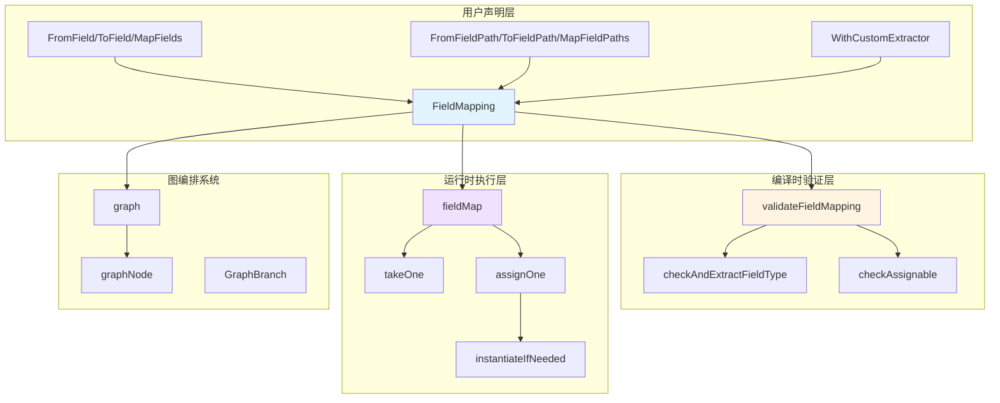

# Field Mapping 模块深度解析

## 概述：为什么需要这个模块？

想象你在搭建一个乐高积木系统：每个节点（Node）是一个功能模块，有输入接口和输出接口。节点 A 输出一个包含 `{User, Order, Payment}` 的结构体，而节点 B 期望接收一个包含 `{Customer, Transaction}` 的结构体。如何把它们连接起来？

**Field Mapping 模块就是那个"智能适配器"**。它解决了图编排系统中的核心问题：**如何在类型不完全匹配的节点之间建立数据流**。

这个模块的设计洞察在于：在复杂的 AI 工作流中，节点的输入输出类型往往是预定义的（比如调用第三方 API 的节点），你无法修改它们的结构。因此，系统需要一种**声明式的、类型安全的字段映射机制**，让开发者可以精确控制数据如何在节点间流动，而不是被迫接受"全量传递"或手动编写转换代码。

 naive 的方案是直接传递整个对象，但这会导致：
1. **数据污染**：下游节点收到不需要的字段
2. **类型不匹配**：字段名或类型不一致导致运行时错误
3. **嵌套结构难以处理**：`user.profile.name` → `customer.fullName` 这样的映射无法表达

Field Mapping 通过**路径表达式 + 反射 + 编译时验证**的组合拳，优雅地解决了这些问题。

---

## 架构全景



### 组件角色说明

| 组件 | 角色 | 职责 |
|------|------|------|
| `FieldMapping` | 核心配置对象 | 存储映射规则（from → to），是编译时和运行时的数据载体 |
| `FromField`/`ToField`/`MapFields` | 工厂函数 | 提供声明式 API，降低使用门槛 |
| `FieldPath` | 路径抽象 | 将嵌套字段（如 `user.profile.name`）表示为 `[]string`，支持任意深度 |
| `validateFieldMapping` | 编译时验证器 | 在图编译阶段检查类型兼容性，提前发现错误 |
| `fieldMap` | 运行时执行器 | 使用反射实际执行字段提取和赋值 |
| `assignOne` | 智能赋值器 | 自动创建中间结构（nil pointer/map），支持动态类型展开 |

### 数据流追踪

以一个典型场景为例：节点 A 输出 `UserProfile{ID: 1, Profile: {Name: "Alice"}}`，节点 B 输入 `Request{UserName: string}`，映射规则为 `MapFields("Profile.Name", "UserName")`。

**编译时流程**：
```
graph.addGraphEdge("A", "B", MapFields("Profile.Name", "UserName"))
    ↓
validateFieldMapping(UserProfile, Request, [mapping])
    ↓
checkAndExtractFieldType(["Profile", "Name"], UserProfile) → string
checkAndExtractFieldType(["UserName"], Request) → string
checkAssignable(string, string) → assignableTypeMust
    ↓
验证通过，记录到 fieldMappingRecords
```

**运行时流程**：
```
节点 A 执行完成，输出 UserProfile 实例
    ↓
fieldMap([mapping])(UserProfile 实例)
    ↓
takeOne(UserProfile, "Profile") → Profile 实例
takeOne(Profile, "Name") → "Alice"
    ↓
assignOne(空 Request 实例, "Alice", "UserName")
    ↓
返回 map[string]any{"UserName": "Alice"}
    ↓
节点 B 接收并转换为 Request 类型
```

---

## 核心组件深度解析

### 1. FieldMapping：映射规则的配置对象

```go
type FieldMapping struct {
    fromNodeKey     string                              // 来源节点 Key（在图编译时填充）
    from            string                              // 源字段路径（内部用 \x1F 连接）
    to              string                              // 目标字段路径
    customExtractor func(input any) (any, error)       // 自定义提取器（可选）
}
```

**设计意图**：这个结构体是**不可变配置**（一旦创建不应修改），它承载了映射的所有元数据。`fromNodeKey` 字段特别关键——它表明一个节点可以接收来自多个前驱节点的数据，每条边都有独立的映射规则。

**为什么 `from` 和 `to` 是字符串而不是 `FieldPath`？**
这是**序列化友好**的设计选择。字符串可以轻松存储、传输、日志打印，而 `FieldPath`（`[]string`）在需要时通过 `splitFieldPath` 动态解析。内部使用 `\x1F`（Unit Separator）作为连接符，因为这个字符几乎不可能出现在用户定义的字段名中。

**关键方法**：
- `FromPath()` / `ToPath()`：将字符串路径解析为 `FieldPath`，供遍历时使用
- `Equals()`：用于测试和去重，**注意**：如果使用了 `customExtractor`，`Equals` 永远返回 `false`（因为函数无法比较）

---

### 2. 工厂函数：声明式 API 设计

模块提供了三组工厂函数，对应三种映射模式：

#### 模式一：单字段 → 整体输入
```go
FromField("UserName")  // 从前驱输出的 UserName 字段提取，作为后继的完整输入
```
**使用场景**：下游节点只需要一个简单值（如 `string` 或 `int`），而不是结构体。

**独占性**：一旦使用这种映射，不能再添加其他映射规则，因为后继的整个输入已经被占用了。

#### 模式二：整体输出 → 单字段
```go
ToField("Request.User")  // 将前驱的完整输出赋值给后继的 Request.User 字段
```
**使用场景**：上游节点输出一个完整对象，下游节点只需要将其放入某个嵌套字段。

**支持 Option**：可以配合 `WithCustomExtractor` 使用，在赋值前进行转换。

#### 模式三：单字段 → 单字段
```go
MapFields("Profile.Name", "UserName")  // 最常见的映射模式
```
**使用场景**：标准的字段重命名或路径转换。

**路径版本**：`FromFieldPath`、`ToFieldPath`、`MapFieldPaths` 接受 `FieldPath{"Profile", "Name"}` 而不是字符串，提供类型安全的构造方式（避免拼写错误导致的路径分隔符问题）。

---

### 3. FieldPath：嵌套字段的抽象

```go
type FieldPath []string

// 示例
FieldPath{"user", "profile", "name"}  // 对应 user.profile.name
FieldPath{"users", "admin"}           // 对应 map 访问 users["admin"]
```

**设计洞察**：`FieldPath` 统一了**结构体字段**和**Map 键**的访问语义。在遍历时，代码不关心当前路径段是 struct field 还是 map key，而是根据运行时类型动态决定访问方式。

**关键约束**：路径元素不能包含 `\x1F` 字符。这是一个**隐式契约**，如果用户真的在字段名中用了这个字符（虽然极不可能），系统会静默失败或产生错误的路径解析。

---

### 4. validateFieldMapping：编译时验证器

这是模块的**核心智能所在**。它在图编译阶段执行以下检查：

```go
func validateFieldMapping(predecessorType, successorType reflect.Type, mappings []*FieldMapping) (
    typeHandler *handlerPair,           // 运行时类型检查器（延迟检查）
    uncheckedSourcePath map[string]FieldPath,  // 因 interface 无法检查的路径
    err error)
```

**验证流程**：

1. **合法性检查**：不允许"全部字段 → 全部字段"的映射（这应该用普通边而不是字段映射）
2. **类型验证**：后继类型必须是 struct、map 或 `any`
3. **路径解析**：对每个映射的 `from` 和 `to` 路径，调用 `checkAndExtractFieldType` 验证路径有效性
4. **类型兼容性**：调用 `checkAssignable` 检查源类型是否可以赋值给目标类型

**关键设计决策**：**部分验证延迟到运行时**。当路径中包含 `interface{}` 类型时，编译器无法确定实际类型，因此返回 `uncheckedSourcePath`，并在运行时通过 `typeHandler` 进行检查。

**为什么这样设计？**
- **优点**：支持更灵活的类型（如接口），不会因为过度严格的编译时检查而限制用户
- **代价**：某些错误只能在运行时发现，需要配合测试覆盖

---

### 5. fieldMap：运行时执行引擎

这是实际执行字段映射的函数，返回一个 `func(any) (map[string]any, error)`。

**执行逻辑**：

```go
for _, mapping := range mappings {
    // 1. 自定义提取器优先
    if mapping.customExtractor != nil {
        result[mapping.to] = mapping.customExtractor(input)
        continue
    }
    
    // 2. 空 from 表示使用整个输入
    if len(mapping.from) == 0 {
        result[mapping.to] = input
        continue
    }
    
    // 3. 路径遍历提取
    fromPath := splitFieldPath(mapping.from)
    taken := input
    for i, path := range fromPath {
        taken, _, err = takeOne(currentValue, currentType, path)
        // 错误处理：区分编译时错误和运行时错误
    }
    result[mapping.to] = taken
}
```

**关键函数 `takeOne`**：
```go
func takeOne(inputValue reflect.Value, inputType reflect.Type, from string) (taken any, takenType reflect.Type, err error)
```

根据 `inputValue.Kind()` 动态选择访问方式：
- `reflect.Map`：调用 `checkAndExtractFromMapKey`
- `reflect.Struct`：调用 `checkAndExtractFromField`
- `reflect.Interface`：返回 `errInterfaceNotValidForFieldMapping`（运行时错误）

**错误处理策略**：
- **编译时可发现的错误**（如路径不存在于已知类型）：在 `validateFieldMapping` 中 `panic`
- **运行时才能发现的错误**（如 interface 实际类型不匹配、map key 不存在）：返回 error，由调用者处理
- **可配置的缺失容忍**：`allowMapKeyNotFound` 参数控制 map key 缺失时是跳过还是报错

---

### 6. assignOne：智能赋值器

这是模块中最复杂的函数，负责将值写入目标路径，**自动创建中间结构**。

**核心逻辑**：

```go
func assignOne(destValue reflect.Value, taken any, to string) reflect.Value {
    toPaths := splitFieldPath(to)
    
    for {
        path := toPaths[0]
        toPaths = toPaths[1:]
        
        if len(toPaths) == 0 {
            // 到达最终路径，执行赋值
            if destValue.Kind() == reflect.Map {
                destValue.SetMapIndex(key, toSet)
            } else {
                field := destValue.FieldByName(path)
                field.Set(toSet)
            }
            return originalDestValue
        }
        
        // 中间路径：确保存在并深入
        if destValue.Kind() == reflect.Map {
            valueValue := destValue.MapIndex(keyValue)
            if !valueValue.IsValid() {
                // 自动创建不存在的中间 map 值
                valueValue = newInstanceByType(destValue.Type().Elem())
                destValue.SetMapIndex(keyValue, valueValue)
            }
            destValue = valueValue
            continue
        }
        
        // struct 字段：自动初始化 nil pointer/map
        field := destValue.FieldByName(path)
        instantiateIfNeeded(field)
        destValue = field
    }
}
```

**设计亮点**：
1. **惰性初始化**：只在需要时创建中间结构，避免不必要的内存分配
2. **类型感知**：根据目标类型（Map/Struct/Ptr）选择正确的初始化方式
3. **路径回溯更新**：通过 `parentMap` 和 `parentKey` 保持对父节点的引用，确保修改能反映到根对象

**`instantiateIfNeeded` 的作用**：
```go
func instantiateIfNeeded(field reflect.Value) {
    if field.Kind() == reflect.Ptr && field.IsNil() {
        field.Set(reflect.New(field.Type().Elem()))  // 创建指针指向的新实例
    } else if field.Kind() == reflect.Map && field.IsNil() {
        field.Set(reflect.MakeMap(field.Type()))     // 创建空 map
    }
}
```

这个函数确保了 `user.Profile.Name = "Alice"` 这样的赋值不会因为 `user.Profile` 是 nil pointer 而 panic。

---

## 依赖关系分析

### 上游依赖（谁调用 Field Mapping）

| 调用方 | 调用方式 | 期望 |
|--------|----------|------|
| [`graph`](compose/graph/graph.md) | `addGraphEdge` 时传入 `FieldMapping` 数组 | 在边创建时记录映射规则，编译时验证，运行时执行 |
| [`graphNode`](compose/graph_node/graphNode.md) | 节点执行后，通过 `fieldMap` 转换输出 | 将节点输出转换为下游节点期望的输入格式 |
| [`GraphBranch`](compose/branch/GraphBranch.md) | 分支条件判断后的数据收集 | 分支合并时可能需要字段映射来统一不同分支的输出 |

### 下游依赖（Field Mapping 调用谁）

| 被调用方 | 调用目的 | 耦合程度 |
|----------|----------|----------|
| `reflect` 包 | 运行时类型检查和字段访问 | **强耦合**：核心功能依赖反射 |
| [`internal/generic`](internal/generic/generic.md) | 类型转换辅助（`generic.TypeOf[I]()`） | 弱耦合：仅用于泛型类型提取 |
| [`internal/safe`](internal/safe/panic.md) | 创建 panic 错误（包含堆栈信息） | 弱耦合：仅用于错误包装 |
| [`schema`](schema/message/Message.md) | `StreamReaderWithConvert` 用于流式映射 | 中等耦合：流式处理依赖 schema 的 StreamReader |

### 数据契约

**输入契约**：
- `input` 参数必须是 `map[string]any` 或 struct/map 类型
- 如果使用 `from` 路径，路径上的所有中间值不能为 nil（除非是 pointer/map 且会被自动初始化）
- Map 的 key 类型必须是 `string` 或可转换为 `string`

**输出契约**：
- 返回 `map[string]any`，key 是 `to` 路径的最后一段
- 如果映射失败，返回 error 而不是 panic（除非是编译时错误）

---

## 设计决策与权衡

### 1. 反射 vs 代码生成

**选择**：使用反射而非代码生成

**理由**：
- **灵活性**：支持任意 struct/map 类型，无需为每种类型生成专用代码
- **开发效率**：用户无需运行额外的代码生成步骤
- **调试友好**：错误堆栈直接指向反射调用位置

**代价**：
- **性能开销**：反射比直接字段访问慢 10-100 倍
- **类型安全**：某些错误只能在运行时发现

**适用场景**：图编排是 IO 密集型（调用 LLM、数据库等），反射开销可以忽略不计。

---

### 2. 编译时验证 vs 运行时灵活

**选择**：混合策略——尽可能在编译时验证，但对 interface 类型延迟到运行时

**理由**：
- **早期错误发现**：大部分类型错误在 `graph.Compile()` 时就能捕获
- **保留灵活性**：允许使用 interface 类型，支持更抽象的节点设计

**张力点**：
- 用户可能误以为编译通过就万事大吉，但运行时仍可能因 interface 实际类型不匹配而失败
- **缓解措施**：文档中明确说明 `uncheckedSourcePath` 的存在，建议配合测试

---

### 3. 字符串路径 vs 类型安全路径

**选择**：内部使用字符串（`from string`），外部提供 `FieldPath` 类型

**理由**：
- **序列化友好**：字符串可以轻松存储到配置文件或日志
- **API 灵活**：用户可以自由选择 `MapFields("a.b", "c.d")` 或 `MapFieldPaths(FieldPath{"a","b"}, FieldPath{"c","d"})`

**风险**：
- 字符串拼写错误只能在编译时或运行时发现
- `\x1F` 分隔符是隐式契约，用户可能不知情

---

### 4. 自动初始化 vs 显式错误

**选择**：自动创建中间结构（nil pointer、空 map）

**理由**：
- **用户友好**：`user.Profile.Name = "Alice"` 不需要用户先检查 `user.Profile != nil`
- **符合直觉**：大多数用户期望赋值操作"自动完成"

**代价**：
- **隐藏错误**：如果用户期望某个中间结构已经存在，但实际上被自动创建了，可能导致逻辑错误
- **性能开销**：额外的内存分配

---

### 5. 独占映射 vs 组合映射

**选择**：`FromField`（单字段→整体）是独占的，不能与其他映射共存

**理由**：
- **语义清晰**：如果后继的整个输入已经由一个字段提供，再添加其他映射会产生歧义
- **实现简单**：避免了"部分字段来自 A，部分来自 B，剩余部分默认值"的复杂逻辑

**限制**：
- 某些复杂场景需要变通（如先用自定义提取器合并多个字段，再作为整体输入）

---

## 使用指南与示例

### 基础用法

```go
// 场景：节点 A 输出 UserProfile，节点 B 输入 Request
type UserProfile struct {
    ID      int
    Profile struct {
        Name  string
        Email string
    }
}

type Request struct {
    UserName string
    Contact  string
}

// 在图构建时
graph.AddGraphEdge("A", "B", 
    MapFields("Profile.Name", "UserName"),
    MapFields("Profile.Email", "Contact"),
)
```

### 嵌套路径映射

```go
// 深层嵌套：A.B.C.D → X.Y.Z
MapFieldPaths(
    FieldPath{"A", "B", "C", "D"},
    FieldPath{"X", "Y", "Z"},
)

// 运行时等价于
MapFields("A\x1FB\x1FC\x1FD", "X\x1FY\x1FZ")
```

### 自定义提取器

```go
// 场景：需要转换格式或合并多个字段
ToField("FullName", WithCustomExtractor(func(input any) (any, error) {
    profile := input.(UserProfile)
    return profile.FirstName + " " + profile.LastName, nil
}))
```

**注意**：使用自定义提取器后，编译时类型检查会跳过该映射，错误只能在运行时发现。

### Map 类型支持

```go
// 前驱输出是 map[string]any
type Output map[string]any

// 后继输入也是 map
type Input map[string]any

// 映射 map key
MapFields("user_id", "userId")  // Output["user_id"] → Input["userId"]
```

### 流式数据处理

```go
// 对于 Stream 类型的节点，使用 streamFieldMap
streamMapper := streamFieldMap(mappings, uncheckedSourcePaths)
convertedStream := streamMapper(originalStream)
```

流式映射会对每个 chunk 应用相同的字段映射逻辑，通过 `StreamReaderWithConvert` 实现。

---

## 边界情况与陷阱

### 1. Interface 类型的运行时错误

```go
type Input struct {
    Data any  // interface 类型
}

// 编译时验证通过（因为 any 可以是任何类型）
// 但运行时如果前驱输出是 int，而期望是 struct，会失败
MapFields("Value", "Data")
```

**缓解**：在测试中覆盖所有可能的类型组合，或使用具体类型代替 `any`。

---

### 2. Map Key 缺失的处理

```go
// 前驱输出 map[string]any{"a": 1}
// 映射规则
MapFields("b", "B")  // key "b" 不存在

// 默认行为：返回 error
// 可选行为：设置 allowMapKeyNotFound = true，跳过该映射
```

**注意**：`allowMapKeyNotFound` 只在 `fieldMap` 内部使用，用户通常不需要关心。

---

### 3. 指针和 Map 的自动初始化陷阱

```go
type Outer struct {
    Inner *Inner
}

type Inner struct {
    Value string
}

// 映射：Inner.Value → Output
// 如果 Outer.Inner 是 nil，assignOne 会自动创建 Inner 实例
// 这可能导致"意外"的对象创建
```

**建议**：如果期望某个中间结构必须预先存在，在节点逻辑中显式初始化，而不是依赖字段映射的自动创建。

---

### 4. 路径分隔符冲突

```go
// 理论上，字段名包含 \x1F 会导致路径解析错误
type Weird struct {
    Field\x1FName string  // 几乎不可能，但语法上允许
}
```

**实际风险**：极低。`\x1F` 是 ASCII 控制字符，不会出现在正常标识符中。

---

### 5. 自定义提取器的类型安全

```go
// 危险：提取器中的类型断言可能 panic
WithCustomExtractor(func(input any) (any, error) {
    return input.(UserProfile).Name, nil  // 如果 input 不是 UserProfile，panic!
})

// 安全做法
WithCustomExtractor(func(input any) (any, error) {
    profile, ok := input.(UserProfile)
    if !ok {
        return nil, fmt.Errorf("unexpected type: %T", input)
    }
    return profile.Name, nil
})
```

---

### 6. 独占映射的隐式约束

```go
// 错误：混合使用 FromField 和其他映射
graph.AddGraphEdge("A", "B",
    FromField("UserName"),  // 独占：整个输入已映射
    MapFields("Email", "Contact"),  // 无效：输入已被占用
)
```

**检测**：`isFromAll(mappings)` 和 `isToAll(mappings)` 会在编译时检查并 panic。

---

## 扩展点与定制

### 添加新的映射模式

当前支持的模式：
- `FromField` / `FromFieldPath`：源字段 → 整体输入
- `ToField` / `ToFieldPath`：整体输出 → 目标字段
- `MapFields` / `MapFieldPaths`：源字段 → 目标字段

如需添加新模式（如"多字段合并"），可以：
1. 添加新的工厂函数
2. 在 `FieldMapping` 中添加标识字段
3. 在 `fieldMap` 中添加对应的处理逻辑

### 自定义类型转换

当前类型转换依赖 Go 的 `AssignableTo` 规则。如需支持更灵活的转换（如 `int` → `string`），可以：
1. 在 `validateFieldMapping` 中注册自定义转换规则
2. 在 `assignOne` 中应用转换逻辑

### 路径解析定制

如需支持不同的路径语法（如 `user[profile].name` 而不是 `user.profile.name`），可以：
1. 修改 `splitFieldPath` 和 `FieldPath.join`
2. 确保新分隔符不会与字段名冲突

---

## 相关模块参考

- [Graph 模块](graph.md)：Field Mapping 的主要调用方，负责图的构建和编译
- [Graph Node 模块](graph_node.md)：节点执行时使用 Field Mapping 转换输入输出
- [Branch 模块](branch.md)：分支合并时可能使用 Field Mapping 统一不同分支的输出
- [Schema 模块](schema_message.md)：提供 `StreamReader` 等流式数据处理类型
- [Internal Generic 模块](internal_generic.md)：提供泛型类型提取辅助函数

---

## 总结

Field Mapping 模块是图编排系统的**数据流适配器**，它通过声明式的字段映射规则，解决了节点间类型不匹配的核心问题。其设计哲学是：

1. **编译时优先**：尽可能早地发现类型错误
2. **运行时灵活**：对 interface 等动态类型保留宽容度
3. **用户友好**：自动初始化中间结构，减少样板代码
4. **性能可接受**：反射开销在 IO 密集型场景中可以忽略

理解这个模块的关键在于把握**"路径遍历 + 反射访问 + 智能赋值"**的核心模式，以及**编译时验证与运行时检查的边界**。对于新贡献者，建议从阅读 `validateFieldMapping` 和 `fieldMap` 两个函数入手，它们分别代表了模块的"静态分析"和"动态执行"两个侧面。
