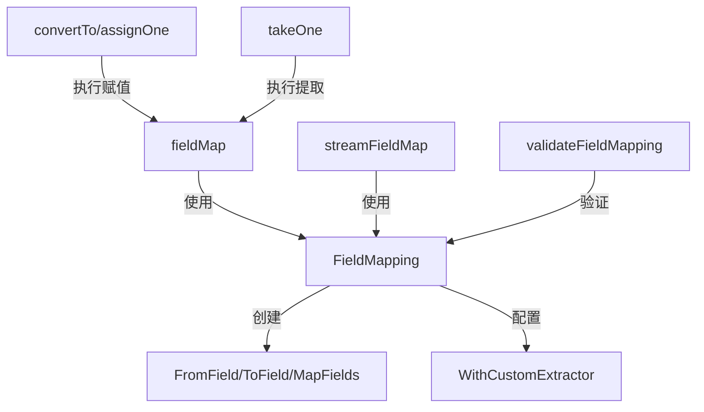

# 字段映射系统 (Field Mapping System)

## 问题空间

在构建复杂的数据处理管道或计算图时，我们经常需要将一个节点的输出传递给另一个节点的输入。最简单的场景是"直接传递"——前一个节点的输出就是后一个节点的输入。但在实际应用中，这种理想情况很少见：

- 前一个节点可能返回一个包含多个字段的结构体，但后一个节点只需要其中一个字段
- 前一个节点返回的单个值需要被放入后一个节点输入结构体的特定字段中
- 需要在前一个节点的输出字段和后一个节点的输入字段之间建立复杂的映射关系
- 有时甚至需要从嵌套的结构体或映射中提取值，或者将值写入嵌套结构

一个天真的解决方案是为每个节点对编写专门的适配器代码，但这会导致：
1. 大量重复的样板代码
2. 类型安全难以保证
3. 运行时错误频发
4. 系统灵活性差，难以重构

**字段映射系统**正是为了解决这个问题而设计的——它提供了一种声明式、类型安全的方式来定义节点之间的数据流向，而无需编写繁琐的转换代码。

## 核心概念与心智模型

想象一下字段映射系统就像是一个**智能的快递分拣中心**：

- **包裹** = 前一个节点的输出数据
- **收件地址** = 后一个节点的输入字段路径
- **分拣规则** = `FieldMapping` 定义的映射关系
- **分拣员** = 系统内部的反射逻辑，负责根据规则提取和放置数据

核心抽象是 `FieldMapping` 结构体，它定义了"从哪里取"和"放到哪里"的规则：

```go
type FieldMapping struct {
    fromNodeKey string  // 源节点标识
    from        string  // 源字段路径（空表示整个输出）
    to          string  // 目标字段路径（空表示整个输入）
    customExtractor func(input any) (any, error)  // 自定义提取器
}
```

### 关键设计洞察

字段映射系统的核心洞察是：**大多数数据转换需求都可以通过"路径式访问"来表达**。无论是从结构体中提取字段，还是从映射中取值，亦或是嵌套访问，都可以用一个由点分隔的路径字符串来描述。

系统支持三种基本映射模式：
1. **FromField**：从源的特定字段映射到目标的整个输入
2. **ToField**：从源的整个输出映射到目标的特定字段  
3. **MapFields**：从源的特定字段映射到目标的特定字段

## 架构与数据流程

### 核心组件关系



### 数据流向详解

让我们追踪一个典型的字段映射操作的完整生命周期：

1. **映射定义阶段**：用户通过 `FromField`、`ToField` 或 `MapFields` 创建 `FieldMapping` 对象
2. **编译时验证**：`validateFieldMapping` 在图编译阶段检查映射的合法性，包括：
   - 源类型是否包含指定字段
   - 目标类型是否可以接收映射的值
   - 类型兼容性检查
3. **运行时处理**：
   - `fieldMap` 函数处理同步数据转换
   - `streamFieldMap` 函数处理流式数据转换
   - `takeOne` 从源数据中提取值
   - `assignOne` 将值赋值给目标数据结构

### 路径表示

系统使用一个特殊的单元分隔符 `\x1F` 来连接路径元素，这种设计确保了：
- 路径元素可以包含普通的点号
- 不会与用户定义的字段名产生冲突
- 提供了一种高效的序列化/反序列化方式

## 核心组件深度解析

### FieldMapping 结构体

`FieldMapping` 是整个系统的核心，它封装了一个映射规则的所有信息。

**设计意图**：提供一个统一的数据结构来表示各种映射场景，同时保持 API 的简洁性。

**关键方法**：
- `FromField(from string)`：创建从源字段到整个目标的映射
- `ToField(to string)`：创建从整个源到目标字段的映射
- `MapFields(from, to string)`：创建字段到字段的映射
- `WithCustomExtractor`：添加自定义提取逻辑

### 路径处理系统

路径处理是字段映射的基础，系统提供了两种方式来表示路径：

1. **字符串表示**：使用 `\x1F` 分隔的字符串
2. **结构化表示**：`FieldPath` 类型，是 `[]string` 的别名

**关键函数**：
- `splitFieldPath(path string)`：将字符串路径分割为结构化路径
- `FieldPath.join()`：将结构化路径连接为字符串

这种双重表示法既提供了用户友好的 API，又保证了内部处理的效率。

### 数据提取与赋值

#### takeOne 函数

**功能**：从源数据结构中提取单个字段或映射值。

**处理逻辑**：
- 根据源数据的类型（映射或结构体）选择相应的提取方式
- 对于映射，使用键查找
- 对于结构体，使用反射访问字段
- 处理指针解引用

**设计权衡**：使用反射虽然会带来一些性能开销，但换来的是极大的灵活性和类型安全性。

#### assignOne 函数

**功能**：将值赋值给目标数据结构的指定路径。

**处理逻辑**：
- 逐级处理路径，按需实例化中间结构
- 对于映射，处理键类型转换
- 对于结构体，处理字段赋值
- 自动处理指针和 nil 值

**设计亮点**：该函数会智能地实例化嵌套的指针和映射，这意味着用户不需要预先准备好完整的目标结构——系统会自动处理。

### 编译时验证

`validateFieldMapping` 是系统的"守门员"，它在图编译阶段就捕获尽可能多的错误。

**验证内容**：
- 源类型是否包含指定的字段路径
- 目标类型是否可以接收映射的值
- 类型兼容性检查
- 字段导出性检查（必须是大写开头的字段）

**延迟验证**：对于接口类型，系统会将验证延迟到运行时，因为在编译时无法确定接口的具体实现类型。

## 设计决策与权衡

### 1. 反射 vs 代码生成

**选择**：使用反射

**原因**：
- 灵活性：可以处理任意类型，无需预先生成代码
- 开发体验：用户不需要额外的构建步骤
- 维护成本：不需要维护代码生成器

**权衡**：
- 性能：反射比直接代码慢，但在大多数场景下可以接受
- 错误捕获：一些错误只能在运行时发现

### 2. 路径分隔符选择

**选择**：使用特殊字符 `\x1F` 而不是点号

**原因**：
- 避免冲突：用户的字段名可能包含点号
- 清晰分离：内部表示和用户 API 明确区分
- 前向兼容：为未来的复杂路径语法预留空间

### 3. 编译时 vs 运行时验证

**选择**：混合策略

**原因**：
- 尽早反馈：尽可能在编译时捕获错误
- 灵活性：对于接口类型等无法在编译时确定的情况，延迟到运行时
- 平衡：在类型安全和灵活性之间取得平衡

### 4. 自动实例化 vs 严格要求

**选择**：自动实例化嵌套结构

**原因**：
- 用户体验：减少用户的样板代码
- 健壮性：避免因忘记初始化而导致的 panic
- 实用性：大多数情况下用户希望系统处理这些细节

## 使用指南与最佳实践

### 基本用法

```go
// 场景1：将源的 "user" 字段映射到整个目标输入
mapping1 := FromField("user")

// 场景2：将整个源输出映射到目标的 "result" 字段
mapping2 := ToField("result")

// 场景3：将源的 "user.name" 映射到目标的 "userName"
mapping3 := MapFields("user.name", "userName")

// 场景4：使用结构化路径处理嵌套字段
fromPath := FieldPath{"user", "profile", "name"}
toPath := FieldPath{"response", "data", "userName"}
mapping4 := MapFieldPaths(fromPath, toPath)

// 场景5：使用自定义提取器
mapping5 := ToField("result", WithCustomExtractor(func(input any) (any, error) {
    // 自定义提取逻辑
    return extractedValue, nil
}))
```

### 流式处理

字段映射系统无缝支持流式数据处理，通过 `streamFieldMap` 函数实现。这意味着你可以在不改变映射定义的情况下，同时处理同步和流式数据。

### 最佳实践

1. **优先使用编译时验证**：尽量使用具体类型而不是 `any`，这样系统可以在编译时捕获更多错误
2. **避免过度使用自定义提取器**：自定义提取器会绕过编译时类型检查，应谨慎使用
3. **保持路径简单**：虽然系统支持复杂的嵌套路径，但过于复杂的路径会降低可读性
4. **注意字段导出性**：结构体字段必须是大写开头才能被映射

## 边缘情况与注意事项

### 常见陷阱

1. **未导出字段**：尝试映射小写开头的结构体字段会导致错误
2. **接口类型延迟验证**：当路径中包含接口类型时，错误只会在运行时出现
3. **映射键类型**：虽然系统会尝试转换键类型，但最好使用字符串键以获得最佳兼容性
4. **nil 值处理**：对于可选字段，要考虑 nil 值的情况
5. **路径分隔符冲突**：避免在字段名中使用 `\x1F` 字符（虽然这种情况极少见）

### 错误处理

系统定义了两个特定的错误类型：
- `errMapKeyNotFound`：在映射中找不到指定的键
- `errInterfaceNotValidForFieldMapping`：接口的实际类型不支持字段映射

这些错误可以通过类型断言来特殊处理。

## 与其他模块的关系

字段映射系统是 [Compose Graph Engine](compose_graph_engine.md) 的核心子模块之一，它与以下模块紧密协作：

- **[分支系统](branch_system.md)**：字段映射经常与分支逻辑一起使用，来控制数据在不同分支间的流动
- **[值合并系统](value_merge_system.md)**：当多个源映射到同一个目标时，值合并系统负责处理冲突
- **[图运行时](runtime_execution_engine.md)**：字段映射在图执行过程中被实际应用

## 总结

字段映射系统是一个看似简单但功能强大的组件，它通过提供声明式的 API 来解决数据转换这个常见问题。系统的设计体现了以下核心原则：

1. **用户体验优先**：API 简洁直观，隐藏了复杂的反射细节
2. **安全与灵活平衡**：编译时验证与运行时验证相结合
3. **通用性**：可以处理结构体、映射、嵌套结构等多种场景
4. **流处理友好**：原生支持流式数据转换

理解这个系统的关键是掌握"路径式访问"的心智模型——一旦你习惯于用路径来思考数据访问，字段映射就会成为你的第二本能。
