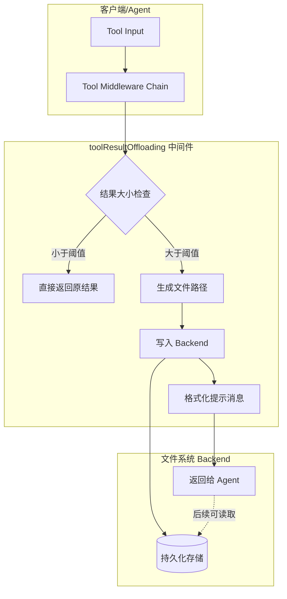

# filesystem_large_tool_result_offloading

## 概述

**`filesystem_large_tool_result_offloading`** 是 Eino 框架中的一个中间件模块，用于解决大模型对话中工具返回结果过大的问题。

### 问题背景

在基于 LLM 的 Agent 系统中，工具（Tool）执行后返回的结果需要发送回模型继续推理。当工具返回结果非常大时——比如读取大型文件、执行复杂查询、或者返回大量日志——会产生几个严重问题：

1. **Token 成本爆炸**：大模型按 token 收费，超大结果会显著增加 API 调用成本
2. **上下文溢出**：某些模型有上下文长度限制，超大结果可能导致输入超出限制
3. **响应延迟**：传输和处理超大文本会增加整体响应时间

### 核心解决思路

这个模块采用**"截断 + 外存"**的策略：不是把完整结果发给模型，而是：

1. **检测大小**：判断工具返回结果是否超过配置的 token 阈值
2. **持久化存储**：如果超过阈值，将完整结果写入文件系统
3. **返回提示**：向模型返回一个格式化的提示消息，包含：
   - 结果已保存到文件的信息
   - 结果的前几行（默认10行，每行最多1000字符）作为摘要
   - 可以用来读取完整文件的文件路径

这类似于**快递寄存柜**的机制：大件物品不直接送到用户手上，而是存到寄存柜，然后给用户一张取货码（文件路径）。

---

## 架构设计

### 组件关系



### 核心组件

| 组件 | 职责 |
|------|------|
| `toolResultOffloadingConfig` | 配置结构体，定义 Backend、TokenLimit、PathGenerator |
| `toolResultOffloading` | 中间件实现，提供 `invoke` 和 `stream` 两种包装方式 |
| `Backend` (依赖) | 文件系统抽象接口，负责实际的读写操作 |

### 数据流程

```
1. Agent 调用工具
   │
   ▼
2. Middleware 包装的 endpoint 执行实际工具逻辑
   │
   ▼
3. 获取工具返回结果
   │
   ▼
4. handleResult() 检查结果长度
   │   ├─ 长度 > tokenLimit * 4 → 触发 offload
   │   └─ 长度 ≤ tokenLimit * 4 → 直接返回
   │
   ▼ (触发 offload 时)
5. PathGenerator 生成文件路径（默认: /large_tool_result/{callID}）
   │
   ▼
6. Backend.Write() 将完整结果写入文件系统
   │
   ▼
7. formatToolMessage() 生成摘要（前10行，每行最多1000字符）
   │
   ▼
8. 返回格式化的提示消息，告知模型结果已保存
```

---

## 核心实现

### 配置结构

```go
type toolResultOffloadingConfig struct {
    Backend       Backend           // 文件系统后端（必需）
    TokenLimit    int               // token 阈值，默认 20000
    PathGenerator func(ctx context.Context, input *compose.ToolInput) (string, error)
                                        // 文件路径生成器，默认 /large_tool_result/{callID}
}
```

**关键设计点**：

- **`TokenLimit * 4` 阈值**：为什么是 4？一般认为 1 个 token 约等于 4 个字符。如果设置 `TokenLimit=20000`，则 80000 字符以下的结果不会触发 offload。这是经过实践检验的经验值。

- **可自定义的 PathGenerator**：允许调用者控制文件存储路径，方便集成到不同的存储系统（如 S3、云存储）。

### 中间件实现

```go
type toolResultOffloading struct {
    backend       Backend
    tokenLimit    int
    pathGenerator func(ctx context.Context, input *compose.ToolInput) (string, error)
}
```

中间件实现了 `compose.ToolMiddleware` 接口，提供两个包装方法：

1. **`invoke`** - 同步调用包装
2. **`stream`** - 流式调用包装

两者逻辑相同，都会在结果返回前进行大小检查和处理。

### 结果处理逻辑

```go
func (t *toolResultOffloading) handleResult(ctx context.Context, result string, input *compose.ToolInput) (string, error) {
    // 阈值检查
    if len(result) > t.tokenLimit*4 {
        // 生成文件路径
        path, err := t.pathGenerator(ctx, input)
        // ...
        
        // 写入完整结果到文件
        err = t.backend.Write(ctx, &WriteRequest{
            FilePath: path,
            Content:  result,
        })
        
        // 生成摘要消息
        nResult := formatToolMessage(result)  // 前10行，每行最多1000字符
        nResult, err = pyfmt.Fmt(tooLargeToolMessage, map[string]any{
            "tool_call_id":   input.CallID,
            "file_path":      path,
            "content_sample": nResult,
        })
        
        return nResult, nil
    }
    
    // 小结果直接返回
    return result, nil
}
```

### 消息格式

当结果被 offload 时，返回的消息类似：

```
Tool result too large. Please use the file_read tool to read the full result.
Tool Call ID: call_123
File Path: /large_tool_result/call_123

Content sample:
1: <first line truncated to 1000 chars>
2: <second line>
...
10: <tenth line>
```

---

## 设计决策与权衡

### 1. 字符数 vs Token 数

**选择**：使用 `len(result) > tokenLimit * 4` 作为判断条件

**分析**：
- 精确计算 token 需要调用 tokenizer，有额外开销
- 使用 4 倍关系是业界通用的估算方式（虽然不精确，但在可接受范围内）
- 权衡：牺牲一点精确性，换取更好的性能

### 2. 摘要截断策略

**选择**：保留前 10 行，每行最多 1000 字符

**分析**：
- 给模型足够的上下文来理解结果的结构和内容
- 避免超长单行（如 base64 编码）占用过多空间
- 这是一个经验值，如果需要更灵活的配置，可以扩展 Config

### 3. 默认路径生成

**选择**：`/large_tool_result/{callID}`

**分析**：
- 使用 callID 可以保证文件名的唯一性，避免冲突
- 路径前缀可自定义，满足不同部署环境的需求
- 简单直接，不需要复杂的命名策略

### 4. 错误处理策略

**选择**：任何步骤出错都立即返回错误

**分析**：
- 如果路径生成失败、写入失败、或消息格式化失败，都不应该继续
- 错误会透明地传播给上层调用者
- 在生产环境中，可能需要考虑更优雅的降级策略（如直接返回原结果而不是报错）

---

## 与其他模块的关系

### 依赖关系

| 模块 | 关系 | 说明 |
|------|------|------|
| `compose.ToolMiddleware` | 实现 | 遵循 compose 框架的中间件接口 |
| `Backend` (filesystem) | 依赖 | 抽象的文件系统操作接口 |
| `generic_tool_result_reduction` | 平行实现 | 存在一个通用的 reduction 版本，功能类似但更抽象 |

### 平行实现：reduction.large_tool_result

在 `adk.middlewares.reduction.large_tool_result` 中存在一个更通用的实现：

```go
type toolResultOffloadingConfig struct {
    Backend          Backend
    ReadFileToolName string   // 增加：读取文件的工具名
    TokenLimit       int
    PathGenerator    func(ctx context.Context, input *compose.ToolInput) (string, error)
    TokenCounter     func(msg *schema.Message) int  // 增加：自定义 token 计数函数
}
```

**区别**：
- `filesystem` 版本：专注于文件系统场景，直接写入文件
- `reduction` 版本：更通用，支持自定义 token 计数逻辑，并知道如何让 Agent 读取回结果

---

## 使用指南

### 基本用法

```go
backend := filesystem.NewInMemoryBackend() // 或其他 Backend 实现

config := &toolResultOffloadingConfig{
    Backend:    backend,
    TokenLimit: 20000,  // 可选，默认 20000
}

middleware := newToolResultOffloading(ctx, config)

// 包装工具节点
graphNode := compose.NewToolNode(
    compose.WithToolMiddleware(middleware),
    // ... 其他配置
)
```

### 自定义路径生成

```go
config := &toolResultOffloadingConfig{
    Backend: backend,
    TokenLimit: 10000,
    PathGenerator: func(ctx context.Context, input *compose.ToolInput) (string, error) {
        // 自定义逻辑，比如按日期分目录
        date := time.Now().Format("2006-01-02")
        return fmt.Sprintf("/agent_results/%s/%s.json", date, input.CallID), nil
    },
}
```

---

## 注意事项与陷阱

### 1. Backend 必须实现 Write 方法

如果 Backend 的 `Write` 方法返回错误，整个 offload 流程会失败。如果不希望因为 offload 失败而导致整个请求失败，需要在外层做错误处理。

### 2. 路径冲突

默认的 PathGenerator 使用 `CallID`，在重试场景下可能会生成相同的路径。如果需要支持重试，应该在 PathGenerator 中加入额外的不确定性（如时间戳、随机数）。

### 3. 摘要可能误导模型

当前实现只保留前 10 行。如果工具返回的是一个列表或表格，前 10 行可能不包含关键信息。模型需要理解"读取完整文件"的提示才能获取全部内容。

### 4. 流式调用的处理

在流式场景下，中间件会先收集完整流（`concatString`），再进行大小判断。这意味着流式调用的优势（边生产边消费）被一定程度上抵消了。对于超长结果，仍然需要等待完整结果后才能决定是否 offload。

### 5. 默认阈值适合大多数场景

- 默认 `TokenLimit = 20000` 意味着约 80000 字符以下的结果不会触发 offload
- 调整时考虑：模型上下文窗口大小、API 成本、延迟要求

---

## 测试覆盖

测试文件 `large_tool_result_test.go` 覆盖了以下场景：

| 测试用例 | 验证点 |
|----------|--------|
| `TestToolResultOffloading_SmallResult` | 小结果直接通过，不写文件 |
| `TestToolResultOffloading_LargeResult` | 大结果触发 offload，生成正确消息 |
| `TestToolResultOffloading_CustomPathGenerator` | 自定义路径生成器生效 |
| `TestToolResultOffloading_PathGeneratorError` | 路径生成错误正确传播 |
| `TestToolResultOffloading_EndpointError` | 工具执行错误正确传播 |
| `TestToolResultOffloading_DefaultTokenLimit` | 默认 TokenLimit 为 20000 |
| `TestToolResultOffloading_Stream` | 流式调用正常工作 |
| `TestToolResultOffloading_StreamError` | 流式调用错误处理 |
| `TestFormatToolMessage` | 摘要格式化逻辑（行数限制、字符截断、Unicode） |
| `TestConcatString` | 流数据拼接逻辑 |
| `TestToolResultOffloading_BackendWriteError` | Backend 写入失败错误处理 |

---

## 扩展点

如果需要定制更复杂的行为，可以考虑：

1. **实现自定义 Backend**：支持将结果写入 S3、云存储或其他存储系统
2. **自定义 Token 计算**：通过 `reduction.large_tool_result` 版本支持自定义 token 计数逻辑
3. **异步写文件**：当前是同步写入，高吞吐场景可以改为异步
4. **压缩存储**：对于纯文本结果，可以考虑先压缩再存储，节省空间