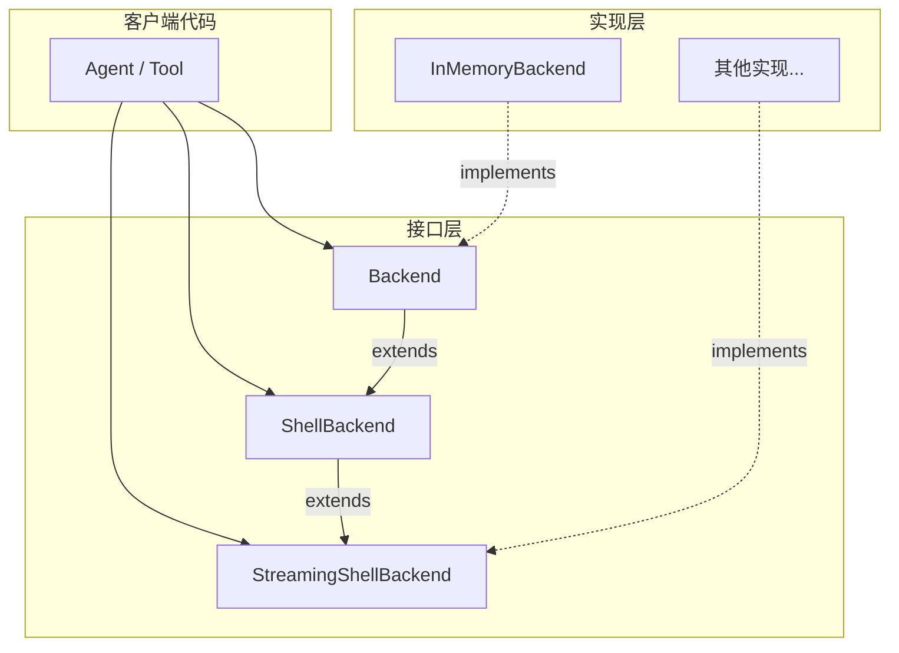

# filesystem_backend_core 模块文档

## 概述

`filesystem_backend_core` 模块是 EINO 框架中的**虚拟文件系统抽象层**。它定义了一套与具体存储无关的文件操作接口，使得上层代码可以工作在"虚拟文件"上，而无需关心数据是存储在内存、真实文件系统还是远程存储中。

**解决的问题**：在 AI Agent 场景中，Agent 需要读取、编辑、搜索代码文件，但直接操作真实文件系统存在风险（破坏用户数据、权限问题、路径规范化困难）。通过引入 Backend 抽象，我们可以在**沙箱环境**中运行 Agent，所有文件操作都在内存或隔离的虚拟文件系统中完成，确保安全性和可测试性。

**核心价值**：
- **可测试性**：在单元测试中用 InMemoryBackend 替代真实文件系统，无需 mock 文件 I/O
- **安全性**：Agent 的文件操作被限制在虚拟文件系统中，无法访问系统关键目录
- **可扩展性**：只需实现 Backend 接口，即可支持 S3、NFS、Git 仓库等不同存储后端

---

## 架构设计

### 核心接口层级



### 接口职责说明

| 接口 | 职责 | 典型使用场景 |
|------|------|-------------|
| `Backend` | 基础文件操作集合 | 文件读取、编辑、搜索、列表 |
| `ShellBackend` | 扩展 Shell 命令执行 | 需要运行系统命令的工具 |
| `StreamingShellBackend` | 流式输出支持 | 长命令的实时输出消费 |

### 请求/响应 DTO 设计

所有操作都使用**结构体参数**（Request）和**结构体返回值**（Response），而非原始类型。这一设计选择的考量：

1. **向后兼容**：新增字段无需破坏已有调用代码
2. **自描述性**：字段名本身就是文档
3. **扩展性**：future 可以轻松添加 `Options` 字段

---

## 核心组件详解

### 1. Backend 接口 —— 虚拟文件系统的"操作系统调用"

```go
type Backend interface {
    LsInfo(ctx context.Context, req *LsInfoRequest) ([]FileInfo, error)
    Read(ctx context.Context, req *ReadRequest) (string, error)
    GrepRaw(ctx context.Context, req *GrepRequest) ([]GrepMatch, error)
    GlobInfo(ctx context.Context, req *GlobInfoRequest) ([]FileInfo, error)
    Write(ctx context.Context, req *WriteRequest) error
    Edit(ctx context.Context, req *EditRequest) error
}
```

**设计意图**：这六个方法对应了 Agent 最常用的文件操作：
- `LsInfo` → `ls` 命令：列出目录内容
- `Read` → `cat` 命令：读取文件内容（支持分页）
- `GrepRaw` → `grep` 命令：搜索文件内容
- `GlobInfo` → shell glob：按模式匹配文件
- `Write` → 文件创建/覆盖
- `Edit` → 文本替换（sed 的安全版本）

### 2. InMemoryBackend —— 内存中的虚拟文件系统

```go
type InMemoryBackend struct {
    mu    sync.RWMutex
    files map[string]string  // 虚拟文件系统存储
}
```

**内部机制**：
- 使用 `map[string]string` 存储文件路径 → 内容 的映射
- `sync.RWMutex` 保证并发安全（读锁并行，写锁独占）
- 路径规范化：`normalizePath()` 确保所有路径以 `/` 开头，移除尾随斜杠

### 3. Shell 执行能力

```go
type ExecuteResponse struct {
    Output    string
    ExitCode  *int
    Truncated bool
}
```

注意 `Truncated` 字段 —— 当输出过长时被截断，这是一个务实的**降级策略**，避免大输出撑爆内存。

---

## 关键设计决策与 tradeoff 分析

### 决策 1：结构体参数 vs 原始类型参数

**选择**：所有方法使用结构体 Request 参数

**tradeoff**：
- ✅ **优点**：向后兼容、易于扩展、可添加 Options 字段
- ❌ **缺点**：调用时语法略微冗长（需要构造结构体）

**适用场景**：公共 API、长期维护的接口、需要版本演进的场景

---

### 决策 2：InMemoryBackend 的 Write 是"创建"而非"覆盖"

```go
// Write.go
if _, ok := b.files[filePath]; ok {
    return fmt.Errorf("file already exists: %s", filePath)
}
```

**选择**：Write 只负责创建新文件，如果文件已存在则报错

**tradeoff**：
- ✅ **优点**：避免意外覆盖，语义更安全（类似 `O_CREAT | O_EXCL`）
- ❌ **缺点**：需要先删除再创建，与 Unix `>` 重定向语义不同

---

### 决策 3：Edit 操作的单次 vs 全部替换

```go
// Edit.go
if !req.ReplaceAll {
    // 检查是否有多处匹配
    if strings.Contains(content[firstIndex+len(req.OldString):], req.OldString) {
        return fmt.Errorf("multiple occurrences...")
    }
}
```

**选择**：默认情况下（`ReplaceAll=false`），OldString 必须恰好出现一次

**tradeoff**：
- ✅ **优点**：更安全，避免意外的批量替换
- ❌ **缺点**：需要用户显式指定 `ReplaceAll=true` 才能批量替换

---

### 决策 4：路径规范化 —— 强制以 "/" 开头

```go
func normalizePath(path string) string {
    if path == "" {
        return "/"
    }
    if !strings.HasPrefix(path, "/") {
        path = "/" + path
    }
    return filepath.Clean(path)
}
```

**选择**：所有路径统一规范化为绝对路径

**tradeoff**：
- ✅ **优点**：消除路径歧义（相对 vs 绝对）、简化目录遍历逻辑
- ❌ **缺点**：无法表示相对路径（但在虚拟文件系统中这也确实是正确的设计）

---

## 数据流示例

### 场景：Agent 编辑一个代码文件

```
┌─────────────────┐     ┌──────────────────┐     ┌─────────────────────┐
│  Agent 决策     │────▶│  EditRequest     │────▶│  Backend.Edit()     │
│  "修改函数名"   │     │  OldString:      │     │  1. 获取写锁         │
│                 │     │    "OldFunc"     │     │  2. 验证文件存在     │
│                 │     │  NewString:      │     │  3. 验证 OldString  │
│                 │     │    "NewFunc"     │     │  4. 替换             │
│                 │     │  ReplaceAll:true │     │  5. 释放写锁         │
└─────────────────┘     └──────────────────┘     └─────────────────────┘
```

### 场景：搜索代码中的 TODO 标记

```
┌─────────────────┐     ┌──────────────────┐     ┌─────────────────────┐
│  Agent 决策     │────▶│  GrepRequest     │────▶│  Backend.GrepRaw()  │
│  "找 TODO"      │     │  Pattern: "TODO" │     │  1. 遍历所有文件    │
│                 │     │  Path: "/src"    │     │  2. 按 Glob 过滤    │
│                 │     │  Glob: "*.go"    │     │  3. 逐行匹配        │
│                 │     │                  │     │  4. 返回 GrepMatch[]│
└─────────────────┘     └──────────────────┘     └─────────────────────┘
```

---

## 子模块说明

### 1. backend_inmemory

`InMemoryBackend` 是 `Backend` 接口的内存实现。

**职责**：
- 提供一个完整的、线程安全的虚拟文件系统
- 支持所有 6 个基础文件操作
- 路径规范化处理
- 并发访问控制

**适用场景**：
- 单元测试（无需真实文件 I/O）
- 沙箱环境（Agent 的文件操作隔离）
- 演示/调试（快速搭建可复现状态）

---

## 与其他模块的交互

根据模块树结构，`filesystem_backend_core` 是 `adk_middlewares_and_filesystem` 的核心组件，预计会被以下模块使用：

- **[filesystem_tool_middleware](filesystem_tool_middleware.md)** - 将 Backend 操作暴露为 Agent Tool
- **[filesystem_large_tool_result_offloading](filesystem_large_tool_result_offloading.md)** - 大型工具结果卸载

---

## 注意事项与 Gotchas

### 1. 路径必须以 "/" 开头

所有 Backend 实现都假设路径是绝对路径。如果你传入相对路径（如 `src/main.go`），它会被自动规范化为 `/src/main.go`。这可能导致意外行为，如果你的业务逻辑需要相对路径支持。

### 2. Write 不会覆盖现有文件

`InMemoryBackend.Write()` 在文件已存在时会返回错误。如果需要覆盖，请先调用删除操作（当前接口未提供删除方法 —— 这是**有意设计的限制**，避免 Agent 意外删除文件）。

### 3. Edit 的 ReplaceAll 默认为 false

这意味着默认情况下只能替换唯一匹配项。如果文件中有多处相同的 OldString，Edit 会报错。这是一个**安全特性**，防止批量替换导致不可逆的破坏。

### 4. GrepRaw 不支持正则表达式

```go
// GrepRequest.go
// Pattern is the literal string to search for. This is not a regular expression.
```

当前实现是**字面字符串匹配**（literal match），不是正则表达式。如果需要正则支持，需要实现新的 Grep 方法。

### 5. Read 返回带行号的字符串

```go
// Read 输出示例
"     1\tline1\n     2\tline2\n     3\tline3"
```

输出格式是 `行号\t内容`，这是为了方便 Agent 定位编辑位置。这种格式与 IDE 的"跳转到第 N 行"功能配合良好。

### 6. 并发安全但非高性能

`InMemoryBackend` 使用简单的 RWMutex，对于极高并发场景可能成为瓶颈。但在 Agent 场景中，这个设计是合理的（Agent 操作本身是串行/低并发 的）。

---

## 扩展点：实现自定义 Backend

如果你需要实现自定义存储后端（例如对接 Git 仓库），你需要：

1. **实现 Backend 接口**（6 个方法）
2. **可选实现 ShellBackend**（如果需要命令执行能力）
3. **可选实现 StreamingShellBackend**（如果需要流式输出）

示例：

```go
type S3Backend struct {
    bucket string
    client *s3.Client
}

func (s *S3Backend) Read(ctx context.Context, req *ReadRequest) (string, error) {
    // 对接 S3 API
}

func (s *S3Backend) Write(ctx context.Context, req *WriteRequest) error {
    // 上传到 S3
}

// ... 实现其他方法
```

---

## 总结

`filesystem_backend_core` 是 EINO 框架的**文件操作抽象层**，通过 Strategy Pattern 解耦了"文件操作语义"与"存储实现"。它的设计简洁但完备 —— 6 个基础方法覆盖了 Agent 最常用的文件操作，InMemoryBackend 提供了开箱即用的测试和沙箱能力。

**核心设计原则**：
- **安全优先**：默认拒绝危险操作（覆盖文件、批量替换）
- **向后兼容**：结构体参数设计支持 API 演进
- **简单明确**：路径强制规范化，语义清晰无歧义

理解这个模块的关键是认识到：它不是在实现一个"更差的文件系统"，而是在构建一个**专为 Agent 设计的、安全可控的虚拟文件系统**。