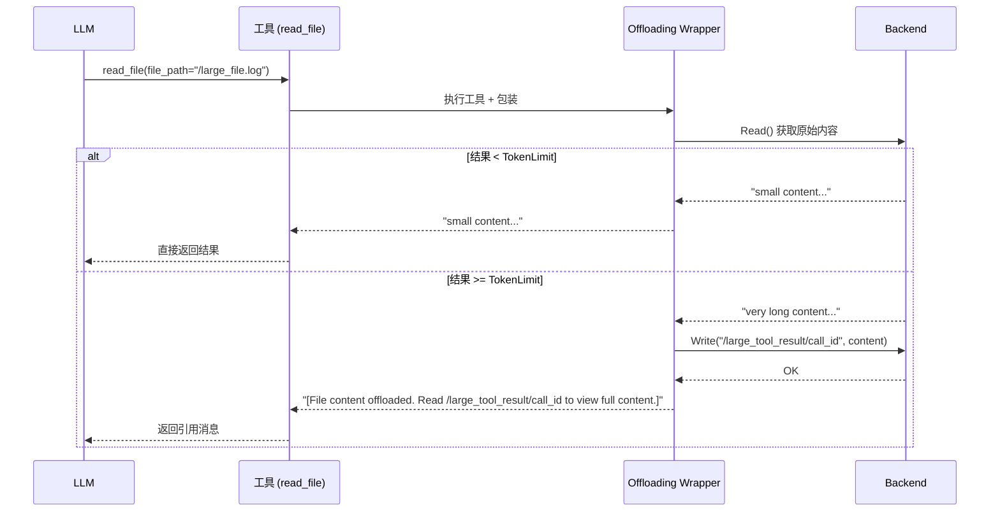

# 大型工具结果卸载 (Large Tool Result Offloading)

## 概述

大型工具结果卸载是 `filesystem_tool_middleware` 的一个关键特性。当 AI Agent 调用工具（如 `read_file`）时，返回的结果可能非常庞大——想象一下读取一个几万行的日志文件或者一个大型代码库。这种情况下，工具结果会消耗大量的 token，可能导致：

1. **上下文溢出**：结果超过 LLM 的上下文窗口限制
2. **成本浪费**：为不重要的内容支付额外费用
3. **性能下降**：处理大量文本增加延迟

大型工具结果卸载机制通过**自动将大结果写入文件系统、然后返回引用**的方式来解决这个问题。

## 工作原理

### 触发条件

卸载机制会在工具结果超过配置的 token 阈值时自动触发：

```go
type Config struct {
    // 默认值为 false，即默认启用 offloading
    WithoutLargeToolResultOffloading bool
    
    // 默认值为 20000 tokens
    LargeToolResultOffloadingTokenLimit int
}
```

### 数据流



### 输出示例

原始输出（未卸载）：
```
package main

import "fmt"

func main() {
    fmt.Println("Hello, World!")
}
// ... 10000 more lines
```

卸载后的输出：
```
[File content offloaded. Read /large_tool_result/call_123 to view full content.]

Total lines: 10000
```

LLM 会被告知"内容已被卸载"，并可以决定是否需要调用 `read_file` 来查看完整内容。

## 配置选项

### Token 阈值

```go
config := &filesystem.Config{
    Backend: backend,
    LargeToolResultOffloadingTokenLimit: 10000, // 默认 20000
}
```

降低阈值可以更早触发卸载，适合上下文窗口较小的模型。

### 自定义路径生成

默认情况下，卸载文件存储在 `/large_tool_result/{ToolCallID}`。你可以自定义这个路径：

```go
config := &filesystem.Config{
    Backend: backend,
    LargeToolResultOffloadingPathGen: func(ctx context.Context, input *compose.ToolInput) (string, error) {
        // 自定义路径逻辑
        return fmt.Sprintf("/user_data/%s/large_results/%s", userID, input.CallID), nil
    },
}
```

这个功能对于以下场景很有用：
- **多租户隔离**：每个用户有独立的存储空间
- **清理策略**：使用日期命名的目录便于定时清理
- **权限控制**：不同的路径有不同的访问权限

### 完全禁用

如果不需要这个功能，可以完全禁用：

```go
config := &filesystem.Config{
    Backend:                          backend,
    WithoutLargeToolResultOffloading: true, // 禁用 offloading
}
```

禁用后，`WrapToolCall` 会被设为 nil，不会引入额外的包装开销。

## 内部实现

### 核心数据结构

```go
type toolResultOffloading struct {
    backend       Backend                    // 用于存储卸载内容的 Backend
    tokenLimit    int                        // token 阈值
    pathGenerator func(ctx context.Context, input *compose.ToolInput) (string, error)  // 路径生成器
}
```

### Token 估算

Offloading 机制使用一个简单的启发式方法来估算 token 数量：

```go
// 简单估算：每 4 个字符约等于 1 个 token
estimatedTokens := len(content) / 4
```

这是一个**保守估算**，实际 token 数量可能因内容类型而异。对于代码文件，实际 token 通常比这个估算更多（因为有空格、缩进等）。

### 错误处理

如果卸载过程中发生错误（如 Backend 不可用），系统会：
1. 记录错误日志
2. 尝试返回原始内容（可能触发上下文溢出）
3. 让 LLM 处理后续情况

这是一种**降级策略**——宁可让 LLM 面对一个潜在的错误，也不要完全失败。

## 设计权衡

### 自动触发 vs 手动触发

**选择**：自动触发

LLM 不需要知道何时应该请求卸载——一切都是透明的。

**权衡**：
- ✅ LLM 无需理解卸载机制
- ✅ 配置一次即可，无需每此调用都指定
- ❌ 可能导致意外的文件写入
- ❌ 阈值配置需要根据实际使用场景调优

### 固定阈值 vs 动态阈值

**选择**：固定阈值（配置一次，永久使用）

**可能的改进**（未实现）：
- 根据 LLM 模型的剩余上下文动态调整
- 根据历史数据学习最佳阈值

### 存储位置

**选择**：存储在同一个 Backend 中

**替代方案**：
- 单独的存储服务 → 增加复杂性
- 临时文件系统 → 不适合分布式环境

统一 Backend 的好处是简化部署——只需要配置一个存储后端。

## 注意事项

### 1. 幂等性问题

相同的 `ToolCallID` 会生成相同的卸载路径。如果 LLM 由于某种原因重试同一个工具调用，第二次会覆盖第一次的内容。

```go
// 每次调用使用唯一的 CallID
path := pathGenerator(ctx, toolInput)
// 第二次调用相同的 tool...
path = pathGenerator(ctx, toolInput) // 相同的 path，会覆盖
```

### 2. 清理机制

当前实现**不包含自动清理**。你需要自己定期清理 `/large_tool_result/` 目录。

建议的清理策略：
- 使用 TTL（如 24 小时后删除）
- 使用定时任务（如每天凌晨清理）
- 根据存储空间阈值触发清理

### 3. 路径冲突

如果你使用自定义路径生成器，确保生成的路径是唯一的。如果两个工具调用生成相同的路径，会发生覆盖。

```go
// 好的实现
pathGenerator: func(ctx context.Context, input *compose.ToolInput) (string, error) {
    return fmt.Sprintf("/results/%s_%d", input.CallID, time.Now().Unix()), nil
}

// 不好的实现（可能导致冲突）
pathGenerator: func(ctx context.Context, input *compose.ToolInput) (string, error) {
    return "/results/output.txt", nil  // 总是相同！
}
```

### 4. 空内容处理

如果工具返回空结果，不会触发 offloading——即使设置了 tokenLimit 为 0 也不会处理空字符串。

### 5. 读取已卸载内容

卸载后，LLM 收到的消息会包含一个"引用"。LLM 可以选择：
- 忽略它（如果只需要知道操作成功）
- 调用 `read_file` 读取完整内容

这要求 System Prompt 正确告知 LLM 如何处理这种情况——这由 `filesystem_tool_middleware` 的默认 Prompt 处理。