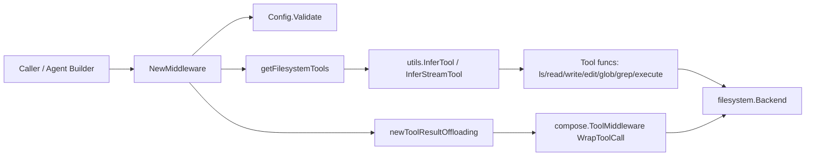

# filesystem_middleware_and_tool_surface

`filesystem_middleware_and_tool_surface` 模块的核心价值，可以用一句话概括：**把“文件系统能力”安全、可控、可提示地包装成 Agent 能直接调用的工具集合**。如果没有这一层，中间件使用方就要手动拼装一组 tool、手动写 system prompt、手动处理 shell 能力的有无、手动兜底超大工具输出——这会导致每个 Agent 都重复造轮子，而且行为不一致。这个模块像一个“总配电箱”：上游只需要提供一个 `Backend`，它就自动决定该暴露哪些工具、如何描述这些工具、是否在输出过大时落盘并给模型返回可继续读取的指引。

## 架构角色与数据流



从架构定位看，这个模块是一个**能力装配网关（capability assembly gateway）**：

它不实现真正的文件系统逻辑（那是 `Backend` 的职责，见 [backend_protocol_and_requests](backend_protocol_and_requests.md)），也不负责 Agent 主循环（那是 chatmodel agent/runtime 层的职责，见 [agent_runtime_and_orchestration](agent_runtime_and_orchestration.md)）。它做的是中间那层“翻译 + 策略注入”：把后端 API 翻译为 tool surface，并把运行策略（system prompt、大结果 offloading）注入 `adk.AgentMiddleware`。

关键链路是：调用方传 `Config` -> `NewMiddleware` 校验并生成工具 -> 组装 `AdditionalInstruction` 与 `AdditionalTools` -> 可选挂载 `WrapToolCall` 以做大结果 offloading。最终返回的 `adk.AgentMiddleware` 被上游 Agent 组合进执行管线。

## 这个模块解决的根问题

### 为什么“直接把 Backend 给 Agent”不够

一个朴素方案是：让 Agent 直接拿到文件系统接口，再由每个业务自行决定如何暴露工具。问题在于这会产生三类系统性风险。

第一类是**行为漂移**。不同团队会给同一能力起不同工具名、不同参数名，模型提示词也各写各的，导致“同样是 read file，在 A Agent 好用，在 B Agent 不好用”。

第二类是**上下文爆炸**。工具输出（尤其 grep/execute）可能极大，直接塞回模型上下文会拉高 token 成本并可能击穿窗口。

第三类是**能力协商复杂化**。Backend 可能有 shell、也可能没有；shell 可能是同步 `Execute`，也可能是流式 `ExecuteStreaming`。这些分支如果交给每个调用方处理，接入复杂度高，且很容易漏掉边界。

本模块的设计洞察是：**把文件系统能力的“接口差异”和“运行策略”集中到中间件层统一决策**，上游只做一次声明式配置。

## 心智模型：它像“机场安检 + 登机口广播”

可以把这个模块想象成机场流程：

- `Backend` 是机场背后的基础设施（跑道、行李系统）；
- `newXxxTool` 系列函数是各个安检通道，把自然语言工具调用转成结构化请求；
- `prompt.go` 里的描述与 system prompt 是登机口广播，告诉“乘客（模型）”怎么正确行动；
- `newToolResultOffloading` 是超重行李托运柜台：大件不让你手提进机舱（上下文），而是托运到文件系统，再给你取件单（path + 样例）。

这个模型有助于理解为什么它同时关心“tool surface”与“tool result policy”：两者必须一起设计，才能保证可用性与成本稳定性。

## 组件深潜

### `Config`

`Config` 是中间件的总开关，字段分四组：

1. 后端能力：`Backend`（必填）。
2. 大结果策略：`WithoutLargeToolResultOffloading`、`LargeToolResultOffloadingTokenLimit`、`LargeToolResultOffloadingPathGen`。
3. 系统提示覆盖：`CustomSystemPrompt`。
4. 各工具描述覆盖：`CustomLsToolDesc`、`CustomReadFileToolDesc`、`CustomGrepToolDesc`、`CustomGlobToolDesc`、`CustomWriteFileToolDesc`、`CustomEditToolDesc`、`CustomExecuteToolDesc`。

设计上它偏“显式可覆盖 + 默认可用”：如果你不配，模块给你可工作的默认行为；如果你有企业规范（提示词、输出策略、路径规范），可以精准替换。

### `(*Config).Validate()`

只做两件事：`config != nil` 且 `Backend != nil`。这是有意保持薄校验：

- 好处是减少配置耦合，不预设过多业务规则；
- 代价是一些“软错误”会延后到运行期才暴露（比如自定义 path generator 的问题）。

### `NewMiddleware(ctx, config)`

这是模块入口。它做了三步：

第一步，调用 `Validate` 与 `getFilesystemTools` 生成工具集合。

第二步，生成 `AdditionalInstruction`。若 `CustomSystemPrompt` 非空则完全覆盖；否则用 `ToolsSystemPrompt`，并在 backend 同时实现 `filesystem.StreamingShellBackend` 或 `filesystem.ShellBackend` 时追加 `ExecuteToolsSystemPrompt`。

第三步，默认启用 `WrapToolCall`（除非 `WithoutLargeToolResultOffloading=true`），通过 `newToolResultOffloading` 注入结果截流与落盘策略。

返回值是标准 `adk.AgentMiddleware`，因此能无缝接到 ADK agent 侧组合点。

### `getFilesystemTools(...)`

它是“能力协商器”。固定注册 `ls/read_file/write_file/edit_file/glob/grep` 六个工具，然后按 backend 类型追加 `execute`：

- 若 backend 实现 `filesystem.StreamingShellBackend`，注册流式 `execute`（`newStreamingExecuteTool`）；
- 否则若实现 `filesystem.ShellBackend`，注册非流式 `execute`（`newExecuteTool`）；
- 都不实现则不暴露 execute。

注意这里优先流式分支，避免同名 `execute` 重复注册，也体现“优先 richer capability”的策略。

### 参数结构体：`lsArgs/readFileArgs/writeFileArgs/editFileArgs/globArgs/grepArgs/executeArgs`

这些结构体是 tool 的入参 schema 来源（通过 `utils.InferTool` / `utils.InferStreamTool` 推断）。

它们不仅是类型定义，还是**模型-工具契约**：JSON 字段名（如 `file_path`、`output_mode`）直接决定模型如何构造 tool call。

### `newLsTool`

调用 `fs.LsInfo`，把 `[]FileInfo` 映射为按行拼接的路径字符串。它故意只返回路径，不返回完整元数据，目标是降低 token 开销并把“继续探索”交给后续工具（read/glob/grep）。

### `newReadFileTool`

在调用 `fs.Read` 前做本地参数归一化：`offset<0` 归零，`limit<=0` 设为 200。这个设计在工具层做防御，避免把无意义参数下推到 backend。

值得注意的是，`ReadFileToolDesc` 文案提到默认行为与实现的 `limit=200` 有差异，新贡献者要以实现为准并考虑同步文档。

### `newWriteFileTool`

调用 `fs.Write`，成功后返回确认字符串 `Updated file ...`。这里返回自然语言确认，而不是空串，目的是给模型一个稳定正反馈，减少它对“是否成功”的二次猜测。

### `newEditFileTool`

调用 `fs.Edit` 执行替换，成功返回 `Successfully replaced ...`。它把“唯一性/replace_all 语义”留给 backend 实现与工具描述约束（见 `EditFileToolDesc`）。

### `newGlobTool`

调用 `fs.GlobInfo`，输出同样是路径列表。和 `ls` 的区别是输入语义：`glob` 面向模式匹配，`ls` 面向目录浏览。

### `newGrepTool`

调用 `fs.GrepRaw` 后依据 `output_mode` 变换输出：

- `count`：返回 `len(matches)`（总匹配条数）；
- `content`：返回 `path:line:content` 列表；
- 默认（含非法值）：去重后的命中文件列表。

这里的默认分支其实是“容错降级”，即便模型给了未知 `output_mode` 也尽量返回有用结果，而不是报错打断流程。

### `newExecuteTool` 与 `convExecuteResponse`

非流式 execute 路径：调用 `ShellBackend.Execute`，再由 `convExecuteResponse` 统一拼装文本。

`convExecuteResponse` 的规则很关键：

- 非 0 exit code 会附带 `[Command failed with exit code X]`；
- `Truncated=true` 会附带截断提示；
- 若无输出且成功，返回 `[Command executed successfully with no output]`。

这个规则保证“无输出”不被误解成“调用失败/工具失灵”。

### `newStreamingExecuteTool`

流式 execute 路径：调用 `StreamingShellBackend.ExecuteStreaming`，把后端流桥接到 `schema.Pipe[string](10)`。

内部 goroutine 的机制有三个非显式但重要的点：

1. `recover + debug.Stack()`：防止桥接层 panic 导致 reader 悬挂。
2. 累积 `exitCode` 与 `hasSentContent`：在流结束时补发状态信息（失败码或“无输出成功”）。
3. chunk 级拼装：每个 chunk 输出文本 + 截断提示。

这是典型“流协议归一化适配器”：后端是结构化 chunk，向上游暴露统一 string 流。

## 依赖关系与契约分析

从源码调用关系看，当前模块的热点依赖包括：

- `github.com/cloudwego/eino/adk`：用于构造 `adk.AgentMiddleware`；
- `github.com/cloudwego/eino/adk/filesystem`：底层 backend 协议（`Backend/ShellBackend/StreamingShellBackend` 与请求结构体）；
- `github.com/cloudwego/eino/components/tool/utils`：`InferTool`/`InferStreamTool`，把 Go 函数直接提升为 tool；
- `github.com/cloudwego/eino/compose`：`ToolInput/ToolOutput` 以及 `ToolMiddleware`（由 offloading 使用）；
- `github.com/cloudwego/eino/schema`：流 reader/writer 及 `Pipe`。

它被谁调用：通常是 Agent 构建阶段，调用 `NewMiddleware` 得到 `adk.AgentMiddleware` 并注入 Agent 配置。上游期望它提供两类合同：

第一类是**声明合同**：`AdditionalInstruction` 与 `AdditionalTools` 一致，避免“提示词说有工具但没注册”。

第二类是**运行合同**：若启用 offloading，`WrapToolCall` 需要对 invokable/streamable 都可工作，并且结果语义可被模型继续消费（路径 + 样例 + read_file 指引）。

与兄弟模块关系：

- backend 协议见 [backend_protocol_and_requests](backend_protocol_and_requests.md)
- in-memory backend 见 [in_memory_backend_implementation](in_memory_backend_implementation.md)
- 大结果 offloading 实现见 [large_tool_result_offloading_pipeline](large_tool_result_offloading_pipeline.md)

## 设计取舍

### 1) 简单性 vs 灵活性：工具固定集合 + 描述可覆盖

当前实现固定了核心工具名（`ls/read_file/...`），这让模型行为更稳定，也便于 prompt 对齐；同时允许 description 覆盖，给业务留定制空间。它放弃了“任意命名工具”的灵活性，换来跨场景一致性。

### 2) 性能 vs 正确性：offloading 以长度近似 token

`handleResult` 使用 `len(result) > tokenLimit*4` 作为阈值近似，而非真实 tokenizer。优点是零额外依赖、开销低；代价是阈值不精确（尤其多字节字符或不同模型 tokenizer 下偏差明显）。

### 3) 流式体验 vs 策略统一：offloading 会把流拼成整块

在 `toolResultOffloading.stream` 中，先 `concatString` 再处理，最后返回单 chunk stream。这简化了“流式/非流式共享同一 offloading 逻辑”，但牺牲了真正增量流式体验。对长命令输出，这是明显的体验-实现复杂度权衡。

### 4) 低耦合校验 vs 提前失败

`Validate` 只检查 nil，保留高度自治，但意味着某些配置错误（例如 path generator 逻辑）会晚失败。该策略更偏框架中立性，而非强规范。

## 使用方式与示例

```go
ctx := context.Background()
backend := /* your implementation of filesystem.Backend */

mw, err := filesystem.NewMiddleware(ctx, &filesystem.Config{
    Backend: backend,
    LargeToolResultOffloadingTokenLimit: 30000,
    LargeToolResultOffloadingPathGen: func(ctx context.Context, input *compose.ToolInput) (string, error) {
        return "/tmp/tool_results/" + input.CallID + ".txt", nil
    },
})
if err != nil {
    panic(err)
}

// 将 mw 注入你的 Agent 构建流程
_ = mw
```

如果你希望完全禁用大结果托管：

```go
mw, err := filesystem.NewMiddleware(ctx, &filesystem.Config{
    Backend: backend,
    WithoutLargeToolResultOffloading: true,
})
```

如果 backend 还实现了 `filesystem.StreamingShellBackend`，则会自动得到流式 `execute` 工具；若只实现 `filesystem.ShellBackend`，得到非流式 `execute`；都没实现则无 `execute`。

## 新贡献者最容易踩的坑

第一，**提示词文案与实现可能存在漂移**。例如 `ReadFileToolDesc` 的默认读取描述与 `newReadFileTool` 中 `limit=200` 的实现并不完全一致。改行为时要同步检查 `prompt.go`。

第二，**`grep` 的 `count` 语义是总匹配条数**。工具描述文字容易让人误解为“按文件计数”，但实现是 `len(matches)`。

第三，**流式 execute 在启用 offloading 时会被整流**。因为 offloading 的 stream 分支会先拼接全部输出再返回单片段，这对需要实时回显的场景影响很大。

第四，**`execute` 的注册依赖类型断言**。如果你的 backend 把 shell 能力包在别的对象里而未实现接口，工具不会出现。

第五，**错误传播是直通的**。大多数 tool handler 不做错误包装，上游看到的是 backend 原始错误；这有利于诊断，但也要求 backend 错误信息足够可读、避免泄露敏感路径。

## 参考

- [backend_protocol_and_requests](backend_protocol_and_requests.md)
- [in_memory_backend_implementation](in_memory_backend_implementation.md)
- [large_tool_result_offloading_pipeline](large_tool_result_offloading_pipeline.md)
- [agent_runtime_and_orchestration](agent_runtime_and_orchestration.md)
