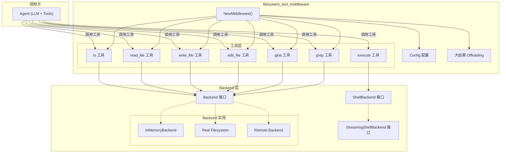
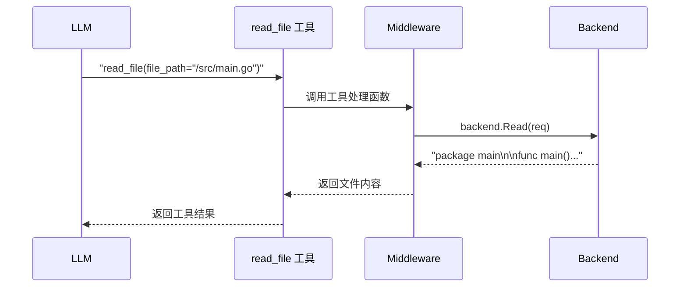
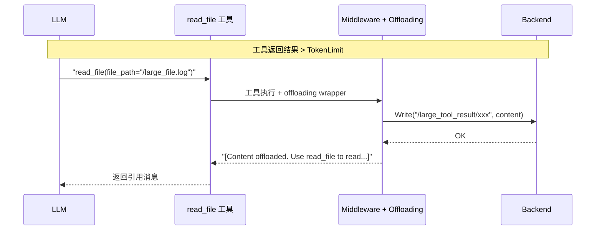

# filesystem_tool_middleware 模块文档

## 概述

`filesystem_tool_middleware` 是 ADK 运行时中的一个关键中间件，它为 AI Agent 提供了文件系统操作的能力。想象一下：如果 AI Agent 只是一个"只会思考的大脑"，那么这个中间件就是它的"手"——让它能够读取代码文件、修改配置、搜索内容、执行命令，真正与用户的项目环境进行交互。

这个模块解决了两个核心问题：
1. **工具暴露问题**：如何将一组文件操作（ls、read、write、edit、glob、grep、execute）以标准化的工具形式注册到 Agent 那里
2. **大结果处理问题**：当工具返回结果过大（如读取大型文件）时，如何避免超出 LLM 的上下文窗口限制

---

## 架构概览



### 核心组件与职责

| 组件 | 职责 | 位置 |
|------|------|------|
| `Config` | 中间件配置结构体，定义 Backend、大结果offloading策略、工具描述等 | `filesystem.go` |
| `Backend` | 核心接口，抽象了所有文件系统操作 | `backend.go` |
| `NewMiddleware()` | 工厂函数，根据配置创建完整的中间件实例 | `filesystem.go` |
| 工具构建函数 | `newLsTool`, `newReadFileTool` 等，将 Backend 方法包装为 Agent 工具 | `filesystem.go` |
| 大结果Offloading | 当工具返回结果超过token阈值时，自动将结果存储到Backend并返回引用 | `large_tool_result` |

---

## 核心抽象：Backend 接口

理解这个模块的关键是理解 `Backend` 接口的设计意图：

```go
type Backend interface {
    LsInfo(ctx context.Context, req *LsInfoRequest) ([]FileInfo, error)
    Read(ctx context.Context, req *ReadRequest) (string, error)
    GrepRaw(ctx context.Context, req *GrepRequest) ([]GrepMatch, error)
    GlobInfo(ctx context.Context, req *GlobInfoRequest) ([]FileInfo, error)
    Write(ctx context.Context, req *WriteRequest) error
    Edit(ctx context.Context, req *EditRequest) error
}
```

**为什么使用结构体参数而不是基础类型？**

想象一下：如果 `Read` 方法签名是 `Read(ctx context.Context, path string, offset int, limit int)`，那么将来想要添加一个新参数（比如 `encoding string`）时，就必须修改所有实现这个接口的代码。使用结构体参数就像给方法预留了"扩展插槽"——新增字段不会破坏现有的实现，实现了**向后兼容**。

**ShellBackend 和 StreamingShellBackend 的分层设计**

这是一个经典的门面模式（Facade Pattern）应用：
- `Backend` 是基础门面，提供核心文件操作
- `ShellBackend` 扩展了执行 shell 命令的能力
- `StreamingShellBackend` 在 shell 执行能力基础上增加了流式输出支持

这种分层的好处是：实现者可以根据自己的能力选择实现哪个接口——一个简单的内存 Backend 只需要实现 `Backend`，而一个支持命令执行的本地文件系统则可以实现 `ShellBackend`。

---

## 数据流分析

### 场景一：Agent 读取文件



### 场景二：大结果 Offloading

当读取的文件非常大时（如 > 20000 tokens），中间件会自动：

1. 将内容写入 Backend（默认路径：`/large_tool_result/{ToolCallID}`）
2. 返回一个带有引用信息的消息，告诉 LLM 可以用 `read_file` 读取这个内容



---

## 设计决策与权衡

### 1. 工具注册模式：固定工具集 vs 动态注册

**选择**：固定工具集 + 可选扩展

当前实现会注册 6 个核心工具（ls, read_file, write_file, edit_file, glob, grep），如果 Backend 实现了 `ShellBackend` 或 `StreamingShellBackend`，则额外注册 `execute` 工具。

**权衡分析**：
- ✅ **优点**：简单确定，LLM 知道有哪些工具可用；配置即生效
- ❌ **缺点**：无法动态增删工具；如果不需要某些工具，仍会注册

**为什么这样选择？**
对于文件系统操作这种基础能力，通常是"要么全要要么不要"的场景。没有必要让用户精细配置每个工具是否启用。

### 2. Offloading 策略：自动 vs 手动

**选择**：自动阈值触发

当工具结果超过配置的 token 阈值时自动触发 offloading，无需 LLM 显式请求。

**权衡分析**：
- ✅ **优点**：对 LLM 透明，不需要它理解何时应该请求 offloading
- ❌ **缺点**：可能导致意外的文件写入；阈值配置需要根据具体场景调优

### 3. 执行模式：同步 vs 流式

**选择**：根据 Backend 能力自动选择

- 如果 Backend 实现了 `StreamingShellBackend`：使用流式执行，实时返回输出
- 如果 Backend 实现了 `ShellBackend`：使用同步执行，等待命令完成
- 如果只实现了 `Backend`：不注册 execute 工具

**权衡分析**：
- ✅ **优点**：适配不同后端能力；流式输出提供更好的交互体验
- ❌ **缺点**：LLM 可能观察到不同的行为，取决于后端类型

---

## 子模块概览

| 子模块 | 描述 | 文档 |
|--------|------|------|
| `filesystem_tool_middleware`（当前模块） | 核心中间件，提供文件操作工具 | 本文档 |
| `filesystem_large_tool_result_offloading` | 大型工具结果自动 offloading 到文件系统的机制 | [filesystem_large_tool_result_offloading](filesystem_large_tool_result_offloading.md) |
| `filesystem_backend_core` | Backend 接口定义与实现（InMemory, ShellBackend 等） | [filesystem_backend_core](filesystem_backend_core.md) |
| `generic_tool_result_reduction` | 通用的工具结果缩减策略（清理 + offloading） | [generic_tool_result_reduction](generic_tool_result_reduction.md) |

---

## 依赖关系

### 上游依赖（被谁依赖）

- **ChatModelAgent**: 使用这个中间件为 Agent 添加文件系统能力
- **Workflow Agents**: 在工作流中执行文件操作任务

### 下游依赖（依赖谁）

- **filesystem_backend_core**: 提供 Backend 接口定义
- **components/tool**: 工具定义和注册
- **compose**: ToolInput 等类型定义

### 关键依赖链

```
Agent
  └── Middleware (filesystem_tool_middleware)
        ├── Backend (filesystem_backend_core)
        │     ├── InMemoryBackend
        │     ├── ShellBackend (real filesystem)
        │     └── StreamingShellBackend
        │
        └── Offloading (large_tool_result_offloading)
              └── Backend (用于存储 offload 内容)
```

---

## 使用指南

### 基本用法

```go
import (
    "github.com/cloudwego/eino/adk/middlewares/filesystem"
    "github.com/cloudwego/eino/adk/filesystem"
)

func main() {
    // 1. 创建 Backend（这里是内存实现，适合测试）
    backend := filesystem.NewInMemoryBackend()
    
    // 2. 配置中间件
    config := &filesystem.Config{
        Backend: backend,
        // 大结果 offloading 默认开启
        LargeToolResultOffloadingTokenLimit: 20000,
    }
    
    // 3. 创建中间件
    middleware, err := filesystem.NewMiddleware(ctx, config)
    
    // 4. 将中间件应用到 Agent
    // ... (根据具体 Agent 创建方式)
}
```

### 自定义工具描述

```go
customLsDesc := "列出指定目录下的文件和文件夹"
config := &filesystem.Config{
    Backend:            backend,
    CustomLsToolDesc:   &customLsDesc,
    CustomReadFileToolDesc: ptrOf("读取文件内容，支持行号偏移和限制"),
}
```

### 禁用大结果 Offloading

```go
config := &filesystem.Config{
    Backend:                          backend,
    WithoutLargeToolResultOffloading: true,  // 禁用 offloading
}
```

---

## 新贡献者注意事项

### 1. 配置验证是前置门槛

`Config.Validate()` 在 `NewMiddleware` 开始时就执行，任何配置错误都会立即返回。这意味着：
- 不要试图在工具创建函数中处理"配置缺失"——配置应该在更上层被验证

### 2. 空 Path 的隐式语义

在 `ls`, `glob`, `grep` 等工具中，空字符串 `""` 会被视为根路径 `/`。这是通过 Backend 实现来处理的，但调用方需要意识到这个约定。

### 3. read_file 的默认值陷阱

```go
if input.Limit <= 0 {
    input.Limit = 200  // 默认只读 200 行！
}
```

如果 LLM 没有明确指定 limit，可能会只拿到部分内容。这对于大型代码文件可能是问题。

### 4. edit_file 的安全约束

`edit_file` 工具要求 `OldString` 不能为空。这防止了"追加而非替换"的误用，但如果 LLM 尝试直接追加内容到文件末尾，可能会失败。

### 5. Offloading 的幂等性

同一个 ToolCallID 会生成相同的 offload 路径。如果同一个工具调用被执行两次（由于 LLM 重试），第二次会覆盖第一次的内容。这通常是预期行为，但可能影响调试。

### 6. Streaming Execute 的 Panic 处理

在 `newStreamingExecuteTool` 中有一个 `recover()` 捕获：

```go
defer func() {
    e := recover()
    if e != nil {
        sw.Send("", fmt.Errorf("panic: %v,\n stack: %s", e, string(debug.Stack())))
    }
    sw.Close()
}()
```

这是为了防止命令执行时的 panic 导致整个流被破坏。理解这一点有助于调试流式执行的异常情况。

---

## 相关文档

- [Backend 接口详解](./filesystem_backend_core.md)
- [大结果 Offloading 机制](./filesystem_large_tool_result_offloading.md)
- [通用工具结果缩减策略](./generic_tool_result_reduction.md)
- [Agent 中间件系统](../adk_runtime/chatmodel_agent_core_runtime.md)