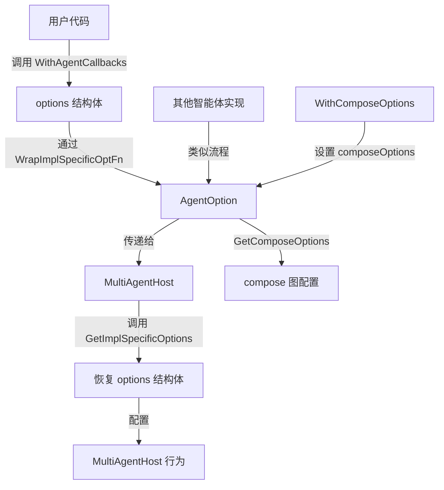

# option_handlers 模块技术深度解析

## 1. 问题空间：为什么需要这个模块？

在构建多智能体系统时，我们面临着一个经典的配置挑战：如何在保持统一接口的同时，让不同的智能体实现拥有自己特定的配置选项？

想象一下这样的场景：
- 你有一个通用的 `AgentOption` 接口，所有智能体都使用它
- 但每个具体的智能体实现（比如 MultiAgentHost、ReactAgent）都有自己独特的配置需求
- 你不希望为每种智能体创建完全不同的选项系统，因为那样会导致接口碎片化

一个朴素的解决方案可能是在 `AgentOption` 中包含所有可能的配置字段，但这显然不可持续——随着智能体类型增多，这个结构会变得臃肿不堪，而且违反了开闭原则。

`option_handlers` 模块正是为了解决这个问题而存在的：它提供了一种机制，让通用的 `AgentOption` 可以承载实现特定的配置，同时保持接口的一致性。

## 2. 核心概念与心智模型

要理解这个模块，你需要掌握两个关键概念：

### 2.1 两层选项模型

把 `AgentOption` 想象成一个**通用信封**：
- 信封里可以装两种东西：
  1. **通用邮票**：`composeOptions`——适用于所有基于 compose 图的智能体
  2. **私人信件**：`implSpecificOptFn`——只有特定智能体实现才能读取的配置

### 2.2 类型安全的类型擦除

这里使用了一个巧妙的模式：**通过类型擦除实现通用性，通过类型断言恢复类型安全**。

- `WrapImplSpecificOptFn` 将具体类型的函数"擦除"为 `any` 类型，存入通用结构
- `GetImplSpecificOptions` 再通过类型断言将其恢复为具体类型
- 这种做法在 Go 的泛型出现之前很常见，即使有了泛型，它依然提供了极大的灵活性

## 3. 架构与数据流



### 数据流向详解：

1. **配置创建阶段**：
   - 用户调用 `WithAgentCallbacks` 等函数
   - 这些函数创建具体的选项修改函数
   - 通过 `WrapImplSpecificOptFn` 包装成 `AgentOption`

2. **配置传递阶段**：
   - `AgentOption` 被传递给智能体构造函数
   - 此时它只是一个不透明的容器

3. **配置应用阶段**：
   - 智能体实现调用 `GetImplSpecificOptions`
   - 传入自己特定的选项结构体类型
   - 只有类型匹配的选项函数会被应用

## 4. 核心组件深度解析

### 4.1 AgentOption 结构体

**位置**：[flow/agent/agent_option.go](flow-agent-agent_option.md)

**作用**：通用的智能体选项容器，是整个选项系统的核心。

```go
type AgentOption struct {
    implSpecificOptFn any  // 实现特定的选项函数
    composeOptions    []compose.Option  // 通用的 compose 选项
}
```

**设计意图**：
- 将两种不同类型的选项统一在一个结构中
- `implSpecificOptFn` 使用 `any` 类型是为了灵活性——它可以容纳任何类型的选项函数
- `composeOptions` 是共享的，因为大多数智能体最终都是基于 compose 图构建的

**关键洞察**：这个结构体本身不"知道"具体的选项内容，它只是一个载体——这是它能够通用的关键。

### 4.2 WrapImplSpecificOptFn 函数

**签名**：`func WrapImplSpecificOptFn[T any](optFn func(*T)) AgentOption`

**作用**：将具体类型的选项函数包装成通用的 `AgentOption`。

**工作原理**：
1. 接受一个针对特定类型 `T` 的修改函数
2. 将其存储在 `implSpecificOptFn` 字段中（类型擦除）
3. 返回一个通用的 `AgentOption`

**设计意图**：这是工厂模式的一种形式，它让具体实现可以创建自己的选项，同时保持与通用接口的兼容性。

### 4.3 GetImplSpecificOptions 函数

**签名**：`func GetImplSpecificOptions[T any](base *T, opts ...AgentOption) *T`

**作用**：从通用选项中提取特定实现的配置。

**工作原理**：
1. 遍历所有 `AgentOption`
2. 对每个选项，尝试将 `implSpecificOptFn` 断言为 `func(*T)` 类型
3. 如果类型匹配，调用该函数修改 `base`
4. 返回修改后的 `base`

**设计意图**：这是整个系统的"解包器"，它实现了类型安全的配置提取。注意这里使用了"尽力而为"的策略——不匹配的选项会被静默忽略，这使得选项可以跨多个实现传递。

### 4.4 options 结构体（MultiAgentHost 特定）

**位置**：[flow/agent/multiagent/host/options.go](flow-agent-multiagent-host-options.md)

**作用**：MultiAgentHost 实现的特定选项容器。

```go
type options struct {
    agentCallbacks []MultiAgentCallback
}
```

**设计意图**：这是一个具体实现的选项结构，它只包含 MultiAgentHost 关心的配置。注意它是包私有的，这确保了只有 MultiAgentHost 包内部可以直接操作它。

### 4.5 WithAgentCallbacks 函数

**作用**：为 MultiAgentHost 创建配置回调的选项。

**工作原理**：
1. 接受一组 `MultiAgentCallback`
2. 创建一个函数，将这些回调添加到 `options` 结构体
3. 通过 `WrapImplSpecificOptFn` 包装成 `AgentOption`

## 5. 依赖关系分析

### 5.1 被依赖方（本模块调用什么）

- **compose 包**：通过 `WithComposeOptions` 和 `GetComposeOptions` 直接依赖
  - 这是合理的，因为大多数智能体构建在 compose 图之上
  - 这种耦合是有意的，它提供了跨实现的通用配置点

### 5.2 依赖方（什么调用本模块）

- **MultiAgentHost**：在 [host_config_types](flow-agents-and-retrieval-agent_orchestration_and_multiagent_host-multiagent_host_configuration_options-host_config_types.md) 中使用
- **其他智能体实现**：任何需要自定义选项的智能体都会使用这个模式

### 5.3 数据契约

这个模块建立了一个重要的契约：
- 智能体实现必须定义自己的选项结构体（如 `options`）
- 必须提供创建选项的函数（如 `WithAgentCallbacks`）
- 必须在内部使用 `GetImplSpecificOptions` 提取配置

## 6. 设计决策与权衡

### 6.1 类型擦除 vs 类型安全

**选择**：使用 `any` 类型进行类型擦除，然后在 `GetImplSpecificOptions` 中恢复类型安全

**原因**：
- 在 Go 中，这是实现这种泛型行为的经典方式
- 它提供了最大的灵活性——任何类型的选项函数都可以被包装
- 类型断言虽然有运行时开销，但在配置阶段是可以接受的

**权衡**：
- ✅ 灵活性极高
- ❌ 失去了编译时类型检查
- ❌ 错误的类型匹配会被静默忽略（这既是特性也是 bug）

### 6.2 选项的静默忽略 vs 严格验证

**选择**：不匹配的选项被静默忽略

**原因**：
- 这允许将一组选项传递给多个不同的智能体实现
- 每个实现只会处理它理解的选项
- 这类似于 HTTP 头的处理方式——未知的头被忽略

**权衡**：
- ✅ 选项可以跨实现共享
- ❌ 拼写错误的选项函数不会被检测到
- ❌ 调试配置问题可能更困难

### 6.3 单一结构体 vs 分离的选项

**选择**：将通用选项和实现特定选项放在同一个结构体中

**原因**：
- 用户只需要处理一种选项类型
- 简化了 API——不需要传递两组选项
- 反映了实际使用场景：通常会同时设置通用和特定选项

**权衡**：
- ✅ API 简洁
- ❌ 结构体有点"不纯粹"——混合了两种不同的关注点
- ❌ 如果将来有更多类型的选项，这个结构体会变得更复杂

## 7. 使用指南与最佳实践

### 7.1 为新智能体实现添加选项

如果你要创建一个新的智能体实现，按照这个模式：

1. **定义你的选项结构体**（包私有）：
```go
type myAgentOptions struct {
    someSetting string
    anotherSetting int
}
```

2. **创建选项设置函数**：
```go
func WithSomeSetting(value string) agent.AgentOption {
    return agent.WrapImplSpecificOptFn(func(opts *myAgentOptions) {
        opts.someSetting = value
    })
}
```

3. **在构造函数中应用选项**：
```go
func NewMyAgent(opts ...agent.AgentOption) *MyAgent {
    options := agent.GetImplSpecificOptions(nil, opts...)
    // 使用 options 配置你的智能体
}
```

### 7.2 同时使用通用和特定选项

```go
agent := NewMultiAgentHost(
    // 特定选项
    WithAgentCallbacks(myCallback),
    // 通用选项
    agent.WithComposeOptions(
        compose.WithNodeName("my-node"),
    ),
)
```

## 8. 边缘情况与注意事项

### 8.1 选项的顺序很重要

如果多个选项修改同一个字段，后应用的会覆盖先应用的：

```go
// 最终 someSetting 会是 "second"
agent := NewMyAgent(
    WithSomeSetting("first"),
    WithSomeSetting("second"),
)
```

### 8.2 nil 是安全的

`GetImplSpecificOptions` 接受 nil 作为 base 参数，会自动创建一个新的结构体：

```go
// 安全的，base 为 nil 时会自动创建
options := agent.GetImplSpecificOptions[myAgentOptions](nil, opts...)
```

### 8.3 类型不匹配不会报错

如果你将一个智能体的选项传递给另一个智能体，不会有任何错误——只是选项会被忽略：

```go
// 这不会报错，但 WithAgentCallbacks 会被忽略
agent := NewMyAgent(WithAgentCallbacks(myCallback))
```

### 8.4 不要在选项函数中做复杂操作

选项函数应该是简单的设置操作，不要在其中执行 I/O 或其他可能失败的操作：

```go
// 坏例子
WithSomeSetting(func() string {
    content, _ := os.ReadFile("config.txt")  // 不要这样做
    return string(content)
}())

// 好例子
content, _ := os.ReadFile("config.txt")
WithSomeSetting(string(content))
```

## 9. 总结

`option_handlers` 模块展示了一个优雅的解决方案，解决了在保持统一接口的同时支持实现特定配置的问题。它的核心思想是：

1. **统一容器**：使用 `AgentOption` 承载所有类型的选项
2. **类型擦除与恢复**：通过 `any` 和类型断言实现灵活性
3. **静默忽略**：不匹配的选项被忽略，实现跨实现兼容性

这种设计虽然失去了一些编译时类型安全，但换取了极大的灵活性和简洁的 API。对于需要支持多种实现但又希望保持统一接口的系统来说，这是一个值得借鉴的模式。
