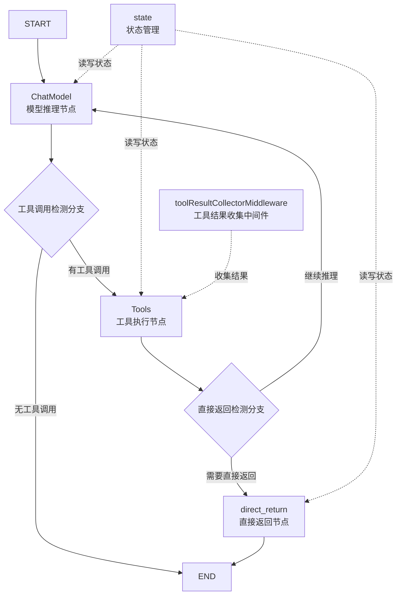

# react_agent_core_runtime 模块技术深度解析

## 1. 问题与定位

在构建 AI 代理系统时，最经典且实用的模式之一是 ReAct 模式——即 Reasoning（推理）与 Acting（行动）的循环。然而，实现一个健壮、灵活且高效的 ReAct 代理并非易事：

- **循环控制问题**：需要在模型推理和工具调用之间无缝切换，直到模型决定结束
- **状态管理挑战**：需要维护对话历史、工具调用结果等状态，同时处理中断和恢复
- **工具集成复杂度**：不同工具可能有不同的调用方式（同步/异步、普通/增强），需要统一处理
- **直接返回需求**：某些工具调用结果可以直接作为最终答案，无需再经过模型推理

`react_agent_core_runtime` 模块正是为了解决这些问题而设计的，它提供了一个可配置、可扩展的 ReAct 代理实现，将底层的复杂性封装起来，让开发者可以专注于业务逻辑。

## 2. 核心设计与心智模型

### 2.1 心智模型：状态机与工作流的结合

可以将这个模块想象成一个**智能装配线**：

1. **输入站**（START）：接收用户消息
2. **模型车间**（ChatModel）：处理消息，决定是回答还是调用工具
3. **工具车间**（Tools）：执行工具调用，收集结果
4. **质检站**（Branch）：决定下一步是回到模型车间、直接输出还是结束
5. **输出站**（END）：交付最终结果

整个过程由一个**状态管理器**（state）监督，它记录所有对话历史和特殊标记（如直接返回的工具调用 ID）。

### 2.2 核心架构图



### 2.3 关键组件角色

| 组件 | 角色 | 核心职责 |
|------|------|----------|
| `Agent` | 门面与协调器 | 封装底层图执行，提供简洁的 `Generate` 和 `Stream` 接口 |
| `AgentConfig` | 配置中心 | 集中管理代理的所有可配置项，包括模型、工具、回调等 |
| `state` | 状态存储器 | 维护对话历史和直接返回标记，是整个代理的"记忆" |
| `toolResultCollectorMiddleware` | 结果收集器 | 拦截工具调用结果，通过上下文传递的发送器分发给外部 |
| `compose.Graph` | 执行引擎 | 提供图定义和执行能力，是代理的"骨架" |

## 3. 数据与控制流深度解析

### 3.1 初始化流程：构建执行图

当调用 `NewAgent` 时，模块会按以下步骤构建执行图：

1. **配置准备**：
   - 确定图和节点名称（使用默认值或用户配置）
   - 设置工具调用检测函数（默认检查第一个块）
   - 生成工具信息列表

2. **模型与工具准备**：
   - 选择合适的聊天模型（优先使用 `ToolCallingModel`）
   - 为模型绑定工具信息
   - 创建工具节点，并在最前面插入工具结果收集中间件

3. **图构建**：
   - 创建图并设置本地状态生成器
   - 添加模型节点，配置前置处理器处理消息
   - 添加入边：START → 模型节点
   - 添加工具节点，配置前置处理器更新状态
   - 添加模型输出分支：有工具调用 → 工具节点，否则 → END
   - 构建直接返回逻辑：添加直接返回节点和相应分支
   - 编译图，设置最大步数和节点触发模式

### 3.2 运行时数据流：完整的 ReAct 循环

让我们以一次典型的 `Generate` 调用为例，追踪数据如何在系统中流动：

1. **输入阶段**：
   - 用户调用 `agent.Generate(ctx, inputMessages)`
   - 输入消息传递给底层的 `runnable.Invoke`

2. **模型处理阶段**：
   - 图从 START 节点开始，流向模型节点
   - 模型前置处理器 `modelPreHandle` 被调用：
     - 将输入消息添加到状态的 `Messages` 中
     - 如果有 `MessageRewriter`，先应用它重写历史消息
     - 如果有 `MessageModifier`，应用它修改即将发送给模型的消息
   - 模型处理修改后的消息，生成输出

3. **分支决策阶段**：
   - 模型输出流向分支节点 `modelPostBranchCondition`
   - 使用 `toolCallChecker` 检测是否有工具调用
   - 如果没有工具调用，流向 END，流程结束
   - 如果有工具调用，流向工具节点

4. **工具处理阶段**：
   - 工具前置处理器 `toolsNodePreHandle` 被调用：
     - 将模型输出添加到状态的 `Messages` 中
     - 检查是否有工具配置为直接返回，设置 `ReturnDirectlyToolCallID`
   - 工具节点执行工具调用：
     - 工具结果收集中间件拦截结果
     - 如果上下文中有工具结果发送器，将结果发送出去
     - 将结果传递给下一个中间件或最终返回
   - 工具执行结果流向工具分支节点

5. **工具后分支决策**：
   - 检查状态中的 `ReturnDirectlyToolCallID`
   - 如果设置了，流向直接返回节点
   - 直接返回节点查找匹配的工具结果消息，流向 END
   - 如果没有设置，流回模型节点，开始下一轮循环

### 3.3 流式处理的特殊考虑

在流式模式下，数据流动有一些关键差异：

1. **工具调用检测**：需要处理流式输出，不同模型可能在不同位置输出工具调用
2. **流复制**：当使用流式工具结果发送器时，需要复制流以同时发送和返回
3. **提前关闭**：`StreamToolCallChecker` 必须在返回前关闭模型输出流

## 4. 组件深度解析

### 4.1 Agent：门面模式的优雅应用

`Agent` 结构体是整个模块的门面，它封装了底层复杂的图执行逻辑，提供简洁的接口：

```go
type Agent struct {
    runnable         compose.Runnable[[]*schema.Message, *schema.Message]
    graph            *compose.Graph[[]*schema.Message, *schema.Message]
    graphAddNodeOpts []compose.GraphAddNodeOpt
}
```

**设计意图**：
- 将复杂的图构建和执行细节隐藏在简单接口后面
- 允许用户以两种方式使用：直接调用 `Generate`/`Stream`，或导出图嵌入更大的工作流
- 保持灵活性的同时提供易用性

**关键方法**：
- `Generate`：同步生成响应，适合不需要流式输出的场景
- `Stream`：流式生成响应，适合需要实时展示的场景
- `ExportGraph`：导出底层图，允许将 ReAct 代理作为子图嵌入更大的系统

### 4.2 AgentConfig：配置的集中管理

`AgentConfig` 是一个典型的配置结构体，但它的设计体现了对不同使用场景的考虑：

```go
type AgentConfig struct {
    ToolCallingModel model.ToolCallingChatModel  // 推荐使用
    Model            model.ChatModel              // 已弃用
    ToolsConfig      compose.ToolsNodeConfig
    MessageModifier  MessageModifier
    MessageRewriter  MessageModifier
    MaxStep          int
    ToolReturnDirectly map[string]struct{}
    StreamToolCallChecker func(context.Context, *schema.StreamReader[*schema.Message]) (bool, error)
    GraphName        string
    ModelNodeName    string
    ToolsNodeName    string
}
```

**设计亮点**：
- **模型选择的渐进式迁移**：同时提供 `ToolCallingModel`（推荐）和 `Model`（已弃用），方便用户迁移
- **消息处理的两层设计**：
  - `MessageRewriter`：修改状态中的历史消息，影响后续所有轮次
  - `MessageModifier`：仅修改当前发送给模型的消息，不影响状态
- **灵活的工具返回策略**：通过 `ToolReturnDirectly` 映射和 `SetReturnDirectly` 函数两种方式控制直接返回
- **可定制的流式工具调用检测**：认识到不同模型有不同的流式输出模式，提供 `StreamToolCallChecker` 扩展点

### 4.3 state：轻量级状态管理

`state` 结构体是代理的"记忆中心"：

```go
type state struct {
    Messages                 []*schema.Message
    ReturnDirectlyToolCallID string
}
```

**设计意图**：
- 最小化状态：只保存必要的信息
- 消息历史：累积所有对话消息，为模型提供上下文
- 直接返回标记：通过 `ReturnDirectlyToolCallID` 传递工具节点和直接返回节点之间的状态

**注册机制**：
```go
func init() {
    schema.RegisterName[*state]("_eino_react_state")
}
```
这确保了状态可以被正确序列化和反序列化，支持中断和恢复场景。

### 4.4 toolResultCollectorMiddleware：结果的多路复用

这个中间件是模块中一个精巧的设计，它解决了"如何让外部也能获取工具调用结果"的问题：

```go
func newToolResultCollectorMiddleware() compose.ToolMiddleware {
    return compose.ToolMiddleware{
        Invokable: func(next compose.InvokableToolEndpoint) compose.InvokableToolEndpoint {
            return func(ctx context.Context, input *compose.ToolInput) (*compose.ToolOutput, error) {
                senders := getToolResultSendersFromCtx(ctx)
                output, err := next(ctx, input)
                if err != nil {
                    return nil, err
                }
                if senders != nil && senders.sender != nil {
                    senders.sender(input.Name, input.CallID, output.Result)
                }
                return output, nil
            }
        },
        // ... 其他三种模式的实现
    }
}
```

**设计智慧**：
- **非侵入式**：通过上下文传递发送器，不改变工具的签名
- **全面覆盖**：支持四种工具调用模式（普通同步、普通流式、增强同步、增强流式）
- **流复制**：在流式模式下使用 `Copy(2)` 创建两个流，一个发送，一个返回
- **安全优先**：在发送前检查发送器是否存在，避免空指针 panic

**上下文传递机制**：
```go
type toolResultSenderCtxKey struct{}

func setToolResultSendersToCtx(ctx context.Context, senders *toolResultSenders) context.Context {
    return context.WithValue(ctx, toolResultSenderCtxKey{}, senders)
}
```
使用空结构体作为上下文键，避免了字符串键可能带来的冲突。

### 4.5 直接返回机制：优化常见场景

直接返回机制是一个精心设计的优化，允许某些工具结果直接作为最终答案：

**两个层次的控制**：
1. **配置层**：通过 `AgentConfig.ToolReturnDirectly` 预先配置哪些工具直接返回
2. **运行时层**：通过 `SetReturnDirectly` 函数在工具执行时动态决定

**实现细节**：
```go
func buildReturnDirectly(graph *compose.Graph[[]*schema.Message, *schema.Message]) (err error) {
    // 1. 创建直接返回节点
    directReturn := func(ctx context.Context, msgs *schema.StreamReader[[]*schema.Message]) (*schema.StreamReader[*schema.Message], error) {
        // 查找匹配的工具结果消息
    }
    
    // 2. 添加节点
    nodeKeyDirectReturn := "direct_return"
    graph.AddLambdaNode(nodeKeyDirectReturn, compose.TransformableLambda(directReturn))
    
    // 3. 添加分支
    graph.AddBranch(nodeKeyTools, compose.NewStreamGraphBranch(func(ctx context.Context, msgsStream *schema.StreamReader[[]*schema.Message]) (endNode string, err error) {
        // 检查是否需要直接返回
    }, map[string]bool{nodeKeyModel: true, nodeKeyDirectReturn: true}))
    
    // 4. 添加到 END 的边
    graph.AddEdge(nodeKeyDirectReturn, compose.END)
}
```

## 5. 依赖关系分析

### 5.1 输入依赖

`react_agent_core_runtime` 模块依赖以下关键组件：

| 依赖 | 用途 | 来源模块 |
|------|------|----------|
| `model.ToolCallingChatModel` / `model.ChatModel` | 提供语言模型能力 | [components_core-model_and_prompting-model_interfaces_and_options](components_core-model_and_prompting-model_interfaces_and_options.md) |
| `compose.Graph` / `compose.Runnable` | 提供图执行引擎 | [compose_graph_engine-composition_api_and_workflow_primitives](compose_graph_engine-composition_api_and_workflow_primitives.md) |
| `compose.ToolsNode` / `compose.ToolMiddleware` | 提供工具执行能力 | [compose_graph_engine-tool_node_execution_and_interrupt_control](compose_graph_engine-tool_node_execution_and_interrupt_control.md) |
| `schema.Message` / `schema.ToolResult` | 核心数据结构 | [schema_models_and_streams](schema_models_and_streams.md) |
| `agent.ChatModelWithTools` | 模型与工具绑定 | [adk_runtime-agent_contracts_and_context](adk_runtime-agent_contracts_and_context.md) |

### 5.2 被依赖关系

这个模块通常被以下组件使用：
- `adk_prebuilt_agents` 模块中的预构建代理
- 用户自定义的代理系统
- 多代理编排系统（如 `agent_orchestration_and_multiagent_host`）

### 5.3 契约与假设

**对模型的假设**：
- 如果使用 `ToolCallingModel`，假设模型原生支持工具调用
- 如果使用普通 `ChatModel`，假设 `agent.ChatModelWithTools` 能正确绑定工具

**对工具的假设**：
- 工具必须提供 `Info(ctx)` 方法返回工具元数据
- 工具结果可以被序列化为字符串或 `schema.ToolResult`

**状态契约**：
- 状态会在每个节点执行前后被保存和恢复
- 消息历史会持续累积，直到最大步数限制

## 6. 设计权衡与决策

### 6.1 消息处理：Rewriter vs Modifier

**决策**：提供两种不同的消息处理机制
- `MessageRewriter`：修改状态中的历史消息
- `MessageModifier`：仅修改当前发送给模型的消息

**权衡**：
- ✅ 灵活性：满足不同场景需求（如历史压缩 vs 临时添加系统提示）
- ❌ 复杂性：用户需要理解两者的区别，可能会用错

**设计理由**：认识到消息处理有两种根本不同的需求：
1. 需要永久改变历史（如压缩对话以适应上下文窗口）
2. 仅需要临时调整（如添加当前请求特有的提示）

### 6.2 工具调用检测：默认策略与可定制性

**决策**：提供默认的 `firstChunkStreamToolCallChecker`，同时允许用户自定义

**默认实现**：
```go
func firstChunkStreamToolCallChecker(_ context.Context, sr *schema.StreamReader[*schema.Message]) (bool, error) {
    defer sr.Close()
    for {
        msg, err := sr.Recv()
        // ... 检查第一个非空块是否有工具调用
    }
}
```

**权衡**：
- ✅ 开箱即用：默认实现对大多数模型（如 OpenAI）有效
- ✅ 可扩展：允许用户为特殊模型（如 Claude）提供自定义实现
- ❌ 文档负担：需要明确说明默认实现的局限性

**设计理由**：认识到"检测流式输出中的工具调用"没有通用解决方案，不同模型有不同的输出模式。

### 6.3 直接返回：配置 vs 运行时控制

**决策**：同时支持配置级和运行时级的直接返回控制

**权衡**：
- ✅ 灵活性：既可以预先配置，也可以在运行时动态决定
- ✅ 优先级明确：运行时控制优先级高于配置
- ❌ 状态传递：需要通过状态中的 `ReturnDirectlyToolCallID` 传递信息

**设计理由**：有些工具总是应该直接返回（如"最终答案"工具），而有些工具的返回取决于执行结果（如"搜索"工具，有时结果足够好，有时需要进一步处理）。

### 6.4 图作为内部实现 vs 暴露给用户

**决策**：既封装图提供简洁接口，又允许通过 `ExportGraph` 导出图

**权衡**：
- ✅ 易用性：大多数用户只需要 `Generate` 和 `Stream`
- ✅ 灵活性：高级用户可以将 ReAct 代理作为子图嵌入更大的工作流
- ❌ API 表面增大：需要维护两套接口

**设计理由**：遵循"简单的事情简单做，复杂的事情可能做"的原则。

## 7. 使用指南与最佳实践

### 7.1 基本使用

```go
// 创建代理
agent, err := react.NewAgent(ctx, &react.AgentConfig{
    ToolCallingModel: myToolCallingModel,
    ToolsConfig: compose.ToolsNodeConfig{
        Tools: []compose.Tool{myTool1, myTool2},
    },
    MaxStep: 10,
})

// 同步生成
response, err := agent.Generate(ctx, []*schema.Message{
    {Role: schema.User, Content: "你好，请帮我查询天气"},
})

// 流式生成
stream, err := agent.Stream(ctx, []*schema.Message{
    {Role: schema.User, Content: "你好，请帮我查询天气"},
})
```

### 7.2 配置直接返回工具

```go
// 方式1：通过配置
config := &react.AgentConfig{
    // ... 其他配置
    ToolReturnDirectly: map[string]struct{}{
        "final_answer": {},
    },
}

// 方式2：在工具中动态设置
func myTool(ctx context.Context, input string) (string, error) {
    result := doSomething(input)
    if isFinalAnswer(result) {
        react.SetReturnDirectly(ctx)
    }
    return result, nil
}
```

### 7.3 处理特殊模型的流式工具调用检测

```go
// 为 Claude 等模型定制检测函数
func claudeToolCallChecker(ctx context.Context, modelOutput *schema.StreamReader[*schema.Message]) (bool, error) {
    defer modelOutput.Close()
    
    // Claude 可能先输出文本，再输出工具调用
    // 需要读取更多内容来检测
    var hasToolCall bool
    for {
        msg, err := modelOutput.Recv()
        if err == io.EOF {
            break
        }
        if err != nil {
            return false, err
        }
        
        if len(msg.ToolCalls) > 0 {
            hasToolCall = true
            break
        }
    }
    
    return hasToolCall, nil
}

// 使用自定义检测函数
config := &react.AgentConfig{
    // ... 其他配置
    StreamToolCallChecker: claudeToolCallChecker,
}
```

### 7.4 消息历史管理

```go
// 使用 MessageRewriter 压缩历史
config := &react.AgentConfig{
    // ... 其他配置
    MessageRewriter: func(ctx context.Context, messages []*schema.Message) []*schema.Message {
        // 保留最近 10 条消息
        if len(messages) > 10 {
            return messages[len(messages)-10:]
        }
        return messages
    },
}
```

## 8. 边缘情况与陷阱

### 8.1 流式工具调用检测的流关闭要求

**陷阱**：`StreamToolCallChecker` 必须在返回前关闭输入流

**后果**：如果不关闭，可能导致资源泄漏或死锁

**示例**：
```go
// 正确的实现
func goodChecker(ctx context.Context, sr *schema.StreamReader[*schema.Message]) (bool, error) {
    defer sr.Close() // 确保关闭
    // ... 检测逻辑
}

// 错误的实现
func badChecker(ctx context.Context, sr *schema.StreamReader[*schema.Message]) (bool, error) {
    // 没有关闭流！
    // ... 检测逻辑
}
```

### 8.2 最大步数限制

**陷阱**：`MaxStep` 配置为 0 或过小的值

**后果**：代理可能在完成任务前就被强制终止

**建议**：
- 默认值是 12，通常足够
- 对于复杂任务，可以适当增大
- 避免设置为 0（虽然代码会处理，但行为不直观）

### 8.3 工具结果发送器的上下文传递

**陷阱**：忘记在上下文中设置工具结果发送器

**后果**：工具结果收集中间件不会发送任何结果

**正确做法**：
```go
// 创建发送器
senders := &react.toolResultSenders{
    sender: func(toolName, callID, result string) {
        // 处理结果
    },
}

// 设置到上下文
ctx = react.setToolResultSendersToCtx(ctx, senders)

// 然后调用代理
response, err := agent.Generate(ctx, input)
```

### 8.4 MessageModifier 与 MessageRewriter 的区别

**陷阱**：混淆 `MessageModifier` 和 `MessageRewriter`

**后果**：
- 如果应该用 `MessageRewriter` 却用了 `MessageModifier`，修改不会影响后续轮次
- 如果应该用 `MessageModifier` 却用了 `MessageRewriter`，临时修改会变成永久修改

**快速参考**：
| 特性 | MessageModifier | MessageRewriter |
|------|-----------------|-----------------|
| 影响范围 | 仅当前轮次 | 所有后续轮次 |
| 是否修改状态 | 否 | 是 |
| 常见用途 | 添加临时系统提示 | 压缩历史消息 |

## 9. 总结

`react_agent_core_runtime` 模块是一个精心设计的 ReAct 代理实现，它成功地平衡了易用性和灵活性：

- **核心价值**：将复杂的 ReAct 循环封装成简单的接口
- **设计亮点**：状态机与工作流结合、两层消息处理、灵活的直接返回机制
- **扩展性**：多个定制点允许适应不同的模型和工具
- **权衡考量**：在简单性和灵活性之间做出了明智的选择

对于新加入的团队成员，理解这个模块的关键是：
1. 把它看作一个构建在图执行引擎上的状态机
2. 注意消息处理的两层设计
3. 理解直接返回机制的两种控制方式
4. 警惕流式处理中的流关闭要求
