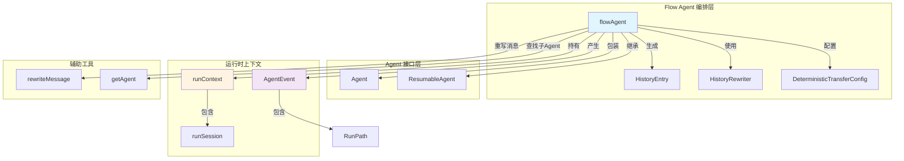

# Flow Agent Orchestration 模块深度解析

## 概述：什么是 Flow Agent Orchestration？

想象你在构建一个智能客服系统，需要多个专门的 Agent 来处理不同场景：一个负责订单查询，一个负责退款处理，还有一个负责产品推荐。用户可能从一个问题跳到另一个问题，系统需要在不同的 Agent 之间流畅地切换，同时保持对话历史的上下文连贯性。Flow Agent Orchestration 模块就是为了解决这个**多 Agent 协作编排**问题而设计的。

这个模块提供了一个层次化的 Agent 管理框架，让 Agent 之间可以互相转移控制权（transfer），自动处理对话历史的上下文重写，支持中断后的恢复，并维护完整的执行路径追踪。它就像是多 Agent 系统的"交通指挥官"，决定什么时候让哪个 Agent 上场，并确保它们之间传递正确的上下文信息。

## 核心问题：为什么需要这个模块？

### 问题一：Agent 层次结构管理

在多 Agent 系统中，Agent 之间往往存在父子关系。比如一个"客户服务主 Agent"下面有多个"专门 Agent"（退款、投诉、咨询等）。我们需要：
- 维护这种层次关系（parent/subAgent 指针）
- 防止循环引用（Agent 已经是其他 Agent 的子 Agent）
- 支持 Agent 树的深拷贝（deepCopy），因为多个运行实例可能共享同一个配置

### 问题二：上下文传递和历史重写

当 Agent A 把控制权转移给 Agent B 时，B 需要知道之前发生了什么。但直接把 A 的历史消息给 B 是不合适的，因为：
- B 可能不理解 A 的内部对话
- 需要把"系统角色"的消息转换为"用户角色"的上下文提示
- 某些转移消息不应该传递给下游 Agent

这个模块通过 `HistoryRewriter` 机制，在转移时智能地重写历史消息，将 Assistant/Tool 角色的消息转换为"为了上下文：[AgentX] 说了..."的 User 消息。

### 问题三：事件归属和执行路径追踪

在嵌套的 Agent 执行中，一个事件可能来自子 Agent、孙 Agent，或者来自当前 Agent 自己的某个工具调用。我们需要知道：
- 这个事件到底是由哪个 Agent 发出的？
- 父 Agent 应该记录这个事件吗？
- 哪些 Action（如 Transfer、Exit）应该影响控制流？

`RunPath` 字段记录了从根 Agent 到当前事件源的完整路径，配合 `exactRunPathMatch`，实现了精确的事件归属判定。

### 问题四：中断恢复（Resume）

Agent 执行可能被中断（用户取消、系统崩溃等），恢复时需要：
- 知道应该在哪个 Agent 继续执行
- 携带正确的状态信息
- 正确处理嵌套的恢复（如果中断发生在子 Agent 中）

`Resume` 方法通过检查 `ResumeInfo.WasInterrupted` 和 `NextResumeAgent`，智能地决定是自己处理还是委托给子 Agent。

## 架构：组件角色与数据流



### 数据流：从用户请求到 Agent 执行

1. **初始化阶段**：
   - 用户调用 `SetSubAgents(ctx, rootAgent, subAgents)` 建立层次结构
   - 每个 Agent 被包装为 `flowAgent`，建立 parent/subAgent 指针
   - 调用 `OnSubAgents.OnSetSubAgents` 和 `OnSetAsSubAgent` 通知底层 Agent

2. **运行阶段**：
   - 用户调用 `flowAgent.Run(ctx, input, opts...)`
   - `initRunCtx` 创建运行上下文，建立 `RunPath` 和 `runSession`
   - `genAgentInput` 从会话历史生成输入，使用 `historyRewriter` 重写消息
   - 调用底层 Agent 的 `Run` 方法
   - `run` 方法处理返回的事件流：设置 RunPath、过滤和记录事件、处理转移 Action

3. **恢复阶段**：
   - 用户调用 `flowAgent.Resume(ctx, resumeInfo, opts...)`
   - 检查 `WasInterrupted`：如果是中断点且自己是 `ResumableAgent`，自己处理
   - 否则查找 `NextResumeAgent`，委托给对应的子 Agent

## 组件深度解析

### HistoryEntry：历史条目的最小单元

```go
type HistoryEntry struct {
    IsUserInput bool
    AgentName   string
    Message     Message
}
```

**设计意图**：这是历史记录的原子单元，区分用户原始输入和 Agent 生成的消息。`IsUserInput` 标记非常重要，因为用户输入不需要被重写，而 Agent 的消息需要通过 `HistoryRewriter` 转换为上下文提示。

**关键使用场景**：
- `genAgentInput` 遍历会话事件，将每个事件转换为 `HistoryEntry`
- 如果 `skipTransferMessages` 为 true，包含 `TransferToAgent` Action 的事件会被跳过
- `historyRewriter` 接收 `[]*HistoryEntry`，返回重写后的 `[]Message`

### flowAgent：核心编排器

这是整个模块的灵魂，它包装了底层的 `Agent`，添加了多 Agent 编排能力。

#### 关键字段

- `subAgents []*flowAgent`：子 Agent 列表，形成树形结构
- `parentAgent *flowAgent`：父 Agent 引用，用于向上转移（通常被禁用）
- `disallowTransferToParent bool`：禁止转移到父 Agent 的标志
- `historyRewriter HistoryRewriter`：历史消息重写函数
- `checkPointStore compose.CheckPointStore`：检查点存储（用于中断恢复）

#### deepCopy：防御性拷贝

```go
func (a *flowAgent) deepCopy() *flowAgent {
    ret := &flowAgent{
        Agent:                    a.Agent,
        subAgents:                make([]*flowAgent, 0, len(a.subAgents)),
        parentAgent:              a.parentAgent,
        disallowTransferToParent: a.disallowTransferToParent,
        historyRewriter:          a.historyRewriter,
        checkPointStore:          a.checkPointStore,
    }
    for _, sa := range a.subAgents {
        ret.subAgents = append(ret.subAgents, sa.deepCopy())
    }
    return ret
}
```

**为什么需要深拷贝？**

`toFlowAgent` 在包装 Agent 时会调用 `deepCopy`，这是为了：
1. 防止多个 `flowAgent` 实例共享同一个 `subAgents` 切片
2. 当同一个 Agent 配置被多次使用时（如在测试中），避免状态污染
3. 支持在构建 Agent 树时的临时修改，不影响原始配置

**注意**：深拷贝只拷贝 `flowAgent` 本身的字段，不拷贝内部的 `Agent` 实例。这是合理的，因为底层的 Agent 逻辑通常是无状态的或自行管理状态。

#### genAgentInput：上下文生成的核心

这是理解整个模块的关键方法。它负责将会话历史转换为当前 Agent 的输入。

```go
func (a *flowAgent) genAgentInput(ctx context.Context, runCtx *runContext, skipTransferMessages bool) (*AgentInput, error) {
    input := runCtx.RootInput.deepCopy()
    
    // 1. 收集历史条目
    historyEntries := make([]*HistoryEntry, 0)
    for _, m := range input.Messages {
        historyEntries = append(historyEntries, &HistoryEntry{
            IsUserInput: true,
            Message:     m,
        })
    }
    
    // 2. 从会话事件构建历史
    for _, event := range runCtx.Session.getEvents() {
        // 处理 skipTransferMessages 逻辑
        if skipTransferMessages && event.Action != nil && event.Action.TransferToAgent != nil {
            // 跳过转移消息
            if event.Output != nil &&
                event.Output.MessageOutput != nil &&
                event.Output.MessageOutput.Role == schema.Tool &&
                len(historyEntries) > 0 {
                historyEntries = historyEntries[:len(historyEntries)-1]
            }
            continue
        }
        
        // 从事件提取消息
        msg, err := getMessageFromWrappedEvent(event)
        if err != nil {
            // 处理 WillRetryError
            continue
        }
        
        if msg != nil {
            historyEntries = append(historyEntries, &HistoryEntry{
                AgentName: event.AgentName,
                Message:   msg,
            })
        }
    }
    
    // 3. 重写历史
    messages, err := a.historyRewriter(ctx, historyEntries)
    if err != nil {
        return nil, err
    }
    input.Messages = messages
    
    return input, nil
}
```

**skipTransferMessages 的作用**：

这是一个微妙但重要的设计。当设置为 `true` 时，包含 `TransferToAgent` Action 的事件不会传递给下游 Agent。为什么？

想象这个场景：
1. Agent A 决定转移到 Agent B，输出"让我转接到退款专员"
2. Agent A 发送一个 `TransferToAgent` Action
3. 如果 B 看到这个消息，它会困惑（"等等，我是退款专员，为什么有人要转接我？"）

通过 `skipTransferMessages`，转移指令对下游 Agent 是透明的，只有框架知道发生了转移。

**为什么需要移除 Tool 角色的消息？**

当跳过转移消息时，如果是 Tool 角色且是转移相关的，还需要移除前一条历史。这是因为 ChatModelAgent 在生成转移消息时，会先生成一个函数调用消息（Tool 角色），然后生成转移 Action。这两个消息是一体的，跳过一个就应该都跳过。

#### run：事件流的编排引擎

这个方法是执行的核心，处理事件流、设置 RunPath、记录事件、处理转移。

```go
func (a *flowAgent) run(
    ctx context.Context,
    runCtx *runContext,
    aIter *AsyncIterator[*AgentEvent],
    generator *AsyncGenerator[*AgentEvent],
    opts ...AgentRunOption) {
    defer func() {
        panicErr := recover()
        if panicErr != nil {
            e := safe.NewPanicErr(panicErr, debug.Stack())
            generator.Send(&AgentEvent{Err: e})
        }
        generator.Close()
    }()
    
    var lastAction *AgentAction
    for {
        event, ok := aIter.Next()
        if !ok {
            break
        }
        
        // 1. 设置 RunPath（如果尚未设置）
        if len(event.RunPath) == 0 {
            event.AgentName = a.Name(ctx)
            event.RunPath = runCtx.RunPath
        }
        
        // 2. 记录事件（仅来自当前 Agent 的非中断事件）
        if (event.Action == nil || event.Action.Interrupted == nil) && 
           exactRunPathMatch(runCtx.RunPath, event.RunPath) {
            copied := copyAgentEvent(event)
            setAutomaticClose(copied)
            setAutomaticClose(event)
            runCtx.Session.addEvent(copied)
        }
        
        // 3. 记录最后一个 Action（用于后续处理）
        if exactRunPathMatch(runCtx.RunPath, event.RunPath) {
            lastAction = event.Action
        }
        
        generator.Send(event)
    }
    
    // 4. 处理转移
    var destName string
    if lastAction != nil {
        if lastAction.Interrupted != nil {
            return
        }
        if lastAction.Exit {
            return
        }
        if lastAction.TransferToAgent != nil {
            destName = lastAction.TransferToAgent.DestAgentName
        }
    }
    
    if destName != "" {
        agentToRun := a.getAgent(ctx, destName)
        if agentToRun == nil {
            e := fmt.Errorf("transfer failed: agent '%s' not found when transferring from '%s'",
                destName, a.Name(ctx))
            generator.Send(&AgentEvent{Err: e})
            return
        }
        
        subAIter := agentToRun.Run(ctx, nil, opts...)
        for {
            subEvent, ok_ := subAIter.Next()
            if !ok_ {
                break
            }
            setAutomaticClose(subEvent)
            generator.Send(subEvent)
        }
    }
}
```

**RunPath 的设置策略**：

代码注释解释了这个设计："the eino framework sets RunPath exactly once." 如果事件已经设置了 RunPath（比如由 `agentTool` 设置的），flowAgent 就不会修改它。否则，它用自己的 RunPath 替换。

这个设计确保了 RunPath 的唯一性，避免重复设置。

**事件记录的精确控制**：

只有满足以下条件的事件才会被记录到会话中：
1. `event.Action == nil || event.Action.Interrupted == nil`：非中断事件
2. `exactRunPathMatch(runCtx.RunPath, event.RunPath)`：来自当前 Agent

为什么？
- 子 Agent 的事件由子 Agent 自己记录
- 中断事件不应该进入会话，它们只用于框架内部控制
- 父 Agent 不应该记录子 Agent 的事件（会重复）

**事件拷贝的原因**：

```go
copied := copyAgentEvent(event)
setAutomaticClose(copied)
setAutomaticClose(event)
```

`copyAgentEvent` 创建了事件的深拷贝（包括 MessageStream），然后两个副本都被设置为自动关闭。这是为了：
1. `copied` 被添加到会话，可能被后续的 `genAgentInput` 消费
2. `event` 被发送给调用者，也可能被消费
3. 两个消费者需要独立的流，避免竞争

#### Resume：恢复逻辑的智能分发

```go
func (a *flowAgent) Resume(ctx context.Context, info *ResumeInfo, opts ...AgentRunOption) *AsyncIterator[*AgentEvent] {
    ctx, info = buildResumeInfo(ctx, a.Name(ctx), info)
    
    if info.WasInterrupted {
        // 如果自己是中断点，尝试自己处理
        ra, ok := a.Agent.(ResumableAgent)
        if !ok {
            return genErrorIter(fmt.Errorf("failed to resume agent: agent '%s' is an interrupt point "+
                "but is not a ResumableAgent", a.Name(ctx)))
        }
        iterator, generator := NewAsyncIteratorPair[*AgentEvent]()
        aIter := ra.Resume(ctx, info, opts...)
        if _, ok := ra.(*workflowAgent); ok {
            return aIter
        }
        go a.run(ctx, getRunCtx(ctx), aIter, generator, opts...)
        return iterator
    }
    
    // 否则，查找下一个要恢复的 Agent
    nextAgentName, err := getNextResumeAgent(ctx, info)
    if err != nil {
        return genErrorIter(err)
    }
    
    subAgent := a.getAgent(ctx, nextAgentName)
    if subAgent == nil {
        // 可能是包装在 AgentWithDeterministicTransferTo 中的
        if len(a.subAgents) == 0 {
            if ra, ok := a.Agent.(ResumableAgent); ok {
                return ra.Resume(ctx, info, opts...)
            }
        }
        return genErrorIter(fmt.Errorf("failed to resume agent: agent '%s' not found from flowAgent '%s'", 
            nextAgentName, a.Name(ctx)))
    }
    
    return subAgent.Resume(ctx, info, opts...)
}
```

**恢复逻辑的层次**：

1. 如果 `WasInterrupted`：自己是中断点，委托给底层的 `ResumableAgent`
2. 否则：查找 `NextResumeAgent`，如果能在子 Agent 中找到，委托给子 Agent
3. 特殊情况：如果内部被 `AgentWithDeterministicTransferTo` 包装，尝试委托给它

这个设计支持多层次的嵌套恢复。

### HistoryRewriter：上下文转换的接口

```go
type HistoryRewriter func(ctx context.Context, entries []*HistoryEntry) ([]Message, error)
```

这是一个函数类型，允许用户自定义历史消息的重写逻辑。默认实现是 `buildDefaultHistoryRewriter`。

#### buildDefaultHistoryRewriter：默认的重写策略

```go
func buildDefaultHistoryRewriter(agentName string) HistoryRewriter {
    return func(ctx context.Context, entries []*HistoryEntry) ([]Message, error) {
        messages := make([]Message, 0, len(entries))
        var err error
        for _, entry := range entries {
            msg := entry.Message
            if !entry.IsUserInput {
                msg, err = genMsg(entry, agentName)
                if err != nil {
                    return nil, fmt.Errorf("gen agent input failed: %w", err)
                }
            }
            if msg != nil {
                messages = append(messages, msg)
            }
        }
        return messages, nil
    }
}
```

默认策略：
1. 用户输入直接使用
2. Agent 生成的消息通过 `genMsg` 重写

#### genMsg：单个消息的重写

```go
func genMsg(entry *HistoryEntry, agentName string) (Message, error) {
    msg := entry.Message
    if entry.AgentName != agentName {
        msg = rewriteMessage(msg, entry.AgentName)
    }
    return msg, nil
}
```

**重要细节**：只有 `entry.AgentName != agentName` 的消息才会被重写。也就是说，当前 Agent 自己的消息不会被重写，其他 Agent 的消息会被转换为上下文提示。

#### rewriteMessage：消息转换逻辑

```go
func rewriteMessage(msg Message, agentName string) Message {
    var sb strings.Builder
    sb.WriteString("For context:")
    if msg.Role == schema.Assistant {
        if msg.Content != "" {
            sb.WriteString(fmt.Sprintf(" [%s] said: %s.", agentName, msg.Content))
        }
        if len(msg.ToolCalls) > 0 {
            for i := range msg.ToolCalls {
                f := msg.ToolCalls[i].Function
                sb.WriteString(fmt.Sprintf(" [%s] called tool: `%s` with arguments: %s.",
                    agentName, f.Name, f.Arguments))
            }
        }
    } else if msg.Role == schema.Tool && msg.Content != "" {
        sb.WriteString(fmt.Sprintf(" [%s] `%s` tool returned result: %s.",
            agentName, msg.ToolName, msg.Content))
    }
    
    return schema.UserMessage(sb.String())
}
```

这个函数将不同角色的消息转换为统一的 User 消息格式：
- Assistant 的发言 → "For context: [AgentX] said: ..."
- Assistant 的工具调用 → "For context: [AgentX] called tool: `Y` with arguments: ..."
- Tool 的返回 → "For context: [AgentX] `Y` tool returned result: ..."

这种格式确保下游 Agent 可以理解上下文，但不会被这些消息的角色所困扰。

### exactRunPathMatch：路径匹配算法

```go
func exactRunPathMatch(aPath, bPath []RunStep) bool {
    if len(aPath) != len(bPath) {
        return false
    }
    for i := range aPath {
        if !aPath[i].Equals(bPath[i]) {
            return false
        }
    }
    return true
}
```

**为什么需要精确匹配？**

想象一个三层 Agent 树：Root → A → B
- Root 的 RunPath 是 `[Root]`
- A 的 RunPath 是 `[Root, A]`
- B 的 RunPath 是 `[Root, A, B]`

当 Root 处理事件时，它只想记录自己发出的的事件，不想记录 A 或 B 的事件。`exactRunPathMatch` 确保只有完全匹配的事件才被处理。

### 辅助函数和构造器

#### SetSubAgents：构建 Agent 树

```go
func SetSubAgents(ctx context.Context, agent Agent, subAgents []Agent) (ResumableAgent, error) {
    return setSubAgents(ctx, agent, subAgents)
}
```

**关键检查**：
1. `len(fa.subAgents) > 0`：防止重复设置子 Agent
2. `fsa.parentAgent != nil`：防止循环引用（Agent 已经是其他 Agent 的子 Agent）
3. 调用 `OnSetSubAgents` 和 `OnSetAsSubAgent`：通知底层 Agent，让它们可以初始化状态

#### AgentOption：配置选项模式

```go
type AgentOption func(options *flowAgent)

func WithDisallowTransferToParent() AgentOption {
    return func(fa *flowAgent) {
        fa.disallowTransferToParent = true
    }
}

func WithHistoryRewriter(h HistoryRewriter) AgentOption {
    return func(fa *flowAgent) {
        fa.historyRewriter = h
    }
}
```

这是一个经典的"选项模式"（Options Pattern），允许在包装 Agent 时灵活配置行为。

#### toFlowAgent：统一的包装逻辑

**关键逻辑**：
1. 如果 Agent 已经是 `flowAgent`，深拷贝
2. 否则，包装为 `flowAgent`
3. 应用选项
4. 如果没有提供 `historyRewriter`，使用默认的

**注意**：这里使用 `agent.Name(ctx)` 作为默认重写器的参数，而不是 `fa.Name(ctx)`。因为如果 `agent` 是 `flowAgent`，它的 `Name` 方法来自底层的 `Agent`，这确保了一致性。

#### getAgent：在层次结构中查找 Agent

这个方法只在直接子 Agent 和父 Agent 中查找，不支持递归查找。这简化了逻辑，也避免了深度递归的性能问题。

## 依赖分析：模块如何连接到外部世界

### 依赖的上游模块

#### Agent 接口层

`flowAgent` 实现并依赖这些接口：

- **Agent**：基础接口，提供 `Name`、`Description`、`Run` 方法
- **ResumableAgent**：扩展接口，提供 `Resume` 方法
- **AgentInput/AgentOutput**：输入输出数据结构
- **AgentEvent/AgentAction/TransferToAgentAction**：事件和动作类型
- **RunStep**：执行路径的步骤类型

**依赖关系**：`flowAgent` 包装 `Agent`，当底层 Agent 是 `ResumableAgent` 时，会调用其 `Resume` 方法。

#### 运行时上下文

- **runContext**：保存 RootInput、RunPath、Session
- **runSession**：保存 Values、Events、LaneEvents
- **agentEventWrapper**：包装 `AgentEvent`，添加锁和元数据

**依赖关系**：
- `flowAgent.Run` 使用 `initRunCtx` 创建上下文
- `genAgentInput` 从 `runCtx.Session` 获取历史事件
- `run` 方法向 `runCtx.Session` 添加事件

#### 确定性转移包装器

- **deterministicTransferState**：保存确定性转移的状态
- **agentWithDeterministicTransferTo/resumableAgentWithDeterministicTransferTo**：包装 Agent，限制转移目标

**依赖关系**：这些包装器可能包装 `flowAgent`，`flowAgent.Resume` 需要处理这种情况。

#### Runner

- **Runner**：顶层执行器
- **ResumeParams**：恢复参数

**依赖关系**：`Runner` 可能调用 `flowAgent.Run` 或 `flowAgent.Resume`。

### 依赖的下游模块

#### Compose 框架

- **CheckPointStore**：检查点存储接口
- **AsyncIterator/AsyncGenerator**：异步迭代器工具

**依赖关系**：`flowAgent.checkPointStore` 使用 `CheckPointStore`，`run` 方法使用 `AsyncIterator` 和 `AsyncGenerator`。

#### Schema 模块

- **Message**：消息类型
- **UserMessage**：构造用户消息
- **Assistant/Tool**：消息角色

**依赖关系**：`rewriteMessage` 使用这些类型构造消息。

### 数据流向

**Run 流向**：
```
用户 → flowAgent.Run
  → initRunCtx → runContext
  → genAgentInput → 从 runContext.Session 获取历史 → 使用 historyRewriter 重写
  → Agent.Run → AsyncIterator[*AgentEvent]
  → flowAgent.run → 处理事件流 → 设置 RunPath → 记录到 runContext.Session → 发送给用户
  → 如果有 TransferToAgent → 调用子 Agent.Run → 继续处理
```

**Resume 流向**：
```
用户 → flowAgent.Resume
  → buildResumeInfo → 检查 WasInterrupted
  → 如果是中断点 → Agent.Resume → 继续处理
  → 否则 → getNextResumeAgent → getAgent → 子 Agent.Resume
```

## 设计决策与权衡

### 决策一：使用包装而非继承

**选择**：`flowAgent` 包装 `Agent`，而不是让 `Agent` 直接继承 `flowAgent` 的方法。

**原因**：
1. **灵活性**：任何实现了 `Agent` 接口的类型都可以被包装为 `flowAgent`，无需修改原有代码
2. **组合优于继承**：Go 语言的组合模式更符合惯用法
3. **无侵入性**：底层 Agent 不需要知道 `flowAgent` 的存在

**权衡**：
- **优点**：解耦、灵活、符合 Go 惯例
- **缺点**：需要深拷贝、额外的包装层、可能有性能开销

### 决策二：RunPath 的精确匹配

**选择**：使用 `exactRunPathMatch` 而非前缀匹配（"以...开头"）。

**原因**：
1. **精确归属**：确保每个事件只被记录一次
2. **防止重复**：父 Agent 不会记录子 Agent 的事件
3. **Action 控制流**：只有当前 Agent 的 Action 才影响控制流

**权衡**：
- **优点**：逻辑清晰、避免重复记录、精确的控制流
- **缺点**：需要维护完整的路径、调试时需要理解 RunPath 的结构

### 决策三：历史重写的默认策略

**选择**：将其他 Agent 的消息转换为"上下文提示"，而不是保留原始消息。

**原因**：
1. **上下文连续性**：下游 Agent 需要知道之前发生了什么
2. **角色混淆**：保留原始角色会导致下游 Agent 收到不属于它的 Assistant/Tool 消息
3. **信息过滤**：某些内部细节（如函数调用参数）可以简化或隐藏

**权衡**：
- **优点**：上下文清晰、避免角色混淆、简化下游处理
- **缺点**：信息丢失（原始消息的细节被简化）、可能影响某些需要原始消息的场景

**替代方案**：如果需要原始消息，用户可以提供自定义的 `HistoryRewriter`。

### 决策四：skipTransferMessages 选项

**选择**：支持跳过转移消息，避免下游 Agent 看到转移指令。

**原因**：
1. **透明性**：转移是框架层面的控制流，不应暴露给下游 Agent
2. **避免困惑**：下游 Agent 看到转移指令会困惑（"为什么要转接我？"）
3. **简化逻辑**：下游 Agent 只需要处理实际的任务，不需要关心控制流

**权衡**：
- **优点**：控制流透明、简化下游逻辑
- **缺点**：增加了 `genAgentInput` 的复杂度、需要理解何时使用这个选项

### 决策五：事件的深拷贝和自动关闭

**选择**：在记录事件前拷贝，并为两个副本都设置自动关闭。

**原因**：
1. **并发安全**：多个消费者（会话、调用者）需要独立的流
2. **资源管理**：自动关闭确保流不会被泄漏
3. **防消费冲突**：如果一个消费者先消费完流，另一个不会受影响

**权衡**：
- **优点**：并发安全、资源管理清晰
- **缺点**：内存开销（两个副本）、可能增加 GC 压力

### 决策六：中断恢复的智能分发

**选择**：`Resume` 方法根据 `WasInterrupted` 和 `NextResumeAgent` 智能地决定处理方式。

**原因**：
1. **层次化恢复**：支持任意深度的嵌套恢复
2. **委托原则**：最底层的 ResumableAgent 处理自己的中断
3. **灵活性**：中间层可以不实现 ResumableAgent，只需委托

**权衡**：
- **优点**：灵活、支持复杂场景、符合单一职责原则
- **缺点**：需要理解恢复逻辑的层次、调试时需要跟踪调用链

## 使用场景与示例

### 场景一：构建简单的多 Agent 系统

```go
// 创建主 Agent 和子 Agent
mainAgent := chatModelAgent.New(chatModelAgent.Config{...})
refundAgent := chatModelAgent.New(chatModelAgent.Config{...})
complaintAgent := chatModelAgent.New(chatModelAgent.Config{...})

// 设置子 Agent
flowAgent, err := SetSubAgents(ctx, mainAgent, []Agent{refundAgent, complaintAgent})
if err != nil {
    log.Fatal(err)
}

// 运行
input := &AgentInput{
    Messages: []Message{
        schema.UserMessage("我要退款"),
    },
}
iter := flowAgent.Run(ctx, input)

// 处理事件
for event := range iter {
    if event.Err != nil {
        log.Fatal(event.Err)
    }
    // 处理事件...
}
```

### 场景二：自定义历史重写器

```go
// 自定义重写器，添加更多上下文信息
customRewriter := func(ctx context.Context, entries []*HistoryEntry) ([]Message, error) {
    messages := make([]Message, 0, len(entries))
    for _, entry := range entries {
        if entry.IsUserInput {
            messages = append(messages, entry.Message)
        } else {
            // 添加时间戳信息
            msg := fmt.Sprintf("[%s] At time %s: %s", 
                entry.AgentName, 
                time.Now().Format(time.RFC3339),
                entry.Message.Content)
            messages = append(messages, schema.UserMessage(msg))
        }
    }
    return messages, nil
}

// 使用自定义重写器
flowAgent, err := SetSubAgents(ctx, mainAgent, []Agent{subAgent1, subAgent2})
if err != nil {
    log.Fatal(err)
}
flowAgent = toFlowAgent(ctx, flowAgent, WithHistoryRewriter(customRewriter))
```

### 场景三：禁止转移到父 Agent

```go
// 创建子 Agent 并禁止向上转移
subAgent := chatModelAgent.New(chatModelAgent.Config{...})
subAgent = toFlowAgent(ctx, subAgent, WithDisallowTransferToParent())

flowAgent, err := SetSubAgents(ctx, mainAgent, []Agent{subAgent})
if err != nil {
    log.Fatal(err)
}
```

### 场景四：中断后的恢复

```go
// 正常运行
iter := flowAgent.Run(ctx, input)

// 假设被中断
// ... 用户取消或系统崩溃 ...

// 恢复
resumeInfo := &ResumeInfo{
    WasInterrupted: true,
    // ... 其他恢复信息
}
iter = flowAgent.Resume(ctx, resumeInfo)

// 继续处理
for event := range iter {
    // ...
}
```

## 边缘情况与注意事项

### 边缘情况一：循环引用

**问题**：如果一个 Agent 已经是另一个 Agent 的子 Agent，尝试再次设置为子 Agent。

**防护**：`setSubAgents` 检查 `fsa.parentAgent != nil`，会返回错误。

**注意**：深拷贝不会拷贝 `parentAgent`，所以不会意外创建循环引用。

### 边缘情况二：重复设置子 Agent

**问题**：调用两次 `SetSubAgents`。

**防护**：`setSubAgents` 检查 `len(fa.subAgents) > 0`，会返回错误。

**注意**：如果需要修改子 Agent 列表，需要重新构建整个树。

### 边缘情况三：找不到转移目标

**问题**：`TransferToAgent` Action 指定的 Agent 不存在。

**处理**：`run` 方法会发送一个错误事件，并停止执行。

**注意**：这会中断整个 Agent 树的执行，而不是优雅地降级。

### 边缘情况四：非 ResumableAgent 的中断恢复

**问题**：`WasInterrupted` 为 true，但 Agent 不是 `ResumableAgent`。

**处理**：`Resume` 返回错误迭代器，错误信息明确指出"agent is an interrupt point but is not a ResumableAgent"。

**注意**：这是编程错误，应该在设计时避免。

### 边缘情况五：嵌套的包装器

**问题**：`flowAgent` 被 `AgentWithDeterministicTransferTo` 包装，又被其他包装器包装。

**处理**：`Resume` 方法尝试遍历包装器，找到底层的 `flowAgent`。

**注意**：这种多层包装会增加调试难度，需要理解每层的作用。

### 边缘情况六：Stream 的并发消费

**问题**：事件被记录到会话后，可能被 `genAgentInput` 消费，也可能被调用者消费。

**处理**：使用 `copyAgentEvent` 创建副本，两个副本独立。

**注意**：这增加了内存开销，如果事件很大，可能需要优化。

### 边缘情况七：WillRetryError 的处理

**问题**：`getMessageFromWrappedEvent` 返回 `WillRetryError`。

**处理**：`genAgentInput` 会记录日志并跳过这个事件。

**注意**：这允许 Agent 在重试时不影响历史记录。

### 注意事项

1. **RunPath 是框架管理的**：用户代码不应该修改 `AgentEvent.RunPath`，因为 `RunStep` 的字段是未导出的。

2. **MessageStream 需要自动关闭**：建议对 `AgentEvent` 的 `MessageStream` 使用 `SetAutomaticClose()`，确保流不会被泄漏。

3. **历史重写器的性能**：`historyRewriter` 会被多次调用（每次 `genAgentInput`），如果逻辑复杂，可能会影响性能。

4. **深拷贝的开销**：`deepCopy` 和 `copyAgentEvent` 都会创建拷贝，如果状态很大，需要考虑性能影响。

5. **检查点存储的可选性**：`checkPointStore` 是可选的，如果为 `nil`，检查点功能被禁用。

6. **RunPath 的调试**：在调试多 Agent 系统时，`RunPath` 是理解事件来源的关键信息。

## 参考资料

- [Agent 接口定义](../agent-contracts-and-handoff.md)：`Agent`、`ResumableAgent` 等基础接口
- [运行时上下文](../run-context-and-session-state.md)：`runContext`、`runSession` 的详细说明
- [确定性转移包装器](../deterministic-transfer-wrappers.md)：`AgentWithDeterministicTransferTo` 等包装器
- [Runner 执行器](../runner-execution-and-resume.md)：`Runner` 如何调用 `flowAgent`
