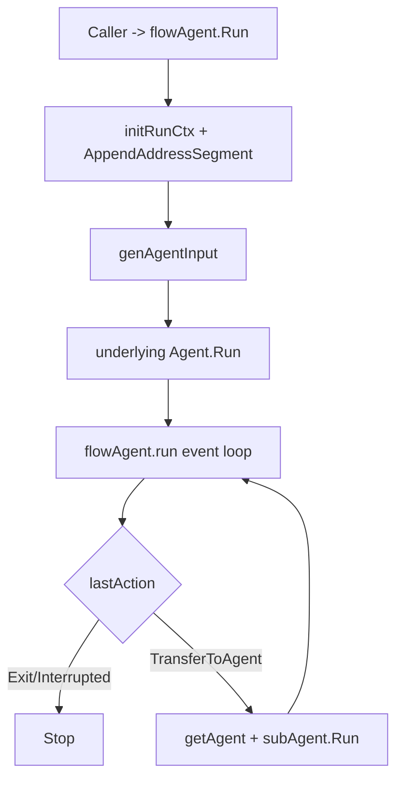

# flow_agent_orchestration 深入解析

`flowAgent`（`adk/flow.go`）是 ADK 多 Agent 编排里的“交通总控层”：它不负责具体推理能力（那是底层 `Agent` 的职责），而是负责 **子代理拓扑、会话历史重写、transfer 路由、以及 interrupt/resume 的分发**。你可以把它想成机场塔台：每架飞机（具体 agent）各自会飞，但谁先起降、何时中转、如何在突发中断后继续，都是塔台在协调。

## 这个子模块解决什么问题

单个 Agent `Run` 很简单：输入消息，输出事件流。但多 Agent 场景会立刻出现 4 个系统级问题：

1. **拓扑关系谁维护**：父子 agent 的关系、能否回跳父节点、是否允许重复挂载，需要框架层防错。
2. **历史如何喂给不同 agent**：子 agent 不应看到“原样”跨代理消息，否则上下文角色会错位。
3. **transfer 动作谁执行**：模型只给出 `TransferToAgentAction` 意图，真正路由执行应在统一层。
4. **恢复时谁接着跑**：中断后应根据 `ResumeInfo` 找到下一跳 agent，而不是把恢复逻辑散落在每个业务 agent 中。

`flowAgent` 的存在，就是把这些“编排语义”从业务 agent 中抽出来。

## 心智模型：三段式编排循环

理解 `flowAgent` 时，建议记住一个循环：

1. **组装输入**：`genAgentInput(...)` 从 `runSession` 历史事件重构当前 agent 的输入。
2. **运行并记录**：`Run(...)` 调底层 `Agent.Run(...)`，`run(...)` 持续转发事件，同时按 `RunPath` 精准记账进 session。
3. **检查动作并路由**：若最后动作是 `TransferToAgent`，就查找目标 agent 并继续执行。

这是一种“事件驱动的编排器”，不是同步函数调用链。

## 核心组件与职责

### `flowAgent`

字段分成两类：

- **编排结构**：`subAgents`、`parentAgent`、`disallowTransferToParent`
- **上下文策略**：`historyRewriter`

它通过匿名嵌入 `Agent`，把“业务执行能力”与“编排能力”叠加。`deepCopy()` 的设计很关键：当已有 `*flowAgent` 再次被包装时，不直接原地改，而是复制后应用新选项，避免共享结构被意外污染。

### `HistoryEntry`

是历史重写的中间表示：记录消息是否来自用户输入、来自哪个 agent、消息本体是什么。它让 `HistoryRewriter` 能在“结构化上下文”上改写，而不是直接操作原始 `[]Message`。

### `DeterministicTransferConfig`

这是和另一个子模块（`deterministic_transfer_wrapper`）的桥接配置：指定被包装的 `Agent` 与固定 transfer 目标列表。它本身很小，但定义了“确定性 handoff”契约边界。

## 关键执行链路（端到端）

### 1) `SetSubAgents(...)` / `setSubAgents(...)`：建拓扑并施加约束

- 只能设置一次子 agent：若 `len(fa.subAgents)>0` 直接报错。
- 子 agent 不能被多个父节点复用：`fsa.parentAgent != nil` 报错。
- 若底层 agent 实现 `OnSubAgents`，会触发回调：
  - 父侧：`OnSetSubAgents`
  - 子侧：`OnSetAsSubAgent`
  - 若配置了禁止回跳父节点，还会调 `OnDisallowTransferToParent`

这体现了“框架管结构，业务可感知”的设计：拓扑由 flow 管理，但 agent 可以在钩子里做自校验或初始化。

### 2) `Run(...)`：输入重写 + 底层执行 + 包装事件循环

`Run` 先做三件事：

- 初始化/复制 `runContext`（`initRunCtx`）
- 从 options 里解析公共参数（`getCommonOptions`）
- 调 `genAgentInput(...)` 基于 session 重建输入

然后分支：

- 若底层是 `*workflowAgent`，直接 `wf.Run(...)`（特殊路径）
- 否则进入统一 `a.run(...)` 循环

`a.run(...)` 里最非显然但最重要的是 **RunPath 精确匹配**：

- 只有 `exactRunPathMatch(runCtx.RunPath, event.RunPath)` 的事件，才会影响本层 `lastAction`
- 只有“本层且非 interrupt action”事件才写入 session

这避免父层错误消费子层/工具内部事件，等于给多层执行做了“事件归属隔离”。

### 3) 历史重写：`genAgentInput(...)` + 默认 `buildDefaultHistoryRewriter(...)`

默认策略不是简单拼接历史，而是：

- 用户输入原样保留
- 来自其他 agent 的消息调用 `rewriteMessage(...)` 转成 `schema.UserMessage("For context: ...")`

即，把“别的 agent 的 assistant/tool 输出”转换成当前 agent 眼里的上下文说明。这是一个明确 tradeoff：

- 优点：避免角色混乱，减少模型误判“这是我自己刚说的话”
- 代价：语义被压缩成文本，结构化细节（尤其复杂 tool payload）可能损失

`WithHistoryRewriter(...)` 正是留给高级场景的扩展点（比如保留更多结构、做脱敏、做窗口裁剪）。

### 4) `Resume(...)`：中断恢复的路由分派

恢复路径先 `buildResumeInfo(...)` 更新上下文地址与 run path，然后：

- 若当前层就是中断点（`info.WasInterrupted`），要求底层实现 `ResumableAgent`，直接 `Resume`
- 否则通过 `getNextResumeAgent(...)` 找到下一跳子 agent，并递归委托 `subAgent.Resume(...)`

这里的硬约束是：**并发多目标恢复不支持**（`getNextResumeAgent` 返回多个会报错）。这换来恢复语义的确定性。

## 设计取舍分析

1. **组合优先于继承**：`flowAgent` 通过包装 `Agent` 增强行为，而不是要求所有 agent 继承统一基类。好处是兼容存量 agent；代价是包装层增多时调试复杂。
2. **正确性优先于最短路径**：RunPath 精确匹配、事件拷贝再入 session、跳过 transfer 消息等细节都增加复杂度，但避免历史污染。
3. **默认策略保守，扩展点外放**：默认 history rewriter 偏“可解释上下文文本”，不是最强表达，但稳定；进阶需求由 `WithHistoryRewriter` 自定义。
4. **拓扑限制换一致性**：不允许一个子 agent 绑定多个父节点，牺牲灵活图结构，换来更可预测的路由和恢复。

## 新贡献者最容易踩的坑

- **不要忽略 `RunPath` 语义**：若修改 `run(...)` 的事件归属判定，父子事件可能串台。
- **`skipTransferMessages` 有联动删除逻辑**：跳过 transfer 事件时，若是 `schema.Tool`，会回退上一条历史，避免双重 transfer 记录；改这里要连带考虑 ChatModel transfer 消息生成行为。
- **`historyRewriter` 可能返回 `nil` message**：代码允许过滤消息，别默认长度不变。
- **`checkPointStore` 字段在本文件未直接使用**：它更像为与 Runner/interrupt 体系协同预留；改动前先看上层调用链。

## 相关模块

- [deterministic_transfer_wrapper](deterministic_transfer_wrapper.md)：在 flow 之上追加确定性 transfer 序列。
- [ADK Agent Interface](ADK%20Agent%20Interface.md)：`Agent` / `ResumableAgent` / `AgentEvent` 契约。
- [ADK Runner](ADK%20Runner.md)：运行入口与 checkpoint 生命周期（若文件存在请优先阅读）。
- [ADK Interrupt](ADK%20Interrupt.md)：`ResumeInfo` 与中断上下文模型。
