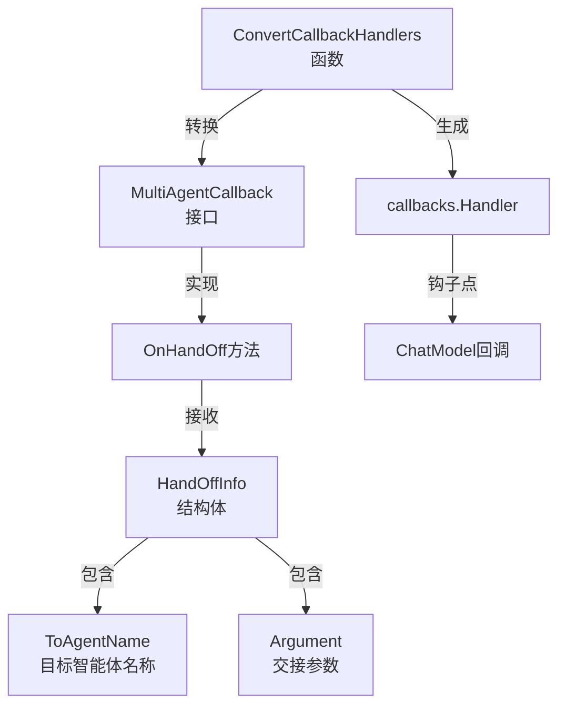

# handoff_callback_contracts 模块技术深度解析

## 1. 模块概述

`handoff_callback_contracts` 模块是多智能体系统中实现智能体间任务交接和上下文传递的核心基础设施。在复杂的多智能体协作场景中，一个智能体可能需要将任务移交给另一个更专业的智能体继续处理，这个过程就称为"交接"（handoff）。本模块通过定义标准的回调接口和数据结构，确保这种智能体间的协作能够以一致、可扩展的方式进行。

## 2. 问题空间与设计动机

在没有这个模块之前，多智能体系统中的任务交接可能会面临以下挑战：

- **分散的交接逻辑**：每个智能体可能都有自己独特的交接机制，导致系统不一致
- **缺乏标准化的上下文传递**：交接时的上下文信息传递方式不统一，增加了集成难度
- **难以监控和审计**：没有统一的钩子点来记录或干预智能体间的交互
- **紧耦合的实现**：智能体直接依赖其他智能体的接口，降低了系统的灵活性

本模块的设计洞察是：**将智能体间的交接事件抽象为标准化的回调机制**，通过定义清晰的接口和数据契约，实现智能体间的松耦合协作。

## 3. 核心架构与组件

### 3.1 核心组件



### 3.2 组件职责解析

#### 3.2.1 MultiAgentCallback 接口

```go
type MultiAgentCallback interface {
    OnHandOff(ctx context.Context, info *HandOffInfo) context.Context
}
```

这是模块的核心抽象，定义了智能体交接事件的标准处理契约。任何希望监听或干预多智能体系统中交接行为的组件都需要实现这个接口。

- **设计意图**：提供一个扩展点，允许外部代码在智能体交接发生时注入自定义逻辑
- **返回值设计**：返回 `context.Context` 使得回调可以修改或增强上下文，为后续处理传递额外信息
- **灵活性**：通过接口而非具体实现，允许多种不同的处理策略共存

#### 3.2.2 HandOffInfo 结构体

```go
type HandOffInfo struct {
    ToAgentName string
    Argument    string
}
```

这是交接事件的数据载体，封装了一次智能体交接所需的核心信息：

- **ToAgentName**：指定目标智能体的名称，标识任务将移交给谁
- **Argument**：交接参数，通常包含任务描述、上下文信息或其他需要传递给目标智能体的数据

这个结构体的设计体现了**最小必要信息**原则，只包含交接过程中必不可少的字段，保持了结构的简洁性和通用性。

#### 3.2.3 ConvertCallbackHandlers 函数

这个函数是模块的"适配器"，负责将 `MultiAgentCallback` 接口转换为系统通用的 `callbacks.Handler`：

```go
func ConvertCallbackHandlers(handlers ...MultiAgentCallback) callbacks.Handler
```

**核心实现逻辑**：
1. 创建两个关键的回调处理函数：`onChatModelEnd` 和 `onChatModelEndWithStreamOutput`
2. 这两个函数监听聊天模型的输出，检测是否包含工具调用（tool calls）
3. 当检测到工具调用时，将其解释为智能体交接事件，并调用相应的 `OnHandOff` 方法
4. 最后，通过 `template.NewHandlerHelper()` 将这些回调组装成标准的 `callbacks.Handler`

## 4. 数据流程解析

### 4.1 非流式输出场景

在非流式输出场景下，数据流程如下：

1. 聊天模型生成完整的响应消息
2. `onChatModelEnd` 回调被触发
3. 检查消息是否为助手角色且包含工具调用
4. 遍历所有工具调用，将每个工具调用转换为 `HandOffInfo`（工具名作为 `ToAgentName`，工具参数作为 `Argument`）
5. 依次调用所有注册的 `MultiAgentCallback.OnHandOff` 方法
6. 返回可能被修改的上下文

### 4.2 流式输出场景

在流式输出场景下，处理逻辑更复杂一些：

1. 聊天模型开始输出流式响应
2. `onChatModelEndWithStreamOutput` 回调被触发
3. 启动一个 goroutine 异步处理流式数据
4. 使用 `schema.ConcatMessageStream` 将流式消息拼接成完整消息
5. 后续步骤与非流式场景相同：检测工具调用、转换为 `HandOffInfo`、调用回调

这种异步处理设计确保了流式输出的性能不会被回调处理阻塞。

## 5. 设计决策与权衡

### 5.1 工具调用即智能体交接

**设计决策**：将模型的工具调用（tool calls）直接解释为智能体交接事件

**权衡分析**：
- **优点**：
  - 复用了现有工具调用机制，无需引入新的通信原语
  - 使得智能体交接对模型来说是"透明"的，模型不需要知道它正在调用另一个智能体
- **缺点**：
  - 这种设计将工具调用与智能体交接耦合在一起，限制了工具调用的其他用途
  - 交接参数被限制为字符串格式，可能需要额外的序列化/反序列化步骤

### 5.2 上下文传递模式

**设计决策**：通过 `context.Context` 传递回调处理结果，而不是直接返回修改后的数据

**权衡分析**：
- **优点**：
  - 遵循 Go 语言的常见模式，与标准库和生态系统保持一致
  - 允许在不修改核心数据结构的情况下传递额外信息
  - 支持链式处理，多个回调可以依次增强上下文
- **缺点**：
  - 上下文中的数据类型不安全，需要使用类型断言
  - 可能导致"上下文污染"，过多不相关的数据被塞入上下文

### 5.3 异步流式处理

**设计决策**：在流式场景下使用 goroutine 异步处理回调

**权衡分析**：
- **优点**：
  - 不会阻塞主处理流程，保持流式输出的低延迟特性
  - 将回调处理与流消费解耦
- **缺点**：
  - 引入了并发复杂性，需要注意上下文的正确使用
  - 错误处理受限（示例中只是打印错误，没有更健壮的错误传播机制）
  - 回调中对上下文的修改不会反映到主流程中（这在代码中是隐式的）

## 6. 依赖关系分析

### 6.1 核心依赖

本模块依赖以下关键组件：

- **callbacks**：提供通用的回调基础设施
- **model**：提供聊天模型的回调输出结构
- **agent**：提供智能体选项机制
- **schema**：提供消息和流式处理的核心数据结构
- **template**：提供回调处理的模板辅助工具

### 6.2 被依赖关系

根据模块树，本模块被以下模块依赖：

- **[host_composition_state_and_test_fixture](flow_agents_and_retrieval-agent_orchestration_and_multiagent_host-host_composition_state_and_test_fixture.md)**：可能用于测试多智能体主机的组合状态

## 7. 实际使用指南

### 7.1 实现自定义交接回调

```go
// 自定义交接日志记录器
type HandoffLogger struct{}

func (h *HandoffLogger) OnHandOff(ctx context.Context, info *HandOffInfo) context.Context {
    log.Printf("Handing off to agent: %s with args: %s", info.ToAgentName, info.Argument)
    
    // 可以在上下文中添加额外信息
    return context.WithValue(ctx, "handoff_time", time.Now())
}

// 注册回调
logger := &HandoffLogger{}
handler := ConvertCallbackHandlers(logger)
```

### 7.2 在多智能体系统中使用

```go
// 创建智能体选项时注册回调
opts := []agent.AgentOption{
    // 假设有一个方法可以添加 MultiAgentCallback
    WithMultiAgentCallbacks(&HandoffLogger{}),
}

// 创建多智能体主机
host := NewMultiAgentHost(opts...)
```

### 7.3 高级场景：上下文增强

```go
// 交接上下文增强器
type ContextEnricher struct {
    metadata map[string]string
}

func (e *ContextEnricher) OnHandOff(ctx context.Context, info *HandOffInfo) context.Context {
    // 添加上下文元数据
    for k, v := range e.metadata {
        ctx = context.WithValue(ctx, k, v)
    }
    
    // 可以根据目标智能体添加特定信息
    if info.ToAgentName == "specialist_agent" {
        ctx = context.WithValue(ctx, "special_mode", true)
    }
    
    return ctx
}
```

## 8. 注意事项与常见陷阱

### 8.1 流式处理的上下文修改不生效

在流式场景下，由于回调是在 goroutine 中异步执行的，回调内对上下文的修改不会反映到主处理流程中。如果需要在流式场景下传递信息，需要使用其他机制。

### 8.2 错误处理限制

当前实现在流式场景下的错误处理非常有限，只是简单地打印错误。在生产环境中，可能需要考虑更健壮的错误处理机制。

### 8.3 工具调用与交接的耦合

当前实现假设所有工具调用都是智能体交接。如果系统中的工具调用还有其他用途，这种设计可能会导致问题。解决方案可能是添加一个命名空间约定或过滤机制。

### 8.4 上下文键的命名冲突

使用 `context.Context` 传递数据时，要注意键的命名冲突问题。建议使用自定义类型作为键，而不是简单的字符串：

```go
type contextKey string
const handoffTimeKey contextKey = "handoff_time"

// 使用
ctx = context.WithValue(ctx, handoffTimeKey, time.Now())
```

## 9. 扩展与演进方向

这个模块在未来可能的演进方向包括：

- **更丰富的交接信息**：扩展 `HandOffInfo` 结构体，包含源智能体名称、交接历史等更多上下文
- **可拦截的交接**：允许回调不仅观察交接，还能修改或阻止交接
- **更灵活的映射机制**：提供一种机制，将工具调用映射到智能体交接的过程更加可配置
- **更好的流式错误处理**：改进流式场景下的错误处理和传播机制

## 10. 总结

`handoff_callback_contracts` 模块通过简洁而灵活的设计，为多智能体系统中的智能体交接提供了标准化的回调机制。它的核心价值在于：

- **抽象**：将智能体间的复杂交互简化为清晰的接口和数据结构
- **解耦**：通过回调机制实现了智能体间的松耦合
- **扩展**：提供了明确的扩展点，使系统行为可以被灵活定制

虽然这个模块相对较小，但它在整个多智能体系统架构中扮演着关键的连接角色，使得复杂的智能体协作成为可能。
