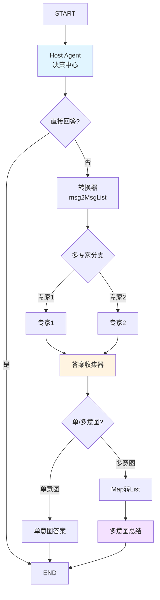

# Host Composition State and Test Fixture 模块深度解析

## 问题空间：为什么这个模块存在？

想象一个现代企业的客服中心：有一个总机接线员（Host Agent），他负责接听所有来电，然后根据问题类型将电话转接给不同领域的专家（Specialist Agents）——有的专家处理账单问题，有的处理技术支持，有的处理退货申请。总机接线员不需要解决所有问题，他只需要知道**谁能解决问题**，以及**如何高效地协调他们**。

这正是 `host_composition_state_and_test_fixture` 模块解决的问题：在多代理系统中，我们需要一个智能的"总机"来协调多个专业代理。这个模块提供了构建这种协调系统的核心基础设施，包括：

1. **状态管理**：跟踪对话历史和协调过程中的关键决策
2. **灵活的专家集成**：支持多种类型的专家代理（基于ChatModel的、自定义的Invokable/Streamable代理）
3. **分支决策逻辑**：根据总机代理的输出决定是直接回答、转接单个专家还是并行调用多个专家
4. **结果聚合**：当多个专家被调用时，能够智能地汇总他们的回答
5. **流式处理**：支持实时流式输出，提供更好的用户体验

在没有这个模块之前，构建多代理协调系统需要手动处理大量的状态管理、分支逻辑和结果聚合代码，而且很难保证代码的可维护性和可扩展性。

## 架构概览



### 核心组件与数据流

这个模块构建在 [compose_graph_engine](compose_graph_engine.md) 之上，使用图（Graph）作为核心抽象来组织多代理系统。让我们详细了解每个关键组件：

1. **Host Agent（总机代理）**：这是整个系统的大脑，它接收用户输入，决定是直接回答还是转接给专家。它通过工具调用（Tool Call）来表示转接决策。

2. **Specialist Agents（专家代理）**：这些是领域专家，可以是基于ChatModel的代理，也可以是自定义的Invokable或Streamable代理。每个专家都有自己的系统提示词和处理逻辑。

3. **Branching Logic（分支逻辑）**：
   - **直接回答分支**：当Host Agent决定直接回答时，输出直接流向END
   - **多专家分支**：根据Host Agent的工具调用，决定调用哪些专家
   - **结果处理分支**：根据是单意图还是多意图，决定如何处理专家的回答

4. **State Management（状态管理）**：通过 `state` 结构体跟踪对话历史和是否为多意图的标志，这个状态在整个图的执行过程中被传递和修改。

5. **Result Aggregation（结果聚合）**：
   - 单意图：直接返回专家的回答
   - 多意图：可以使用自定义的Summarizer来总结多个专家的回答，或者简单地将所有回答拼接起来

## 核心设计思想

### 1. 图作为协调的统一抽象

这个模块的核心设计决策是使用图（Graph）作为多代理协调的统一抽象。这有几个关键优势：

- **声明式配置**：你描述"想要什么"而不是"如何做"
- **可视化理解**：图结构直观地展示了代理之间的关系和数据流
- **灵活组合**：可以轻松添加、移除或修改代理，而不影响整个系统

### 2. 状态作为一等公民

`state` 结构体虽然简单（只有 `msgs` 和 `isMultipleIntents` 两个字段），但它是整个系统的"神经中枢"。设计时特意将状态限制在最小必要集，避免了状态膨胀带来的复杂性。

### 3. 流式处理优先

从设计之初，这个模块就将流式处理作为一等公民支持，而不是事后添加的功能。这体现在：

- 所有主要节点都支持流式输入输出
- 提供了 `StreamToolCallChecker` 接口来自定义流式工具调用检测
- 测试代码中大量覆盖了流式场景

### 4. 灵活的专家集成

模块支持三种类型的专家代理：
1. 基于ChatModel的代理
2. 自定义的Invokable代理
3. 自定义的Streamable代理

这种灵活性让用户可以根据实际需求选择最合适的集成方式，而不是被强制使用某种特定的代理类型。

## 关键设计决策与权衡

### 1. 使用本地状态而非全局状态

**决策**：使用 `compose.WithGenLocalState` 创建本地状态，而不是依赖外部状态管理。

**原因**：
- 局部性原理：状态只在图执行期间存在，避免了状态泄漏
- 可测试性：每次执行都有干净的状态，测试更容易
- 并发性：多个执行可以并行进行，互不干扰

**权衡**：
- 限制了跨执行的状态共享（但这通常不是多代理协调的需求）
- 状态不能在图外部直接访问（但可以通过回调等机制获取需要的信息）

### 2. 工具调用作为转接机制

**决策**：使用LLM的工具调用（Tool Call）功能来表示代理间的转接，而不是自定义一种转接格式。

**原因**：
- 利用LLM的原生能力：大多数现代LLM都支持工具调用，这是它们的强项
- 自然的决策表示：工具调用的结构（名称、参数）非常适合表示"调用哪个专家"和"为什么调用"
- 一致性：与单代理使用工具的方式保持一致

**权衡**：
- 依赖LLM的工具调用能力：对于不支持工具调用的模型，需要额外的适配
- 需要合适的提示词工程：需要精心设计Host Agent的提示词，确保它正确使用工具调用来表示转接

### 3. 默认流式工具调用检查器的限制

**决策**：提供了一个默认的 `firstChunkStreamToolCallChecker`，但在文档中明确指出它的局限性。

**原因**：
- 不同模型的流式输出行为差异很大：有些模型在第一个chunk就输出完整的工具调用，有些则分批输出
- 无法提供一个适用于所有模型的通用实现
- 给用户灵活性，让他们可以根据使用的模型自定义检查器

**权衡**：
- 默认实现可能不适用于所有模型（如Claude）
- 用户需要了解模型的流式输出行为，可能需要额外的开发工作

### 4. 多意图结果的两种处理方式

**决策**：对于多意图场景，提供了两种处理方式：
1. 使用自定义的Summarizer（基于ChatModel）
2. 默认的简单拼接

**原因**：
- 满足不同场景的需求：有些场景需要智能总结，有些场景只需要简单拼接
- 灵活性与简单性的平衡：默认实现简单易用，自定义实现提供更大的灵活性

**权衡**：
- 自定义Summarizer需要额外的模型调用，增加了延迟和成本
- 简单拼接可能不够智能，特别是当专家回答之间有冲突或重叠时

## 核心组件详解

### state 结构体

```go
type state struct {
    msgs              []*schema.Message
    isMultipleIntents bool
}
```

这个结构体虽然简单，但它是整个多代理协调系统的核心。

**设计意图**：
- `msgs`：保存原始的用户输入消息，这样专家代理可以看到完整的对话历史，而不仅仅是Host Agent的工具调用消息
- `isMultipleIntents`：标记是否调用了多个专家，这决定了后续如何处理专家的回答

**使用方式**：
- 在Host Agent的preHandler中，将输入消息保存到 `state.msgs`
- 在多专家分支中，如果检测到多个工具调用，设置 `state.isMultipleIntents = true`
- 在专家代理的preHandler中，使用 `state.msgs` 作为输入（而不是工具调用消息）
- 在结果处理分支中，根据 `state.isMultipleIntents` 决定如何处理专家的回答

### NewMultiAgent 函数

这是整个模块的入口点，它创建一个完整的多代理系统图。

**关键步骤**：
1. 配置验证和默认值设置
2. 创建图并设置本地状态生成器
3. 添加专家收集器节点
4. 为每个专家创建工具信息并添加到图中
5. 创建Host Agent并添加到图中
6. 添加各种分支逻辑节点
7. 编译图并返回MultiAgent实例

**设计亮点**：
- 大量使用默认值，简化了常见场景的配置
- 支持自定义Host Agent的名称和提示词
- 提供了 `StreamToolCallChecker` 扩展点
- 返回的MultiAgent实例可以进一步扩展或导出图供其他图使用

### mockAgentCallback 结构体

这是测试中使用的一个关键组件，它实现了 `OnHandOff` 回调接口，用于跟踪代理之间的转接。

**设计意图**：
- 提供一个简单的方式来验证多代理系统是否正确地进行了转接
- 使用 `sync.WaitGroup` 来处理异步场景
- 保存所有的 `HandOffInfo`，方便后续验证

**使用方式**：
```go
mockCallback := newMockAgentCallback(1) // 期望1次转接
out, err := hostMA.Generate(ctx, nil, WithAgentCallbacks(mockCallback))
mockCallback.wg.Wait() // 等待所有期望的转接发生
// 验证 mockCallback.infos
```

## 数据流详解

让我们通过一个典型的场景来跟踪数据的流动：

### 场景：用户请求需要单个专家处理

1. **输入**：用户发送消息 "我想查一下我的账单"
2. **Host Agent**：
   - 接收消息，保存到 `state.msgs`
   - 决定调用"账单专家"，输出包含工具调用的消息
3. **直接回答分支**：检测到工具调用，不直接回答
4. **转换器**：将Host Agent的输出转换为列表格式
5. **多专家分支**：检测到工具调用"账单专家"，只激活这个分支
6. **账单专家**：
   - 从 `state.msgs` 获取原始用户输入
   - 处理请求，返回回答
7. **答案收集器**：收集专家的回答
8. **结果处理分支**：检测到 `isMultipleIntents = false`，走单意图路径
9. **单意图答案**：直接返回专家的回答
10. **输出**：用户收到账单专家的回答

### 场景：用户请求需要多个专家处理

1. **输入**：用户发送消息 "我想查一下我的账单，同时想了解一下退货政策"
2. **Host Agent**：
   - 接收消息，保存到 `state.msgs`
   - 决定调用"账单专家"和"退货专家"，输出包含两个工具调用的消息
3. **直接回答分支**：检测到工具调用，不直接回答
4. **转换器**：将Host Agent的输出转换为列表格式
5. **多专家分支**：检测到两个工具调用，激活两个分支（并行执行）
6. **同时设置**：`state.isMultipleIntents = true`
7. **两个专家**：
   - 各自从 `state.msgs` 获取原始用户输入
   - 各自处理请求，返回回答
8. **答案收集器**：收集两个专家的回答（顺序可能不确定）
9. **结果处理分支**：检测到 `isMultipleIntents = true`，走多意图路径
10. **Map转List**：将专家回答的map转换为list
11. **多意图总结**：使用Summarizer（如果配置了）总结两个专家的回答，或者简单拼接
12. **输出**：用户收到汇总后的回答

## 常见使用模式与扩展点

### 1. 自定义Host Agent提示词

```go
hostMA, err := NewMultiAgent(ctx, &MultiAgentConfig{
    Host: Host{
        ToolCallingModel: myModel,
        SystemPrompt: "你是一个智能助手，负责将用户的问题分配给最合适的专家。",
    },
    Specialists: specialists,
})
```

### 2. 自定义流式工具调用检查器

```go
myStreamChecker := func(ctx context.Context, modelOutput *schema.StreamReader[*schema.Message]) (bool, error) {
    defer modelOutput.Close()
    // 自定义逻辑，例如检查所有chunk而不仅仅是第一个
    for {
        msg, err := modelOutput.Recv()
        if err == io.EOF {
            return false, nil
        }
        if err != nil {
            return false, err
        }
        if len(msg.ToolCalls) > 0 {
            return true, nil
        }
    }
}

hostMA, err := NewMultiAgent(ctx, &MultiAgentConfig{
    Host: Host{ToolCallingModel: myModel},
    Specialists: specialists,
    StreamToolCallChecker: myStreamChecker,
})
```

### 3. 使用自定义Summarizer

```go
hostMA, err := NewMultiAgent(ctx, &MultiAgentConfig{
    Host: Host{ToolCallingModel: myModel},
    Specialists: specialists,
    Summarizer: &Summarizer{
        ChatModel: mySummarizerModel,
        SystemPrompt: "请将以下专家的回答整合成一个连贯的答案。",
    },
})
```

### 4. 将MultiAgent嵌入到更大的图中

```go
hostMA, err := NewMultiAgent(ctx, config)
maGraph, opts := hostMA.ExportGraph()

fullGraph, err := compose.NewChain[map[string]any, *schema.Message]().
    AppendChatTemplate(prompt.FromMessages(schema.FString, schema.UserMessage("处理这个请求：{user_input}"))).
    AppendGraph(maGraph, append(opts, compose.WithNodeKey("host_ma_node"))...).
    Compile(ctx)
```

## 陷阱与注意事项

### 1. 模型流式输出行为差异

**问题**：不同模型的流式输出行为差异很大，默认的 `firstChunkStreamToolCallChecker` 可能不适用于所有模型（如Claude）。

**解决方案**：
- 仔细阅读文档中关于 `StreamToolCallChecker` 的警告
- 根据你使用的模型实现自定义的检查器
- 在测试中充分验证流式场景

### 2. 专家代理的输入是原始消息

**问题**：专家代理接收到的输入不是Host Agent的工具调用消息，而是保存在 `state.msgs` 中的原始消息。

**原因**：这是设计决策，目的是让专家代理看到完整的对话历史，而不仅仅是工具调用。

**注意事项**：
- 如果你需要专家代理知道Host Agent是如何描述任务的，你需要在工具调用参数中包含这些信息，并在专家代理的逻辑中处理
- 专家代理的系统提示词应该独立于Host Agent的提示词

### 3. 多专家执行顺序不确定

**问题**：当调用多个专家时，它们的执行是并行的，回答的顺序不确定。

**解决方案**：
- 如果顺序很重要，考虑使用自定义Summarizer来正确排序
- 或者，考虑将多步骤任务拆分为 sequential 的多代理调用，而不是单个MultiAgent中的并行调用

### 4. 状态只在图执行期间有效

**问题**：`state` 是图的本地状态，只在单次执行期间有效。

**注意事项**：
- 如果你需要跨执行的状态管理，需要在MultiAgent外部实现
- 可以使用回调机制来获取执行过程中的关键信息，如 `OnHandOff` 回调

### 5. 专家代理的工具可用性

**问题**：专家代理无法直接使用Host Agent的工具。

**原因**：这是设计上的隔离，每个代理应该是独立的。

**解决方案**：
- 如果专家代理需要工具，应该在创建专家代理时单独配置
- 或者，考虑将工具使用作为一个单独的专家代理

## 测试策略

`compose_test.go` 文件提供了很好的测试模式参考：

1. **测试直接回答场景**：验证Host Agent可以直接回答问题
2. **测试转接场景**：验证Host Agent可以正确转接给专家
3. **测试流式场景**：验证流式输入输出的正确性
4. **测试多意图场景**：验证多个专家被调用时的行为
5. **测试图嵌入场景**：验证MultiAgent可以嵌入到更大的图中

关键测试工具：
- `mockAgentCallback`：跟踪转接事件
- `model.NewMockToolCallingChatModel` 和 `model.NewMockChatModel`：模拟模型
- `schema.StreamReaderFromArray` 和 `schema.Pipe`：创建测试用的流

## 总结

`host_composition_state_and_test_fixture` 模块提供了一个强大而灵活的多代理协调系统框架。它的核心价值在于：

1. **简化了多代理系统的构建**：通过图抽象和声明式配置，大大降低了构建多代理系统的复杂性
2. **提供了关键的协调原语**：Host Agent、专家代理、分支逻辑、状态管理、结果聚合
3. **支持流式处理**：从设计之初就考虑了流式场景，提供了良好的用户体验
4. **灵活可扩展**：提供了多个扩展点，如自定义提示词、自定义 `StreamToolCallChecker`、自定义Summarizer
5. **可组合**：生成的MultiAgent可以嵌入到更大的图中，支持复杂的工作流

这个模块不是"银弹"，它最适合的场景是：
- 需要多个专业代理协作的场景
- 有明确的"总机-专家"关系的场景
- 需要灵活组合和扩展代理的场景

对于更复杂的场景，可能需要结合使用 [flow_runner_interrupt_and_transfer](flow_agents_and_retrieval-flow_runner_interrupt_and_transfer.md) 模块，或者直接使用 [compose_graph_engine](compose_graph_engine.md) 来构建自定义的解决方案。