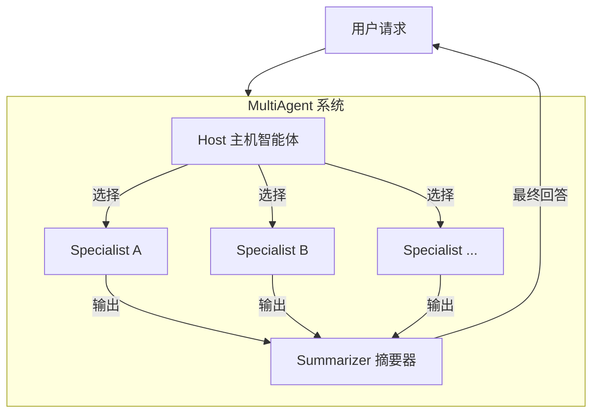

# host_role_and_agent_descriptors 模块技术深度解析

## 1. 问题背景与模块定位

在构建多智能体系统时，我们面临一个核心挑战：如何优雅地协调多个专业智能体（Specialist）的工作，让它们各司其职又能协同解决复杂问题？

想象一个场景：你有一个用于代码审查的智能体、一个用于文档编写的智能体，还有一个用于测试用例生成的智能体。当用户提出一个涉及多个方面的需求时，系统需要：
- 理解用户意图
- 决定将任务分配给哪个（或哪些）智能体
- 收集各智能体的输出
- （可选）将多个输出整合成一个连贯的回答

如果没有一个统一的协调机制，每个智能体都需要自己处理任务分发和结果整合，这会导致代码重复、逻辑混乱，而且难以扩展。

`host_role_and_agent_descriptors` 模块正是为了解决这个问题而设计的。它提供了一个**主机-专业智能体（Host-Specialist）模式**的实现，将任务协调的职责集中到一个 Host 智能体上，让各个 Specialist 专注于自己的专业领域。

## 2. 核心抽象与心智模型

### 2.1 核心抽象

该模块的核心抽象可以概括为：

1. **Host（主机智能体）**：负责"观察"整个对话上下文，决定将任务"移交"给哪个 Specialist。它是整个系统的"大脑"和"指挥中心"。
2. **Specialist（专业智能体）**：专注于特定领域任务的智能体，可以是 ChatModel、React Agent 或任何可调用的组件。
3. **AgentMeta（智能体元信息）**：描述智能体的身份和用途，帮助 Host 理解何时应该使用该智能体。
4. **Summarizer（摘要器）**：当 Host 选择多个 Specialist 时，负责将它们的输出整合成一个连贯的回答。
5. **MultiAgent（多智能体系统）**：将上述组件组合在一起的顶层容器，提供统一的调用接口。

### 2.2 心智模型

我们可以将这个系统想象成一个**医院分诊台**：

- **Host** 是分诊台的医生，负责接待病人（用户请求），根据症状（对话上下文）判断应该将病人分配给哪个科室（Specialist）。
- **Specialist** 是各个科室的专科医生，专注于治疗特定类型的疾病（完成特定领域的任务）。
- **AgentMeta** 是各个科室的介绍牌，告诉分诊医生这个科室擅长治疗什么。
- **Summarizer** 是会诊总结医生，当多个科室的医生都参与了诊断时，负责整理出一份综合的诊断报告。
- **MultiAgent** 是整个医院的管理系统，协调各个部分的工作。

## 3. 架构设计与数据流程

### 3.1 架构图



### 3.2 数据流程详解

1. **用户输入**：用户发送一个请求（`[]*schema.Message`）到 `MultiAgent`。
2. **Host 决策**：Host 接收用户请求和对话上下文，根据各个 Specialist 的 `AgentMeta` 信息，决定将任务分配给哪些 Specialist。
3. **Specialist 执行**：被选中的 Specialist 执行各自的任务，生成输出。
4. **结果汇总**：如果只有一个 Specialist 被选中，直接返回其输出；如果有多个，Summarizer 将它们的输出整合成一个连贯的回答。
5. **返回结果**：将最终结果返回给用户。

### 3.3 与其他模块的关系

- **依赖**：
  - `compose_graph_engine`：用于构建和执行底层的工作流图
  - `schema_models_and_streams`：提供消息和流处理的核心数据结构
  - `components_core/model_and_prompting`：提供 ChatModel 接口
- **被依赖**：
  - `multiagent_host_configuration_options`：提供配置选项
  - `handoff_callback_contracts`：提供回调接口
  - `host_composition_state_and_test_fixture`：提供测试支持

## 4. 核心组件深度解析

### 4.1 MultiAgent

`MultiAgent` 是整个系统的顶层容器，它封装了 Host、Specialists 和 Summarizer，并提供了统一的调用接口。

```go
type MultiAgent struct {
    runnable         compose.Runnable[[]*schema.Message, *schema.Message]
    graph            *compose.Graph[[]*schema.Message, *schema.Message]
    graphAddNodeOpts []compose.GraphAddNodeOpt
}
```

**设计意图**：
- 将复杂的多智能体协调逻辑封装在内部，对外提供简洁的接口
- 同时支持同步（Generate）和流式（Stream）两种调用模式
- 通过 `ExportGraph` 方法支持将整个系统作为子图嵌入到更大的工作流中

**核心方法**：
- `Generate`：同步执行，返回最终消息
- `Stream`：流式执行，返回消息流
- `ExportGraph`：导出底层图，用于组合
- `HostNodeKey`：获取 Host 节点的键，用于回调配置

### 4.2 MultiAgentConfig

`MultiAgentConfig` 是配置 `MultiAgent` 的结构体，它包含了所有必要的组件和选项。

```go
type MultiAgentConfig struct {
    Host        Host
    Specialists []*Specialist

    Name         string
    HostNodeName string
    StreamToolCallChecker func(ctx context.Context, modelOutput *schema.StreamReader[*schema.Message]) (bool, error)
    Summarizer *Summarizer
}
```

**设计意图**：
- 提供清晰的配置入口，将所有相关组件集中在一起
- 支持可选配置（如 `Summarizer`、`StreamToolCallChecker`），有合理的默认值
- 通过 `validate` 方法确保配置的有效性

**关键设计决策**：
- `StreamToolCallChecker` 的存在是因为不同模型在流式输出时处理工具调用的方式不同。有些模型（如 OpenAI）直接输出工具调用，而有些模型（如 Claude）先输出文本，再输出工具调用。这个函数允许自定义逻辑来检测流中是否包含工具调用。
- `Summarizer` 是可选的，如果不提供，会使用一个简单的默认实现（将所有输出拼接在一起）。但需要注意的是，默认实现不支持流式。

### 4.3 AgentMeta

`AgentMeta` 描述了一个智能体的元信息，包括名称和用途。

```go
type AgentMeta struct {
    Name        string
    IntendedUse string
}
```

**设计意图**：
- 为 Host 提供决策依据：`Name` 用于标识智能体，`IntendedUse` 用于告诉 Host 何时应该使用该智能体
- 通过 `validate` 方法确保必要字段的存在

**重要性**：
`IntendedUse` 字段是 Host 做出正确决策的关键。它应该清晰、准确地描述智能体的用途，这样 Host 才能理解何时应该将任务分配给该智能体。

### 4.4 Host

`Host` 是负责决策的智能体，目前只能是 `model.ChatModel` 或 `model.ToolCallingChatModel`。

```go
type Host struct {
    ToolCallingModel model.ToolCallingChatModel
    // Deprecated: ChatModel is deprecated, please use ToolCallingModel instead.
    ChatModel    model.ChatModel
    SystemPrompt string
}
```

**设计意图**：
- 封装 Host 的核心组件（模型）和配置（系统提示词）
- 支持向后兼容（保留 `ChatModel` 字段，但标记为 deprecated）

**设计决策**：
- 目前 Host 只能是模型，这是一个有意的限制。因为 Host 需要理解对话上下文并做出复杂的决策，这通常需要强大的语言模型能力。
- 推荐使用 `ToolCallingChatModel` 而不是普通的 `ChatModel`，因为工具调用能力更适合 Host 的决策场景。

### 4.5 Specialist

`Specialist` 是专注于特定领域任务的智能体，可以是多种类型的组件。

```go
type Specialist struct {
    AgentMeta

    ChatModel    model.BaseChatModel
    SystemPrompt string

    Invokable  compose.Invoke[[]*schema.Message, *schema.Message, agent.AgentOption]
    Streamable compose.Stream[[]*schema.Message, *schema.Message, agent.AgentOption]
}
```

**设计意图**：
- 提供极大的灵活性：Specialist 可以是 ChatModel、React Agent 或任何可调用的组件
- 同时支持同步和流式调用
- 通过 `AgentMeta` 提供身份和用途信息

**关键设计点**：
- `ChatModel` 和（`Invokable`/`Streamable`）是互斥的，只能提供其中一种
- 如果只提供 `Invokable`，则 Specialist 会被包装成 `compose.InvokableLambda`
- 如果只提供 `Streamable`，则 Specialist 会被包装成 `compose.StreamableLambda`
- 如果同时提供 `Invokable` 和 `Streamable`，则 Specialist 会被包装成 `compose.AnyLambda`
- `SystemPrompt` 只有在设置了 `ChatModel` 时才会生效

### 4.6 Summarizer

`Summarizer` 是一个轻量级的智能体，用于将多个 Specialist 的输出整合成一个连贯的回答。

```go
type Summarizer struct {
    ChatModel    model.BaseChatModel
    SystemPrompt string
}
```

**设计意图**：
- 当 Host 选择多个 Specialist 时，提供一种方式来整合它们的输出
- 保持简单：只需要一个 ChatModel 和一个系统提示词

**使用场景**：
- 当一个任务需要多个 Specialist 协作完成时
- 当你希望将多个 Specialist 的输出整合成一个统一的回答时

## 5. 设计权衡与决策

### 5.1 集中式协调 vs 分布式协调

**选择**：集中式协调（Host 做出所有决策）

**原因**：
- 简化了系统设计：只有一个决策点，逻辑更清晰
- 更容易实现全局最优：Host 可以看到整个对话上下文，做出更明智的决策
- 减少了智能体之间的通信开销：不需要 Specialist 之间直接通信

**权衡**：
- Host 成为单点故障：如果 Host 出现问题，整个系统都会受到影响
- Host 可能成为性能瓶颈：所有决策都需要经过 Host
- 降低了 Specialist 的自主性：Specialist 只能被动接受任务，不能主动发起协作

### 5.2 灵活性 vs 简单性

**选择**：在关键地方提供灵活性，同时保持整体简单性

**具体体现**：
- Specialist 可以是多种类型的组件（ChatModel、Invokable、Streamable）
- Summarizer 是可选的，有默认实现
- StreamToolCallChecker 是可选的，有默认实现

**权衡**：
- 更多的灵活性意味着更多的配置选项和更复杂的 API
- 默认实现简化了常见场景的使用，但可能不适合所有场景

### 5.3 同步 vs 流式支持

**选择**：同时支持同步和流式两种模式

**原因**：
- 满足不同场景的需求：有些场景需要同步的简单性，有些场景需要流式的实时性
- 提供一致的体验：两种模式使用相同的配置和组件

**权衡**：
- 增加了实现复杂度：需要同时维护两种模式的代码路径
- 有些组件可能不支持两种模式：例如默认的 Summarizer 不支持流式

## 6. 使用指南与最佳实践

### 6.1 基本使用步骤

1. **创建 Host**：
   ```go
   host := host.Host{
       ToolCallingModel: myToolCallingModel,
       SystemPrompt: "You are a helpful host that decides which specialist to use.",
   }
   ```

2. **创建 Specialists**：
   ```go
   specialist1 := &host.Specialist{
       AgentMeta: host.AgentMeta{
           Name:        "code_reviewer",
           IntendedUse: "Use this specialist for code review tasks.",
       },
       ChatModel:    myChatModel,
       SystemPrompt: "You are a code review specialist.",
   }
   ```

3. **（可选）创建 Summarizer**：
   ```go
   summarizer := &host.Summarizer{
       ChatModel:    myChatModel,
       SystemPrompt: "You are a summarizer that combines multiple outputs into one.",
   }
   ```

4. **创建 MultiAgentConfig**：
   ```go
   config := &host.MultiAgentConfig{
       Host:         host,
       Specialists:  []*host.Specialist{specialist1, specialist2},
       Name:         "my_multi_agent",
       HostNodeName: "host",
       Summarizer:   summarizer,
   }
   ```

5. **创建 MultiAgent**（注意：实际创建逻辑不在本文件中，需要使用其他模块的函数）

### 6.2 最佳实践

1. **编写清晰的 IntendedUse**：
   - 清晰、准确地描述 Specialist 的用途
   - 使用 Host 能够理解的语言
   - 避免过于宽泛或模糊的描述

2. **选择合适的 Specialist 类型**：
   - 如果 Specialist 是一个简单的 ChatModel，使用 `ChatModel` 字段
   - 如果 Specialist 是一个更复杂的组件（如 React Agent），使用 `Invokable` 和/或 `Streamable` 字段

3. **考虑流式支持**：
   - 如果需要流式输出，确保所有组件都支持流式
   - 提供自定义的 `StreamToolCallChecker`（如果使用的模型不是 OpenAI 风格的）
   - 如果使用 Summarizer，确保它支持流式（或者接受默认实现不支持流式的限制）

4. **测试 Host 的决策**：
   - 测试不同的输入，确保 Host 能够正确地选择 Specialist
   - 考虑边缘情况，如输入模糊或需要多个 Specialist 的情况

## 7. 注意事项与常见陷阱

### 7.1 常见陷阱

1. **忽略配置验证**：
   - 始终确保配置通过了 `validate` 方法的检查
   - 不要尝试使用无效的配置

2. **不兼容的 Specialist 配置**：
   - 不要同时设置 `ChatModel` 和（`Invokable`/`Streamable`）
   - 确保至少设置了其中一种

3. **默认 Summarizer 的限制**：
   - 默认 Summarizer 不支持流式，如果需要流式输出，必须提供自定义的 Summarizer
   - 默认 Summarizer 只是简单地拼接输出，可能不会产生最连贯的结果

4. **StreamToolCallChecker 的默认实现**：
   - 默认实现假设工具调用会在第一个非空块中出现，这对于 Claude 等模型可能不适用
   - 如果使用的不是 OpenAI 风格的模型，务必提供自定义的 `StreamToolCallChecker`

### 7.2 隐式契约

1. **AgentMeta 的 Name 唯一性**：
   - 虽然代码中没有明确检查，但各个 Specialist 的 `Name` 应该是唯一的
   - 如果有重复的 Name，Host 可能会感到困惑

2. **Specialist 的输入输出格式**：
   - Specialist 应该接受 `[]*schema.Message` 作为输入
   - Specialist 应该返回 `*schema.Message` 作为输出
   - 如果使用自定义的 `Invokable` 或 `Streamable`，确保它们符合这个契约

3. **Host 的工具调用能力**：
   - Host 需要能够调用工具来选择 Specialist
   - 如果使用普通的 `ChatModel` 而不是 `ToolCallingChatModel`，确保它能够正确地处理工具调用

## 8. 总结

`host_role_and_agent_descriptors` 模块提供了一个优雅的 Host-Specialist 模式实现，用于构建多智能体系统。它的核心思想是将决策逻辑集中到一个 Host 智能体上，让各个 Specialist 专注于自己的专业领域。

该模块的主要优势包括：
- 清晰的职责分离：Host 负责决策，Specialists 负责执行
- 极大的灵活性：Specialist 可以是多种类型的组件
- 同时支持同步和流式两种模式
- 可选的 Summarizer，用于整合多个 Specialist 的输出

在使用该模块时，需要注意：
- 编写清晰的 AgentMeta，特别是 IntendedUse 字段
- 选择合适的 Specialist 类型
- 考虑流式支持的限制
- 测试 Host 的决策逻辑

通过理解这些设计意图和最佳实践，你可以更好地使用该模块来构建强大、灵活的多智能体系统。

## 9. 参考文档

- [compose_graph_engine](compose_graph_engine.md)
- [schema_models_and_streams](schema_models_and_streams.md)
- [components_core-model_and_prompting](components_core-model_and_prompting.md)
