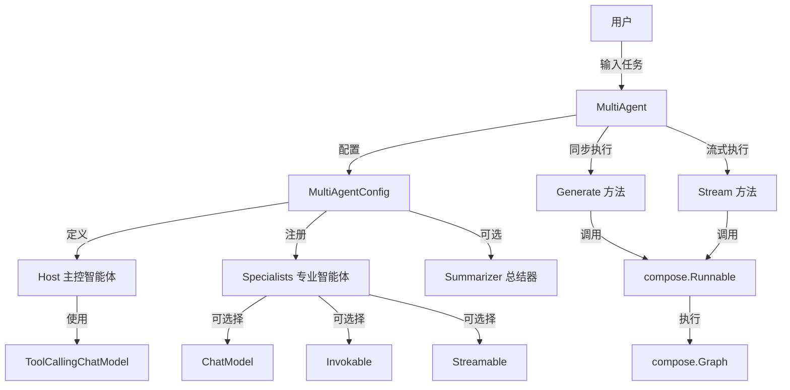

# host_config_types 模块技术深度解析

## 1. 引言

在多智能体系统中，如何有效地管理和协调不同的智能体是一个核心挑战。`host_config_types` 模块正是为了解决这个问题而设计的，它提供了一套完整的类型定义和配置机制，用于构建和管理主-从模式的多智能体系统。这个模块允许开发者定义一个"主控智能体"(host agent)，由它来决定何时以及如何将任务"移交"给不同的"专业智能体"(specialist agents)，从而实现复杂任务的协同完成。

## 2. 核心问题与设计意图

### 2.1 问题空间

在构建多智能体系统时，开发者通常面临以下挑战：

1. **智能体协调复杂性**：如何让多个智能体协同工作，每个智能体专注于自己的专长领域？
2. **任务分配困难**：如何智能地将任务分配给最适合的智能体？
3. **灵活性与可扩展性**：如何构建一个既灵活又易于扩展的多智能体架构？
4. **模式切换**：如何在同步和流式模式之间无缝切换？
5. **输出整合**：当多个智能体参与任务时，如何整合它们的输出？

### 2.2 设计洞察

`host_config_types` 模块采用了"主控-专业"模式的设计思想，类似于公司中的团队协作：
- **主控智能体** 像团队经理，负责理解任务、分配工作、协调进度
- **专业智能体** 像领域专家，专注于完成特定类型的任务
- **配置机制** 像团队组建规则，定义了团队的结构和协作方式

这种设计的核心洞察是：通过将任务分配决策集中到主控智能体，可以实现更灵活、更智能的多智能体协作，同时保持系统的可扩展性和可维护性。

## 3. 核心概念与心智模型

### 3.1 核心抽象

理解这个模块的关键是掌握以下核心抽象：

1. **MultiAgent**：多智能体系统的入口点，封装了整个协作逻辑
2. **MultiAgentConfig**：配置多智能体系统的核心结构
3. **Host**：主控智能体，负责决策和协调
4. **Specialist**：专业智能体，负责执行具体任务
5. **AgentMeta**：智能体的元数据，用于描述智能体的身份和用途
6. **Summarizer**：总结器，用于整合多个专业智能体的输出

### 3.2 心智模型

可以将这个多智能体系统想象成一个**专家咨询团队**：

- **MultiAgent** 是整个咨询公司
- **Host** 是项目经理，负责与客户沟通，理解需求，然后决定派哪个专家去解决问题
- **Specialists** 是各个领域的专家（如法律顾问、技术顾问、财务顾问等）
- **AgentMeta** 是专家的简历，描述了他们的姓名和专长
- **Summarizer** 是报告撰写人，当多个专家都参与了项目时，负责整合他们的意见

当有任务进来时，项目经理(Host)先理解任务，然后根据专家的简历(AgentMeta)决定派谁去。如果需要多个专家，他们的意见会由报告撰写人(Summarizer)整合后再返回给客户。

## 4. 架构与数据流程

### 4.1 架构图



### 4.2 数据流详解

让我们追踪一个典型的任务执行流程：

1. **初始化阶段**：
   - 用户创建 `MultiAgentConfig`，配置 `Host` 和至少一个 `Specialist`
   - 使用配置创建 `MultiAgent` 实例，内部会构建 `compose.Graph`

2. **任务输入阶段**：
   - 用户调用 `MultiAgent.Generate()` 或 `MultiAgent.Stream()`
   - 输入是 `[]*schema.Message`，代表对话历史

3. **主控决策阶段**：
   - 主控智能体(Host)接收输入消息
   - 使用其 `ToolCallingChatModel` 分析任务
   - 根据专业智能体的 `AgentMeta` 决定调用哪个专业智能体

4. **专业智能体执行阶段**：
   - 被选中的专业智能体接收任务
   - 根据其配置（`ChatModel`、`Invokable` 或 `Streamable`）执行任务
   - 生成输出消息

5. **结果整合阶段**：
   - 如果只有一个专业智能体被调用，直接返回其输出
   - 如果有多个专业智能体被调用，使用 `Summarizer` 整合它们的输出

6. **结果返回阶段**：
   - 最终结果通过 `*schema.Message`（同步模式）或 `*schema.StreamReader[*schema.Message]`（流式模式）返回给用户

## 5. 核心组件深度解析

### 5.1 MultiAgentConfig 结构体

`MultiAgentConfig` 是整个多智能体系统的配置核心，它定义了系统的所有组成部分和行为方式。

```go
type MultiAgentConfig struct {
    Host        Host
    Specialists []*Specialist

    Name         string
    HostNodeName string
    StreamToolCallChecker func(ctx context.Context, modelOutput *schema.StreamReader[*schema.Message]) (bool, error)
    Summarizer *Summarizer
}
```

**设计意图**：
- 采用"配置驱动"的设计模式，将系统的结构和行为集中在一个配置对象中
- 提供合理的默认值，简化常见场景的使用，同时保留足够的灵活性

**关键字段解析**：

1. **Host**：主控智能体配置，是系统的"大脑"，负责决策
2. **Specialists**：专业智能体列表，是系统的"手和脚"，负责执行具体任务
3. **Name**：多智能体系统的名称，用于标识和日志记录
4. **HostNodeName**：图中主控节点的名称，默认为"host"
5. **StreamToolCallChecker**：流式工具调用检查函数，这是一个关键的扩展点
6. **Summarizer**：总结器，用于整合多个专业智能体的输出

**验证逻辑**：

```go
func (conf *MultiAgentConfig) validate() error {
    if conf == nil {
        return errors.New("host multi agent config is nil")
    }

    if conf.Host.ChatModel == nil && conf.Host.ToolCallingModel == nil {
        return errors.New("host multi agent host ChatModel is nil")
    }

    if len(conf.Specialists) == 0 {
        return errors.New("host multi agent specialists are empty")
    }

    for _, s := range conf.Specialists {
        if s.ChatModel == nil && s.Invokable == nil && s.Streamable == nil {
            return fmt.Errorf("specialist %s has no chat model or Invokable or Streamable", s.Name)
        }

        if err := s.AgentMeta.validate(); err != nil {
            return err
        }
    }

    return nil
}
```

这个验证方法确保了配置的完整性和一致性，防止创建无效的多智能体系统。

### 5.2 Host 结构体

```go
type Host struct {
    ToolCallingModel model.ToolCallingChatModel
    // Deprecated: ChatModel is deprecated, please use ToolCallingModel instead.
    ChatModel    model.ChatModel
    SystemPrompt string
}
```

**设计意图**：
- 主控智能体专注于决策，不直接执行复杂任务
- 优先使用 `ToolCallingChatModel`，因为工具调用能力是主控智能体决策的关键
- 保留 `ChatModel` 字段作为向后兼容，但标记为已弃用

**关键点**：
- `ToolCallingModel` 是主控智能体的核心，它通过工具调用来选择专业智能体
- `SystemPrompt` 可以用来指导主控智能体的决策过程

### 5.3 Specialist 结构体

```go
type Specialist struct {
    AgentMeta

    ChatModel    model.BaseChatModel
    SystemPrompt string

    Invokable  compose.Invoke[[]*schema.Message, *schema.Message, agent.AgentOption]
    Streamable compose.Stream[[]*schema.Message, *schema.Message, agent.AgentOption]
}
```

**设计意图**：
- 提供多种方式来定义专业智能体，适应不同的使用场景
- 支持从简单的 `ChatModel` 到复杂的自定义 `Invokable`/`Streamable`
- 每种专业智能体都有自己的 `AgentMeta`，为主控智能体提供决策依据

**多种实现方式的设计考虑**：
1. **ChatModel**：最简单的方式，适用于基于聊天模型的专业智能体
2. **Invokable**：同步执行的自定义逻辑，适用于需要精确控制的场景
3. **Streamable**：流式执行的自定义逻辑，适用于需要实时输出的场景
4. **Invokable + Streamable**：同时支持两种模式，提供最大的灵活性

### 5.4 AgentMeta 结构体

```go
type AgentMeta struct {
    Name        string
    IntendedUse string
}
```

**设计意图**：
- 提供标准化的智能体描述方式，为主控智能体提供决策依据
- `Name` 用于标识智能体，`IntendedUse` 用于描述智能体的用途

**关键点**：
- 这两个字段都是必填的，验证逻辑会确保它们不为空
- `IntendedUse` 的描述质量直接影响主控智能体的决策质量

### 5.5 Summarizer 结构体

```go
type Summarizer struct {
    ChatModel    model.BaseChatModel
    SystemPrompt string
}
```

**设计意图**：
- 当多个专业智能体被调用时，提供一种机制来整合它们的输出
- 允许自定义总结逻辑，通过 `ChatModel` 和 `SystemPrompt` 控制

**默认行为**：
- 如果没有提供 `Summarizer`，系统会使用一个简单的默认实现，将所有输出消息拼接成一个消息
- 默认实现不支持流式模式

### 5.6 firstChunkStreamToolCallChecker 函数

```go
func firstChunkStreamToolCallChecker(_ context.Context, sr *schema.StreamReader[*schema.Message]) (bool, error) {
    defer sr.Close()

    for {
        msg, err := sr.Recv()
        if err == io.EOF {
            return false, nil
        }
        if err != nil {
            return false, err
        }

        if len(msg.ToolCalls) > 0 {
            return true, nil
        }

        if len(msg.Content) == 0 { // skip empty chunks at the front
            continue
        }

        return false, nil
    }
}
```

**设计意图**：
- 提供一个默认的流式工具调用检查实现
- 检查流的第一个非空块是否包含工具调用

**局限性**：
- 注释中明确指出，这个默认实现对于 Claude 等模型效果不好，因为这些模型通常先输出文本，然后才输出工具调用
- 这就是为什么提供了 `StreamToolCallChecker` 扩展点的原因

## 6. 依赖分析

### 6.1 输入依赖

`host_config_types` 模块依赖以下关键组件：

1. **model.ToolCallingChatModel** ([model_interface_and_options-model_interface](components_core-model_and_prompting-model_interfaces_and_options-model_interface.md))：主控智能体的核心，用于工具调用决策
2. **compose.Runnable** 和 **compose.Graph** ([graph_definition_and_compile_configuration-core_graph_structure](compose_graph_engine-graph_execution_runtime-graph_definition_and_compile_configuration-core_graph_structure.md))：底层执行引擎，用于构建和执行多智能体工作流
3. **schema.Message** 和 **schema.StreamReader** ([message_schema_and_templates](schema_models_and_streams-message_schema_and_templates.md))：消息格式和流式处理基础设施
4. **agent.AgentOption** ([agent_contracts_and_context-agent_run_options](adk_runtime-agent_contracts_and_context-agent_run_options.md))：智能体选项

### 6.2 输出依赖

这个模块被以下组件使用：

1. **option_handlers** ([flow_agents_and_retrieval-agent_orchestration_and_multiagent_host-multiagent_host_configuration_options-option_handlers](flow_agents_and_retrieval-agent_orchestration_and_multiagent_host-multiagent_host_configuration_options-option_handlers.md))：处理配置选项的模块
2. **multiagent_host** ([flow_agents_and_retrieval-agent_orchestration_and_multiagent_host-host_role_and_agent_descriptors](flow_agents_and_retrieval-agent_orchestration_and_multiagent_host-host_role_and_agent_descriptors.md))：实际实现多智能体逻辑的模块

### 6.3 数据契约

模块的关键数据契约包括：

1. **输入契约**：
   - 任务输入：`[]*schema.Message`，表示对话历史
   - 配置输入：`MultiAgentConfig`，定义系统结构

2. **输出契约**：
   - 同步输出：`*schema.Message`，表示最终结果
   - 流式输出：`*schema.StreamReader[*schema.Message]`，表示结果流

3. **内部契约**：
   - 主控智能体与专业智能体之间通过工具调用进行通信
   - 专业智能体的选择基于其 `AgentMeta`

## 7. 设计决策与权衡

### 7.1 配置集中化 vs 分散化

**决策**：采用集中式配置 (`MultiAgentConfig`)

**理由**：
- 简化系统初始化，所有配置在一个地方
- 便于验证和错误检查
- 提供清晰的系统概览

**权衡**：
- 配置对象可能变得庞大复杂
- 对于非常大的系统，可能需要考虑配置的模块化

### 7.2 专业智能体的多种实现方式

**决策**：支持 `ChatModel`、`Invokable` 和 `Streamable` 多种方式

**理由**：
- 提供灵活性，适应不同的使用场景
- 降低入门门槛，简单场景可以使用 `ChatModel`
- 支持复杂场景，可以使用完全自定义的 `Invokable`/`Streamable`

**权衡**：
- 增加了 API 的复杂性
- 需要在文档中清楚地说明各种方式的使用场景和限制

### 7.3 默认总结器的设计

**决策**：提供一个简单的默认总结器，拼接所有输出

**理由**：
- 确保系统在没有自定义总结器时也能工作
- 简单直接，易于理解和预测

**权衡**：
- 默认实现不支持流式模式
- 对于复杂场景，可能不够智能

### 7.4 StreamToolCallChecker 的设计

**决策**：提供默认实现，同时允许自定义

**理由**：
- 不同的模型有不同的流式输出行为
- 默认实现可以处理常见场景（如 OpenAI）
- 允许自定义以支持特殊模型（如 Claude）

**权衡**：
- 增加了配置的复杂性
- 需要用户了解他们使用的模型的行为

### 7.5 向后兼容性

**决策**：保留 `Host.ChatModel` 字段，但标记为已弃用

**理由**：
- 允许现有代码继续工作
- 给用户时间迁移到新的 API

**权衡**：
- 代码库中保留了过时的代码
- 可能会混淆新用户

## 8. 使用指南与示例

### 8.1 基本使用

创建一个简单的多智能体系统：

```go
// 创建主控智能体配置
host := host.Host{
    ToolCallingModel: myToolCallingModel,
    SystemPrompt: "你是一个项目经理，负责分配任务给合适的专家。",
}

// 创建专业智能体配置
specialists := []*host.Specialist{
    {
        AgentMeta: host.AgentMeta{
            Name:        "代码专家",
            IntendedUse: "编写和审查代码，解决编程问题",
        },
        ChatModel: myCodeExpertModel,
        SystemPrompt: "你是一个代码专家，专注于编写高质量的代码。",
    },
    {
        AgentMeta: host.AgentMeta{
            Name:        "写作专家",
            IntendedUse: "撰写和编辑文档、文章和其他文本内容",
        },
        ChatModel: myWritingExpertModel,
        SystemPrompt: "你是一个写作专家，专注于创作清晰、有说服力的文本。",
    },
}

// 创建多智能体配置
config := &host.MultiAgentConfig{
    Host:        host,
    Specialists: specialists,
    Name:        "我的专家团队",
}

// 创建多智能体系统
multiAgent, err := host.NewMultiAgent(config)
if err != nil {
    // 处理错误
}
```

### 8.2 使用自定义 Invokable

创建一个使用自定义逻辑的专业智能体：

```go
specialist := &host.Specialist{
    AgentMeta: host.AgentMeta{
        Name:        "数据处理专家",
        IntendedUse: "处理和分析结构化数据",
    },
    Invokable: func(ctx context.Context, input []*schema.Message, opts ...agent.AgentOption) (*schema.Message, error) {
        // 自定义数据处理逻辑
        result := processData(input)
        return schema.NewUserMessage(result), nil
    },
    Streamable: func(ctx context.Context, input []*schema.Message, opts ...agent.AgentOption) (*schema.StreamReader[*schema.Message], error) {
        // 自定义流式处理逻辑
        return streamData(input), nil
    },
}
```

### 8.3 自定义 StreamToolCallChecker

为 Claude 模型创建一个自定义的流式工具调用检查器：

```go
config := &host.MultiAgentConfig{
    // ... 其他配置
    StreamToolCallChecker: func(ctx context.Context, modelOutput *schema.StreamReader[*schema.Message]) (bool, error) {
        defer modelOutput.Close()
        
        // Claude 可能先输出一些文本，然后才输出工具调用
        // 我们需要检查整个流，或者至少检查更多的块
        var hasToolCalls bool
        var messages []*schema.Message
        
        for {
            msg, err := modelOutput.Recv()
            if err == io.EOF {
                break
            }
            if err != nil {
                return false, err
            }
            
            messages = append(messages, msg)
            if len(msg.ToolCalls) > 0 {
                hasToolCalls = true
            }
        }
        
        return hasToolCalls, nil
    },
}
```

### 8.4 使用自定义 Summarizer

创建一个自定义的总结器：

```go
config := &host.MultiAgentConfig{
    // ... 其他配置
    Summarizer: &host.Summarizer{
        ChatModel: mySummarizerModel,
        SystemPrompt: "你是一个报告撰写人，负责整合多个专家的意见，生成一个连贯的总结。请确保总结全面、客观，并突出关键要点。",
    },
}
```

## 9. 边缘情况与注意事项

### 9.1 专业智能体选择

- **问题**：主控智能体可能无法总是选择最合适的专业智能体
- **缓解**：
  - 编写清晰、具体的 `IntendedUse` 描述
  - 使用 `SystemPrompt` 指导主控智能体的决策
  - 考虑添加示例到主控智能体的提示中

### 9.2 流式模式限制

- **问题**：默认的总结器不支持流式模式
- **缓解**：
  - 如果需要流式模式并使用多个专业智能体，必须提供自定义的支持流式的总结器
  - 或者，确保主控智能体每次只选择一个专业智能体

### 9.3 模型兼容性

- **问题**：不同的模型有不同的流式输出行为
- **缓解**：
  - 了解你使用的模型的行为
  - 为非标准模型提供自定义的 `StreamToolCallChecker`
  - 考虑使用提示来约束模型的输出行为

### 9.4 配置验证

- **问题**：无效的配置可能导致运行时错误
- **缓解**：
  - 始终检查 `NewMultiAgent` 的错误返回值
  - 确保所有必填字段都已设置
  - 为专业智能体提供有效的实现（`ChatModel`、`Invokable` 或 `Streamable`）

### 9.5 性能考虑

- **问题**：多智能体系统可能比单个智能体慢
- **缓解**：
  - 考虑任务是否真的需要多个智能体
  - 优化专业智能体的实现
  - 考虑使用流式模式来改善感知性能

## 10. 总结

`host_config_types` 模块提供了一个强大而灵活的框架，用于构建主-从模式的多智能体系统。它的核心价值在于：

1. **清晰的抽象**：通过 `Host`、`Specialist` 等抽象，提供了直观的多智能体协作模型
2. **灵活的配置**：支持多种实现方式和扩展点，适应不同的使用场景
3. **完整的功能**：支持同步和流式模式，支持单个或多个专业智能体
4. **合理的默认值**：提供默认实现，简化常见场景的使用

通过理解这个模块的设计思想和核心组件，开发者可以构建出强大而灵活的多智能体系统，充分利用不同智能体的专长，协同完成复杂任务。

## 11. 参考链接

- [model_interface](components_core-model_and_prompting-model_interfaces_and_options-model_interface.md) - 模型接口定义
- [core_graph_structure](compose_graph_engine-graph_execution_runtime-graph_definition_and_compile_configuration-core_graph_structure.md) - 图形结构定义
- [message_schema_and_templates](schema_models_and_streams-message_schema_and_templates.md) - 消息模式和模板
- [agent_run_options](adk_runtime-agent_contracts_and_context-agent_run_options.md) - 智能体运行选项
- [option_handlers](flow_agents_and_retrieval-agent_orchestration_and_multiagent_host-multiagent_host_configuration_options-option_handlers.md) - 选项处理器
