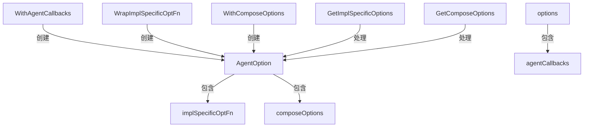

# option_handlers 模块技术深度解析

## 1. 问题与解决方案概述

在构建多智能体系统时，我们面临一个核心挑战：如何设计一个既灵活又类型安全的配置系统，能够同时处理通用的图表配置和特定智能体实现的自定义设置？`option_handlers` 模块正是为了解决这个问题而诞生的。

想象一下，如果我们使用传统的配置方法，可能会面临两种极端情况：要么是过度通用的配置接口，导致类型安全丧失和运行时错误；要么是高度特定的配置系统，使得代码复用变得困难。`option_handlers` 模块巧妙地平衡了这两个极端，通过一个统一的 `AgentOption` 类型，既支持传递底层图表引擎的配置，又能安全地处理特定智能体实现的自定义选项。

## 2. 核心抽象与架构

### 2.1 核心组件关系图



### 2.2 关键抽象解析

#### 2.2.1 `AgentOption` 结构体

`AgentOption` 是整个配置系统的核心抽象，它巧妙地将两种不同类型的配置统一在一个类型中：

- `implSpecificOptFn any`：一个类型擦除的函数指针，用于存储特定实现的配置修改函数
- `composeOptions []compose.Option`：用于存储底层图表引擎的配置选项

这种设计允许我们使用相同的 `AgentOption` 类型来传递两种完全不同的配置，同时保持类型系统的完整性。

#### 2.2.2 `options` 结构体

`options` 是多智能体主机特定的配置存储结构，目前只包含一个字段：

- `agentCallbacks []MultiAgentCallback`：存储多智能体回调函数列表

这个结构体作为特定实现的配置容器，通过 `WrapImplSpecificOptFn` 和 `GetImplSpecificOptions` 函数与通用的 `AgentOption` 系统交互。

## 3. 数据流程与工作原理

### 3.1 配置创建流程

当用户想要配置多智能体主机时，他们会使用 `WithAgentCallbacks` 函数：

1. 用户调用 `WithAgentCallbacks` 并传入回调函数列表
2. 该函数内部调用 `agent.WrapImplSpecificOptFn`，传入一个闭包
3. 这个闭包的作用是将传入的回调函数追加到 `options` 结构体的 `agentCallbacks` 字段中
4. `WrapImplSpecificOptFn` 创建并返回一个 `AgentOption` 实例，将闭包存储在 `implSpecificOptFn` 字段中

### 3.2 配置应用流程

当多智能体主机需要应用这些配置时：

1. 主机创建一个空的 `options` 结构体作为基础配置
2. 调用 `agent.GetImplSpecificOptions`，传入基础配置和用户提供的 `AgentOption` 列表
3. `GetImplSpecificOptions` 遍历所有选项，检查每个选项的 `implSpecificOptFn` 字段
4. 如果该字段是一个类型匹配的函数（即 `func(*options)`），则调用该函数并传入基础配置
5. 最终返回应用了所有配置的 `options` 结构体

### 3.3 图表配置流程

对于底层图表引擎的配置，流程更加直接：

1. 用户使用 `agent.WithComposeOptions` 创建包含图表配置的 `AgentOption`
2. 主机调用 `agent.GetComposeOptions` 提取所有图表配置
3. 将这些配置传递给底层的图表引擎

## 4. 关键设计决策与权衡

### 4.1 类型安全与灵活性的平衡

**决策**：使用 `any` 类型存储实现特定的配置函数，并在应用时进行类型断言。

**权衡分析**：
- **优点**：实现了高度的灵活性，允许不同的智能体实现有完全不同的配置结构，同时共享同一个 `AgentOption` 类型
- **缺点**：类型检查延迟到运行时，如果类型不匹配，只能在运行时发现

**设计理由**：在这个场景下，灵活性的需求超过了完全的编译时类型安全。因为配置通常在系统启动时应用，任何类型不匹配的错误都会在早期被发现，而不是在生产环境中。

### 4.2 选项的不可变性设计

**决策**：所有选项创建函数都返回新的 `AgentOption` 实例，而不是修改现有实例。

**权衡分析**：
- **优点**：支持函数式编程风格，允许选项的安全重用和组合，避免了意外的副作用
- **缺点**：可能会创建更多的临时对象，但在这个场景下，性能影响可以忽略不计

**设计理由**：配置选项通常是在系统初始化时创建和组合的，这种不可变设计使得配置代码更加清晰和可维护。

### 4.3 双轨配置系统

**决策**：将配置分为实现特定的配置和图表配置两种类型，分别处理。

**权衡分析**：
- **优点**：明确分离了关注点，使得配置系统既可以支持智能体特定的自定义，又可以与底层图表引擎无缝集成
- **缺点**：增加了一定的概念复杂度，用户需要理解两种不同类型的配置

**设计理由**：这种分离反映了系统的实际架构层次——智能体实现在逻辑上位于图表引擎之上，它们有不同的配置需求和生命周期。

## 5. 使用指南与最佳实践

### 5.1 基本使用模式

对于多智能体主机的用户，最常见的使用场景是注册回调函数：

```go
host, err := NewMultiAgentHost(
    WithAgentCallbacks(myCallback1, myCallback2),
    // 其他选项...
)
```

### 5.2 扩展新的配置选项

如果你是多智能体主机的开发者，想要添加新的配置选项，可以遵循以下模式：

1. 在 `options` 结构体中添加新的字段
2. 创建一个新的 `WithXxx` 函数，使用 `WrapImplSpecificOptFn` 包装一个修改该字段的闭包
3. 确保在主机的初始化代码中使用 `GetImplSpecificOptions` 来应用这些配置

### 5.3 与图表配置组合

你可以自由地混合使用智能体特定的配置和图表配置：

```go
host, err := NewMultiAgentHost(
    WithAgentCallbacks(myCallback),
    agent.WithComposeOptions(compose.WithMaxConcurrency(10)),
)
```

## 6. 注意事项与潜在陷阱

### 6.1 类型安全的边界

虽然系统设计得尽可能安全，但仍有一些边界情况需要注意：

- 不要手动构造 `AgentOption` 实例，总是使用提供的工厂函数
- 确保在调用 `GetImplSpecificOptions` 时使用正确的类型参数，否则配置将被静默忽略

### 6.2 选项的顺序

通常情况下，选项的应用顺序很重要：后应用的选项可能会覆盖先应用的选项的效果。在设计新的配置选项时，要考虑到这一点。

### 6.3 线程安全性

当前的实现假设配置是在单线程环境中应用的（通常是在初始化阶段）。如果你需要在并发环境中动态修改配置，需要额外的同步机制。

## 7. 相关模块与依赖

- [agent 模块](flow_agents_and_retrieval-agent_orchestration_and_multiagent_host.md)：定义了 `AgentOption` 类型和相关的工具函数
- [compose 模块](compose_graph_engine.md)：提供了底层的图表引擎配置选项
- [multiagent_host 模块](flow_agents_and_retrieval-agent_orchestration_and_multiagent_host-multiagent_host_configuration_options.md)：使用这个选项系统的多智能体主机实现
