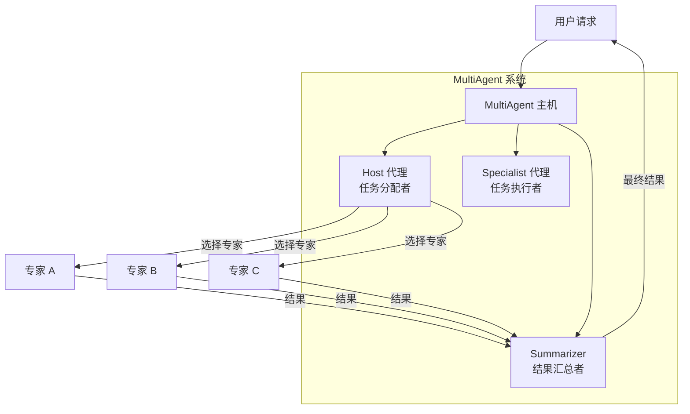

# 多代理主机配置选项模块详解

## 概述

想象一下，你有一个专家团队，每个人都擅长不同的任务。当一个复杂问题出现时，你需要一个主持人（主持人）来决定将任务分配给哪个或哪些专家，然后可能需要汇总他们的工作成果。`multiagent_host_configuration_options` 模块正是为这个场景设计的：它提供了配置这种"主持人 + 专家团队"多代理系统的基础设施。

这个模块解决了**如何协调多个专门化代理以协作解决复杂任务**的问题。它不仅仅是让多个代理一起工作，更重要的是提供了一种结构化的方式来定义：
- 谁是主持人（负责任务分配）
- 有哪些专家（专门处理特定类型的子任务）
- 当多个专家被调用时，如何汇总他们的结果
- 在流式输出模式下，如何判断模型何时在调用工具

## 核心概念和心智模型

### 核心心智模型

可以把这个模块想象成**一个任务分配中心**：

1. **主持人 (Host)** 是前台接待员，负责理解用户请求并决定将任务转发给哪个部门
2. **专家 (Specialists)** 是各个部门的专业人员，各自擅长特定类型的工作
3. **汇总器 (Summarizer)** 是文档编辑员，当多个部门都参与工作时，负责将他们的成果整合成一份连贯的报告

### 关键抽象

这个模块围绕三个核心抽象构建：

1. **MultiAgentConfig** - 多代理系统的"蓝图"，定义整个系统的结构
2. **Host** - 负责任务路由的决策者
3. **Specialists** - 实际执行工作的专门代理
4. **AgentOption** - 灵活配置代理行为的选项系统

## 架构设计

让我们通过以下 Mermaid 图表来理解这个模块的架构：

### 数据流程

1. **初始化阶段**：
   - 使用 `MultiAgentConfig` 配置整个系统
   - 定义 Host 代理及其决策模型
   - 注册一个或多个 Specialist 代理
   - 可选地配置 Summarizer 来合并多个专家的输出

2. **运行阶段**：
   - 用户输入到达 `MultiAgent.Generate()` 或 `MultiAgent.Stream()`
   - Host 代理分析输入并决定调用哪些 Specialist
   - 被选中的 Specialist 执行其任务
   - 如果调用了多个 Specialist，Summarizer 会合并结果
   - 最终结果返回给用户

## 设计决策与权衡

### 1. Host 只能是模型，而 Specialist 可以是任意可调用组件

**决策**：Host 被限制为 `model.ChatModel` 或 `model.ToolCallingChatModel`，而 Specialist 可以是 ChatModel、`compose.Invokable` 或 `compose.Streamable`。

**原因**：
- Host 的核心职责是做出路由决策，这自然需要语言模型的推理能力
- Specialist 需要灵活处理各种任务，可能已经是完整的代理（如 React 代理）
- 这种分离保持了 Host 的专注性同时给 Specialist 最大的灵活性

**权衡**：
- ✅ 优点：清晰的职责分离，Specialist 可以是任何已有组件
- ❌ 缺点：Host 的定制性受到限制，无法使用非模型组件作为 Host

### 2. 支持单专家和多专家场景的灵活处理

**决策**：系统既支持 Host 选择单个 Specialist，也支持选择多个 Specialist，并通过 Summarizer 合并结果。

**原因**：
- 复杂问题往往需要多个专业领域的知识
- 简单问题只需要单个专家，避免不必要的复杂性
- 提供默认的简单汇总器（拼接所有输出），同时允许自定义

**权衡**：
- ✅ 优点：适用范围广，从简单到复杂场景都能处理
- ❌ 缺点：默认汇总器不支持流式输出，使用时需要注意

### 3. 流式模式下的工具调用检测需要自定义

**决策**：提供了 `StreamToolCallChecker` 配置项，允许用户自定义如何检测流式输出中的工具调用。

**原因**：
- 不同模型在流式模式下输出工具调用的方式差异很大
  - OpenAI 直接输出工具调用
  - Claude 先输出文本，再输出工具调用
- 无法用单一策略适配所有模型

**权衡**：
- ✅ 优点：最大程度的灵活性，可以适配任何模型的行为
- ❌ 缺点：增加了配置复杂度，用户需要了解其模型的行为
- ❌ 缺点：默认实现对 Claude 等模型效果不佳

### 4. 选项系统的双层设计

**决策**：`AgentOption` 采用了双层设计，区分通用的 compose 选项和实现特定的选项。

**原因**：
- 保持 Agent 选项的通用性，不同 Agent 实现可以共享同一套选项机制
- 允许各 Agent 实现有自己特定的配置，而不破坏通用性
- 通过类型安全的方式处理实现特定的选项

**权衡**：
- ✅ 优点：灵活且类型安全，既能共享通用部分又能支持特定需求
- ❌ 缺点：理解和正确使用需要一定的学习曲线

## 子模块简介

### host_config_types（主机配置类型）

这个子模块定义了多代理系统的核心数据结构，包括 `MultiAgentConfig`、`Host`、`Specialist`、`Summarizer` 和 `AgentMeta`。它是整个系统的"蓝图"定义，负责验证配置的有效性并提供默认行为。

详细内容请参阅：[host_config_types 子模块文档](flow_agents_and_retrieval-agent_orchestration_and_multiagent_host-multiagent_host_configuration_options-host_config_types.md)

### option_handlers（选项处理器）

这个子模块实现了灵活的选项系统，包括 `AgentOption` 类型和相关的选项处理函数。它允许以统一的方式配置各种代理实现，同时支持各实现的特定需求。

详细内容请参阅：[option_handlers 子模块文档](flow_agents_and_retrieval-agent_orchestration_and_multiagent_host-multiagent_host_configuration_options-option_handlers.md)

## 与其他模块的关系

### 依赖关系

1. **compose 模块**：整个多代理系统构建在 compose 图执行引擎之上，使用 `compose.Graph`、`compose.Runnable` 等核心抽象
2. **model 模块**：Host 和某些 Specialist 依赖 `model.ChatModel` 或 `model.ToolCallingChatModel`
3. **schema 模块**：使用 `schema.Message` 和 `schema.StreamReader` 作为数据传递格式
4. **agent 模块**：共享通用的 `agent.AgentOption` 接口

### 被依赖关系

这个模块通常被更高级的代理编排系统使用，例如：
- 需要多个专业代理协作的复杂应用
- 构建在多代理模式之上的特定领域代理系统

## 新贡献者注意事项

### 1. 配置验证

`MultiAgentConfig.validate()` 会进行严格的验证，确保：
- Host 必须有模型（ChatModel 或 ToolCallingChatModel）
- 至少有一个 Specialist
- 每个 Specialist 必须有且只有一种实现方式（ChatModel、Invokable 或 Streamable）
- AgentMeta 必须有名称和用途描述

### 2. 流式模式的特殊考虑

- 如果使用流式模式且模型不是 OpenAI 风格（工具调用在前），必须配置 `StreamToolCallChecker`
- 默认的汇总器不支持流式输出，如需流式汇总，必须实现自己的 Summarizer
- 自定义 `StreamToolCallChecker` 时，**必须**在返回前关闭输入流

### 3. Specialist 的实现互斥性

Specialist 的三个实现选项是互斥的：
- 设置了 ChatModel 就不能设置 Invokable 或 Streamable
- 设置了 Invokable 或 Streamable 就不能设置 ChatModel
- SystemPrompt 仅在使用 ChatModel 时有效

### 4. AgentOption 的正确使用

- 使用 `WithComposeOptions` 来设置底层 compose 图的选项
- 使用 `WrapImplSpecificOptFn` 来设置实现特定的选项
- 使用 `GetImplSpecificOptions` 时要注意类型匹配

### 5. 弃用项的注意

`Host.ChatModel` 已被标记为弃用，新代码应使用 `Host.ToolCallingChatModel`。

## 总结

`multiagent_host_configuration_options` 模块为构建"主持人 + 专家团队"模式的多代理系统提供了灵活而强大的配置基础设施。它通过清晰的职责分离、灵活的配置选项和对各种场景的支持，使得构建复杂的多代理协作系统变得更加容易。

然而，使用时需要注意一些边缘情况，特别是流式模式下的工具调用检测和汇总器的流式支持。理解这个模块的设计思想和权衡，可以帮助你更好地使用和扩展它。
