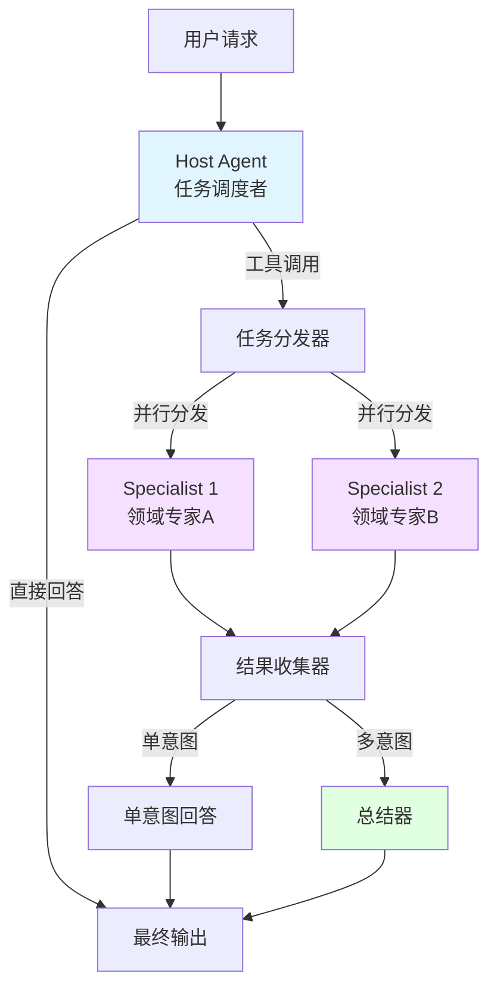

# Agent Orchestration and Multi-Agent Host 模块

## 概述

你是否曾经遇到过这样的场景：你需要构建一个 AI 助手，它既能写代码，又能解答医疗问题，还能帮你撰写 marketing 文案？如果试图用单个智能体来完成所有这些任务，你很快就会发现它在各个领域都表现平平——正所谓"样样通，样样松"。

这就是 **agent_orchestration_and_multiagent_host** 模块诞生的背景。它提供了一种优雅的方式来构建"专家团队"式的 AI 系统，而不是试图打造一个"全能"的 AI。

### 核心思想

这个模块实现了一种称为"主机模式"（Host Pattern）的多智能体系统架构。可以把它想象成一家咨询公司的运作方式：

- **Host Agent** 是项目经理：它理解客户需求，但不亲自完成所有工作
- **Specialist Agents** 是领域专家：每个都有自己独特的技能和专业知识
- **任务流转**：项目经理决定把任务交给哪个专家，然后整合专家的工作成果

通过这种方式，我们可以构建出比单个智能体更强大、更灵活的 AI 应用——每个专家都可以专注于自己擅长的领域，而 Host 则负责协调和整合。

## 架构概览

### 核心组件图



### 架构详解

这个模块的核心是一个由 [compose_graph_engine](compose_graph_engine.md) 驱动的有向无环图（DAG）。整个系统由以下几个关键部分组成：

1. **Host Agent**：这是整个系统的"大脑"，负责理解用户的意图，并决定是直接回答还是将任务分发给专家。它通过工具调用的方式来表达自己的决策——每个工具调用实际上对应着一个 Specialist Agent。

2. **Specialist Agents**：这些是领域专家，每个都有自己独特的技能。它们可以是简单的聊天模型，也可以是复杂的 [React Agent](chatmodel_react_and_retry_runtime.md)，甚至是完全自定义的函数。

3. **结果收集与整合**：当一个或多个 Specialist 完成任务后，系统会根据情况决定是直接返回单个专家的结果，还是使用 Summarizer 将多个专家的结果整合成一个连贯的回答。

## 核心设计决策

### 1. 使用工具调用作为任务分发机制

**决策**：Host Agent 通过工具调用（Tool Calls）来选择 Specialist，而不是使用自定义的路由逻辑。

**为什么这样设计**：
- 利用了大型语言模型（LLM）已经具备的工具使用能力，无需重新发明路由机制
- 提供了自然的扩展性——添加新的 Specialist 就像添加新工具一样简单
- 使得 Host Agent 的决策过程可解释（通过查看工具调用的参数）

**权衡**：
- 依赖于 LLM 正确理解和使用工具的能力，可能需要精心设计提示词
- 工具调用格式有一定的开销，对于极简单的任务可能显得过于复杂

### 2. 支持单意图和多意图两种工作流

**决策**：系统能够处理两种情况：Host Agent 选择单个 Specialist，或者同时选择多个 Specialist。

**为什么这样设计**：
- 实际应用中，用户的查询经常包含多个子问题，需要不同的专家来解答
- 提供了灵活的响应策略——可以并行处理多个子任务，提高效率

**权衡**：
- 增加了系统的复杂度，需要维护额外的状态来跟踪意图数量
- 多意图情况下的结果整合需要 Summarizer，这增加了延迟和成本

### 3. 灵活的 Specialist 定义

**决策**：Specialist 可以是多种形式：ChatModel、Invokable 函数、Streamable 函数，或者它们的组合。

**为什么这样设计**：
- 最大限度地提高了灵活性——可以复用现有的各种智能体实现
- 支持渐进式采用——从简单的 ChatModel 开始，逐步升级到复杂的 React Agent

**权衡**：
- 类型安全有所牺牲（使用 `any` 来容纳不同类型）
- 配置变得更加复杂，需要验证多种可能的组合

### 4. 内置流式处理支持

**决策**：从一开始就设计为支持流式输出，包括在流式模式下检测工具调用的能力。

**为什么这样设计**：
- 流式输出对于良好的用户体验至关重要，尤其是在响应可能较长的场景
- 不同的模型在流式输出工具调用时有不同的行为（例如 OpenAI vs Claude），需要专门处理

**权衡**：
- 增加了实现的复杂度，需要同时处理同步和异步两种路径
- StreamToolCallChecker 的设计需要仔细考虑，特别是对于 Claude 这样的模型

## 数据流动详解

让我们通过一个典型的场景来追踪数据的流动：

1. **用户输入**：用户发送一条消息，如"帮我分析一下这篇财务报告，并总结其中的风险点"。

2. **Host Agent 处理**：
   - 输入消息首先到达 Host Agent
   - Host Agent 使用其配置的系统提示词和工具列表处理消息
   - 工具列表实际上是由所有 Specialist 的描述动态生成的
   - Host Agent 决定调用"财务分析专家"和"风险评估专家"两个工具

3. **任务分发**：
   - 系统检测到 Host Agent 的输出包含工具调用
   - 分支逻辑将流程导向多个 Specialist 的并行执行
   - 状态 `isMultipleIntents` 被设置为 `true`

4. **Specialist 执行**：
   - 每个 Specialist 接收到原始输入消息（通过状态预处理器从 `state.msgs` 获取）
   - 它们并行处理任务并生成各自的输出

5. **结果收集与整合**：
   - 所有 Specialist 的输出被收集到 `specialistsAnswersCollectorNodeKey` 节点
   - 由于 `isMultipleIntents` 为 `true`，流程导向 Summarizer
   - Summarizer 接收原始对话历史和所有 Specialist 的输出，生成最终总结

6. **最终输出**：整合后的结果返回给用户

## 关键组件解析

### 完整使用示例

让我们通过一个完整的示例来展示如何使用这个模块：

```go
package main

import (
        "context"
        "fmt"

        "github.com/cloudwego/eino/flow/agent/multiagent/host"
        "github.com/cloudwego/eino/components/model"
        "github.com/cloudwego/eino/schema"
)

// 定义一个简单的回调，用于监控任务切换
type handoffLogger struct{}

func (h *handoffLogger) OnHandOff(ctx context.Context, info *host.HandOffInfo) context.Context {
        fmt.Printf("Handoff to %s with argument: %s\n", info.ToAgentName, info.Argument)
        return ctx
}

func main() {
        ctx := context.Background()

        // 1. 创建 Host 的模型（这里使用假的实现，实际中会使用真实的模型）
        hostModel := createMockHostModel()

        // 2. 创建 Specialist 模型
        codeExpertModel := createMockCodeExpertModel()
        writingExpertModel := createMockWritingExpertModel()

        // 3. 创建多智能体系统
        ma, err := host.NewMultiAgent(ctx, &host.MultiAgentConfig{
                Name: "智能助手",
                Host: host.Host{
                        ToolCallingModel: hostModel,
                        SystemPrompt: "你是一个智能助手，可以帮助用户解决各种问题。" +
                                "对于代码相关问题，交给代码专家；对于写作相关问题，交给写作专家。",
                },
                Specialists: []*host.Specialist{
                        {
                                AgentMeta: host.AgentMeta{
                                        Name:        "代码专家",
                                        IntendedUse: "用于解答编程和代码相关的问题",
                                },
                                ChatModel:    codeExpertModel,
                                SystemPrompt: "你是一个专业的软件工程师，擅长解释代码概念和解决编程问题。",
                        },
                        {
                                AgentMeta: host.AgentMeta{
                                        Name:        "写作专家",
                                        IntendedUse: "用于帮助写作、修改和润色文本",
                                },
                                ChatModel:    writingExpertModel,
                                SystemPrompt: "你是一个专业的作家和编辑，擅长帮助用户改进他们的写作。",
                        },
                },
        })
        if err != nil {
                panic(err)
        }

        // 4. 使用多智能体系统
        messages := []*schema.Message{
                {
                        Role:    schema.User,
                        Content: "你能帮我写一段 Go 语言的 HTTP 服务器代码吗？",
                },
        }

        // 同步调用
        result, err := ma.Generate(ctx, messages, host.WithAgentCallbacks(&handoffLogger{}))
        if err != nil {
                panic(err)
        }

        fmt.Printf("Response: %s\n", result.Content)
}
```

### MultiAgent 类型

这是整个系统的门面（Facade），封装了底层的 compose graph。它提供了三个主要方法：

- `Generate`：同步执行，返回最终消息
- `Stream`：流式执行，返回消息流
- `ExportGraph`：导出底层图，以便嵌入到更大的工作流中

重要的是，`MultiAgent` 本身也是一个 `compose.Runnable`，这意味着它可以无缝地集成到其他基于 compose 的系统中。

### Specialist 类型

`Specialist` 是一个非常灵活的抽象，可以容纳多种类型的智能体：

- 最简单的形式是一个 `ChatModel`，加上可选的系统提示词
- 更复杂的形式是提供 `Invokable` 和/或 `Streamable` 函数
- 这种设计使得既可以快速原型化（使用简单的 ChatModel），也可以构建生产级系统（使用完整的 React Agent）

### MultiAgentCallback 接口

这个接口允许你在 Agent 之间发生切换时插入自定义逻辑。当 Host Agent 决定调用某个 Specialist 时，`OnHandOff` 方法会被调用，传递包含目标 Agent 名称和参数的 `HandOffInfo`。

这对于日志记录、审计、监控或自定义上下文传递非常有用。

### StreamToolCallChecker

这是一个关键的扩展点，用于处理不同模型在流式输出工具调用时的差异。默认实现只检查第一个块，但对于像 Claude 这样先输出文本再输出工具调用的模型，你需要提供自定义实现。

## 使用指南

### 基本配置

创建一个 Host Multi-Agent 系统的基本步骤：

```go
hostMA, err := NewMultiAgent(ctx, &MultiAgentConfig{
    Host: Host{
        ToolCallingModel: myToolCallingModel,
        SystemPrompt: "你是一个 helpful 的助手，决定哪个专家最适合处理任务...",
    },
    Specialists: []*Specialist{
        {
            AgentMeta: AgentMeta{
                Name: "代码审查专家",
                IntendedUse: "用于审查和分析代码，提供改进建议",
            },
            ChatModel: codeReviewModel,
            SystemPrompt: "你是一个专业的代码审查员...",
        },
        // 更多 Specialist...
    },
})
```

### 处理流式输出

对于 Claude 等模型，你可能需要自定义 `StreamToolCallChecker`：

```go
customChecker := func(ctx context.Context, modelOutput *schema.StreamReader[*schema.Message]) (bool, error) {
    defer modelOutput.Close()
    
    // 读取所有块，直到找到工具调用或流结束
    for {
        msg, err := modelOutput.Recv()
        if err == io.EOF {
            return false, nil
        }
        if err != nil {
            return false, err
        }
        
        if len(msg.ToolCalls) > 0 {
            return true, nil
        }
    }
}

config.StreamToolCallChecker = customChecker
```

### 添加回调

使用 `WithAgentCallbacks` 来监听任务切换事件：

```go
callback := &myCallback{} // 实现 MultiAgentCallback 接口

result, err := hostMA.Generate(ctx, messages, WithAgentCallbacks(callback))
```

## 性能与扩展性考量

### 延迟优化

当使用 Host Multi-Agent 系统时，有几个关键的延迟点需要注意：

1. **Host Agent 的决策时间**：这是不可避免的，但可以通过精心设计提示词来优化，让 Host Agent 能够更快地做出决策。

2. **Specialist 的并行执行**：当选择多个 Specialist 时，系统会并行执行它们，这在大多数情况下是有益的。但是，如果你有大量的 Specialist，这可能会导致资源竞争。

3. **Summarizer 的额外延迟**：在多意图场景下，Summarizer 会增加额外的一轮 LLM 调用。对于性能敏感的应用，可以考虑：
   - 优化 Summarizer 的提示词，使其更简洁
   - 使用更快但可能能力稍弱的模型作为 Summarizer
   - 在某些情况下，直接使用默认的拼接策略而不是 Summarizer

### 扩展性设计

该模块在设计时考虑了扩展性，主要体现在以下几个方面：

1. **Specialist 的多样性**：如前所述，Specialist 可以是多种形式，这使得系统可以随着需求增长而演进。

2. **Graph Export**：`ExportGraph` 方法允许你将整个 Multi-Agent 系统作为一个节点嵌入到更大的图中，这意味着你可以构建层级化的多智能体系统。

3. **Callback 机制**：`MultiAgentCallback` 提供了扩展点，允许你在不修改核心代码的情况下添加自定义功能。

### 资源使用建议

1. **模型选择**：
   - Host Agent：应该使用能力较强的模型，因为它需要做出正确的路由决策
   - Specialist：可以根据任务复杂度选择合适的模型，不一定都需要最强的模型
   - Summarizer：可以使用中等能力的模型，除非总结任务非常复杂

2. **Specialist 数量**：
   - 虽然理论上可以添加任意数量的 Specialist，但实际上应该保持在合理范围内（建议 5-10 个）
   - 过多的 Specialist 会让 Host Agent 的决策变得困难，也会增加提示词的长度

3. **State 管理**：
   - 当前实现使用本地状态，这对于简单场景是足够的
   - 对于需要持久化和恢复的复杂场景，可以考虑与 [checkpointing_and_rerun_persistence](compose_graph_engine-checkpointing_and_rerun_persistence.md) 模块结合使用

## 常见陷阱与注意事项

1. **Claude 等模型的流式工具调用检测**：
   - 默认的 `StreamToolCallChecker` 可能不适用，需要自定义实现
   - 或者考虑在提示词中要求模型在输出文本之前先输出工具调用

2. **Specialist 的输入处理**：
   - Specialist 接收到的是 `state.msgs` 中的原始消息，而不是 Host Agent 的工具调用消息
   - 这是设计使然，但有时会让人感到意外

3. **多意图场景下的 Summarizer**：
   - 默认的 Summarizer 只是简单地拼接结果，不支持流式输出
   - 对于生产环境，建议提供自定义的 Summarizer

4. **错误处理**：
   - 目前，如果任何一个 Specialist 失败，整个流程都会失败
   - 考虑在 Specialist 内部实现容错逻辑

5. **状态管理**：
   - 系统使用本地状态 (`state` 结构体) 来跟踪消息和意图类型
   - 这个状态不会自动持久化，如果需要恢复功能，需要额外的检查点机制

## 子模块

该模块包含以下子模块，详细信息请参考各自的文档：

- [host_role_and_agent_descriptors](flow_agents_and_retrieval-agent_orchestration_and_multiagent_host-host_role_and_agent_descriptors.md)：定义 Host 和 Specialist 的角色和描述符
- [multiagent_host_configuration_options](flow_agents_and_retrieval-agent_orchestration_and_multiagent_host-multiagent_host_configuration_options.md)：配置选项的详细说明
- [handoff_callback_contracts](flow_agents_and_retrieval-agent_orchestration_and_multiagent_host-handoff_callback_contracts.md)：切换回调的契约定义
- [host_composition_state_and_test_fixture](flow_agents_and_retrieval-agent_orchestration_and_multiagent_host-host_composition_state_and_test_fixture.md)：图构建和测试工具

## 与其他模块的关系

- **依赖**：
  - [compose_graph_engine](compose_graph_engine.md)：提供底层的图执行引擎
  - [agent_contracts_and_context](adk_runtime-agent_contracts_and_context.md)：定义 Agent 的通用契约和选项
  - [schema_models_and_streams](schema_models_and_streams.md)：提供消息和流的核心数据结构

- **被依赖**：
  - 可以嵌入到更大的 [workflow_agents](adk_runtime-workflow_agents.md) 中
  - 可以与 [react_agent_runtime_and_options](flow_agents_and_retrieval-react_agent_runtime_and_options.md) 结合使用，将 React Agent 作为 Specialist

这个模块是构建复杂多智能体系统的基石，通过将任务分解和专业化，我们可以构建出比单个智能体更强大、更灵活的 AI 应用。
