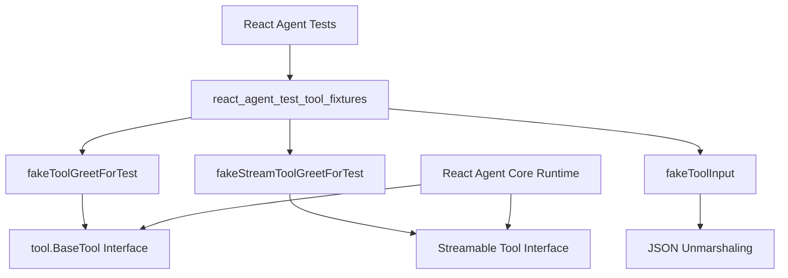

# React Agent 测试工具夹具 (react_agent_test_tool_fixtures)

## 1. 模块概览

`react_agent_test_tool_fixtures` 模块是 React Agent 运行时的测试基础设施，专门为测试 [React Agent Core Runtime](flow_agents_and_retrieval-react_agent_runtime_and_options-react_agent_core_runtime.md) 而设计。它提供了一组可预测、可配置的测试工具和测试双精度（test doubles），让开发者能够在受控环境中验证 React Agent 的各种行为，而不需要依赖真实的外部服务。

### 问题背景
在测试 React Agent 时，直接使用真实工具会带来几个问题：
- 测试结果不可预测（例如网络请求失败、第三方 API 限流）
- 难以模拟特定的边界情况和错误场景
- 测试执行速度慢，依赖外部资源
- 难以验证工具调用的正确性和顺序

这个模块通过提供模拟工具实现解决了这些问题，这些工具可以精确控制其行为、输出和状态。

## 2. 核心组件详解

### 2.1 fakeToolGreetForTest - 同步测试工具

`fakeToolGreetForTest` 是一个实现了 `tool.BaseTool` 接口的同步测试工具，用于模拟标准的请求-响应模式工具调用。

```go
type fakeToolGreetForTest struct {
    tarCount int  // 目标调用次数，用于控制何时返回 "bye"
    curCount int  // 当前调用计数，内部状态
}
```

#### 设计意图
这个工具的设计围绕着一个简单但实用的用例：模拟一个需要多次调用才能完成任务的工具。它维护内部状态，在达到指定调用次数后会改变行为（从返回 "hello" 改为返回 "bye"），这非常适合测试 React Agent 的循环执行和终止逻辑。

#### 核心方法

**Info()** - 提供工具元数据
```go
func (t *fakeToolGreetForTest) Info(_ context.Context) (*schema.ToolInfo, error)
```
返回工具的名称、描述和参数定义，让模型知道如何调用这个工具。这是一个稳定的实现，不会改变其输出，确保测试的一致性。

**InvokableRun()** - 执行同步工具调用
```go
func (t *fakeToolGreetForTest) InvokableRun(_ context.Context, argumentsInJSON string, _ ...tool.Option) (string, error)
```
这是工具的核心逻辑：
1. 解析 JSON 参数，提取 `name` 字段
2. 检查当前调用次数是否已达到目标次数
3. 如果未达到，返回 `{"say": "hello <name>"}` 并增加计数
4. 如果已达到，返回 `{"say": "bye"}` 保持计数不变

### 2.2 fakeStreamToolGreetForTest - 流式测试工具

`fakeStreamToolGreetForTest` 是一个实现了流式工具接口的测试工具，用于测试 React Agent 的流式输出处理能力。

```go
type fakeStreamToolGreetForTest struct {
    tarCount int  // 目标调用次数
    curCount int  // 当前调用计数
}
```

#### 设计意图
这个工具与 `fakeToolGreetForTest` 类似，但它返回流式输出而不是同步响应。它专门用于测试 React Agent 在处理工具的流式结果时的行为，特别是在与流式模型输出结合使用时的集成测试。

#### 核心方法

**Info()** - 提供工具元数据
与同步工具类似，但名称为 "greet in stream"，以便在测试中区分。

**StreamableRun()** - 执行流式工具调用
```go
func (t *fakeStreamToolGreetForTest) StreamableRun(_ context.Context, argumentsInJSON string, _ ...tool.Option) (*schema.StreamReader[string], error)
```
这个方法：
1. 解析输入参数
2. 根据当前计数状态决定返回内容
3. 使用 `schema.StreamReaderFromArray()` 创建一个包含单个元素的流
4. 返回流读取器给调用者

虽然当前实现只返回单个元素的流，但这个设计为未来扩展更复杂的流式行为（如分块输出、延迟发送等）留下了空间。

### 2.3 fakeToolInput - 工具输入结构

```go
type fakeToolInput struct {
    Name string `json:"name"`
}
```

这是一个简单的结构体，用于解析两个测试工具的输入参数。它只包含一个 `Name` 字段，保持了测试工具的简洁性，同时仍然足够验证参数解析的正确性。

## 3. 架构与数据流

### 3.1 测试架构视图



### 3.2 数据流分析

在典型的测试场景中，数据流动如下：

1. **测试设置阶段**：
   - 测试创建 `fakeToolGreetForTest` 和/或 `fakeStreamToolGreetForTest` 实例
   - 设置 `tarCount` 以控制工具行为
   - 将这些工具注入到 [React Agent 配置](flow_agents_and_retrieval-react_agent_runtime_and_options-react_agent_core_runtime.md#agentconfig) 中

2. **测试执行阶段**：
   - React Agent 调用工具的 `Info()` 方法获取元数据
   - Agent 将工具信息绑定到模型
   - 模型生成工具调用请求
   - Agent 调用工具的 `InvokableRun()` 或 `StreamableRun()` 方法
   - 工具解析输入（使用 `fakeToolInput`），更新内部状态，返回结果
   - Agent 处理结果，决定下一步操作

3. **验证阶段**：
   - 测试检查 Agent 的最终输出
   - 测试可以验证工具被调用的次数、顺序和参数

## 4. 设计决策与权衡

### 4.1 状态ful vs 无状态工具

**决策**：测试工具被设计为有状态的，维护 `curCount` 和 `tarCount`。

**权衡分析**：
- ✅ **优点**：可以测试 Agent 的多步执行逻辑和终止条件
- ✅ **优点**：单个工具实例可以模拟复杂的多轮交互
- ❌ **缺点**：测试之间需要重置状态，否则会相互影响
- ❌ **缺点**：并行测试需要为每个测试创建独立的工具实例

**替代方案考虑**：
- 无状态工具 + 外部状态管理：更灵活但增加了测试复杂性
- 每次调用后自动重置：简单但无法测试多步场景

当前设计代表了在简单性和功能性之间的良好平衡，适合大多数测试场景。

### 4.2 简单的输出格式

**决策**：工具返回简单的 JSON 字符串 `{"say": "hello <name>"}` 而不是结构化对象。

**权衡分析**：
- ✅ **优点**：易于在测试中验证和断言
- ✅ **优点**：不依赖特定的数据结构，保持测试的稳定性
- ❌ **缺点**：Agent 需要解析 JSON 才能使用结果（这实际上也是测试的一部分）

### 4.3 流式工具的单元素流

**决策**：`fakeStreamToolGreetForTest` 返回只包含单个元素的流。

**权衡分析**：
- ✅ **优点**：简化了测试，仍然可以验证流式路径
- ❌ **缺点**：没有测试真正的多块流式输出场景

这个设计选择表明，当前的测试重点是验证流式路径的存在和基本功能，而不是测试复杂的流式行为。如果未来需要测试更复杂的流式场景，可以扩展这个实现。

## 5. 使用指南与示例

### 5.1 基本使用模式

在测试中使用这些工具的典型模式：

```go
// 创建工具实例，设置目标调用次数
fakeTool := &fakeToolGreetForTest{
    tarCount: 3,  // 调用3次后返回 "bye"
}

// 创建 Agent 并注入工具
agent, err := NewAgent(ctx, &AgentConfig{
    Model: mockModel,
    ToolsConfig: compose.ToolsNodeConfig{
        Tools: []tool.BaseTool{fakeTool},
    },
    MaxStep: 40,
})

// 执行测试
result, err := agent.Generate(ctx, inputMessages)
```

### 5.2 测试工具返回直接结果

```go
// 获取工具信息
info, _ := fakeTool.Info(ctx)

// 创建 Agent 时配置直接返回工具
agent, err := NewAgent(ctx, &AgentConfig{
    Model: mockModel,
    ToolsConfig: compose.ToolsNodeConfig{
        Tools: []tool.BaseTool{fakeTool},
    },
    ToolReturnDirectly: map[string]struct{}{info.Name: {}},
})
```

### 5.3 同时使用同步和流式工具

```go
fakeTool := &fakeToolGreetForTest{tarCount: 20}
fakeStreamTool := &fakeStreamToolGreetForTest{tarCount: 20}

agent, err := NewAgent(ctx, &AgentConfig{
    Model: mockModel,
    ToolsConfig: compose.ToolsNodeConfig{
        Tools: []tool.BaseTool{fakeTool, fakeStreamTool},
    },
})
```

## 6. 注意事项与陷阱

### 6.1 状态管理

**陷阱**：在多个测试中重用同一个工具实例会导致状态污染。

**解决方案**：
- 每个测试创建新的工具实例
- 或者在测试之间显式重置 `curCount` 字段

### 6.2 参数解析

**陷阱**：工具期望输入包含 `name` 字段，如果模型生成的工具调用不包含这个字段，会导致解析错误。

**解决方案**：
- 在测试中确保模型生成正确的参数
- 或者根据需要修改 `fakeToolInput` 结构

### 6.3 流式测试的局限性

**陷阱**：当前的流式工具实现只返回单元素流，可能无法发现与多块流相关的问题。

**解决方案**：
- 对于需要测试复杂流式行为的场景，可以扩展 `fakeStreamToolGreetForTest` 或创建自定义测试工具
- 关注未来的模块更新，看是否会添加更复杂的流式测试工具

### 6.4 与测试框架的集成

**提示**：这些工具设计为与 `testing` 包和 `testify/assert` 一起使用，但它们本身不依赖这些库，可以在任何测试设置中使用。

## 7. 扩展与定制

虽然当前的测试工具已经覆盖了常见场景，但您可能需要根据特定需求扩展它们：

1. **创建自定义测试工具**：实现 `tool.BaseTool` 或流式工具接口
2. **扩展现有工具**：添加更多功能，如错误注入、延迟模拟等
3. **创建工具工厂**：为不同测试场景预配置工具实例

## 8. 相关模块

- [React Agent Core Runtime](flow_agents_and_retrieval-react_agent_runtime_and_options-react_agent_core_runtime.md) - 这些测试工具服务的主要模块
- [React Option Streaming and Callback Contracts](flow_agents_and_retrieval-react_agent_runtime_and_options-react_option_streaming_and_callback_contracts.md) - 定义了流式工具接口
- [Tool Contracts and Options](../components_core-tool_contracts_and_options.md) - 基础工具接口定义
