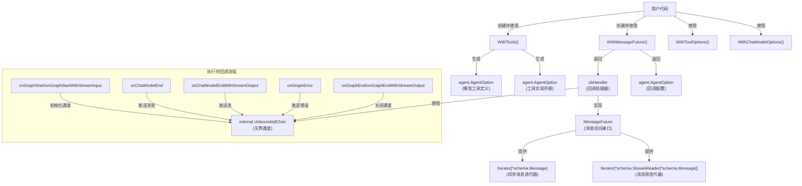

# React Agent 选项、流与回调契约

## 概述

`react_option_streaming_and_callback_contracts` 模块是 React Agent 运行时的基础设施层，它解决了一个看似简单但实则复杂的问题：**如何让 React Agent 的用户既能够方便地配置工具和模型选项，又能够以异步、非阻塞的方式获取执行过程中产生的所有消息？**

在传统的 Agent 设计中，用户要么只能获得最终结果，要么需要轮询状态；要么配置工具时需要手动同步工具定义和工具实现，容易出错。这个模块通过提供三个核心能力，优雅地解决了这些问题：

1. **统一的工具配置**：一次性完成工具定义（给模型）和工具实现（给执行器）的注册
2. **灵活的选项传递**：将底层组件的选项透传给 Agent 用户
3. **异步消息消费**：通过 Future 模式和迭代器，让用户可以按自己的节奏消费执行过程中的所有中间消息

## 架构与数据流程

让我们先通过一个架构图来理解这个模块的核心组件和数据流：



这个架构图揭示了模块的两个主要职责：

### 1. 选项配置层（左上部分）

这部分的设计非常直观——它是一个**透传层**，将底层 `compose` 图和 `model`/`tool` 组件的选项打包成 `agent.AgentOption`，让用户可以在 Agent 层面配置底层组件。

但其中 `WithTools` 是一个关键的设计点，我们后面会详细分析。

### 2. 消息收集与异步消费层（右半部分）

这是模块的核心创新部分。它的工作原理可以类比为**"事件总线+订阅者模式"**，但有一个重要的区别：**消息是有边界的（从图执行开始到结束），并且通过迭代器而不是回调函数来消费**。

数据流如下：
1. 用户调用 `WithMessageFuture()` 获取一个选项和一个 Future
2. 将选项传递给 Agent 的 `Generate` 或 `Stream` 方法
3. Agent 执行时，回调被触发，消息被写入无界通道
4. 用户通过 Future 获取迭代器，按自己的节奏从通道中读取消息
5. 图执行结束时，通道被关闭，迭代器返回 `false` 表示结束

## 核心组件深度解析

### 1. `WithTools` - 统一工具配置

```go
func WithTools(ctx context.Context, tools ...tool.BaseTool) ([]agent.AgentOption, error)
```

**设计意图**：这是一个**便利性函数**，解决了工具配置中最容易出错的问题——**工具定义和工具实现的同步**。

在没有这个函数之前，用户需要：
1. 手动调用每个工具的 `Info()` 方法获取工具定义
2. 将工具定义通过 `model.WithTools()` 传递给聊天模型
3. 将工具实现通过 `compose.WithToolList()` 传递给工具节点
4. 确保这两个步骤使用的是同一组工具，顺序一致，没有遗漏

这不仅繁琐，而且容易出错——比如添加了一个工具但忘记更新模型的工具定义，或者工具顺序不一致导致调用错误。

`WithTools` 将这一切封装起来，一次性完成所有操作，保证了一致性。

**实现细节**：
- 遍历所有工具，调用 `Info()` 收集工具定义
- 创建两个选项：一个给模型（工具定义），一个给工具节点（工具实现）
- 总是返回恰好两个选项（成功时）

**使用示例**：
```go
opts, err := react.WithTools(ctx, searchTool, calculatorTool)
if err != nil {
    // 处理错误
}
msg, err := agent.Generate(ctx, messages, opts...)
```

### 2. `MessageFuture` 与 `cbHandler` - 异步消息消费

```go
type MessageFuture interface {
    GetMessages() *Iterator[*schema.Message]
    GetMessageStreams() *Iterator[*schema.StreamReader[*schema.Message]]
}
```

**设计意图**：这是模块最精妙的部分。它解决了两个问题：
1. **如何在不阻塞执行的情况下获取所有中间消息？**
2. **如何同时支持同步（Generate）和流式（Stream）两种执行模式？**

这里的设计选择非常值得玩味：

**为什么使用 Future + 迭代器，而不是直接返回通道？**
- 迭代器提供了更友好的 API：`v, ok, err := iter.Next()`
- 隐藏了通道的实现细节，未来可以替换底层实现而不改变 API
- 更容易处理错误（通道本身不支持错误传递，需要包装）

**为什么需要两个迭代器（`GetMessages` 和 `GetMessageStreams`）？**
因为 Agent 有两种执行模式：
- `Generate`：返回单个消息，执行过程中产生的消息也是完整的消息
- `Stream`：返回消息流，执行过程中产生的消息也可能是流

`cbHandler` 会根据执行模式自动选择合适的通道，并进行必要的转换（比如将流拼接成完整消息，或者将完整消息包装成流）。

**实现细节**：
- `cbHandler` 使用 `started` 通道来同步——确保用户调用 `GetMessages` 时，通道已经初始化
- 根据执行模式（同步/流式）初始化不同的通道（`msgs` 或 `sMsgs`）
- 在回调中自动进行消息和流之间的转换，保证用户总是得到与执行模式匹配的数据类型

### 3. `Iterator` - 轻量级 FIFO 迭代器

```go
type Iterator[T any] struct {
    ch *internal.UnboundedChan[item[T]]
}

func (iter *Iterator[T]) Next() (T, bool, error)
```

**设计意图**：这是一个**通用的迭代器抽象**，包装了无界通道，提供了类型安全、错误感知的迭代接口。

**为什么不直接使用 Go 的通道？**
- 通道本身不支持错误传递——我们需要一个 `(T, error)` 的组合
- 迭代器模式更符合"消费一系列值"的语义
- 提供了清晰的结束信号（`ok == false`）

**实现细节**：
- 使用 `internal.UnboundedChan` 作为底层存储——这是一个无界通道，可以无限写入而不会阻塞
- `item` 结构体包装了值和错误
- `Next()` 方法阻塞直到有值可用，或者通道关闭

## 依赖分析

这个模块在架构中处于**基础设施层**，它被上层的 Agent 运行时使用，同时依赖于多个底层组件：

### 被依赖（谁使用这个模块）
- [react_agent_core_runtime](flow_agents_and_retrieval-react_agent_runtime_and_options-react_agent_core_runtime.md)：React Agent 的核心运行时，用户通过它来使用这些选项

### 依赖（这个模块使用谁）
- `agent`：定义了 `AgentOption` 接口
- `compose`：提供了图执行的选项和回调机制
- `model`：定义了聊天模型的选项和回调
- `tool`：定义了工具的接口和选项
- `schema`：定义了消息和流的核心数据结构
- `callbacks`：提供了回调基础设施
- `internal`：提供了无界通道的实现
- `utils/callbacks`：提供了回调处理器的辅助构建器

### 关键契约
1. **工具必须实现 `tool.BaseTool` 接口**：特别是 `Info()` 方法，用于获取工具定义
2. **回调执行顺序**：`onGraphStart` → 多次消息回调 → `onGraphEnd`/`onGraphError`
3. **消息顺序保证**：通过无界通道的 FIFO 特性保证消息按产生顺序到达

## 设计决策与权衡

这个模块中有几个关键的设计决策，每个都体现了对不同需求的权衡：

### 1. `WithTools` 返回两个选项而不是一个

**选择**：返回 `[]agent.AgentOption` 而不是单个 `agent.AgentOption`

**权衡**：
- ✅ 优点：清晰分离关注点——一个选项给模型，一个给工具节点
- ✅ 优点：用户可以单独使用其中一个选项（虽然不推荐）
- ❌ 缺点：用户必须记得使用两个选项，否则工具不会正常工作
- ❌ 缺点：返回 slice 让 API 显得不那么"干净"

**为什么这样选择**：因为工具配置本质上就是两个独立的操作——告诉模型有什么工具，以及告诉执行器如何执行这些工具。将它们强制合并成一个选项会失去灵活性。

### 2. 使用无界通道而不是有界通道

**选择**：使用 `internal.UnboundedChan` 而不是普通的有界 Go 通道

**权衡**：
- ✅ 优点：不会阻塞执行流程——无论用户消费消息的速度如何，Agent 都能继续执行
- ✅ 优点：简化了回调实现——不需要处理阻塞和背压
- ❌ 缺点：可能导致内存爆炸——如果用户完全不消费消息，而 Agent 产生大量消息
- ❌ 缺点：无界通道是内部实现，有一定的维护成本

**为什么这样选择**：在 Agent 执行场景中，**执行流程的连续性**比内存使用更重要。阻塞 Agent 执行来等待用户消费消息是不可接受的。而且，Agent 产生的消息数量通常是可控的（每次推理循环产生少量消息）。

### 3. 自动进行消息和流之间的转换

**选择**：`cbHandler` 在检测到模式不匹配时，自动将流拼接成消息，或将消息包装成流

**权衡**：
- ✅ 优点：用户体验更好——不需要关心执行模式和消息类型的匹配
- ✅ 优点：简化了 API——不需要两个不同的 Future 接口
- ❌ 缺点：隐藏了性能成本——将流拼接成完整消息需要缓冲所有内容
- ❌ 缺点：可能导致意外的行为——用户期望流但得到了完整消息，反之亦然

**为什么这样选择**：便利性优先。在大多数情况下，用户只关心"获取所有消息"，而不关心它们是流还是完整消息。如果用户需要精确控制，他们可以直接使用 Agent 的 `Stream` 方法。

### 4. 使用 Future 模式而不是直接返回迭代器

**选择**：`WithMessageFuture` 返回一个 Future，用户需要通过 Future 获取迭代器

**权衡**：
- ✅ 优点：清晰的生命周期——Future 表示"将会有数据"，迭代器表示"数据可以消费了"
- ✅ 优点：可以同步初始化——`started` 通道确保迭代器只有在通道初始化后才可用
- ❌ 缺点：多了一层间接——用户需要多调用一次方法
- ❌ 缺点：API 略显复杂

**为什么这样选择**：因为迭代器只有在 Agent 开始执行后才有意义。Future 模式很好地表达了这种"先获取凭证，后获取数据"的时序关系。

## 使用指南与最佳实践

### 1. 工具配置的正确方式

**推荐**：使用 `WithTools` 一次性配置工具
```go
opts, err := react.WithTools(ctx, tool1, tool2, tool3)
if err != nil {
    // 处理错误（通常是工具 Info() 调用失败）
}
msg, err := agent.Generate(ctx, messages, opts...)
```

**不推荐**：分别配置工具定义和工具实现（容易出错）
```go
// 不要这样做，除非你有充分的理由
toolInfos := []*schema.ToolInfo{...}
toolList := []tool.BaseTool{...}
opt1 := agent.WithComposeOptions(compose.WithChatModelOption(model.WithTools(toolInfos)))
opt2 := agent.WithComposeOptions(compose.WithToolsNodeOption(compose.WithToolList(toolList...)))
msg, err := agent.Generate(ctx, messages, opt1, opt2)
```

### 2. 使用 MessageFuture 获取所有消息

**同步模式（Generate）**：
```go
opt, future := react.WithMessageFuture()
go func() {
    iter := future.GetMessages()
    for {
        msg, ok, err := iter.Next()
        if !ok {
            break // 迭代结束
        }
        if err != nil {
            // 处理错误
            continue
        }
        // 处理消息
        fmt.Printf("收到消息: %v\n", msg)
    }
}()

// 执行 Agent
msg, err := agent.Generate(ctx, messages, opt)
```

**流式模式（Stream）**：
```go
opt, future := react.WithMessageFuture()
go func() {
    iter := future.GetMessageStreams()
    for {
        stream, ok, err := iter.Next()
        if !ok {
            break
        }
        if err != nil {
            // 处理错误
            continue
        }
        // 消费消息流
        msg, err := schema.ConcatMessageStream(stream)
        if err != nil {
            // 处理错误
            continue
        }
        fmt.Printf("收到完整消息: %v\n", msg)
    }
}()

// 执行 Agent
stream, err := agent.Stream(ctx, messages, opt)
```

### 3. 组合多个选项

所有选项都可以组合使用：
```go
// 配置工具
toolOpts, err := react.WithTools(ctx, tool1, tool2)
if err != nil {
    // 处理错误
}

// 配置 MessageFuture
msgOpt, future := react.WithMessageFuture()

// 配置模型选项
modelOpt := react.WithChatModelOptions(
    model.WithTemperature(0.7),
    model.WithMaxTokens(1000),
)

// 配置工具选项
toolOpt := react.WithToolOptions(
    tool.WithTimeout(5*time.Second),
)

// 组合所有选项
allOpts := append(toolOpts, msgOpt, modelOpt, toolOpt)

// 使用
msg, err := agent.Generate(ctx, messages, allOpts...)
```

## 边缘情况与陷阱

### 1. MessageFuture 的生命周期

**陷阱**：MessageFuture 是**一次性**的——只能用于一次 Agent 执行

```go
// 错误示例
opt, future := react.WithMessageFuture()
msg1, err := agent.Generate(ctx, messages1, opt) // 第一次使用
msg2, err := agent.Generate(ctx, messages2, opt) // 第二次使用！future 已经失效了
```

**正确做法**：每次执行都创建新的 MessageFuture
```go
opt1, future1 := react.WithMessageFuture()
msg1, err := agent.Generate(ctx, messages1, opt1)

opt2, future2 := react.WithMessageFuture()
msg2, err := agent.Generate(ctx, messages2, opt2)
```

### 2. 迭代器必须被消费

**陷阱**：如果不消费迭代器，虽然不会阻塞 Agent 执行，但会导致内存泄漏

```go
// 不好的做法
opt, _ := react.WithMessageFuture()
msg, err := agent.Generate(ctx, messages, opt)
// 从不使用 future 获取迭代器，也不消费消息
// 如果 Agent 产生了很多消息，它们会一直留在内存中
```

**正确做法**：即使不关心消息，也应该启动一个 goroutine 消费并丢弃它们，或者干脆不使用 MessageFuture

### 3. 错误通过迭代器传递

**重要**：Agent 执行过程中的错误会通过迭代器传递，而不是只通过 `Generate`/`Stream` 的返回值

```go
iter := future.GetMessages()
for {
    msg, ok, err := iter.Next()
    if !ok {
        break
    }
    if err != nil {
        // 这里会收到 Agent 执行过程中的错误
        log.Printf("执行错误: %v", err)
        continue
    }
    // 处理消息
}
```

### 4. 不要混合使用 GetMessages 和 GetMessageStreams

**陷阱**：对于同一次执行，只能使用其中一个方法

```go
opt, future := react.WithMessageFuture()
go func() {
    iter1 := future.GetMessages() // 可以
    iter2 := future.GetMessageStreams() // 不要这样做！行为未定义
}()
msg, err := agent.Generate(ctx, messages, opt)
```

### 5. WithTools 的错误处理

**重要**：`WithTools` 可能会返回错误，通常是因为某个工具的 `Info()` 方法失败了

```go
opts, err := react.WithTools(ctx, tools...)
if err != nil {
    // 不要忽略这个错误！
    // 它意味着至少有一个工具无法正确获取其定义
    return fmt.Errorf("配置工具失败: %w", err)
}
```

## 总结

`react_option_streaming_and_callback_contracts` 模块是一个看似简单但实则深思熟虑的基础设施层。它的核心价值在于：

1. **简化工具配置**：通过 `WithTools` 消除了工具定义和实现不同步的风险
2. **提供异步消息消费**：通过 Future + 迭代器模式，让用户可以灵活地消费执行过程中的所有消息
3. **统一同步和流式模式**：自动处理消息和流之间的转换，提供一致的体验

这个模块的设计体现了"**便利性与灵活性的平衡**"——它提供了简单易用的 API，同时保留了足够的灵活性来处理复杂场景。对于新加入团队的开发者来说，理解这个模块的设计思想，将帮助他们更好地使用 React Agent，并在需要时扩展其功能。
