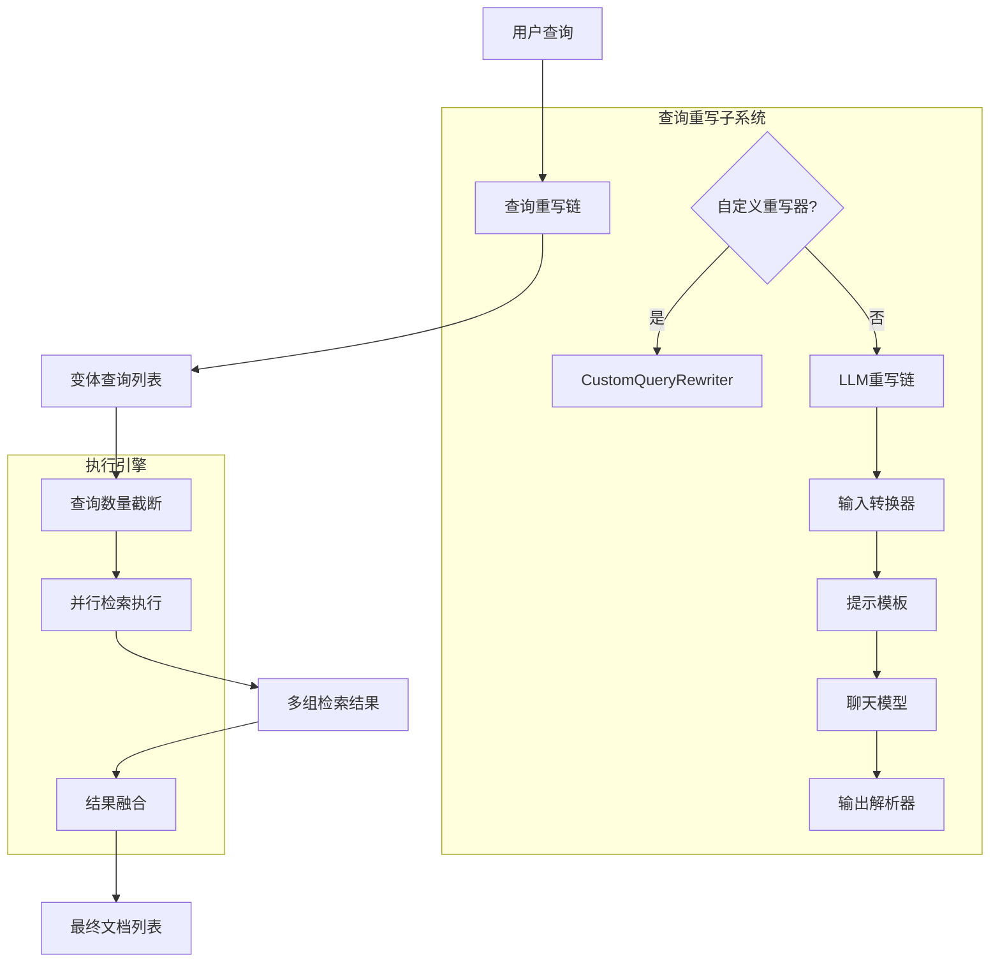

# MultiQuery Query Expansion Retriever 技术深度解析

## 1. 问题背景与模块目标

在检索系统中，**词汇不匹配问题（Vocabulary Mismatch Problem）** 是一个长期存在的挑战：用户可能使用与文档集合中完全不同的词语描述相同的概念。例如，用户查询"如何构建AI助手"时，相关文档可能标记为"agent开发教程"或"LLM应用构建指南"，导致基于相似度的检索无法找到这些文档。

**MultiQuery Query Expansion Retriever** 模块的核心目标是解决这个问题：通过将用户的原始查询自动扩展为多个语义相关的变体查询，然后用所有这些查询并行检索，最后融合结果。这种方法大幅提高了召回率（recall），同时保持了检索的效率。

## 2. 核心抽象与心智模型

理解这个模块的关键在于以下三个核心抽象：

### 2.1 查询重写器（Query Rewriter）
可以将其想象成一个"查询翻译官"——它接收一个原始查询，生成多个视角不同但语义相关的查询。这可以通过LLM完成（利用其语义理解能力），也可以通过自定义逻辑实现。

### 2.2 并行检索执行器（Parallel Retriever）
这就像同时派出多支搜索队，每支队伍使用一个变体查询进行搜索。所有搜索并行执行，充分利用系统资源，避免串行处理的延迟累积。

### 2.3 结果融合器（Result Fusion）
将多支搜索队带回的结果合并成一个统一、去重的列表。默认策略是基于文档ID去重，但也支持自定义融合逻辑。

## 3. 架构与数据流

### 3.1 核心组件架构图



### 3.2 数据流向详解

1. **查询进入与重写阶段**：
   - 用户原始查询进入 `Retrieve` 方法
   - 通过预编译的 `queryRunner`（一个 `compose.Runnable`）执行重写
   - 如果配置了 `RewriteHandler`，直接调用自定义逻辑
   - 否则，执行一个包含"转换器→模板→LLM→解析器"的链

2. **检索阶段**：
   - 重写后的查询被截断到 `maxQueriesNum`（默认5个）
   - 为每个查询创建 `utils.RetrieveTask`
   - 通过 `utils.ConcurrentRetrieveWithCallback` 并行执行所有检索

3. **结果融合阶段**：
   - 收集所有检索结果（二维文档数组）
   - 触发融合回调（`callbacks.OnStart` / `OnEnd` / `OnError`）
   - 应用 `fusionFunc`（默认是基于ID去重）
   - 返回最终文档列表

## 4. 核心组件深度解析

### 4.1 Config 结构

```go
type Config struct {
    // 查询重写配置
    RewriteLLM        model.ChatModel
    RewriteTemplate   prompt.ChatTemplate
    QueryVar          string
    LLMOutputParser   func(context.Context, *schema.Message) ([]string, error)
    RewriteHandler    func(ctx context.Context, query string) ([]string, error)
    MaxQueriesNum     int
    
    // 检索与融合配置
    OrigRetriever     retriever.Retriever
    FusionFunc        func(ctx context.Context, docs [][]*schema.Document) ([]*schema.Document, error)
}
```

**设计意图**：
- **双轨制重写配置**：既支持完整的LLM重写链（`RewriteLLM` + 模板 + 解析器），也支持完全自定义的 `RewriteHandler`，满足从简单到复杂的各种场景
- **合理的默认值**：所有可选字段都有经过验证的默认值，最小化配置门槛
- **结果融合可插拔**：`FusionFunc` 的存在让结果合并策略完全可定制

### 4.2 multiQueryRetriever 结构

```go
type multiQueryRetriever struct {
    queryRunner    compose.Runnable[string, []string]
    maxQueriesNum  int
    origRetriever  retriever.Retriever
    fusionFunc     func(...)
}
```

**核心特点**：
- 封装了预编译的 `queryRunner`，避免每次检索都重新构建链
- 保留了原始检索器 `origRetriever`，作为所有变体查询的执行引擎
- 将融合函数作为一等公民存储，确保调用路径高效

### 4.3 Retrieve 方法

这是模块的核心执行逻辑，让我们分析其关键点：

```go
func (m *multiQueryRetriever) Retrieve(ctx context.Context, query string, opts ...retriever.Option) ([]*schema.Document, error)
```

**执行流程**：
1. **查询生成**：调用 `m.queryRunner.Invoke` 生成变体查询
2. **数量限制**：截断查询列表到 `maxQueriesNum`，防止过度检索
3. **并行执行**：使用 `utils.ConcurrentRetrieveWithCallback` 并行检索
4. **错误处理**：任何一个检索任务失败都会导致整体失败
5. **结果融合**：应用融合函数，并触发完整的回调生命周期

## 5. 设计决策与权衡

### 5.1 使用 compose.Chain 构建查询重写逻辑

**决策**：查询重写不是硬编码的逻辑，而是通过 `compose.Chain` 动态构建

**原因**：
- 这提供了极大的灵活性——可以插入任意的 `compose.Runnable`
- 利用了已有的链执行引擎，不需要重写执行逻辑
- 自动获得了回调、监控等基础设施

**权衡**：
- ✅ 灵活性高
- ✅ 代码复用性好
- ❌ 有一定的学习曲线（需要理解 compose 包）
- ❌ 简单场景下显得有些"重"

### 5.2 并行检索而非串行

**决策**：所有变体查询的检索是并行执行的

**原因**：
- 检索通常是IO密集型操作，并行可以大幅降低总体延迟
- 变体查询之间没有依赖关系，完美并行化

**权衡**：
- ✅ 性能最优
- ✅ 用户体验好（低延迟）
- ❌ 对底层检索系统造成瞬时压力高峰
- ❌ 需要处理部分失败的情况（当前策略是全有或全无）

### 5.3 默认去重策略基于文档ID

**决策**：默认的 `deduplicateFusion` 使用文档ID进行去重

**原因**：
- 简单、可靠、无歧义
- 性能好（O(n)时间复杂度）
- 对于大多数场景足够

**权衡**：
- ✅ 实现简单
- ✅ 性能优秀
- ❌ 无法处理内容相同但ID不同的文档
- ❌ 没有考虑结果的相关性排序（只是简单追加）

## 6. 依赖关系分析

### 6.1 依赖的核心接口

- `retriever.Retriever`：原始检索器接口，这是模块的"工作马"
- `model.ChatModel`：用于查询重写的聊天模型（当使用LLM重写时）
- `prompt.ChatTemplate`：提示模板接口
- `compose.Chain` / `compose.Runnable`：用于构建和执行查询重写链
- `utils.ConcurrentRetrieveWithCallback`：并行检索工具函数

### 6.2 被依赖情况

这个模块通常作为高级检索策略被更高层的应用或Agent调用，实现透明的查询增强。

## 7. 使用指南与常见模式

### 7.1 基本使用（LLM重写）

```go
retriever, err := multiquery.NewRetriever(ctx, &multiquery.Config{
    OrigRetriever: myBaseRetriever,
    RewriteLLM:    myChatModel,
})
```

### 7.2 高级配置（自定义提示和解析）

```go
retriever, err := multiquery.NewRetriever(ctx, &multiquery.Config{
    OrigRetriever:   myBaseRetriever,
    RewriteLLM:      myChatModel,
    RewriteTemplate: myCustomPromptTemplate,
    QueryVar:        "user_question",
    LLMOutputParser: myCustomParser,
    MaxQueriesNum:   8,
    FusionFunc:      myRankingFusion,
})
```

### 7.3 完全自定义重写逻辑

```go
retriever, err := multiquery.NewRetriever(ctx, &multiquery.Config{
    OrigRetriever: myBaseRetriever,
    RewriteHandler: func(ctx context.Context, query string) ([]string, error) {
        // 同义词扩展、翻译、拼写纠正等自定义逻辑
        return expandQuerySynonyms(query), nil
    },
})
```

## 8. 边界情况与注意事项

### 8.1 错误处理

- **查询重写失败**：任何重写阶段的错误都会直接传播，导致整个检索失败
- **部分检索失败**：当前实现中，任何一个变体查询的检索失败都会导致整体失败（"快速失败"策略）
- **空结果处理**：如果所有查询都返回空，融合结果也为空，但这不算错误

### 8.2 性能考虑

- **查询数量**：`MaxQueriesNum` 控制着并发度和压力，默认5是保守值
- **结果集大小**：每个查询返回的文档数 × 查询数 = 融合前的总文档数，这可能很大
- **上下文传播**：确保传入的 `ctx` 有合理的超时，防止 hanging

### 8.3 隐含契约

- **文档ID唯一性**：默认去重策略假设文档ID是唯一且稳定的
- **LLM输出格式**：使用默认解析器时，LLM必须输出用换行分隔的查询
- **原始检索器线程安全**：`OrigRetriever` 必须能被并发调用

## 9. 扩展与定制点

这个模块设计了三个主要的扩展点：

1. **查询重写逻辑**：通过 `RewriteHandler` 完全控制查询生成
2. **LLM输出解析**：通过 `LLMOutputParser` 适应不同的LLM输出格式
3. **结果融合策略**：通过 `FusionFunc` 实现高级融合（如加权投票、排序等）

## 10. 总结

MultiQuery Query Expansion Retriever 是一个优雅解决词汇不匹配问题的模块。它通过"查询扩展→并行检索→结果融合"的三阶段流程，在保持简单接口的同时提供了强大的召回能力。其设计体现了"组合优于继承"的理念，通过 `compose.Chain` 和可插拔的融合函数实现了高度的灵活性。

对于新团队成员，理解这个模块的关键是认识到它不是一个"独立的检索器"，而是一个"检索器包装器"——它增强了现有检索器的能力，而不是替代它。
