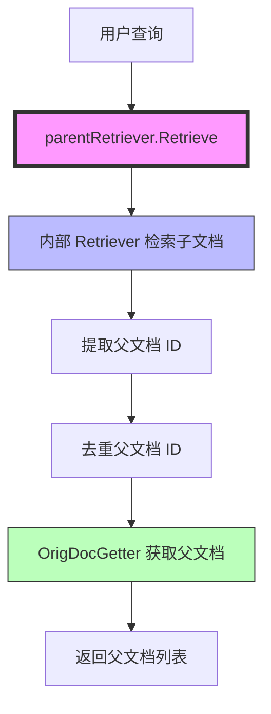

# Parent Document Retrieval Strategy 模块深度解析

## 1. 问题空间与模块定位

在检索增强生成（RAG）系统中，我们经常面临一个两难选择：是将文档切分成小块进行向量化以提高检索精度，还是保留完整文档以提供更丰富的上下文？`parent_document_retrieval_strategy` 模块正是为了解决这个矛盾而设计的。

想象一下图书馆的检索系统：如果你搜索"量子力学"，系统可能会先找到书中相关的章节或段落（子文档），但最终你需要的是整本书（父文档）来获得完整的理解。这个模块就扮演了这样的角色——它先通过子文档进行精确检索，然后回溯到原始的父文档，既保证了检索的准确性，又提供了完整的上下文信息。

## 2. 核心抽象与心理模型

这个模块的设计围绕着三个核心抽象展开：

- **子文档（Sub-document）**：用于检索的小块文本，通常是原始文档的切片，携带指向父文档的引用
- **父文档（Parent Document）**：原始的完整文档，包含丰富的上下文信息
- **检索桥接（Retrieval Bridge）**：连接子文档检索和父文档获取的机制

心理模型可以类比为"索引-图书"系统：
1. 索引卡片（子文档）包含关键词和指向图书的编号
2. 读者通过索引卡片快速找到相关内容
3. 然后根据编号获取完整的图书（父文档）进行阅读

## 3. 架构与数据流程

让我们通过 Mermaid 图表来理解这个模块的架构和数据流程：



### 数据流程详解

1. **入口调用**：用户调用 `parentRetriever.Retrieve` 方法，传入查询字符串和检索选项
2. **子文档检索**：`parentRetriever` 首先委托给内部的 `Retriever` 进行子文档检索
3. **父文档 ID 提取**：从检索到的子文档元数据中，根据 `ParentIDKey` 提取父文档 ID
4. **去重处理**：使用 `inList` 函数确保每个父文档 ID 只出现一次
5. **父文档获取**：通过 `OrigDocGetter` 函数批量获取完整的父文档
6. **结果返回**：将获取到的父文档列表返回给调用者

## 4. 核心组件深度解析

### 4.1 Config 结构体

`Config` 是模块的配置中心，它定义了父文档检索策略所需的所有依赖项。

```go
type Config struct {
    Retriever     retriever.Retriever
    ParentIDKey   string
    OrigDocGetter func(ctx context.Context, ids []string) ([]*schema.Document, error)
}
```

**设计意图**：
- **依赖注入模式**：通过配置结构体注入所有外部依赖，使得模块高度可测试和可定制
- **灵活组合**：`Retriever` 可以是任何实现了 `retriever.Retriever` 接口的组件，如向量数据库检索器、全文检索器等
- **扩展性**：`OrigDocGetter` 作为函数类型，允许用户自定义父文档的获取方式，可以是数据库查询、文件系统读取等

**参数详解**：
- `Retriever`：实际执行子文档检索的组件，是整个策略的"搜索眼睛"
- `ParentIDKey`：子文档元数据中存储父文档 ID 的键名，是连接子文档和父文档的"桥梁"
- `OrigDocGetter`：根据 ID 获取父文档的函数，是获取完整上下文的"最后一公里"

### 4.2 parentRetriever 结构体

`parentRetriever` 是模块的核心实现，它封装了父文档检索的完整逻辑。

```go
type parentRetriever struct {
    retriever     retriever.Retriever
    parentIDKey   string
    origDocGetter func(ctx context.Context, ids []string) ([]*schema.Document, error)
}
```

**设计意图**：
- **组合优于继承**：通过组合而不是继承来扩展检索功能，遵循了 Go 语言的惯用法
- **接口一致性**：实现了 `retriever.Retriever` 接口，使得它可以与其他检索器互换使用
- **状态封装**：将配置参数作为私有字段封装，确保内部状态的安全性

### 4.3 Retrieve 方法

`Retrieve` 方法是模块的核心业务逻辑实现，它 orchestrate 了从子文档检索到父文档获取的完整流程。

```go
func (p *parentRetriever) Retrieve(ctx context.Context, query string, opts ...retriever.Option) ([]*schema.Document, error) {
    subDocs, err := p.retriever.Retrieve(ctx, query, opts...)
    if err != nil {
        return nil, err
    }
    ids := make([]string, 0, len(subDocs))
    for _, subDoc := range subDocs {
        if k, ok := subDoc.MetaData[p.parentIDKey]; ok {
            if s, okk := k.(string); okk && !inList(s, ids) {
                ids = append(ids, s)
            }
        }
    }
    return p.origDocGetter(ctx, ids)
}
```

**设计意图**：
- **装饰器模式**：在不改变原有检索器行为的前提下，增强了其功能
- **流水线处理**：将检索过程分解为多个清晰的步骤，每个步骤职责单一
- **防御性编程**：对元数据的类型进行检查，避免类型断言失败导致的 panic

**关键逻辑解析**：
1. 首先委托内部检索器获取子文档
2. 遍历子文档，提取并验证父文档 ID
3. 使用 `inList` 函数进行去重，避免重复获取相同的父文档
4. 最后调用 `OrigDocGetter` 获取完整的父文档

### 4.4 inList 辅助函数

`inList` 是一个简单但重要的辅助函数，用于检查字符串是否已存在于列表中。

```go
func inList(elem string, list []string) bool {
    for _, v := range list {
        if v == elem {
            return true
        }
    }
    return false
}
```

**设计意图**：
- **简单实用**：对于小规模数据，线性搜索是最简单且有效的方式
- **避免依赖**：不引入额外的数据结构（如 map），保持代码的简洁性

**性能考虑**：
- 时间复杂度：O(n²)，在子文档数量较多时可能成为瓶颈
- 优化空间：如果预期子文档数量很大，可以考虑使用 map 来提高去重效率

## 5. 依赖关系分析

### 5.1 模块依赖

该模块依赖以下核心组件：

- **retriever.Retriever** ([retriever options and callback payloads](../components_core-embedding_indexing_and_retrieval_primitives-retriever_options_and_callback_payloads.md))：定义了检索器的通用接口
- **schema.Document** ([document schema](../schema_models_and_streams-document_schema.md))：定义了文档的数据结构

### 5.2 调用关系

```
parentRetriever 
├── 调用 → retriever.Retriever.Retrieve (子文档检索)
└── 调用 → OrigDocGetter (父文档获取)
```

### 5.3 契约与假设

该模块对其依赖项有以下隐式契约：

1. **子文档元数据契约**：子文档必须在元数据中包含 `ParentIDKey` 指定的字段，且该字段必须是字符串类型
2. **OrigDocGetter 契约**：该函数必须能够处理可能重复的 ID（尽管模块已进行去重），并按 ID 顺序返回对应的文档
3. **错误处理契约**：内部检索器和 OrigDocGetter 的错误会直接向上传播，不进行重试或降级处理

## 6. 设计决策与权衡

### 6.1 组合 vs 继承

**决策**：使用组合而非继承来扩展检索功能

**理由**：
- Go 语言没有类继承，只有接口和组合
- 组合提供了更大的灵活性，可以在运行时更换内部检索器
- 符合"组合优于继承"的设计原则

**权衡**：
- ✅ 优点：灵活性高，易于测试，符合 Go 惯用法
- ❌ 缺点：需要编写更多的样板代码来转发接口方法

### 6.2 简单去重 vs 高效去重

**决策**：使用简单的线性搜索进行去重

**理由**：
- 对于大多数 RAG 场景，检索到的子文档数量通常不会太大（几十到几百个）
- 线性搜索实现简单，代码可读性好
- 避免了使用 map 带来的额外内存开销

**权衡**：
- ✅ 优点：实现简单，内存效率高，小数据量下性能足够
- ❌ 缺点：大数据量下性能可能成为瓶颈

**优化建议**：
如果预期子文档数量很大（如数千个），可以考虑以下优化：
```go
func uniqueIDs(ids []string) []string {
    seen := make(map[string]bool, len(ids))
    result := make([]string, 0, len(ids))
    for _, id := range ids {
        if !seen[id] {
            seen[id] = true
            result = append(result, id)
        }
    }
    return result
}
```

### 6.3 直接返回 vs 保留子文档信息

**决策**：直接返回父文档，不保留子文档信息

**理由**：
- 简化 API，返回结果与普通检索器一致
- 常见场景下，用户只需要父文档
- 符合"关注点分离"原则，模块只负责父文档检索

**权衡**：
- ✅ 优点：API 简洁，使用方便
- ❌ 缺点：丢失了子文档的相关性评分等信息

**扩展方向**：
如果需要保留子文档信息，可以考虑扩展返回结果的数据结构，或者使用回调机制来传递额外信息。

## 7. 使用指南与最佳实践

### 7.1 基本使用示例

```go
// 创建内部检索器（例如 Milvus 向量检索器）
milvusRetriever := createMilvusRetriever()

// 创建父文档检索器
parentRetriever, err := parent.NewRetriever(ctx, &parent.Config{
    Retriever:     milvusRetriever,
    ParentIDKey:   "source_doc_id",
    OrigDocGetter: func(ctx context.Context, ids []string) ([]*schema.Document, error) {
        // 从数据库或文件系统获取父文档
        return documentStore.GetByIDs(ctx, ids)
    },
})
if err != nil {
    // 处理错误
}

// 使用父文档检索器
docs, err := parentRetriever.Retrieve(ctx, "如何使用 Go 语言构建 RAG 系统")
```

### 7.2 配置最佳实践

1. **ParentIDKey 的选择**：
   - 使用具有语义的键名，如 "source_document_id" 或 "parent_doc_id"
   - 确保在整个系统中保持一致
   - 避免使用可能与其他元数据键冲突的名称

2. **OrigDocGetter 的实现**：
   - 实现批量获取以提高效率
   - 添加适当的缓存机制，避免重复获取相同文档
   - 处理部分失败的情况（例如，某些 ID 对应的文档不存在）

3. **错误处理**：
   - 妥善处理 `NewRetriever` 的错误，确保所有必需的依赖项都已提供
   - 考虑在 `OrigDocGetter` 中实现重试逻辑，特别是在网络调用的情况下

### 7.3 测试策略

由于模块采用了依赖注入模式，测试变得相对简单：

```go
// 创建 mock 检索器
mockRetriever := &MockRetriever{
    Documents: []*schema.Document{
        {
            Content: "子文档内容",
            MetaData: map[string]any{
                "source_doc_id": "doc_123",
            },
        },
    },
}

// 创建测试用的父文档获取器
testDocGetter := func(ctx context.Context, ids []string) ([]*schema.Document, error) {
    // 返回测试用的父文档
    return []*schema.Document{
        {
            Content: "完整的父文档内容...",
            ID:      "doc_123",
        },
    }, nil
}

// 创建父文档检索器
retriever, err := parent.NewRetriever(ctx, &parent.Config{
    Retriever:     mockRetriever,
    ParentIDKey:   "source_doc_id",
    OrigDocGetter: testDocGetter,
})

// 执行测试
docs, err := retriever.Retrieve(ctx, "测试查询")
// 验证结果...
```

## 8. 边缘情况与陷阱

### 8.1 常见陷阱

1. **忘记设置 ParentIDKey**：
   - 虽然 `ParentIDKey` 不是 `NewRetriever` 的强制参数，但如果不设置，将无法提取父文档 ID
   - 结果是返回空文档列表，且没有明确的错误提示

2. **元数据类型不匹配**：
   - 如果 `ParentIDKey` 对应的元数据不是字符串类型，会被静默忽略
   - 这可能导致调试困难，建议在文档处理阶段确保类型正确

3. **OrigDocGetter 返回顺序不一致**：
   - 虽然当前实现不依赖返回顺序，但某些扩展场景可能需要
   - 建议确保 `OrigDocGetter` 按照输入 ID 的顺序返回文档

### 8.2 边缘情况处理

1. **没有找到任何子文档**：
   - 行为：返回空文档列表，没有错误
   - 这是正常行为，符合检索器的预期行为

2. **部分子文档没有 ParentIDKey**：
   - 行为：这些子文档会被忽略，只处理有 ParentIDKey 的子文档
   - 设计决策：静默处理而不是报错，以提高鲁棒性

3. **OrigDocGetter 找不到某些 ID 对应的文档**：
   - 行为：取决于 `OrigDocGetter` 的实现
   - 建议：`OrigDocGetter` 应该只返回找到的文档，或者明确报告缺失的文档

4. **重复的父文档 ID**：
   - 行为：通过 `inList` 函数去重，确保每个父文档只获取一次
   - 注意：去重是基于字符串匹配的，确保 ID 的一致性

## 9. 总结与回顾

`parent_document_retrieval_strategy` 模块通过优雅的设计解决了 RAG 系统中检索精度和上下文完整性之间的矛盾。它的核心价值在于：

1. **组合设计**：通过组合而非继承来扩展功能，保持了高度的灵活性
2. **依赖注入**：通过配置结构体注入所有依赖，使得模块易于测试和定制
3. **简单高效**：在满足常见场景需求的前提下，保持了实现的简洁性

作为新加入团队的工程师，理解这个模块的设计思想和实现细节，将帮助你更好地构建和优化 RAG 系统。记住，好的设计往往不是做最复杂的事情，而是在恰当的地方做恰当的权衡。
