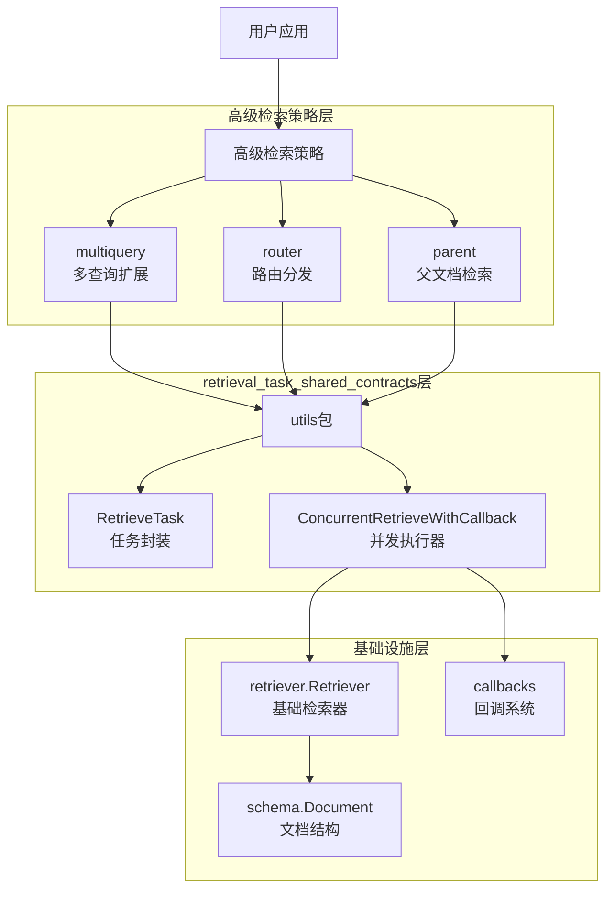

# retrieval_task_shared_contracts 模块技术深度解析

## 1. 模块概览

**retrieval_task_shared_contracts** 模块（代码位置：`flow/retriever/utils`）是整个检索策略框架的基础设施层。它解决了高级检索策略（如 [multiquery](flow_agents_and_retrieval-retriever_strategies_and_routing-multiquery_query_expansion_retriever.md)、[router](flow_agents_and_retrieval-retriever_strategies_and_routing-router_based_retriever_dispatch.md)、parent）中一个共同的核心问题：**如何安全、高效、一致地执行多个并发检索任务，同时保持完整的可观测性和错误处理机制**。

想象一下，当你需要同时向多个数据源发起查询请求时（比如用不同的查询词查询同一个索引，或者用同一个查询词查询不同的索引），你需要处理并发控制、错误恢复、回调集成等问题。这个模块就提供了一个标准化的"任务包"和"执行引擎"，让上层策略可以专注于业务逻辑，而不是底层并发细节。

## 2. 核心问题与设计思路

### 2.1 为什么需要这个模块？

在没有这个模块之前，每个高级检索策略都需要自己处理：
1. **并发执行**：如何启动多个 goroutine 并等待它们完成
2. **错误处理**：如何捕获 panic、传播错误、处理部分失败
3. **回调集成**：如何在检索的各个阶段（开始、结束、错误）触发回调
4. **结果收集**：如何将多个检索任务的结果收集和整理

这导致了代码重复，且每个实现可能有不同的错误处理和回调行为，造成不一致的用户体验。

### 2.2 核心设计思路

这个模块采用了"**任务对象化 + 共享执行器**"的设计模式：
- 将单次检索操作封装为一个 `RetrieveTask` 对象，包含执行所需的所有信息和执行结果
- 提供一个通用的 `ConcurrentRetrieveWithCallback` 函数来执行这些任务
- 所有任务共享同一套并发控制、错误处理和回调机制

## 3. 架构与数据流

下面是这个模块在整个检索策略生态系统中的位置和数据流：



**数据流向详解**：
1. 上层策略（如 multiquery、router）创建多个 `RetrieveTask` 对象
2. 将这些任务传递给 `ConcurrentRetrieveWithCallback` 函数
3. 该函数启动多个 goroutine 并发执行任务
4. 每个任务在执行过程中会触发适当的回调
5. 执行结果（文档或错误）填充回 `RetrieveTask` 对象
6. 上层策略收集并处理这些结果

## 4. 核心组件深度解析

### 4.1 RetrieveTask 结构体

```go
type RetrieveTask struct {
    Name            string
    Retriever       retriever.Retriever
    Query           string
    RetrieveOptions []retriever.Option
    Result          []*schema.Document
    Err             error
}
```

**设计意图**：
`RetrieveTask` 不仅仅是一个数据容器，它是一个"**自包含的执行单元**"。这种设计有几个关键好处：

1. **输入输出合一**：同一个对象既包含执行所需的所有参数，也用于存储执行结果
2. **便于追踪**：通过 `Name` 字段可以给任务打上标签，便于调试和结果关联
3. **状态可见**：上层策略可以在任务执行后检查 `Result` 和 `Err` 字段来获取结果

**字段详解**：
- `Name`：任务的标识符，在 router 策略中用于将结果与特定检索器关联
- `Retriever`：实际执行检索的组件，满足 `retriever.Retriever` 接口
- `Query`：检索查询字符串
- `RetrieveOptions`：传递给检索器的选项
- `Result`：存储成功检索到的文档
- `Err`：存储检索过程中发生的错误

### 4.2 ConcurrentRetrieveWithCallback 函数

这是模块的核心功能，它的实现体现了几个重要的设计考量：

```go
func ConcurrentRetrieveWithCallback(ctx context.Context, tasks []*RetrieveTask) {
    wg := sync.WaitGroup{}
    for i := range tasks {
        wg.Add(1)
        go func(ctx context.Context, t *RetrieveTask) {
            ctx = ctxWithRetrieverRunInfo(ctx, t.Retriever)

            defer func() {
                if e := recover(); e != nil {
                    t.Err = fmt.Errorf("retrieve panic, query: %s, error: %v", t.Query, e)
                    ctx = callbacks.OnError(ctx, t.Err)
                }
                wg.Done()
            }()

            ctx = callbacks.OnStart(ctx, t.Query)
            docs, err := t.Retriever.Retrieve(ctx, t.Query, t.RetrieveOptions...)
            if err != nil {
                callbacks.OnError(ctx, err)
                t.Err = err
                return
            }

            callbacks.OnEnd(ctx, docs)
            t.Result = docs
        }(ctx, tasks[i])
    }
    wg.Wait()
}
```

**关键设计点解析**：

1. **并发控制**：使用 `sync.WaitGroup` 确保所有任务完成后函数才返回
2. **闭包参数捕获**：注意 `go func(ctx context.Context, t *RetrieveTask)` 的写法，显式传递参数避免了循环变量捕获的常见陷阱
3. **Panic 恢复**：通过 `defer` 和 `recover()` 确保单个任务的 panic 不会导致整个程序崩溃
4. **回调链集成**：
   - 在执行前设置检索器运行信息
   - 触发 `OnStart` 回调
   - 执行检索
   - 根据结果触发 `OnError` 或 `OnEnd` 回调
   - panic 时也会触发 `OnError`
5. **错误处理**：采用"失败即记录"策略，不中断其他任务的执行，让上层策略决定如何处理部分失败

### 4.3 ctxWithRetrieverRunInfo 辅助函数

```go
func ctxWithRetrieverRunInfo(ctx context.Context, r retriever.Retriever) context.Context {
    runInfo := &callbacks.RunInfo{
        Component: components.ComponentOfRetriever,
    }

    if typ, okk := components.GetType(r); okk {
        runInfo.Type = typ
    }

    runInfo.Name = runInfo.Type + string(runInfo.Component)

    return callbacks.ReuseHandlers(ctx, runInfo)
}
```

这个函数确保回调系统知道当前执行的组件类型和信息，是可观测性的关键部分。

## 5. 依赖关系分析

### 5.1 被依赖模块（输入）

这个模块依赖以下核心组件：

1. **retriever.Retriever**：
   - 这是整个检索系统的基础接口
   - 定义了 `Retrieve(ctx context.Context, query string, opts ...Option) ([]*schema.Document, error)` 方法
   - `RetrieveTask` 持有这个接口的实例

2. **callbacks**：
   - 提供了 `OnStart`、`OnEnd`、`OnError` 等回调函数
   - 用于在检索的各个生命周期点插入自定义逻辑
   - 是可观测性和调试的关键

3. **schema.Document**：
   - 定义了检索结果的结构
   - 包含 ID、Content 和 MetaData 等字段

### 5.2 依赖此模块的模块（输出）

从代码中可以看到，这个模块被以下高级检索策略使用：

1. **[multiquery](flow_agents_and_retrieval-retriever_strategies_and_routing-multiquery_query_expansion_retriever.md)**：
   - 生成多个查询变体
   - 为每个查询创建一个 `RetrieveTask`
   - 收集所有结果后进行去重融合

2. **[router](flow_agents_and_retrieval-retriever_strategies_and_routing-router_based_retriever_dispatch.md)**：
   - 选择合适的检索器
   - 为每个选中的检索器创建一个带名称的 `RetrieveTask`
   - 使用名称将结果组织成 map 后进行融合

3. **parent**（推测用法类似）

## 6. 设计权衡与决策

### 6.1 同步 vs 异步设计

**决策**：`ConcurrentRetrieveWithCallback` 是一个同步阻塞函数，它会等待所有任务完成后才返回。

**原因**：
- 简化上层策略的逻辑，不需要处理异步结果
- 符合大多数检索场景的需求（用户通常需要等待所有结果返回）
- 如果需要异步，可以在上层再包装一层

**替代方案**：返回一个 channel 或 future，但这会增加使用复杂度。

### 6.2 错误处理策略

**决策**：单个任务的错误只影响该任务，不中断其他任务，也不直接返回错误。

**原因**：
- 给上层策略最大的灵活性，可以选择忽略错误、部分重试或完全失败
- 在 router 场景中，可能某些检索器失败但其他检索器成功，仍然可以返回有用结果

**隐含契约**：上层策略必须负责检查每个任务的 `Err` 字段。

### 6.3 任务对象的可变性

**决策**：`RetrieveTask` 的 `Result` 和 `Err` 字段是公开可写的。

**原因**：
- 简化实现，不需要通过方法来设置结果
- 允许上层策略在需要时修改结果

**风险**：可能导致意外的数据竞争，但在当前使用模式下，任务创建后只会被一个 goroutine 写入。

## 7. 使用指南与最佳实践

### 7.1 基本使用模式

```go
// 1. 创建任务
tasks := []*utils.RetrieveTask{
    {
        Name:      "retriever1",
        Retriever: myRetriever,
        Query:     "query1",
    },
    {
        Name:      "retriever2", 
        Retriever: anotherRetriever,
        Query:     "query2",
    },
}

// 2. 并发执行
utils.ConcurrentRetrieveWithCallback(ctx, tasks)

// 3. 处理结果
for _, task := range tasks {
    if task.Err != nil {
        // 处理错误
        log.Printf("Task %s failed: %v", task.Name, task.Err)
        continue
    }
    // 使用结果
    processDocuments(task.Result)
}
```

### 7.2 与上层策略的集成

从 multiquery 和 router 的实现中，我们可以看到一个清晰的模式：

```go
func (s *SomeStrategy) Retrieve(ctx context.Context, query string, opts ...retriever.Option) ([]*schema.Document, error) {
    // 1. 准备阶段：生成查询或选择检索器
    // ...
    
    // 2. 创建任务
    tasks := make([]*utils.RetrieveTask, n)
    // ... 填充 tasks
    
    // 3. 并发检索
    utils.ConcurrentRetrieveWithCallback(ctx, tasks)
    
    // 4. 检查错误
    for _, task := range tasks {
        if task.Err != nil {
            return nil, task.Err // 或选择其他错误处理策略
        }
    }
    
    // 5. 结果融合
    // ...
    
    return fusedResults, nil
}
```

## 8. 注意事项与潜在陷阱

### 8.1 Context 传播

注意 `ConcurrentRetrieveWithCallback` 是如何处理 context 的：
- 它将同一个 context 传递给所有任务
- 这意味着如果 context 被取消，所有正在进行的任务都会收到取消信号

### 8.2 并发安全性

虽然 `RetrieveTask` 的字段是公开的，但在使用时应该遵循：
- 创建任务后，不要从多个 goroutine 同时修改同一个任务
- 任务的 `Result` 和 `Err` 字段只应由执行该任务的 goroutine 写入

### 8.3 错误处理的责任

`ConcurrentRetrieveWithCallback` 不会返回错误，也不会因为单个任务失败而停止。检查和处理错误完全是调用者的责任。

### 8.4 回调的执行顺序

每个任务的回调是独立执行的，但由于并发，不同任务的回调可能会交错执行。回调处理函数应该是并发安全的。

## 9. 总结

**retrieval_task_shared_contracts** 模块是一个典型的"**基础设施关注点提取**"的例子。它将多个高级检索策略中重复的并发执行、错误处理和回调集成逻辑提取出来，形成了一个共享的、一致的、可靠的底层设施。

这个模块虽然代码量不大，但它的设计体现了几个重要的软件工程原则：
- **关注点分离**：上层策略关注业务逻辑，底层模块关注并发基础设施
- **不要重复自己（DRY）**：消除了多个策略中的重复代码
- **容错设计**：通过 panic 恢复和细致的错误处理提高了系统的韧性
- **可观测性**：完整的回调集成使得系统行为可追踪和可调试

对于新加入团队的开发者，理解这个模块将帮助你更好地理解整个检索策略框架是如何构建的，以及如何在自己的代码中应用类似的设计模式。

