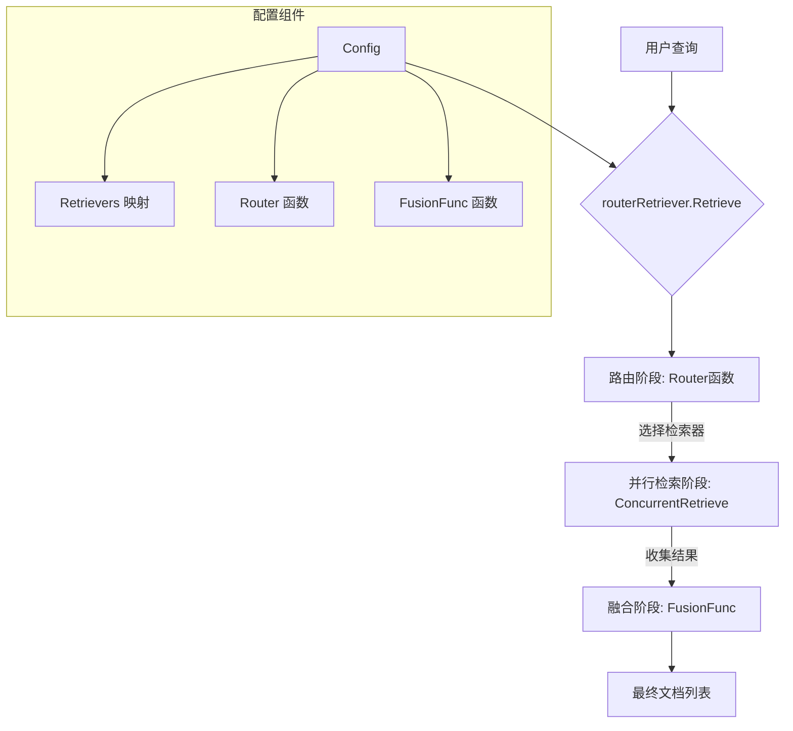

# router\_based\_retriever\_dispatch 模块技术深度解析

## 1. 模块概览与问题解决

在构建复杂的检索增强生成（RAG）系统时，单一检索器往往无法满足所有场景的需求。不同的检索器可能具有不同的特性：有的擅长语义检索，有的处理关键词匹配更好，有的可能针对特定领域数据进行了优化。当我们需要综合利用多个检索器的优势时，就会面临几个核心问题：

1. **路由决策**：如何根据查询内容智能选择合适的检索器组合？
2. **并行执行**：如何高效地同时调用多个检索器而不引入不必要的复杂性？
3. **结果融合**：如何将不同检索器返回的文档合并、去重并重新排序，形成统一的最终结果？

**router\_based\_retriever\_dispatch** 模块正是为了解决这些问题而设计的。它提供了一个灵活的框架，允许你：
- 配置多个不同的检索器
- 通过自定义路由函数决定使用哪些检索器
- 使用融合策略（默认为 RRF 算法）合并和重排结果

这个模块的设计理念类似于一个"检索器交响乐团的指挥"——它不直接演奏乐器，而是协调各个乐器（检索器），根据乐谱（查询）选择合适的演奏者，并将他们的演奏融合成和谐的整体。

## 2. 核心架构与数据流程

### 2.1 架构图示



### 2.2 数据流程详解

当调用 `routerRetriever.Retrieve` 时，数据会经历三个主要阶段：

1. **路由阶段**：首先调用配置的 `Router` 函数，传入用户查询，返回应该使用的检索器名称列表。这个阶段的作用是根据查询内容智能选择合适的检索器。

2. **并行检索阶段**：根据路由结果，创建相应的检索任务，并通过 `utils.ConcurrentRetrieveWithCallback` 并行执行这些任务。这个阶段的设计非常关键——它通过并发执行减少了整体延迟，同时将并发逻辑封装在工具函数中，保持了核心代码的简洁性。

3. **融合阶段**：收集所有检索器的结果后，调用 `FusionFunc` 函数将不同来源的文档合并、去重并重新排序。默认使用的是 RRF（Reciprocal Rank Fusion）算法，这是一种在信息检索领域广泛使用的结果融合方法。

整个过程中，模块还通过 `callbacks` 包提供了详细的回调支持，允许监控和记录每个阶段的执行情况。

## 3. 核心组件深度解析

### 3.1 Config 结构体

```go
type Config struct {
    Retrievers map[string]retriever.Retriever
    Router func(ctx context.Context, query string) ([]string, error)
    FusionFunc func(ctx context.Context, result map[string][]*schema.Document) ([]*schema.Document, error)
}
```

**设计意图**：
- `Retrievers` 使用 map 而不是 slice，是为了通过名称快速查找检索器，这在路由阶段非常重要。
- `Router` 和 `FusionFunc` 都设计为函数类型，这体现了"策略模式"的思想——允许用户自定义核心行为，而不是将其硬编码在模块中。

**关键设计决策**：
- `Router` 是可选的。如果未提供，默认会使用所有注册的检索器。这种设计降低了使用门槛，特别是在简单场景下。
- `FusionFunc` 同样是可选的，默认使用内置的 RRF 算法。这既满足了常见需求，又为高级用户提供了自定义空间。

### 3.2 routerRetriever 结构体

```go
type routerRetriever struct {
    retrievers map[string]retriever.Retriever
    router     func(ctx context.Context, query string) ([]string, error)
    fusionFunc func(ctx context.Context, result map[string][]*schema.Document) ([]*schema.Document, error)
}
```

这个结构体是整个模块的核心，它实现了 `retriever.Retriever` 接口，因此可以像普通检索器一样使用。

**设计要点**：
- 它持有三个核心组件，但并不负责创建它们——所有依赖都通过 `Config` 从外部注入。这种依赖注入的设计使得模块更加灵活，也更容易进行单元测试。
- 它不直接处理并发逻辑，而是委托给 `utils.ConcurrentRetrieveWithCallback`。这种关注点分离是良好设计的体现。

### 3.3 Retrieve 方法

这是模块的主要入口点，让我们分析其内部工作机制：

```go
func (e *routerRetriever) Retrieve(ctx context.Context, query string, opts ...retriever.Option) ([]*schema.Document, error)
```

**执行流程**：

1. **路由执行与回调**：
   - 创建带有路由运行信息的上下文
   - 触发 `OnStart` 回调
   - 调用路由函数获取检索器列表
   - 处理路由错误或空结果的情况
   - 触发 `OnEnd` 回调

2. **任务创建与并行检索**：
   - 根据路由结果创建检索任务列表
   - 验证每个检索器名称是否存在（重要的安全检查）
   - 调用 `utils.ConcurrentRetrieveWithCallback` 并行执行
   - 收集结果并检查错误

3. **结果融合与回调**：
   - 创建带有融合运行信息的上下文
   - 触发融合阶段的 `OnStart` 回调
   - 调用融合函数处理结果
   - 处理融合错误
   - 触发 `OnEnd` 回调并返回最终结果

**设计亮点**：
- 每个阶段都有独立的回调上下文，这使得监控和调试变得更加容易。
- 错误处理非常细致——在每个可能失败的地方都有适当的错误处理和回调通知。
- 检索选项 `opts` 被传递给所有检索器，确保了行为的一致性。

### 3.4 默认 RRF 融合函数

```go
var rrf = func(ctx context.Context, result map[string][]*schema.Document) ([]*schema.Document, error) {
    // ...
}
```

这个内置的融合函数实现了 RRF（Reciprocal Rank Fusion）算法，这是一种简单但有效的结果融合方法。

**算法原理**：
- 对于每个文档，计算其在每个检索器结果中的排名位置 i
- 使用公式 1/(i+60) 计算该文档在这个排名下的得分（60 是一个常用的常数）
- 将文档在所有检索器中的得分相加，得到总得分
- 按总得分降序排序文档

**设计选择**：
- 常数 60 的选择是一个经验值，它平衡了前排位置和后排位置的重要性。
- 使用文档 ID 作为去重键，这假设不同检索器返回的同一文档具有相同的 ID——这是一个重要的隐含契约。

## 4. 依赖关系分析

### 4.1 输入依赖

这个模块依赖于几个关键的外部组件：

1. **retriever.Retriever 接口**：
   - 这是模块的核心依赖，所有注册的检索器都必须实现这个接口。
   - 模块假设这个接口的 `Retrieve` 方法是线程安全的，因为它们会被并发调用。

2. **utils.ConcurrentRetrieveWithCallback**：
   - 虽然我们没有看到这个函数的具体实现，但从使用方式可以推断，它负责管理并行检索任务的执行。
   - 模块依赖它来处理并发逻辑、错误传播和回调通知。

3. **callbacks 包**：
   - 用于在各个执行阶段触发回调，这对于监控和调试非常重要。
   - 模块假设回调函数的执行是轻量级的，不会显著影响性能。

4. **schema.Document**：
   - 表示检索到的文档，模块假设它有一个唯一的 `ID` 字段用于去重。

### 4.2 被依赖情况

从模块树可以看出，这个模块位于 `flow_agents_and_retrieval/retriever_strategies_and_routing` 下，很可能被上层的检索策略或 RAG 流程所使用。由于它实现了标准的 `retriever.Retriever` 接口，它可以无缝地融入任何使用该接口的系统中。

## 5. 设计决策与权衡

### 5.1 函数类型依赖 vs 接口依赖

**决策**：使用函数类型（`Router`、`FusionFunc`）而不是定义接口。

**权衡分析**：
- ✅ **优点**：更加灵活，用户可以直接传递函数或闭包，不需要定义新的类型。
- ✅ **优点**：对于简单的逻辑，函数类型更加简洁和直接。
- ❌ **缺点**：对于复杂的逻辑，接口可能更加清晰，特别是当需要维护状态时。
- ❌ **缺点**：函数类型的自我文档化能力较弱，需要通过注释来解释期望的行为。

这个选择在这个场景下是合理的，因为路由和融合逻辑通常是无状态的，而且函数类型提供了最大的灵活性。

### 5.2 同步 API vs 异步 API

**决策**：提供同步的 `Retrieve` 方法，但内部使用并行执行。

**权衡分析**：
- ✅ **优点**：同步 API 更容易使用，符合 `retriever.Retriever` 接口的期望。
- ✅ **优点**：内部并行化对调用者透明，简化了使用。
- ❌ **缺点**：调用者无法控制并行执行的细节（如超时、取消特定子任务等）。
- ❌ **缺点**：在某些情况下，隐藏的并行性可能导致资源争用问题。

这个设计体现了"简单的事情简单做，复杂的事情可能做"的原则——对于大多数用户，同步 API 就足够了；对于需要更细粒度控制的用户，他们可能需要直接使用底层的并发工具。

### 5.3 Map 配置 vs 有序列表配置

**决策**：使用 `map[string]retriever.Retriever` 而不是有序列表。

**权衡分析**：
- ✅ **优点**：通过名称快速查找，这对路由阶段至关重要。
- ✅ **优点**：明确的名称-检索器映射，使得配置更加清晰。
- ❌ **缺点**：Go 的 map 是无序的，这在默认使用所有检索器时可能导致不确定的行为（尽管 RRF 算法会 mitigate 这个问题）。
- ❌ **缺点**：用户必须为每个检索器提供唯一的名称，增加了一点配置负担。

这个选择是合理的，因为路由功能本质上需要通过名称来选择检索器。

### 5.4 错误处理策略：快速失败 vs 部分结果

**决策**：如果任何检索器失败，整个操作失败。

**权衡分析**：
- ✅ **优点**：简单明确，调用者要么得到完整的结果，要么得到错误。
- ✅ **优点**：避免了部分结果可能导致的误导性回答。
- ❌ **缺点**：在某些场景下，即使部分检索器失败，使用剩余检索器的结果可能比完全失败更好。
- ❌ **缺点**：没有提供降级策略的配置选项。

这个设计选择偏向于正确性而不是可用性，但如果需要，未来可以考虑添加一个配置选项来允许部分失败。

## 6. 使用指南与最佳实践

### 6.1 基本使用

```go
// 创建多个检索器
bm25Retriever := createBM25Retriever()
semanticRetriever := createSemanticRetriever()

// 配置路由检索器
routerRetriever, err := router.NewRetriever(ctx, &router.Config{
    Retrievers: map[string]retriever.Retriever{
        "bm25":     bm25Retriever,
        "semantic": semanticRetriever,
    },
    // 可选：自定义路由函数
    Router: func(ctx context.Context, query string) ([]string, error) {
        // 简单示例：根据查询长度选择检索器
        if len(query) < 10 {
            return []string{"bm25"}, nil
        }
        return []string{"bm25", "semantic"}, nil
    },
    // 可选：自定义融合函数
    FusionFunc: customFusionFunc,
})

// 使用路由检索器，就像使用普通检索器一样
docs, err := routerRetriever.Retrieve(ctx, "如何使用 Eino 构建智能体")
```

### 6.2 路由函数设计考虑

设计路由函数时，有几个关键点需要考虑：

1. **性能**：路由函数会在每次检索时调用，应该保持轻量级。
2. **错误处理**：路由函数的错误会导致整个检索失败，应该适当处理边缘情况。
3. **上下文使用**：路由函数接收 `context.Context`，可以用于超时控制或传递元数据。

一个好的路由函数可能会使用轻量级的分类器、关键词匹配，或者甚至是一个小型的语言模型来做决策。

### 6.3 融合函数设计考虑

自定义融合函数时，应该记住：

1. **去重**：确保处理不同检索器返回相同文档的情况。
2. **排名信息**：利用每个检索器中的排名信息，这通常是有价值的信号。
3. **文档来源**：可能需要考虑不同检索器的可信度，给更可靠的检索器更高的权重。

### 6.4 最佳实践

1. **始终验证检索器名称**：
   - 确保路由函数返回的所有检索器名称都在 `Retrievers` map 中。
   - 模块会对此进行检查，但提前验证可以提供更好的错误信息。

2. **注意文档 ID 的一致性**：
   - 确保不同检索器返回的同一文档具有相同的 ID。
   - 如果做不到这一点，可能需要自定义融合函数来处理去重逻辑。

3. **考虑添加监控**：
   - 使用回调机制来监控路由决策和检索性能。
   - 这对于调试和优化检索策略非常有价值。

4. **从简单开始**：
   - 刚开始时，可以使用默认的路由（使用所有检索器）和默认的 RRF 融合。
   - 只有在需要时才添加自定义逻辑。

## 7. 边缘情况与陷阱

### 7.1 检索器名称不一致

**问题**：路由函数返回的检索器名称不在 `Retrievers` map 中。

**后果**：整个检索失败，返回错误：`"router output[%s] has not registered"`。

**缓解**：
- 确保路由函数只返回已注册的检索器名称。
- 可以在路由函数内部添加验证逻辑，确保只返回有效的名称。

### 7.2 空路由结果

**问题**：路由函数返回空列表。

**后果**：整个检索失败，返回错误：`"no retriever has been selected"`。

**缓解**：
- 确保路由函数总是返回至少一个检索器。
- 考虑添加一个默认检索器，当没有其他合适的选择时使用。

### 7.3 文档 ID 不一致

**问题**：不同检索器返回的同一文档具有不同的 ID。

**后果**：默认的 RRF 融合函数不会将它们识别为同一文档，导致重复。

**缓解**：
- 确保所有检索器使用一致的 ID 方案。
- 如果做不到，自定义融合函数，使用其他属性（如 URL、内容哈希等）来识别重复文档。

### 7.4 检索器并发安全

**问题**：某个检索器的 `Retrieve` 方法不是并发安全的。

**后果**：可能导致数据竞争、不确定的行为或崩溃。

**缓解**：
- 确保所有注册的检索器都是并发安全的。
- 如果某个检索器不是并发安全的，可以考虑在它外面加一层包装，使用互斥锁来保护访问。

### 7.5 融合函数中的空结果

**问题**：自定义融合函数没有正确处理所有检索器都返回空结果的情况。

**后果**：可能导致恐慌或错误。

**缓解**：
- 确保自定义融合函数能够优雅地处理空输入。
- 参考默认的 RRF 函数的错误处理方式。

## 8. 总结

**router\_based\_retriever\_dispatch** 模块是一个设计精良的组件，它解决了多检索器系统中的路由、并行执行和结果融合问题。它的主要优势包括：

1. **灵活性**：通过函数类型的依赖，允许自定义核心行为。
2. **简洁性**：提供清晰的同步 API，隐藏内部的并发复杂性。
3. **可观察性**：通过回调机制提供详细的执行信息。
4. **标准兼容性**：实现标准的 `retriever.Retriever` 接口，易于集成。

虽然它有一些小的限制（如错误处理策略相对严格），但这些都是有意识的设计决策，在大多数场景下是合理的。对于需要构建复杂检索系统的开发者来说，这个模块提供了一个坚实的基础，可以根据具体需求进行扩展和定制。
