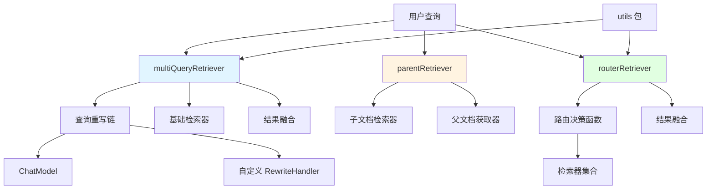

# retriever_strategies_and_routing 模块技术深度解析

## 模块概览

在构建智能检索系统时，开发者经常面临三个核心挑战：如何让查询更灵活以捕获更多相关文档？如何在检索细粒度片段的同时保持上下文的完整性？如何根据查询内容智能选择最合适的检索源？`retriever_strategies_and_routing` 模块正是为了解决这些问题而设计的。

这个模块提供了三种高级检索策略，它们可以独立使用，也可以组合在一起构建强大的检索管道：

1. **多查询扩展**：通过重写用户查询生成多个变体，提高召回率
2. **父文档检索**：先检索子文档片段，再获取完整的父文档上下文
3. **路由检索**：根据查询内容智能选择一个或多个检索器，并融合结果

这些策略都遵循相同的 `retriever.Retriever` 接口，使得它们可以像普通检索器一样被使用，同时提供更强大的功能。

## 核心概念与心智模型

理解这个模块的关键在于掌握**组合式检索器**的概念。每个高级检索器都不是直接与数据存储交互，而是**包装**一个或多个基础检索器，在其前后添加处理逻辑。你可以把它们想象成检索管道中的"中间件"：

```
用户查询 → [高级检索器包装层] → 基础检索器 → 数据存储
             ↓
          处理逻辑（查询扩展、路由决策等）
             ↓
          结果融合（去重、重排序等）
```

另一个重要的心智模型是**检索任务的分解与重组**：
- 多查询将一个查询分解为多个，并行执行后重组结果
- 父文档检索将检索过程分解为"找片段"和"取全文"两个步骤
- 路由检索将选择检索器的逻辑与执行检索的逻辑分离

## 架构与数据流

让我们通过一个 Mermaid 图来理解这个模块的整体架构：



这个图展示了三种检索策略的内部结构以及它们如何与 `utils` 包协作。接下来，我们将深入分析每个策略的数据流。

### 多查询检索器数据流

当用户调用 `multiQueryRetriever.Retrieve()` 时：

1. **查询重写阶段**：
   - 用户查询被送入预构建的 `queryRunner`（一个 compose.Chain）
   - 如果使用 LLM 重写，查询会被格式化到提示模板中，发送给 ChatModel
   - 如果使用自定义 `RewriteHandler`，则直接调用该函数
   - 输出被解析为多个查询变体

2. **并发检索阶段**：
   - 为每个查询变体创建一个 `utils.RetrieveTask`
   - 调用 `utils.ConcurrentRetrieveWithCallback()` 并行执行所有检索任务
   - 每个任务使用同一个基础检索器，但使用不同的查询

3. **结果融合阶段**：
   - 收集所有检索结果（是一个二维文档数组）
   - 调用 `fusionFunc` 进行融合（默认使用去重策略）
   - 返回最终的文档列表

### 父文档检索器数据流

`parentRetriever` 的数据流相对简单，但设计巧妙：

1. **子文档检索**：
   - 使用配置的基础检索器检索子文档片段
   - 这些子文档通常是文档的较小段落，便于更精确的语义匹配

2. **父文档 ID 提取**：
   - 遍历检索到的子文档，从 `MetaData` 中提取 `ParentIDKey` 指定的字段
   - 对提取出的父文档 ID 进行去重处理
   - 没有该字段的子文档会被忽略

3. **父文档获取**：
   - 调用 `OrigDocGetter` 函数，传入去重后的父文档 ID 列表
   - 返回获取到的完整父文档

这种设计的核心优势在于：它结合了子文档检索的精确性和父文档的上下文完整性。

### 路由检索器数据流

`routerRetriever` 是最灵活的策略，它的数据流如下：

1. **路由决策阶段**：
   - 调用 `Router` 函数，传入用户查询
   - `Router` 函数返回一个检索器名称列表
   - 如果没有提供自定义 `Router`，默认使用所有注册的检索器

2. **并发检索阶段**：
   - 为每个选定的检索器创建一个 `utils.RetrieveTask`
   - 调用 `utils.ConcurrentRetrieveWithCallback()` 并行执行
   - 所有任务使用相同的用户查询，但不同的检索器

3. **结果融合阶段**：
   - 收集结果到一个 map 中，key 是检索器名称，value 是该检索器返回的文档列表
   - 调用 `fusionFunc` 进行融合（默认使用 RRF 重排序策略）
   - 返回最终的文档列表

## 关键设计决策

### 1. 接口一致性 vs 功能丰富性

**决策**：所有高级检索器都实现标准的 `retriever.Retriever` 接口。

**分析**：
- **优势**：这使得高级检索器可以无缝替换任何使用基础检索器的地方，支持策略的组合（例如，你可以用一个 `multiQueryRetriever` 作为 `routerRetriever` 的子检索器）。
- **权衡**：一些高级功能（如多查询的中间结果）无法直接通过标准接口暴露，需要通过回调或配置来访问。

**替代方案**：定义扩展接口。但团队选择了保持接口简洁，因为他们相信"组合优于扩展"——通过组合不同的检索器，可以实现更复杂的功能，而不需要复杂的接口层次结构。

### 2. 并发执行 vs 顺序执行

**决策**：在多查询和路由检索中使用并发执行。

**分析**：
- **优势**：显著降低延迟，特别是当使用多个远程检索器时。
- **权衡**：增加了资源消耗，并且需要更复杂的错误处理（一个检索失败是否应该影响其他检索？当前实现选择了快速失败）。

**实现细节**：使用 `sync.WaitGroup` 管理并发，并通过 `utils.ConcurrentRetrieveWithCallback` 统一处理回调和 panic 恢复。

### 3. 默认策略的选择

**决策**：
- 多查询默认使用去重融合
- 路由检索默认使用 RRF（Reciprocal Rank Fusion）重排序

**分析**：
- 去重是多查询的最基本需求——多个查询很可能返回相同的文档
- RRF 是一种简单但有效的融合多个排序结果的方法，它不需要训练，对各种场景都有较好的鲁棒性

**RRF 公式**：
$$ RRF(d) = \sum_{r \in R} \frac{1}{k + rank_r(d)} $$
其中 $k$ 是一个常数（当前实现使用 60），$rank_r(d)$ 是文档 $d$ 在检索器 $r$ 结果中的排名。

### 4. 配置的灵活性

**决策**：提供多层级的配置选项，从简单的"开箱即用"到完全的自定义。

**分析**：
- 对于多查询：可以只提供 `OrigRetriever` 和 `RewriteLLM`，使用默认的提示模板和解析器；也可以完全自定义 `RewriteHandler`。
- 对于路由检索：可以只提供 `Retrievers` map，使用默认的全量路由和 RRF 融合；也可以自定义 `Router` 和 `FusionFunc`。

这种设计遵循了"约定优于配置"的原则，同时保留了完全的灵活性。

## 子模块概览

本模块包含四个子模块，每个子模块负责一个特定的功能领域：

- [multiquery_query_expansion_retriever](flow_agents_and_retrieval-retriever_strategies_and_routing-multiquery_query_expansion_retriever.md)：实现查询扩展策略，通过生成多个查询变体提高召回率。
- [parent_document_retrieval_strategy](flow_agents_and_retrieval-retriever_strategies_and_routing-parent_document_retrieval_strategy.md)：实现父子文档检索策略，在精确性和上下文完整性之间取得平衡。
- [router_based_retriever_dispatch](flow_agents_and_retrieval-retriever_strategies_and_routing-router_based_retriever_dispatch.md)：实现智能路由和结果融合，支持根据查询内容选择最合适的检索器。
- [retrieval_task_shared_contracts](flow_agents_and_retrieval-retriever_strategies_and_routing-retrieval_task_shared_contracts.md)：提供共享的任务抽象和并发执行工具，被其他子模块使用。

## 与其他模块的关系

`retriever_strategies_and_routing` 模块在整个系统中处于一个**策略层**的位置：

1. **依赖关系**：
   - 依赖 `components_core/embedding_indexing_and_retrieval_primitives` 中的 `retriever` 接口定义
   - 依赖 `compose_graph_engine` 中的 `compose.Chain` 用于构建查询重写管道
   - 依赖 `schema_models_and_streams` 中的 `schema.Document` 定义
   - 依赖 `callbacks_and_handler_templates` 提供可观测性支持

2. **被依赖关系**：
   - 可能被 `flow_agents_and_retrieval` 中的其他模块使用，用于构建更复杂的代理系统
   - 可能被 `adk_prebuilt_agents` 中的预构建代理使用

这种设计使得检索策略可以独立于具体的检索实现演进，同时保持良好的互操作性。

## 使用指南与注意事项

### 何时使用哪种策略？

- **使用多查询检索器**：当你的查询可能有多种表述方式，或者你希望提高召回率时。例如，用户可能问"如何搭建代理"，也可能问"代理构建教程"，多查询可以覆盖这些变体。
- **使用父文档检索器**：当你有长文档，希望检索到相关的片段，但最终需要给用户展示完整上下文时。例如，技术文档检索，找到相关段落，但展示整个章节。
- **使用路由检索器**：当你有多个数据源（如向量数据库、全文搜索引擎、知识图谱），希望根据查询内容选择合适的数据源时。

### 常见陷阱与注意事项

1. **多查询检索器的成本**：
   - 每次检索都会调用 LLM 多次（生成查询变体），注意成本控制
   - 设置合理的 `MaxQueriesNum`，避免生成过多查询
   - 考虑缓存查询重写结果，如果相同查询频繁出现

2. **父文档检索器的元数据约定**：
   - 确保你的子文档元数据中确实有 `ParentIDKey` 字段
   - 字段类型必须是 string，否则会被静默忽略
   - `OrigDocGetter` 需要能处理部分 ID 失效的情况（当前实现假设所有 ID 都有效）

3. **路由检索器的检索器名称匹配**：
   - `Router` 函数返回的名称必须与 `Retrievers` map 中的 key 完全匹配
   - 注意空返回的情况，会导致错误
   - 如果使用自定义 `FusionFunc`，注意处理某些检索器返回空结果的情况

4. **回调上下文的传递**：
   - 所有回调都使用了 `callbacks.ReuseHandlers`，确保回调处理器能正确传递
   - 如果你在回调中存储了上下文信息，注意并发安全

### 扩展点

所有三个检索器都设计了明确的扩展点：

- **多查询检索器**：自定义 `RewriteHandler` 或 `FusionFunc`
- **父文档检索器**：自定义 `OrigDocGetter`（虽然这是必需的配置项）
- **路由检索器**：自定义 `Router` 或 `FusionFunc`

此外，由于它们都实现了标准的 `retriever.Retriever` 接口，你可以轻松地创建自己的包装检索器，或者将它们组合在一起。

## 总结

`retriever_strategies_and_routing` 模块通过三种精心设计的检索策略，解决了智能检索系统中的常见挑战。它的核心理念是**组合式设计**——通过包装标准接口，在不改变原有检索器的情况下，为其添加强大的功能。

无论是提高召回率的多查询策略，平衡精确性和上下文的父文档策略，还是智能选择的路由策略，都体现了"简单接口，丰富实现"的设计哲学。这种设计使得模块既易于使用，又足够灵活，可以适应各种复杂的检索场景。
