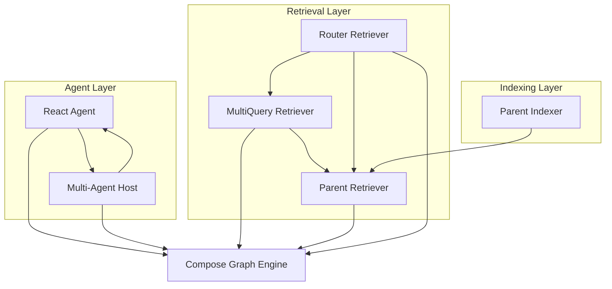
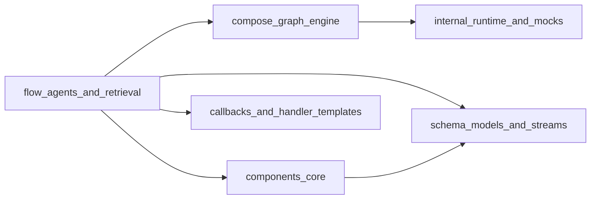

# flow_agents_and_retrieval 模块深度解析

## 模块概览

`flow_agents_and_retrieval` 模块是一个构建智能代理系统和检索增强生成(RAG)应用的核心组件库。它提供了两个关键功能：
1. **智能代理编排**：从简单的 ReAct 代理到复杂的多代理协作系统
2. **高级检索策略**：多种检索增强方法，包括多查询扩展、父文档检索和基于路由的检索

这个模块的核心设计理念是将复杂的代理行为和检索策略分解为可组合的组件，让开发者能够像搭积木一样构建强大的 AI 应用。

## 架构概览



这个架构图展示了模块的层次结构：
- **Agent Layer**：负责决策和行动，包括单个 ReAct 代理和协调多个专家的 Multi-Agent Host
- **Retrieval Layer**：提供多种检索策略，可以单独使用也可以组合使用
- **Indexing Layer**：为检索层准备数据，特别是父文档索引器
- **Compose Graph Engine**：所有组件都构建在这个图执行引擎之上，提供统一的执行和编排能力

让我们分别深入了解每个关键部分。

## 核心子模块

### 1. [代理编排与多代理宿主](flow_agents_and_retrieval-agent_orchestration_and_multiagent_host.md)

这个子模块实现了多代理系统的"宿主模式"——一个中央 Host 代理负责理解任务，然后决定将任务交给哪个 Specialist 专家代理来执行。

**设计亮点**：
- Host 代理将 Specialist 代理视为工具来调用
- 支持单意图和多意图场景的优雅处理
- 提供自定义的交接回调机制，方便监控和调试

### 2. [React 代理运行时与选项](flow_agents_and_retrieval-react_agent_runtime_and_options.md)

ReAct（Reasoning + Acting）模式是智能代理的基础。这个子模块提供了完整的 ReAct 代理实现。

**核心特性**：
- 图结构的执行引擎，清晰分离思考和行动阶段
- 灵活的消息修改和重写机制，支持上下文压缩
- 工具直接返回功能，优化特定场景的响应速度
- MessageFuture 机制，允许异步访问代理执行过程中的所有消息

### 3. [父文档索引流](flow_agents_and_retrieval-parent_indexer_flow.md)

在检索增强生成中，一个常见的问题是：我们需要将文档切分成小块来提高检索精度，但又希望生成时能看到完整的上下文。父文档索引器就是为了解决这个问题而设计的。

**工作原理**：
1. 将大文档切分成小块（子文档）
2. 为每个子文档生成唯一 ID，同时保留父文档 ID
3. 检索时找到相关的子文档，然后根据父文档 ID 获取完整文档

### 4. [检索策略与路由](flow_agents_and_retrieval-retriever_strategies_and_routing.md)

这个子模块提供了三种强大的检索增强策略，可以单独使用也可以组合使用：

- **MultiQuery**：将用户查询扩展成多个变体，提高召回率
- **Parent**：检索子文档但返回完整父文档，平衡精度和上下文
- **Router**：根据查询内容智能选择合适的检索器

## 关键设计决策

### 1. 基于图的执行模型

**决策**：所有代理和检索器都构建在 Compose Graph Engine 之上

**原因**：
- 统一的执行模型降低了理解成本
- 图结构天然支持分支、并行和条件执行
- 统一的回调和状态管理机制

**权衡**：
- ✅ 优点：灵活性高，可组合性强
- ❌ 缺点：简单场景下可能显得过于复杂

### 2. 多代理的"工具即代理"设计

**决策**：Host 代理将 Specialist 代理视为工具来调用，而不是使用特殊的交接机制

**原因**：
- 复用已有的工具调用基础设施
- 统一的接口降低了实现复杂度
- 更容易扩展和自定义

**权衡**：
- ✅ 优点：设计简洁，复用性强
- ❌ 缺点：代理间的交互受限于工具调用的语义

### 3. 检索策略的可组合性

**决策**：检索器遵循统一接口，可以嵌套组合使用

**原因**：
- 不同检索策略解决不同问题，组合使用效果更好
- 统一的接口使得组合变得简单
- 便于实验和 A/B 测试

**权衡**：
- ✅ 优点：灵活性极高，可以构建复杂的检索管道
- ❌ 缺点：需要注意组合带来的延迟增加

## 与其他模块的依赖关系



**核心依赖**：
- **compose_graph_engine**：提供图执行引擎，是所有组件的基础
- **components_core**：提供模型、工具、文档等核心组件接口
- **schema_models_and_streams**：定义消息、文档等数据结构
- **callbacks_and_handler_templates**：提供回调基础设施

## 使用指南

### 创建一个简单的 ReAct 代理

```go
agent, err := react.NewAgent(ctx, &react.AgentConfig{
    ToolCallingModel: myModel,
    ToolsConfig: compose.ToolsNodeConfig{
        Tools: []tool.BaseTool{myTool1, myTool2},
    },
    MaxStep: 10,
})
```

### 创建多代理系统

```go
hostMA, err := NewMultiAgent(ctx, &MultiAgentConfig{
    Host: Host{
        ToolCallingModel: hostModel,
    },
    Specialists: []*Specialist{
        specialist1,
        specialist2,
    },
})
```

### 使用高级检索策略

```go
// 多查询检索
multiRetriever, err := multiquery.NewRetriever(ctx, &multiquery.Config{
    RewriteLLM:    rewriteModel,
    OrigRetriever: baseRetriever,
})

// 父文档检索
parentRetriever, err := parent.NewRetriever(ctx, &parent.Config{
    Retriever:     baseRetriever,
    ParentIDKey:   "parent_id",
    OrigDocGetter: docStore.GetByIDs,
})
```

## 注意事项和常见陷阱

1. **流式输出与工具调用检测**：对于 Claude 等不首先输出工具调用的模型，需要自定义 `StreamToolCallChecker`

2. **消息历史管理**：ReAct 代理会累积所有消息，长会话可能导致上下文窗口溢出，考虑使用 `MessageRewriter` 进行压缩

3. **多代理的意图判断**：Host 代理可能同时选择多个 Specialist，确保有合适的 Summarizer 来整合结果

4. **检索延迟**：组合多个检索器会增加延迟，在生产环境中注意监控和优化

5. **父文档 ID 一致性**：使用 ParentIndexer 和 ParentRetriever 时，确保 `ParentIDKey` 配置一致

## 总结

`flow_agents_and_retrieval` 模块提供了构建智能代理和检索增强应用的完整工具集。它的设计哲学是通过可组合的组件来解决复杂问题，而不是提供一个"一刀切"的解决方案。

无论是构建一个简单的 ReAct 代理，还是一个复杂的多专家协作系统，或者是一个高级的检索增强管道，这个模块都提供了必要的构建块。理解每个组件的作用和它们之间的关系，是有效使用这个模块的关键。
