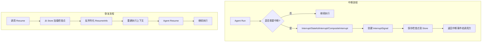

# interrupt_resume_bridge 模块详解

## 概述

`interrupt_resume_bridge` 模块是 ADK (Agent Development Kit) 运行时中负责**中断 (Interrupt) 与恢复 (Resume)** 能力的核心组件。想象一下：你正在指挥一个复杂的自动化工作流，其中某个 Agent 需要暂停执行，等待人类用户的批准或输入——这就是这个模块解决的问题。

从设计角度看，这个模块扮演着**"状态保管员"和"执行恢复器"**的双重角色：当 Agent 决定暂停时，它负责将执行上下文完整地序列化并存储起来；当外部准备好恢复时，它负责将状态反序列化并准确地从中断点继续执行。这类似于航班中的"黑匣子"——记录了飞机（Agent）坠落（中断）前的所有关键信息，以便后续调查和恢复。

## 架构角色与数据流

### 核心抽象

这个模块的核心抽象可以类比为**"断点续传"机制**：

1. **中断点 (Interrupt Point)**: Agent 在执行过程中主动暂停的位置
2. **检查点 (Checkpoint)**: 存储在持久化存储中的执行状态快照
3. **恢复点 (Resume Point)**: 从检查点恢复后的执行入口



### 组件角色

| 组件 | 职责 | 关键特性 |
|------|------|----------|
| **ResumeInfo** | 封装恢复所需的全部信息 | 包含流式标志、中断状态、恢复目标、恢复数据 |
| **InterruptInfo** | 描述中断事件 | 包含用户可见的 info 数据和中断上下文链 |
| **bridgeStore** | 内存级检查点存储 | 用于测试和轻量级场景的简单实现 |
| **serialization** | 检查点的序列化/反序列化 | 使用 gob 编码，支持 RunCtx、InterruptState 等 |

## 核心组件深度解析

### ResumeInfo 结构体

```go
type ResumeInfo struct {
    EnableStreaming bool      // 原始执行是否为流式模式
    *InterruptInfo            // 嵌入的中断信息
    WasInterrupted bool       // 是否曾被中断
    InterruptState any       // 中断时的内部状态
    IsResumeTarget bool       // 当前组件是否是恢复目标
    ResumeData any           // 恢复时传入的数据
}
```

**设计意图**：这个结构体是 Agent 的 `Resume` 方法接收的核心参数。它需要回答三个问题：
1. **从哪继续** (`WasInterrupted`, `InterruptState`) — Agent 需要知道自己的内部状态才能继续执行
2. **恢复给谁** (`IsResumeTarget`) — 在多 Agent 场景，需要明确哪个子 Agent 是恢复目标
3. **携带什么数据** (`ResumeData`) — 外部提供的恢复数据（如用户输入）

### 三种中断类型

#### 1. `Interrupt(ctx, info)` — 基础中断

用于 Agent 需要暂停但**不需要保存内部状态**的场景。例如：等待用户确认一个操作。

```go
// Agent 代码示例
if needsUserApproval {
    return adk.Interrupt(ctx, "请确认是否继续执行此操作")
}
```

#### 2. `StatefulInterrupt(ctx, info, state)` — 状态ful 中断

用于 Agent 有**重要内部状态需要恢复**的场景。例如：REACT Agent 的消息历史需要保留。

```go
// REACT Agent 示例
return adk.StatefulInterrupt(ctx, "等待工具调用结果", s)
```

**关键设计洞察**：这里的 `state` 会被序列化并存储。恢复时，Agent 通过 `GetInterruptState[T](ctx)` 重新获取这个状态。这是实现"真正的断点续传"的核心。

#### 3. `CompositeInterrupt(ctx, info, state, subSignals...)` — 组合中断

专门用于**工作流 Agent (Sequential/Parallel/Loop)**，将子 Agent 的中断信号"汇总"为统一的中断。

```go
// SequentialAgent 中的使用
event := CompositeInterrupt(ctx, "Sequential workflow interrupted", 
    &sequentialWorkflowState{InterruptIndex: i},  // 自己的状态
    lastActionEvent.Action.internalInterrupted)    // 子 Agent 的信号
```

**设计原因**：工作流 Agent 需要知道：
- 哪个子 Agent 导致了中断？
- 中断时执行到了第几个子 Agent？
- 每个子 Agent 的独立状态是什么？

组合中断将这些问题打包成统一的信息结构。

### 检查点持久化机制

#### 保存检查点

```go
func (r *Runner) saveCheckPoint(ctx, key, info, is) error {
    // 1. 从 InterruptSignal 中提取地址和状态的映射
    id2Addr, id2State := core.SignalToPersistenceMaps(is)
    
    // 2. 获取当前运行上下文
    runCtx := getRunCtx(ctx)
    
    // 3. 序列化为 gob 格式
    buf := &bytes.Buffer{}
    err := gob.NewEncoder(buf).Encode(&serialization{
        RunCtx:              runCtx,
        Info:                info,
        InterruptID2Address: id2Addr,
        InterruptID2State:   id2State,
        EnableStreaming:     r.enableStreaming,
    })
    
    // 4. 存储
    return r.store.Set(ctx, key, buf.Bytes())
}
```

#### 加载检查点

```go
func (r *Runner) loadCheckPoint(ctx, checkpointID) (ctx, *runContext, *ResumeInfo, error) {
    // 1. 从存储获取数据
    data, existed, err := r.store.Get(ctx, checkpointID)
    
    // 2. gob 反序列化
    s := &serialization{}
    err = gob.NewDecoder(bytes.NewReader(data)).Decode(s)
    
    // 3. 重建中断状态到上下文
    ctx = core.PopulateInterruptState(ctx, s.InterruptID2Address, s.InterruptID2State)
    
    // 4. 构建 ResumeInfo 返回
    return ctx, s.RunCtx, &ResumeInfo{
        EnableStreaming: s.EnableStreaming,
        InterruptInfo:   s.Info,
    }, nil
}
```

### 恢复目标定位

模块提供了两个关键函数来定位恢复目标：

- `getNextResumeAgent()` — 获取**单个**下一级恢复点（用于 Sequential/Loop 场景）
- `getNextResumeAgents()` — 获取**多个**下一级恢复点（用于 Parallel 场景）

这对应了工作流的三种模式：
- Sequential: 只有一个子 Agent 需要恢复
- Loop: 只有一个子 Agent 需要恢复（从特定索引继续）
- Parallel: 可能有多个子 Agent 需要恢复

## 依赖分析与数据契约

### 上游依赖

| 模块 | 交互方式 | 说明 |
|------|----------|------|
| **[internal/core/address](internal_core_address.md)** | 函数调用 | 提供地址管理、上下文状态存储的核心实现 |
| **[internal/core/interrupt](internal_core_interrupt.md)** | 函数调用 | InterruptSignal 创建、转换、持久化映射的核心实现 |
| **schema** | 注册类型 | gob 序列化时需要注册类型 |
| **adk/runner** | 方法调用 | Runner 调用 loadCheckPoint/saveCheckPoint |

### 下游依赖（调用本模块）

| 模块 | 交互方式 | 说明 |
|------|----------|------|
| **[adk/runner](adk_runner.md)** | 直接调用 | Runner 使用本模块的检查点功能 |
| **[adk/react](adk_react.md)** | 调用 Interrupt 函数 | REACT Agent 在需要暂停时调用 |
| **[adk/workflow](adk_workflow.md)** | 调用 CompositeInterrupt | 工作流 Agent 组合子 Agent 中断信号 |
| **[flow_runner_interrupt_and_transfer/deterministic_transfer_wrappers](flow_runner_interrupt_and_transfer-deterministic_transfer_wrappers.md)** | 使用 bridgeStore | 确定式转移的测试/模拟 |

### 数据契约

**ResumeInfo 约定**：
- `EnableStreaming` 必须与原始 Run 时的设置一致
- `InterruptState` 的类型必须与原始中断时传入的类型一致
- `ResumeData` 由用户通过 `ResumeWithParams` 提供

**检查点约定**：
- 检查点 ID 由调用方通过 `WithCheckPointID` 选项指定
- 如果检查点不存在，`loadCheckPoint` 返回错误

## 设计决策与权衡

### 1. 使用 gob 而非 JSON/MessagePack

**选择**：使用 Go 的 `encoding/gob` 进行序列化

**原因**：
- 原生支持 Go 的任何类型（只要实现了 GobEncoder）
- 无需为每个状态类型手动定义 JSON schema
- 对于内部状态的序列化最简单

**代价**：
- gob 不跨语言兼容
- 如果需要跨语言持久化，需要额外转换层

### 2. 两种恢复策略：隐式 vs 显式

**隐式恢复** (`Resume`)：
```go
r.Resume(ctx, "checkpoint-id")
```
所有被中断的组件都会收到 `wasInterrupted=true`，但没有具体的 `ResumeData`。

**显式恢复** (`ResumeWithParams`)：
```go
r.ResumeWithParams(ctx, "checkpoint-id", &ResumeParams{
    Targets: map[string]any{
        "agent:A;tool:tool_call_123": "用户输入的数据",
    },
})
```
只有目标地址的组件收到数据，其他组件需要自行决定是否重新中断。

**设计权衡**：简单性 vs 灵活性。隐式恢复适合简单场景，显式恢复支持精确控制。

### 3. 地址层级作为中断点的唯一标识

**选择**：使用层级地址（如 `"agent:parent;agent:child"`）标识中断点

**优点**：
- 在嵌套的 Agent 结构中唯一标识任意深度的组件
- 支持精确的"目标恢复"——只恢复特定叶子节点
- 易于调试和日志追踪

**复杂度**：
- 需要维护完整的地址链
- 组合中断时需要正确构建父子关系

### 4. bridgeStore 的内存实现

**选择**：提供 `bridgeStore` 作为轻量级检查点存储

**用途**：
- 测试场景：无需真实存储后端即可测试中断恢复
- 演示/原型：快速验证中断机制

**限制**：不持久化，进程重启后丢失

## 使用指南

### 在 Agent 中触发中断

```go
func (myAgent *MyAgent) Run(ctx context.Context, input *AgentInput, opts ...AgentRunOption) *AsyncIterator[*AgentEvent] {
    // 场景1: 简单中断，无需保存状态
    if needsUserConfirmation {
        return adk.Interrupt(ctx, "请确认是否执行此操作")
    }
    
    // 场景2: 需要保存内部状态
    if waitingForToolResult {
        return adk.StatefulInterrupt(ctx, "等待工具结果", myState)
    }
}
```

### 在工作流 Agent 中组合中断

```go
// 假设这是 SequentialAgent 的执行逻辑
for i := range subAgents {
    event := subAgent.Run(ctx, ...)
    if event.Action.InternalInterrupted != nil {
        // 组合子 Agent 的中断信号
        return adk.CompositeInterrupt(ctx, "工作流在第"+i+"步中断", 
            &myState{Index: i}, 
            event.Action.InternalInterrupted)
    }
}
```

### 从检查点恢复

```go
runner := adk.NewRunner(adk.RunnerConfig{
    Agent:           agent,
    CheckPointStore: myStore, // 实现 CheckPointStore 接口
})

// 方式1: 隐式恢复（所有中断点继续执行）
iter, err := runner.Resume(ctx, "checkpoint-123")

// 方式2: 显式恢复（精确控制恢复目标和数据）
iter, err := runner.ResumeWithParams(ctx, "checkpoint-123", &adk.ResumeParams{
    Targets: map[string]any{
        "agent:parent;agent:child": "用户提供的数据",
    },
})
```

### 实现自定义 CheckPointStore

```go
type MyStore struct {
    data map[string][]byte
}

func (m *MyStore) Get(ctx context.Context, id string) ([]byte, bool, error) {
    data, ok := m.data[id]
    return data, ok, nil
}

func (m *MyStore) Set(ctx context.Context, id string, data []byte) error {
    m.data[id] = data
    return nil
}
```

## 注意事项与陷阱

### 1. 状态类型兼容性

`InterruptState` 使用 gob 序列化，恢复时需要类型断言：

```go
// 原始中断
adk.StatefulInterrupt(ctx, "info", &MyState{Value: 42})

// 恢复时 - 类型必须匹配
wasInterrupted, hasState, state := core.GetInterruptState[*MyState](ctx)
if hasState {
    // state 是 *MyState
}
```

如果类型不匹配，`hasState` 会返回 false。

### 2. 并发安全

`bridgeStore` 不是线程安全的：

```go
// 错误用法：并发调用
go runner.Run(...)
go runner.Resume(...)  // 可能产生竞态
```

### 3. 序列化兼容性

在 `init()` 中注册的类型不能随意更改字段或删除字段：

```go
func init() {
    schema.RegisterName[*serialization]("_eino_adk_serialization")
    // 添加新字段时，旧检查点可能无法加载
}
```

### 4. Parallel Agent 恢复的限制

当前不支持并发恢复多个分支：

```go
// 如果 Parallel Agent 的多个分支都中断了，当前设计只支持
// 恢复其中一个分支（通过 getNextResumeAgent 的单数形式）
if len(nextAgents) > 1 {
    return "", errors.New("concurrent transfer is not supported")
}
```

### 5. 丢失上下文的情况

某些上下文**不会被保存到检查点**：
- Go context.WithCancel 的取消信号
- 网络连接/文件句柄
- 第三方库的内部状态

只能保存"数据"状态，不能保存"资源"状态。

## 相关模块

- **[adk/runner](adk_runner.md)** — 执行入口，调用检查点功能
- **[adk/react](adk_react.md)** — REACT Agent 实现，使用 StatefulInterrupt
- **[adk/workflow](adk_workflow.md)** — 工作流 Agent，使用 CompositeInterrupt
- **[internal/core/address](internal_core_address.md)** — 地址层级管理
- **[internal/core/interrupt](internal_core_interrupt.md)** — 中断信号核心实现
- **[flow_runner_interrupt_and_transfer/deterministic_transfer_wrappers](flow_runner_interrupt_and_transfer-deterministic_transfer_wrappers.md)** — 确定式转移