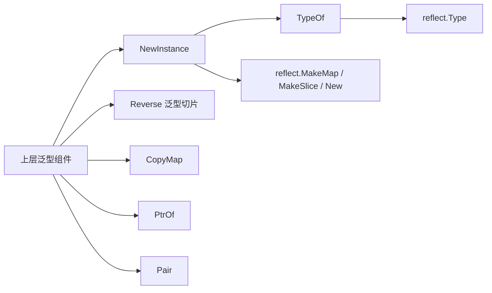

# generic_helpers 模块深度解析

`generic_helpers`（对应代码路径 `internal/generic/generic.go`）看起来很小，但它解决的是一个在 Go 泛型时代非常“高频且烦人”的底层问题：**你写的是通用逻辑，却经常要在“类型形状”上做重复劳动**，例如“我要一个 `T` 的实例，但 `T` 可能是值类型、指针类型、甚至多重指针”，“我要复制 map 但不想写循环模板”，“我要反转任意切片且保留原类型别名”。这个模块的价值不是复杂算法，而是把这些样板和边界行为统一封装，减少上层框架中的偶发 bug 和重复代码。

## 模块存在的原因：它解决了什么问题

如果没有这个模块，上层代码会在很多地方零散地写类似逻辑：`var t T`、`new(T)`、反射创建、map 逐项拷贝、切片逆序。这些写法在“具体类型已知”时没问题，但在框架级泛型代码里会出现两个典型痛点。

第一，**`T` 的真实形状不可预知**。比如 `T` 可能是 `int`，也可能是 `*Config`，甚至是 `**Node`。`var t T` 与 `new(T)` 的语义完全不同：前者得到零值，后者得到 `*T`。如果调用方预期的是“可用实例而不是 nil 指针”，就会很容易踩空。

第二，**泛型工具函数的类型保真很容易丢失**。例如对 `type IDs []string` 这类切片别名，很多朴素实现会返回 `[]string` 而非 `IDs`，导致 API 连贯性下降。`Reverse` 使用 `S ~[]E` 这种约束就是为了保留类型别名语义。

换句话说，这个模块是一个“微型通用构件层”：不追求炫技，而是把“容易写错但到处会用”的泛型基础操作做成稳定积木。

## 心智模型：把它看成“泛型运行时适配垫片”

可以把 `generic_helpers` 想象成插在“静态类型世界”和“运行时类型世界”之间的一层垫片。

在 Go 里，泛型让你在编译期写 `T`，但某些行为（比如判断 `T` 是不是指针、是不是 map）只能在运行时通过 `reflect` 判断。`NewInstance` 和 `TypeOf` 就是这层垫片的核心：前者负责“按类型形状生产实例”，后者负责“把类型参数转成 `reflect.Type`”。而 `PtrOf`、`Reverse`、`CopyMap` 则是围绕这层能力提供的零碎但高频工具。

## 架构与数据流



这个模块在架构上属于**底层无状态工具层**。它不管理生命周期、不持有上下文，也不依赖业务模块。关键数据流集中在 `NewInstance`：调用方给出类型参数 `T`，函数先通过 `TypeOf[T]()`拿到 `reflect.Type`，再根据 `Kind()`分支创建实例（map、slice/array、ptr、default）。其他函数基本是纯函数式转换：输入即输出，不产生外部副作用。

从你提供的模块树看，`generic_helpers` 位于 [Internal Utilities](internal_utilities.md) 下，属于“基础设施中的基础设施”。当前依赖图没有给出逐组件 `depended_by` 细节，因此无法精确列出哪些具体模块调用它；但从功能定位看，它面向的是所有需要泛型辅助的内部实现。

## 组件深潜

### `TypeOf[T any]() reflect.Type`

这是最底层原语。它通过 `reflect.TypeOf((*T)(nil)).Elem()` 获取 `T` 的运行时类型，不需要真实值实例。

设计意图是：在泛型函数内部，很多时候你只有类型参数，没有值。直接 `reflect.TypeOf` 一个零值在某些语境下不直观，而这种写法稳定且常见于泛型反射实现。

返回值是 `reflect.Type`，没有副作用，也不会分配复杂对象。

### `NewInstance[T any]() T`

这是模块中最关键的函数。它的目标不是简单“给我零值”，而是“给我一个**可用**实例”，并处理 `T` 的类型形状差异。

内部机制可以理解为四类分支：

- `reflect.Map`：调用 `reflect.MakeMap(typ)`，返回已初始化 map（非 nil）。
- `reflect.Slice, reflect.Array`：调用 `reflect.MakeSlice(typ, 0, 0)`，返回空切片。这里把 array 与 slice 放在一起是一个值得注意的点（见下文 gotcha）。
- `reflect.Ptr`：逐层解引用并构建指针链，确保最终返回的多级指针都非 nil。例如 `T = **int` 时会构造完整链路，而不是 `nil`。
- default：返回 `var t T`，即类型零值。

它的“why”非常明确：上层框架往往不想分辨 `T` 是 `Config` 还是 `*Config`；它要的是“能马上写字段/调用方法”的实例。`NewInstance` 把这种策略统一化，减少调用方的条件分支。

### `PtrOf[T any](v T) *T`

功能极简：返回值的地址。

这个函数的价值在于可读性和泛型一致性，尤其在 option/config 场景中，常需要“字面量转指针”。例如 `PtrOf(10)` 比先声明变量再取地址更直接。

### `type Pair[F, S any] struct { First F; Second S }`

一个通用二元组结构，用于表达“成对返回”或“键值以外的二元关系”。

设计取舍是**显式字段命名**（`First`/`Second`）而非匿名 tuple（Go 本身也没有 tuple）。它简单、可序列化、可组合，但语义名较弱；在语义明确场景，仍建议定义专门结构体替代。

### `Reverse[S ~[]E, E any](s S) S`

返回一个新切片，元素逆序，不修改原切片。

这里最关键的设计是 `S ~[]E`：这允许 `S` 是“底层类型为 `[]E` 的自定义类型”，从而输出保持为同一别名类型。这比直接写 `[]E -> []E` 更适合框架代码，因为不会抹平调用方自定义类型。

实现上分配同长度新切片 `d` 并倒序拷贝，是典型的“正确性优先、语义清晰优先”选择。

### `CopyMap[K comparable, V any](src map[K]V) map[K]V`

执行 map 的浅拷贝：创建新 map 并逐项赋值。

它解决的不是深拷贝问题，而是隔离“map header 引用共享”导致的意外写入联动。对于值类型 `V` 是指针、切片、map 的情况，内部对象仍共享，这符合 Go 社区对 copy map 的常见语义预期。

## 依赖关系分析

这个模块对外部依赖极少，仅依赖标准库 `reflect`。这是一种刻意选择：底层工具模块越少依赖，越不容易形成循环依赖和初始化顺序问题。

在调用方向上，根据当前提供信息可确认：

- 它隶属 [Internal Utilities](internal_utilities.md) 分类；
- 未提供细粒度 `depended_by` 图，因此不能准确点名调用者。

但从合同（contract）角度，可以明确三点：

- 调用 `NewInstance` 的代码隐含依赖“返回值已按容器/指针语义初始化”；
- 调用 `Reverse` 的代码依赖“输入不被原地修改”；
- 调用 `CopyMap` 的代码依赖“只隔离第一层 map，不保证深层对象隔离”。

这些是最重要的隐式契约，修改时必须保持。

## 设计决策与权衡

这个模块整体偏向“小而硬”的设计哲学：API 少、行为直接、避免配置化。它的优势是可预测性高，劣势是灵活度有限。

一个典型权衡是 `NewInstance` 使用 `reflect`。反射比直接 `var t T` 更重，但它换来了对 map/slice/pointer 形状的统一处理能力。在框架初始化路径中，这种开销通常可接受，而减少了大量分支和 nil 处理。

另一个权衡是 `Reverse` 选择“总是分配新切片”而不是原地反转。前者更安全（无副作用），更符合函数式直觉；后者更省内存。当前实现明显站在正确性与可维护性一侧。

`CopyMap` 只做浅拷贝同样是务实选择：深拷贝需要类型感知或序列化策略，会显著增加复杂度，也容易引入隐藏成本。模块把边界画得很清楚：我只负责 map 层级，不负责对象图层级。

## 使用方式与示例

```go
// 1) 获取类型
rt := generic.TypeOf[*int]()

// 2) 创建“可用实例”
a := generic.NewInstance[int]()      // 0
b := generic.NewInstance[*int]()     // 非 nil, 指向 0
c := generic.NewInstance[map[string]int]() // 空 map, 非 nil

// 3) 字面量转指针
timeout := generic.PtrOf(30)

// 4) 反转切片（不改原值）
xs := []int{1,2,3}
ys := generic.Reverse(xs) // [3,2,1]

// 5) map 浅拷贝
m1 := map[string]int{"a":1}
m2 := generic.CopyMap(m1)
```

如果你在新代码里需要“泛型 + 初始化 + 类型保真”，优先复用这些函数，而不是在业务模块内复制实现。

## 边界条件与常见坑

最需要注意的是 `NewInstance` 的行为边界。

首先，源码把 `reflect.Array` 与 `reflect.Slice` 放在同一分支并调用 `reflect.MakeSlice`。在标准反射语义中，`MakeSlice` 仅适用于 slice 类型；如果 `T` 真的是 array，这里可能触发 panic。当前代码中是否有 array 作为 `T` 的实际调用，需要结合仓库调用点进一步确认。在不确认前，不要把 `NewInstance` 用于 array 类型参数。

其次，`CopyMap` 对 `nil map` 的输入会返回一个已分配空 map（非 nil），而不是保持 nil。这通常是有益的，但如果上游把“nil 与 empty”当作有语义差异（例如序列化或补丁语义），你需要显式处理。

再者，`Reverse` 会分配新切片，热路径高频调用会带来额外分配成本。如果你在性能敏感环路中使用它，需要评估 GC 压力，必要时采用原地算法。

最后，`PtrOf` 返回的是参数副本地址。对值类型这通常符合预期；但若你想要“原变量地址并随原变量变化”，应直接取原变量指针，不要把 `PtrOf` 当成引用绑定语义。

## 给新贡献者的建议

修改这个模块时，优先守住“行为契约稳定”而不是“代码更炫”。它是底层工具，任何小改动都会放大到大量上层路径。尤其关注：`NewInstance` 的 nil/非 nil 语义、`Reverse` 的非原地语义、`CopyMap` 的浅拷贝语义。

如果你打算扩展 API（例如增加深拷贝或三元组），建议先验证是否真有跨模块复用需求；否则应放在更高层模块，避免把 `generic_helpers` 变成“杂物间”。

## 参考

- [Internal Utilities](internal_utilities.md)
- [serialization_runtime](serialization_runtime.md)
- [unbounded_channel](unbounded_channel.md)
- [panic_safety_wrapper](panic_safety_wrapper.md)
