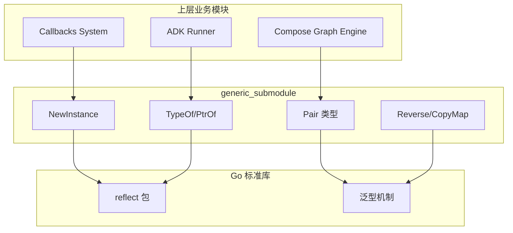

# generic_submodule

## 概述

`generic_submodule` 是整个框架的**基础工具层**，位于 `internal/generic` 包下。它的存在解决了一个看似简单但实际频繁出现的问题：在 Go 语言中，如何优雅地处理泛型场景下的常见操作模式。

想象一下你在编写一个高度泛型化的系统（比如本框架中的 [Compose Graph Engine](compose_graph_engine.md) 或 [Callbacks System](callbacks_system.md)），你需要频繁地：
- 创建未知类型的实例（可能是指针、可能是切片、可能是 Map）
- 在泛型代码中获取类型信息
- 将两个不同类型的值绑定在一起传递
- 对泛型集合进行常见操作（反转、复制）

如果没有这个模块，这些逻辑会散落在各个业务模块中，导致代码重复且难以维护。`generic_submodule` 将这些模式抽象成可复用的工具函数，让上层代码更专注于业务逻辑而非类型处理的脏活累活。

**核心洞察**：Go 的泛型系统（Go 1.18+）虽然强大，但在处理反射与泛型交互、指针层级嵌套等场景时仍有痛点。这个模块的本质是在泛型语法糖和反射底层能力之间架起一座桥梁。

---

## 架构定位



### 模块角色分析

这个模块在整体架构中扮演**基础设施提供者**的角色：

1. **被依赖方**：从模块树可以看到，`internal.generic.generic.Pair` 被标记为当前分析的核心模块，而它被 [Compose Graph Engine](compose_graph_engine.md)、[Internal Utilities](internal_utilities.md) 等多个核心引擎依赖
2. **零外部依赖**：除了 Go 标准库的 `reflect` 包，不依赖任何业务模块，保证了其稳定性和可移植性
3. **高频调用路径**：`NewInstance` 和 `Pair` 是最热的两个组件，尤其在图执行引擎创建节点实例、回调系统传递成对数据时频繁出现

### 数据流特征

由于这是工具模块，数据流相对简单：

```
调用方传入类型参数 T → 工具函数处理 → 返回处理后的值/类型
```

典型场景：
- [Compose Graph Engine](compose_graph_engine.md) 在动态创建节点时调用 `NewInstance[T]()` 获取初始状态
- 回调系统在传递中间结果时使用 `Pair[F, S]` 捆绑两个相关值
- 配置处理时用 `PtrOf(v)` 快速获取指针以满足 API 签名要求

---

## 组件深度解析

### 1. Pair[F, S any]

```go
type Pair[F, S any] struct {
    First  F
    Second S
}
```

#### 设计意图

`Pair` 是一个**二元组**抽象，用于在泛型代码中安全地捆绑两个可能不同类型的值。

**为什么需要它？** 在 Go 中，当你需要从函数返回两个值时，通常使用多返回值语法。但在某些场景下（比如作为 Map 的 value、作为 Channel 传输的元素、作为结构体字段），你需要一个具名的类型来承载这两个值。`Pair` 提供了这种能力，同时保持类型安全。

#### 使用场景

```go
// 场景 1：作为 Map 的 value 存储关联数据
nodePairs := make(map[string]generic.Pair[compose.NodeInfo, compose.ExecutorMeta])

// 场景 2：在 Channel 中传递成对的生产者 - 消费者数据
ch := make(chan generic.Pair[compose.StreamReader, compose.StreamWriter])

// 场景 3：作为中间结果在图节点间传递
func processEdge(input generic.Pair[FieldMapping, AnyGraph]) generic.Pair[State, InterruptInfo] {
    // ...
}
```

#### 设计权衡

**选择具名结构体而非匿名 tuple**：Go 没有原生的 tuple 类型。 alternatives 包括：
- 使用 `interface{}` 数组：丢失类型安全，需要断言
- 使用多返回值：无法作为字段或 Map value
- 使用 `Pair` 结构体：类型安全、可组合、语义清晰

**未实现常见方法**：注意 `Pair` 没有实现 `Swap()`、`Unpack()` 等方法。这是**刻意简化**的设计决策：
- 保持最小 API 表面，避免过度工程化
- 直接访问 `First`/`Second` 字段更直观（Go 风格）
- 如需扩展，调用方可自行封装

---

### 2. NewInstance[T any]() T

```go
func NewInstance[T any]() T {
    typ := TypeOf[T]()
    switch typ.Kind() {
    case reflect.Map:
        return reflect.MakeMap(typ).Interface().(T)
    case reflect.Slice, reflect.Array:
        return reflect.MakeSlice(typ, 0, 0).Interface().(T)
    case reflect.Ptr:
        // 递归解指针，确保每一层都分配内存
        typ = typ.Elem()
        origin := reflect.New(typ)
        inst := origin
        for typ.Kind() == reflect.Ptr {
            typ = typ.Elem()
            inst = inst.Elem()
            inst.Set(reflect.New(typ))
        }
        return origin.Interface().(T)
    default:
        var t T
        return t
    }
}
```

#### 设计意图

这是模块中**最复杂也最易出错**的函数。它的核心任务是：**给定一个类型 T，返回一个"可用"的零值实例**。

**为什么不能直接用 `var t T`？** 问题在于指针类型：

```go
// 期望行为对比
var t1 *int           // t1 == nil，解引用会 panic
t2 := NewInstance[*int]()  // t2 指向 0，可安全解引用

var t3 **MyStruct     // t3 == nil
t4 := NewInstance[**MyStruct]() // t4 指向一个已分配的 *MyStruct
```

#### 内部机制

函数的处理逻辑是一个**类型分类器**：

1. **Map 类型**：返回初始化的空 Map（非 nil），避免后续 `range` 或赋值时 panic
2. **Slice/Array 类型**：返回长度和容量为 0 的切片（非 nil），支持 `append` 操作
3. **指针类型**：这是关键路径。函数会递归解包指针层级，为每一层分配内存
   - `*int` → 分配一个指向 0 的指针
   - `**MyStruct` → 分配第一层指针，再分配第二层指针指向 `MyStruct{}`
   - 以此类推，处理任意深度的指针嵌套
4. **其他类型**：返回 Go 的零值（int→0, string→"", struct→字段零值）

#### 关键设计决策

**为什么指针要递归分配？** 这是由框架的使用场景决定的。在 [Compose Graph Engine](compose_graph_engine.md) 中，状态对象经常是多层指针（如 `**InternalState`），如果只分配最外层，内层仍是 nil，后续访问会 panic。`NewInstance` 确保返回的实例"立即可用"。

**性能考量**：使用反射必然有开销。但在框架初始化、节点创建等低频路径上，这个开销是可接受的。如果在热路径（如每消息处理）使用，建议调用方缓存结果。

---

### 3. TypeOf[T any]() reflect.Type

```go
func TypeOf[T any]() reflect.Type {
    return reflect.TypeOf((*T)(nil)).Elem()
}
```

#### 设计意图

在泛型代码中获取类型 `T` 的 `reflect.Type` 对象。

**为什么需要这个技巧？** Go 的 `reflect.TypeOf()` 接受的是值，但有时你只有类型参数 `T` 而没有实例。这个函数利用了一个巧妙的技巧：
- `(*T)(nil)` 创建一个类型为 `*T` 的 nil 指针（不需要实际分配内存）
- `reflect.TypeOf()` 获取这个指针的类型
- `.Elem()` 解包指针，得到 `T` 本身的类型

#### 使用场景

```go
// 在泛型函数中需要反射类型信息
func process[T any]() {
    typ := generic.TypeOf[T]()
    if typ.Kind() == reflect.Struct {
        // 检查结构体字段
    }
}
```

---

### 4. PtrOf[T any](v T) *T

```go
func PtrOf[T any](v T) *T {
    return &v
}
```

#### 设计意图

快速获取值的指针。这是一个**语法糖**，主要服务于配置 API。

**典型场景**：某些配置字段是指针类型（用于区分"未设置"和"设置为零值"），但字面量无法直接取地址：

```go
// 没有 PtrOf 时的繁琐写法
val := 42
config := Config{Timeout: &val}

// 使用 PtrOf
config := Config{Timeout: generic.PtrOf(42)}
```

---

### 5. Reverse[S ~[]E, E any](s S) S

```go
func Reverse[S ~[]E, E any](s S) S {
    d := make(S, len(s))
    for i := 0; i < len(s); i++ {
        d[i] = s[len(s)-i-1]
    }
    return d
}
```

#### 设计意图

返回切片反转后的**新副本**（原地修改的反面）。

**设计权衡**：
- **选择返回新切片**：避免修改调用方传入的原始数据，符合函数式编程的不可变性原则
- **代价**：需要额外 O(n) 空间。如果调用方在意性能且可以接受原地修改，应自行实现

---

### 6. CopyMap[K comparable, V any](src map[K]V) map[K]V

```go
func CopyMap[K comparable, V any](src map[K]V) map[K]V {
    dst := make(map[K]V, len(src))
    for k, v := range src {
        dst[k] = v
    }
    return dst
}
```

#### 设计意图

创建 Map 的**浅拷贝**。

**重要提醒**：这是浅拷贝，如果 V 是指针或引用类型（slice、map），新旧 Map 会共享底层数据。调用方需要理解这一点。

---

## 依赖关系分析

### 上游依赖（被谁调用）

| 调用模块 | 调用频率 | 典型用途 |
|---------|---------|---------|
| [Compose Graph Engine](compose_graph_engine.md) | 高 | 创建节点实例、状态初始化、字段映射 |
| [Callbacks System](callbacks_system.md) | 中 | 传递成对的回调输入/输出 |
| [Internal Utilities](internal_utilities.md) | 中 | 序列化、Channel 操作 |
| [ADK Runner](adk_runner.md) | 低 | 会话状态管理 |

### 下游依赖（调用谁）

| 被调用方 | 用途 |
|---------|------|
| `reflect` 标准库 | `NewInstance`、`TypeOf` 的底层实现 |
| Go 泛型机制 | 所有函数的类型参数 |

### 数据契约

`Pair` 作为数据传递载体时，遵循以下隐式契约：
- `First` 和 `Second` 字段的语义由调用方约定（模块本身不强制）
- 常见模式：`Pair[Input, Output]`、`Pair[Key, Value]`、`Pair[Data, Metadata]`

---

## 设计决策与权衡

### 1. 泛型 vs 纯反射

**选择**：混合使用泛型 + 反射

**原因**：
- 纯泛型无法在运行时获取类型信息（如 `reflect.Type`），但性能更好
- 纯反射类型不安全，代码冗长
- 混合方案：用泛型保证类型安全，在需要时用反射处理动态类型（如 `NewInstance`）

**代价**：`NewInstance` 等函数有反射开销，不适合热路径

### 2. 最小 API 原则

**观察**：模块只提供了 6 个导出组件，没有实现常见的 `Map`、`Filter`、`FlatMap` 等函数式操作

**原因**：
- 框架的核心复杂度在图执行引擎和回调系统，不在集合操作
- 避免"工具依赖"——调用方不应过度依赖工具函数而忽视业务逻辑
- 保持模块轻量，减少测试和维护负担

### 3. 指针处理的激进策略

**观察**：`NewInstance[*T]` 会递归分配所有指针层级

**权衡**：
- **优点**：返回的实例立即可用，调用方无需担心 nil 指针
- **缺点**：可能过度分配（调用方可能只需要最外层指针）
- **适用场景**：框架内部的状态对象通常是固定结构，过度分配的代价可接受

---

## 使用指南与示例

### 基础用法

```go
import "github.com/cloudwego/kitex/internal/generic"

// 1. 使用 Pair 传递关联数据
func getNodeInfo() generic.Pair[string, compose.NodeInfo] {
    return generic.Pair[string, compose.NodeInfo]{
        First:  "node-1",
        Second: compose.NodeInfo{/* ... */},
    }
}

// 2. 使用 NewInstance 创建类型安全的零值
func createState[T any]() T {
    return generic.NewInstance[T]()  // 即使 T 是 *State 也安全
}

// 3. 使用 PtrOf 简化配置
config := &Config{
    Timeout: generic.PtrOf(30 * time.Second),
    Retry:   generic.PtrOf(3),
}
```

### 高级场景

```go
// 在图节点中创建状态实例
func initNodeState[T any]() (*T, error) {
    state := generic.NewInstance[*T]()  // 返回 **T，外层和内层都已分配
    // 现在可以安全地 (*state).SomeField = ...
    return state, nil
}

// 使用 Pair 作为 Channel 元素类型
func pipeline(ch chan generic.Pair[Input, Output]) {
    for pair := range ch {
        result := process(pair.First)
        ch <- generic.Pair[Input, Output]{First: pair.First, Second: result}
    }
}
```

---

## 边界情况与陷阱

### 1. NewInstance 的指针行为

```go
// ⚠️ 容易误解的行为
p := generic.NewInstance[*int]()
*p = 42  // 安全，p 指向已分配的内存

// 但如果你期望的是 nil 指针来表示"未设置"：
var expected *int = nil  // 这才是 nil
actual := generic.NewInstance[*int]()  // actual != nil
```

**建议**：如果业务逻辑需要区分"零值"和"未设置"，不要对指针类型使用 `NewInstance`。

### 2. Pair 的字段顺序

`Pair` 没有语义约束，`First` 和 `Second` 的含义完全由调用方约定。在团队内部应建立命名规范：

```go
// ✅ 推荐：在类型别名中明确语义
type NodePair = generic.Pair[compose.NodeInfo, compose.ExecutorMeta]
type IO_PAIR = generic.Pair[Input, Output]

// ⚠️ 避免：裸用 Pair 导致可读性差
data := generic.Pair[any, any]{First: x, Second: y}  // 难以理解
```

### 3. CopyMap 的浅拷贝陷阱

```go
type Config struct {
    Value int
}

src := map[string]*Config{"a": {Value: 1}}
dst := generic.CopyMap(src)

dst["a"].Value = 99  // ⚠️ src["a"].Value 也变成 99！
```

**建议**：如果 V 是引用类型且需要深拷贝，调用方应自行实现。

### 4. 反射性能开销

`NewInstance` 和 `TypeOf` 使用反射，在循环中频繁调用会导致性能问题：

```go
// ⚠️ 低效：每次迭代都调用反射
for i := 0; i < 10000; i++ {
    obj := generic.NewInstance[MyType]()
}

// ✅ 高效：缓存结果
template := generic.NewInstance[MyType]()
for i := 0; i < 10000; i++ {
    obj := template  // 或者使用 sync.Pool
}
```

---

## 扩展建议

如果你需要扩展此模块，请遵循以下原则：

1. **保持无状态**：所有函数应是纯函数，不依赖全局状态
2. **泛型优先**：新函数应尽可能使用泛型而非 `interface{}`
3. **文档驱动**：为每个新函数编写清晰的示例，说明适用场景和边界情况
4. **性能敏感**：如果函数可能在热路径使用，提供基准测试

可能的扩展方向：
- `Triple[F, S, T any]`：三元组（如果业务确实需要）
- `Must[T any](v T, err error) T`：忽略错误的快捷方式（谨慎使用）
- `Zero[T any]() T`：显式返回零值（与 `NewInstance` 形成对比）

---

## 相关模块参考

- [Compose Graph Engine](compose_graph_engine.md)：大量使用 `Pair` 和 `NewInstance` 进行节点状态管理
- [Callbacks System](callbacks_system.md)：使用 `Pair` 传递回调输入/输出对
- [Internal Utilities](internal_utilities.md)：同属内部工具层，包含序列化、Channel 等工具
- [Schema Core Types](schema_core_types.md)：定义框架的核心数据结构，常作为 `Pair` 的类型参数

---

## 总结

`generic_submodule` 是一个**小而美**的基础工具模块。它的价值不在于复杂的算法或精妙的设计，而在于：

1. **统一模式**：将散落的类型处理逻辑集中到一处
2. **类型安全**：利用 Go 泛型在编译期捕获错误
3. **降低认知负担**：调用方无需重复思考"如何安全地创建指针实例"这类问题

对于新加入的开发者，理解这个模块的关键是认识到：**它是框架泛型能力的基石**。当你看到 [Compose Graph Engine](compose_graph_engine.md) 中大量使用 `Pair` 传递数据，或在 [Callbacks System](callbacks_system.md) 中看到 `NewInstance` 创建状态时，你应该意识到这些工具函数在背后保证了类型安全和代码简洁。
