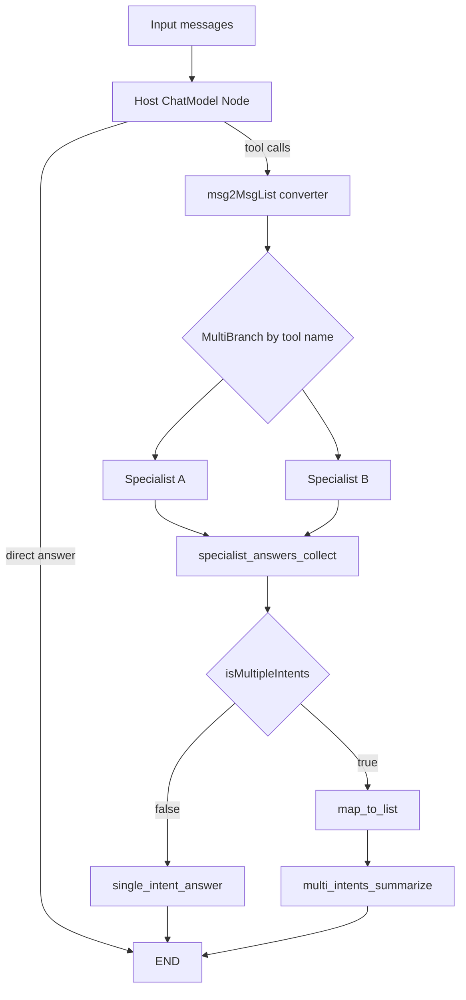

# graph_composition_runtime

`graph_composition_runtime`（对应 `flow/agent/multiagent/host/compose.go` 及其配套类型）本质上是在做一件很“工程化”的事：把“一个 Host 负责分诊、多个 Specialist 分工处理、最后汇总答案”的多智能体模式，编译成一个可执行、可流式、可嵌入上层图的 `compose.Graph`。如果用朴素写法，你会很快陷入 `if/else + goroutine + stream 拼接 + 状态共享` 的泥潭；这个模块的价值在于把这些控制流显式建模成图节点、分支和状态，让复杂路由变成可组合的运行时结构。

## 这个模块解决的核心问题

多智能体 Host 模式看起来简单：Host 判断该交给谁，Specialist 回答，最后返回结果。但一旦进入真实运行时，会出现几个同时成立的约束。第一，Host 既可能直接回答，也可能发起一个或多个 tool call；第二，系统既要支持 `Generate`（一次性）又要支持 `Stream`（增量）；第三，Specialist 形态不统一，可能是 `ChatModel`，也可能是 `Invokable/Streamable`；第四，多专家并发返回后，可能需要二次总结；第五，这个能力还要能作为子图嵌入到更大的业务图里。

`NewMultiAgent` 的设计就是在解这个“五约束交集”。它不把 Host/Specialist 当成硬编码协程流程，而是把它们编译成图：Host 节点、分流分支、专家节点、聚合节点、单意图直出节点、多意图总结节点。这样做的关键收益不是“代码更优雅”，而是让路由策略、流式判定、状态传递和扩展点都附着在通用图运行时能力上。

## 心智模型：把它当成“AI 总机 + 调度车间”

可以把这个模块想象成一个“总机调度系统”。`Host` 像总机接线员，先听懂请求，再决定转接到哪个专家分机。`Specialist` 是分机坐席，可以是不同类型（模型、函数型 agent）。如果只转接一个分机，结果直接返回；如果转接多个分机，就进入“汇总工位”（`Summarizer` 或默认拼接器）。

实现上，这个“总机系统”并不是脚本逻辑，而是图运行时：

- 图的输入是 `[]*schema.Message`，输出是 `*schema.Message`。
- 图的局部状态是 `state`，只存两件事：原始消息 `msgs`，以及是否多意图 `isMultipleIntents`。
- Host 的输出先经过流式分支判断：直接结束，还是进入 specialist 路由。
- specialist 路由通过 tool call 中的 `Function.Name` 映射到已注册节点。
- 专家输出汇聚后再根据 `isMultipleIntents` 走单意图直出或多意图总结路径。

这套模型的重点是：**“谁执行”与“怎么路由”被分离了**。执行者是节点，路由规则是 branch，跨阶段上下文是 state。

## 架构与数据流



### 端到端流程叙述

在 `NewMultiAgent` 里，系统先做配置校验（`MultiAgentConfig.validate`），再构建 `compose.NewGraph[[]*schema.Message, *schema.Message]`。Host 节点通过 `addHostAgent` 加入图，并在 `WithStatePreHandler` 中把输入消息保存到 `state.msgs`，以便后续 specialist 与 summarizer 复用“原始上下文”。

随后，`addDirectAnswerBranch` 在 Host 后挂了一个 `StreamGraphBranch`。它调用 `StreamToolCallChecker` 判断 Host 流中是否出现 tool call：若没有，直接 `END`；若有，进入 `msg2MsgList` 转换节点。

进入 `addMultiSpecialistsBranch` 后，系统读取 Host 聚合后的单条消息，从 `ToolCalls` 提取被点名的专家名，生成 `map[string]bool` 路由表。这个路由表会驱动图多分支，把执行扇出到多个 specialist 节点。若点名专家超过一个，就把 `state.isMultipleIntents` 置为 `true`。

每个 specialist 节点都在 `addSpecialistAgent` 中注册。这里有一个关键一致性动作：它们都通过 `WithStatePreHandler` 把输入替换为 `state.msgs`（可选加 specialist system prompt），从而避免把“Host 的 tool call 消息”错误地传给专家。换句话说，Host 的输出只用于“路由决策”，不是下游语义输入。

专家结果汇聚到 `specialistsAnswersCollectorNodeKey` 后，`addAfterSpecialistsBranch` 根据 `isMultipleIntents` 决定后续路径。单意图走 `single_intent_answer`，它要求聚合 map 里只有一个结果并直接透传；多意图走 `map_to_list -> multi_intents_summarize`，如果配置了 `Summarizer` 就调用其 `ChatModel`，否则走默认拼接 lambda（把多个 `msg.Content` 用换行连接）。

## 核心组件深潜

### `state`

`state` 只有两个字段：`msgs` 与 `isMultipleIntents`。它是图内部的“跨节点工作记忆”，不是业务状态仓库。`msgs` 的存在是为了保证 specialist/summarizer 拿到的是原始对话上下文；`isMultipleIntents` 的存在是为了把“路由判定结果”延迟到后置分支使用。这个结构刻意保持极小，降低并发图执行下的状态复杂度。

### `NewMultiAgent`

这是模块总装函数。它完成了配置默认化、节点注册、分支装配、编译和对象封装。

非直观点在于它同时处理“模型工具化”与“图运行时编译”两层：先用 `agent.ChatModelWithTools` 把 Host 模型绑定成可 tool call 的 `model.BaseChatModel`，再把整个编排 `Compile` 成 runnable。最终返回 `MultiAgent`，并保留 `graph` 与 `graphAddNodeOpts`，支撑 `ExportGraph()` 把此多智能体当作子图复用。

### `addHostAgent`

Host 是入口决策节点。其 `preHandler` 除了可注入 host system prompt，还承担保存 `state.msgs` 的职责。这个动作放在 Host 前，而不是更早，是因为图输入可能来自上游节点加工后的 messages；当前实现选择“以进入 Host 前的输入”为后续专家统一上下文。

### `addDirectAnswerBranch`

这段逻辑解决了流式场景下最容易被忽略的问题：Host 流输出可能一边吐文本一边/稍后才吐 tool call。模块提供 `StreamToolCallChecker` 扩展点，默认 `firstChunkStreamToolCallChecker` 只看首个非空 chunk，因此对某些模型（注释点名 Claude）不稳妥。这里的设计取舍是“默认简单高效 + 高级场景可自定义”，而不是内置一个昂贵、模型耦合的全能检测器。

### `addMultiSpecialistsBranch`

这里把 Host 的 tool calls 转成图分支布尔映射。实现假设 converter 后输入长度必须为 1（否则报错），这是一个强约束：Host 最终必须收敛成单条含 tool call 的消息表示。它还通过 `agentMap` 限定合法分支终点，避免任意 tool name 触发未知节点。

### `addSpecialistAgent`

Specialist 兼容两类执行体：

- `Invokable/Streamable` -> 通过 `compose.AnyLambda` 包装。
- `ChatModel` -> 通过 `AddChatModelNode` 注册。

共同点是都接边到 `specialistsAnswersCollectorNodeKey` 聚合。该函数没有强制“ChatModel 与 Invokable/Streamable 互斥”，但 `types.go` 注释声明了互斥约定；真实行为是优先走 `Invokable/Streamable` 分支。这是一个“文档契约 > 运行时强校验”的点，新贡献者要特别注意。

### `addSingleIntentAnswerNode`

单意图路径的目标是把聚合后的 `map[string]any` 还原为唯一 `*schema.Message`。它显式校验 `len(msgs)==1`，否则报错。这让“路由判定/扇出数量”与“后续节点语义”保持一致，不悄悄吞错。

### `addMultiIntentsSummarizeNode`

先做 `map -> []*schema.Message` 转换，再进入 summarizer。若提供 `Summarizer`，其 pre-handler 会组装输入为：`system prompt + state.msgs + specialist outputs`。这意味着总结器并非只看专家答案，而是带着原始上下文做融合；代价是 token 更高，但一般提升一致性。

若未提供 `Summarizer`，采用默认 lambda 拼接。它成本低、零模型依赖，但不支持流式语义总结，且内容质量仅是串接结果。

### `MultiAgent.Generate` / `MultiAgent.Stream` / `ExportGraph`

`Generate` 与 `Stream` 都先收集通用 `compose` options（`agent.GetComposeOptions`），再把 `WithAgentCallbacks` 转换成 graph callbacks 并通过 `.DesignateNode(ma.HostNodeKey())` 绑定到 Host 节点。这个“定点挂载”确保 handoff 事件只从 Host 产出，不被 specialist 节点噪声污染。

`ExportGraph` 是架构级扩展点，允许把 MultiAgent 像积木一样拼进更大图（测试里通过 `AppendGraph` 验证）。

### `ConvertCallbackHandlers` 与 `WithAgentCallbacks`

`MultiAgentCallback` 只有 `OnHandOff` 一个事件，语义非常聚焦。`ConvertCallbackHandlers` 在非流式 `OnEnd` 和流式 `OnEndWithStreamOutput` 两个路径都提取 Host 的 tool calls，再派发 `HandOffInfo{ToAgentName, Argument}`。

流式分支里它起了 goroutine 去 `ConcatMessageStream` 后回调，这个设计避免阻塞主链路，但也意味着回调时序是异步的；测试里用 `WaitGroup` 显式等待就是这个契约的体现。

## 依赖与耦合分析

这个模块向下最核心依赖是 [Compose Graph Engine](Compose%20Graph%20Engine.md) 的图构建与编译能力，尤其是分支节点（`NewStreamGraphBranch`、`NewGraphMultiBranch`）、状态处理（`WithGenLocalState`、`ProcessState`）和节点注册 API。没有这些能力，它就会退化为手写流程控制器。

其次，它依赖 [Component Interfaces](Component%20Interfaces.md) 中的 `model.BaseChatModel` / `model.ToolCallingChatModel` 抽象，以及 [Schema Core Types](Schema%20Core%20Types.md) 的 `schema.Message`、`ToolCall`、`FunctionCall`。数据契约的关键点是：Host 必须产出可解析的 `ToolCalls`，specialist 输出必须可还原为 `*schema.Message`。

向上看，它暴露的是 `NewMultiAgent` + `Generate`/`Stream` + `ExportGraph`。调用方既可以把它当“独立 agent”运行，也可以当子图嵌入更大工作流（见测试中的 `AppendGraph(...)` 用法）。这使它在系统中的角色更像“可复用编排组件”，而不是单一业务 agent。

## 关键设计取舍

这个模块选择了“图编排优先”而不是“流程函数优先”。好处是组合性和可观察性强，缺点是初读成本高、节点命名和数据形状必须严格一致。

它在流式 tool call 判断上选择“可插拔 checker + 简单默认实现”。这避免了对特定模型行为过拟合，但把正确性责任部分交给使用者：如果模型不是首块输出 tool call，你必须自定义 `StreamToolCallChecker`，并且必须在 checker 内关闭输入流。

它在多意图聚合上提供“可选模型总结 + 默认拼接降级”。前者质量高但成本高，后者鲁棒但语义弱。这个分层符合生产实践：先确保可用，再让用户按质量需求升级。

## 使用方式与实践示例

```go
ma, err := NewMultiAgent(ctx, &MultiAgentConfig{
    Host: Host{ToolCallingModel: hostModel},
    Specialists: []*Specialist{
        {
            AgentMeta: AgentMeta{Name: "math", IntendedUse: "solve calculation tasks"},
            ChatModel: mathModel,
        },
        {
            AgentMeta: AgentMeta{Name: "search", IntendedUse: "lookup external facts"},
            Invokable: searchAgent.Generate,
            Streamable: searchAgent.Stream,
        },
    },
    Summarizer: &Summarizer{ChatModel: sumModel},
})
```

```go
out, err := ma.Generate(ctx, inputMsgs, WithAgentCallbacks(myCallback))
```

```go
sr, err := ma.Stream(ctx, inputMsgs)
for {
    msg, err := sr.Recv()
    if err == io.EOF { break }
    // consume stream chunks
}
sr.Close()
```

```go
subGraph, addOpts := ma.ExportGraph()
// append into a larger compose chain/graph with addOpts
```

## 新贡献者最该警惕的坑

第一，`HostNodeKey()` 当前返回常量 `defaultHostNodeKey`，即便配置了 `HostNodeName` 只影响节点显示名（`WithNodeName`），不影响内部 key。回调挂载和分支连接都依赖 key，不要混淆“名称”和“键”。

第二，`addSpecialistAgent` 中如果同时提供 `ChatModel` 与 `Invokable/Streamable`，代码会优先走 lambda 分支；这与“互斥”注释一致但没有硬性报错，容易产生“为什么 ChatModel 没生效”的误解。

第三，多意图路径里 `map` 迭代顺序不稳定，默认拼接总结的输出顺序可能变化（测试也容忍两种顺序）。如果业务要求稳定顺序，需要额外排序策略。

第四，`StreamToolCallChecker` 的注释要求“必须关闭 `modelOutput`”。这是资源与下游行为契约，漏关会导致流悬挂或资源泄漏。

第五，`ConvertCallbackHandlers` 的流式回调在 goroutine 中异步执行；如果你的测试或业务依赖回调完成时刻，需要像测试一样自行同步。

## 参考阅读

- 图运行时与分支机制：[Compose Graph Engine](Compose%20Graph%20Engine.md)
- 图执行模型：[runtime_execution_engine](runtime_execution_engine.md)
- 节点与任务调度：[channel_and_task_management](channel_and_task_management.md)
- Agent 选项桥接：[agent_runtime_and_orchestration](agent_runtime_and_orchestration.md)
- 消息与工具调用数据结构：[Schema Core Types](Schema%20Core%20Types.md)
