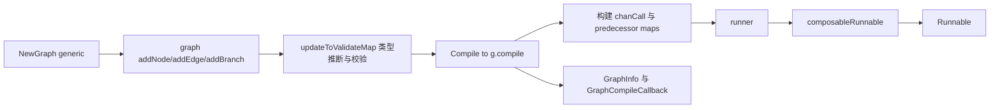

# graph_construction_and_compilation

`graph_construction_and_compilation` 是 Compose Graph Engine 的“建图 + 编译中枢”。如果把运行时比作一台执行流水线机器，那么这个模块就是把“零散节点定义、边关系、分支规则、类型约束、状态策略”装配成可执行蓝图的总装车间。它存在的核心原因是：仅靠“把节点连起来”这种朴素做法，在真实场景里会立刻遇到类型不匹配、分支数据流歧义、循环图失控、并发修改图结构等问题。这个模块用一套 **先建模、再验证、后冻结编译** 的流程，把这些风险前置到编译期。

## 先理解问题空间：为什么必须有“构建-编译”两阶段

图编排系统的复杂度不在“有几个节点”，而在“节点之间如何安全协同”。这里至少有四类约束同时存在：控制依赖（谁先谁后）、数据依赖（数据去哪）、类型依赖（上游输出能否喂给下游输入）、运行语义（DAG 还是 Pregel，是否 eager）。

如果没有统一编译阶段，很多错误只能在运行到一半时才暴露。例如某条边在结构上存在，但上游输出类型和下游输入类型不可赋值；或者分支配置里某个目标节点根本没定义；又或者 DAG 模式下实际存在环。`graph` 的设计把这些问题变成编译时失败，并通过 `buildError` 和 `compiled` 两个“闸门”确保图一旦出错或编译完成就不再被悄悄篡改。

## 心智模型：把它当成“电路板设计器 + 编译器”

可以把 `graph` 想成电路板设计器：

- `Add*Node` 是焊接元件；
- `AddEdge`/`AddBranch` 是连线（还分控制线和数据信号线）；
- `updateToValidateMap` 是电气规则检查（ERC），会尝试自动推断 passthrough 的类型并插入必要的转换器；
- `Compile` 是把原理图烧录成可运行固件（`Runnable`）。

`AnyGraph` 则是“可编译电路”的统一接口，`Graph[I, O]` 只是其中一个实现入口。它暴露的最小能力是：有输入/输出类型、能 compile、能提供 generic helper 和组件类型。



## 架构与数据流：一次完整路径怎么走

从调用路径看，入口是 `NewGraph[I, O](opts ...NewGraphOption)`。它先解析 `newGraphOptions`（例如 `WithGenLocalState` 提供 `stateGenerator` 和 `stateType`），再通过 `newGraphFromGeneric`/`newGraph` 生成底层 `graph`。

随后进入建图阶段：通过 `AddEmbeddingNode`、`AddRetrieverNode`、`AddLoaderNode`、`AddIndexerNode`、`AddChatModelNode`、`AddChatTemplateNode`、`AddToolsNode`、`AddDocumentTransformerNode`、`AddLambdaNode`、`AddGraphNode`、`AddPassthroughNode` 等 API 注入节点；通过 `AddEdge`（底层 `addEdgeWithMappings`）和 `AddBranch`（底层 `addBranch`）建立连接。每次连边都会触发 `addToValidateMap` + `updateToValidateMap`，在图尚未完整时增量地做类型推断与校验。

编译由 `Graph.Compile` 调 `compileAnyGraph`，再进入 `g.compile`。这里会按 `graphCompileOptions` 决定运行语义：

- 触发模式默认 `AnyPredecessor`（Pregel）；
- `AllPredecessor` 或 Workflow 语义会走 DAG；
- eager 在 DAG/Workflow 默认开启，可用 `WithEagerExecutionDisabled` 关闭。

`g.compile` 的核心产物不是直接执行结果，而是 `runner` 的完整运行描述：

1. 为每个节点生成 `chanCall`（动作、写入目标、控制目标、前后处理器）；
2. 计算 `controlPredecessors` 与 `dataPredecessors`；
3. 合并分支对 predecessor 的影响；
4. 注入边/节点/分支 handler manager（`edgeHandlerManager`、`preNodeHandlerManager`、`preBranchHandlerManager`）；
5. 可选挂载 checkpoint、interrupt、merge config；
6. DAG 模式下执行 `validateDAG`，发现环则抛 `DAGInvalidLoopErr`。

最后 `runner.toComposableRunnable()` 再由 `compileAnyGraph` 包装成泛型 `Runnable[I, O]` 并返回。也就是说，本模块的职责是 **把“声明式图”转成“运行时可消费的执行计划”**，实际调度执行在 [runtime_execution_engine](runtime_execution_engine.md) 与 [channel_and_task_management](channel_and_task_management.md)。

## 关键组件深潜

### `graph`（struct）

`graph` 是状态最重的对象，内部同时保存结构信息（`nodes/controlEdges/dataEdges/branches`）、类型推断状态（`toValidateMap`）、运行前置处理器（`handlerOnEdges/handlerPreNode/handlerPreBranch`）、构建生命周期状态（`buildError/compiled`）。

这里有两个很值得注意的设计：

第一，`buildError` 是“粘性错误”。一旦建图过程中某一步失败，后续修改调用会直接返回同一个错误，避免继续在脏状态上构图。它牺牲了“错误后继续编辑”的灵活性，换来实现简洁和状态一致性。

第二，`compiled` 让图在编译后不可变（触发 `ErrGraphCompiled`）。这是一种典型“冻结后执行”策略，避免运行中的结构竞争条件。

### `newGraphOptions` 与 `WithGenLocalState`

`newGraphOptions` 只有两项：`withState` 与 `stateType`。这意味着本模块对状态功能非常克制：它只负责“每次运行怎么生成状态对象”和“状态类型是什么”，不介入业务状态逻辑。

`WithGenLocalState[S any]` 的意义在于把状态类型显式带进编译校验链路。后续 `addNode` 会检查节点 pre/post handler 的 state 类型是否与图一致，不一致直接失败。

### `AnyGraph`（interface）

`AnyGraph` 是跨 `Graph/Chain` 的编译统一抽象。设计上它故意不暴露建图细节，只暴露 compile 所需最小集合。收益是 `compileAnyGraph` 可以复用到多种“可组合图”形态；代价是接口较底层（涉及 `reflect.Type` 和内部 helper），对外扩展实现者门槛较高。

### `graphCompileOptions` / `GraphCompileOption`

编译选项涵盖了运行控制（`maxRunSteps`、`nodeTriggerMode`、`eagerDisabled`）、可观测性（`graphName`、`callbacks`）、韧性能力（checkpoint、interrupt）和 fan-in 合并策略（`mergeConfigs` + `FanInMergeConfig`）。

一个非直观点：`WithEagerExecution()` 目前是空实现（兼容保留），真正有效的是 `WithEagerExecutionDisabled()`。新贡献者很容易误判这个 API 仍在改变行为。

### `GraphInfo` / `GraphNodeInfo` / `GraphCompileCallback`

这是编译期 introspection 面。`onCompileFinish` 会构造 `GraphInfo`，把节点实例、边、数据边、分支、映射、子图信息等传给回调。`subGraphCompileCallback` + `beforeChildGraphCompile` 的配合实现了“父图收集子图编译信息”。

换句话说，这不是运行时 trace，而是编译快照，适合做审计、可视化或静态检查。

### `NodePath`

`NodePath` 非常轻量，只封装节点 key 路径。它是“定位子图内节点”的地址表示，属于控制面工具，而不是执行逻辑。

## 依赖关系分析（基于当前代码与模块关系）

从“它调用谁”看，这个模块直接依赖以下能力层：

- 节点适配与节点元信息（`to*Node`、`graphNode` 等，见 [node_abstraction_and_options](node_abstraction_and_options.md)）；
- 运行时执行容器 `runner` / `chanCall`（见 [runtime_execution_engine](runtime_execution_engine.md)）；
- handler manager 与 channel builder（见 [channel_and_task_management](channel_and_task_management.md)）；
- 类型与流转换辅助（`genericHelper`，见 [runnable_and_type_system](runnable_and_type_system.md)）；
- 分支与字段映射校验（`GraphBranch`、`FieldMapping`，见 [branching_and_field_mapping](branching_and_field_mapping.md)）；
- checkpoint/interrupt/state（见 [compose_checkpoint](compose_checkpoint.md)、[state_and_call_control](state_and_call_control.md)）。

从“谁调用它”看，显式入口是 `Graph.Compile` 与 `compileAnyGraph`。此外，`AddGraphNode` 接受 `AnyGraph`，意味着它也被“上层图作为子图”消费。模块树层面，这一层位于 `Compose Graph Engine` 的上游，向运行时子模块输出编译结果。

数据契约方面最关键的是三条：

1. 类型契约：`reflect.Type` 驱动输入/输出兼容检查；
2. 结构契约：`START`/`END` 保留节点、edge/branch 前必须先 add node；
3. 回调契约：`GraphCompileCallback.OnFinish(ctx, *GraphInfo)` 接收的是编译快照而非运行数据。

## 设计取舍与背后原因

本模块最核心的取舍是“静态尽量校验 + 动态必要兜底”。例如 `checkAssignable` 结果为 `assignableTypeMay` 时，不是直接拒绝，而是往 `handlerOnEdges` 注入 converter，在运行时再做转换。这比纯静态更灵活，但会引入少量运行期开销。

另一个取舍是“双边模型”：控制边与数据边分开维护。好处是能表达“有执行顺序但无数据流”（`noData`）或“有数据流但不控制触发”（`noControl`）这类高级场景；代价是编译逻辑更复杂，predecessor 计算要维护两套图。

在执行语义上，模块同时支持 Pregel（可环）与 DAG（无环）。DAG 更易推理、默认 eager 更低延迟；Pregel 更灵活但需要 `maxRunSteps` 防护。当前实现根据 `nodeTriggerMode`/组件类型自动切换，减少了用户配置负担。

## 如何使用与扩展

典型用法：

```go
g := compose.NewGraph[string, string](
    compose.WithGenLocalState(func(ctx context.Context) *MyState {
        return &MyState{}
    }),
)

_ = g.AddLambdaNode("n1", myLambda)
_ = g.AddLambdaNode("n2", myLambda2)
_ = g.AddEdge("start", "n1") // START 常量值为 "start"
_ = g.AddEdge("n1", "n2")
_ = g.AddEdge("n2", "end")   // END 常量值为 "end"

r, err := g.Compile(ctx,
    compose.WithGraphName("demo"),
    compose.WithNodeTriggerMode(compose.AllPredecessor),
    compose.WithFanInMergeConfig(map[string]compose.FanInMergeConfig{
        "n2": {StreamMergeWithSourceEOF: true},
    }),
)
```

扩展建议是优先复用现有 `Add*Node` 适配路径。如果你要引入新组件形态，通常应先在节点抽象层实现 `graphNode` 适配，再暴露 `AddXxxNode`，而不是在 `graph.compile` 里塞特判。

## 新贡献者最该注意的坑

首先，`START`/`END` 是保留 key，不能手动 `addNode`。其次，图一旦 `Compile`，后续任何结构修改都会 `ErrGraphCompiled`。

再者，很多错误会被“锁存”进 `buildError`，第一次失败后别继续调 add API，应该直接处理错误并重建图。

类型相关坑尤其多：passthrough 节点类型依赖推断，如果 `toValidateMap` 最终仍有未消解项，编译会失败；字段映射目标字段不能重复，否则会在 compile 阶段报错。

运行模式上，DAG 下不能设置 `maxRunSteps`；而 Pregel 下如果没设置会自动给默认值。`Chain/Workflow` 组件不接受 `nodeTriggerMode` 配置（在 `g.compile` 中会直接报错）。

最后，`WithEagerExecution()` 是兼容 API（无行为），不要把它当成性能调优开关。

## 子模块深度解读

本模块的功能是由多个高度内聚的子模块协同完成的，每个子模块解决一个特定的问题域：

- **[节点抽象与选项](node_abstraction_and_options.md)**：定义了图中节点的统一抽象，以及添加节点时的配置选项
- **[运行时执行引擎](runtime_execution_engine.md)**：负责图在运行时的实际执行逻辑和调度
- **[通道与任务管理](channel_and_task_management.md)**：处理节点间的通信、任务调度和处理器管理
- **[分支与字段映射](branching_and_field_mapping.md)**：提供条件分支能力和字段级别的数据映射
- **[可运行与类型系统](runnable_and_type_system.md)**：定义统一的可运行接口和类型安全基础设施
- **[状态与调用控制](state_and_call_control.md)**：管理图执行过程中的状态共享和调用控制

## 参考阅读

除上述子模块外，还可参考：
- [compose_checkpoint](compose_checkpoint.md)
- [compose_interrupt](compose_interrupt.md)
- [compose_tool_node](compose_tool_node.md)
