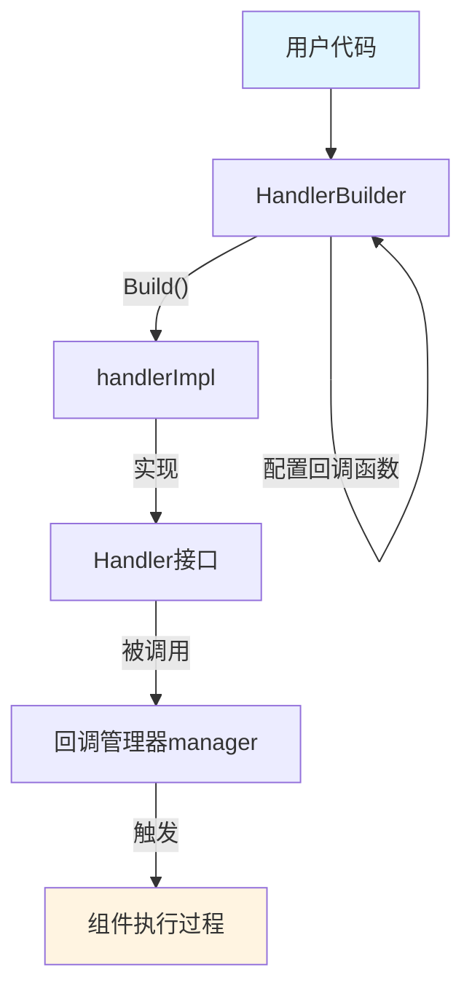

# `handler_builder` 模块技术深度解析

## 1. 为什么需要这个模块？

在构建复杂的 AI 应用系统时，我们常常需要在组件执行的关键节点（如开始、结束、出错时）插入自定义逻辑——例如日志记录、性能监控、输入输出审计等。如果我们直接在每个组件内部硬编码这些逻辑，会导致：

- **关注点分离失效**：组件核心逻辑与横切关注点（cross-cutting concerns）耦合在一起
- **代码复用困难**：相同的监控/日志逻辑需要在多处重复实现
- **灵活性差**：难以动态启用/禁用或替换这些横切逻辑

`handler_builder` 模块的设计目标就是提供一种优雅的方式，让开发者能够**声明式地构建回调处理器**，而无需实现完整的回调接口。

## 2. 核心思想与抽象模型

`handler_builder` 采用了**构建者模式（Builder Pattern）**，允许用户通过链式调用逐步配置回调逻辑，最终构建出一个完整的回调处理器。

### 心理模型

想象一下，你正在组装一个"事件监听设备"——这个设备可以在不同的"时刻"（开始、结束、错误等）执行你指定的动作：

1. 首先你拿到一个空的设备框架（`NewHandlerBuilder()`）
2. 然后你为不同的时刻安装对应的"响应模块"（通过 `OnStartFn`、`OnEndFn` 等方法）
3. 最后你按下"组装完成"按钮（`Build()`），得到一个功能完整的事件监听器

## 3. 架构与数据流向

让我们通过一个简单的 Mermaid 图来理解这个模块的架构和数据流：



### 核心组件

#### HandlerBuilder

`HandlerBuilder` 是整个模块的核心构建者结构体，它存储了用户设置的各种回调函数：

```go
type HandlerBuilder struct {
    onStartFn                func(...) context.Context
    onEndFn                  func(...) context.Context
    onErrorFn                func(...) context.Context
    onStartWithStreamInputFn func(...) context.Context
    onEndWithStreamOutputFn  func(...) context.Context
}
```

这个结构体的设计非常简洁——它仅仅是一组回调函数的容器，不包含任何业务逻辑。

#### handlerImpl

`handlerImpl` 是一个私有结构体，它嵌入了 `HandlerBuilder` 并实现了 `Handler` 接口：

```go
type handlerImpl struct {
    HandlerBuilder
}
```

这种设计实现了两个重要的目标：
1. **实现分离**：将构建阶段和使用阶段的职责分开
2. **接口封装**：通过私有结构体隐藏实现细节，只暴露必要的 `Handler` 接口

### 数据流向详解

当使用 `handler_builder` 时，数据和控制流遵循以下路径：

1. **配置阶段**：用户通过链式调用配置 `HandlerBuilder`
2. **构建阶段**：调用 `Build()` 方法将配置好的函数打包成 `handlerImpl`
3. **注册阶段**：将构建好的 `Handler` 注册到回调管理器中
4. **执行阶段**：当组件执行时，回调管理器会根据时机调用对应的回调方法

## 4. 关键设计决策与权衡

### 4.1 为什么使用构建者模式而不是直接实现接口？

**选择**：使用构建者模式让用户只设置关心的回调，而不必实现完整接口

**理由**：
- **降低使用门槛**：用户不需要实现 5 个方法，只需要设置需要的回调
- **提高可读性**：通过方法名清晰地表达每个回调的用途
- **避免空实现**：不需要为不关心的回调写空方法

**权衡**：
- ✅ **优点**：API 更友好，使用更简洁
- ❌ **缺点**：增加了一层抽象，对于需要完全控制接口实现的场景不够灵活

### 4.2 为什么 `handlerImpl` 是私有的？

**选择**：将实现结构体设为私有，只通过 `Handler` 接口暴露功能

**理由**：
- **封装性**：隐藏内部实现细节，防止外部直接访问或修改内部状态
- **演化灵活性**：未来可以更改实现而不破坏 API 兼容性
- **正确使用引导**：强制用户通过 `Build()` 方法获取实例，确保构建过程的完整性

### 4.3 为什么回调函数返回 `context.Context`？

**选择**：所有回调函数都接收并返回 `context.Context`

**理由**：
- **上下文传递**：允许回调在处理过程中向后续流程传递信息
- **请求范围数据**：可以在 context 中存储请求级别的数据
- **生命周期控制**：支持通过 context 进行超时控制或取消操作

### 4.4 `Needed()` 方法的设计意图

`handlerImpl` 实现了 `Needed()` 方法，用于检查某个回调时机是否有设置对应的处理函数：

```go
func (hb *handlerImpl) Needed(_ context.Context, _ *RunInfo, timing CallbackTiming) bool {
    switch timing {
    case TimingOnStart:
        return hb.onStartFn != nil
    // ...其他 case
    }
}
```

这个设计非常巧妙，它带来的好处是：
- **性能优化**：回调管理器可以提前知道是否需要调用某个回调，避免不必要的函数调用
- **灵活性**：允许动态决定是否需要某个回调（虽然当前实现只是检查函数是否为 nil）

## 5. 使用指南与最佳实践

### 5.1 基本使用方式

创建一个简单的日志记录回调：

```go
handler := callbacks.NewHandlerBuilder().
    OnStartFn(func(ctx context.Context, info *callbacks.RunInfo, input callbacks.CallbackInput) context.Context {
        log.Printf("Component %s starting with input: %v", info.Name, input)
        return ctx
    }).
    OnEndFn(func(ctx context.Context, info *callbacks.RunInfo, output callbacks.CallbackOutput) context.Context {
        log.Printf("Component %s finished with output: %v", info.Name, output)
        return ctx
    }).
    OnErrorFn(func(ctx context.Context, info *callbacks.RunInfo, err error) context.Context {
        log.Printf("Component %s error: %v", info.Name, err)
        return ctx
    }).
    Build()
```

### 5.2 处理流式输入输出

对于支持流式数据的组件，使用对应的回调：

```go
handler := callbacks.NewHandlerBuilder().
    OnStartWithStreamInputFn(func(ctx context.Context, info *callbacks.RunInfo, input *schema.StreamReader[callbacks.CallbackInput]) context.Context {
        log.Printf("Stream processing started for %s", info.Name)
        return ctx
    }).
    OnEndWithStreamOutputFn(func(ctx context.Context, info *callbacks.RunInfo, output *schema.StreamReader[callbacks.CallbackOutput]) context.Context {
        log.Printf("Stream processing ended for %s", info.Name)
        return ctx
    }).
    Build()
```

### 5.3 最佳实践

1. **保持回调函数轻量**：回调函数应该快速执行，避免阻塞主流程
2. **正确处理 context**：总是返回传入的 context 或其派生版本
3. **错误处理**：在回调内部处理错误，不要让 panic 传播到调用方
4. **避免在回调中修改输入/输出**：除非明确设计需要，否则不应修改输入或输出参数

## 6. 扩展点与集成

`handler_builder` 模块与系统其他部分的集成主要通过以下几个点：

1. **与回调管理器集成**：构建的 `Handler` 会被注册到 `manager` 中
2. **与组件模板集成**：可以与 `handlerTemplate` 一起使用，为不同类型的组件提供特定的回调
3. **与图执行引擎集成**：在 `compose.graph` 执行过程中，回调会在适当的时机被触发

## 7. 常见陷阱与注意事项

### 7.1 不要忘记调用 Build()

一个常见的错误是配置完 `HandlerBuilder` 后忘记调用 `Build()` 方法：

```go
// 错误示例
builder := callbacks.NewHandlerBuilder().OnStartFn(...)
// 直接使用 builder 而不是 builder.Build()

// 正确示例
handler := callbacks.NewHandlerBuilder().OnStartFn(...).Build()
```

### 7.2 注意回调的执行顺序

当注册多个回调时，它们的执行顺序通常是按照注册顺序，但不要依赖这个顺序进行业务逻辑处理。

### 7.3 上下文传递的陷阱

当在回调中修改 context 时，要确保这个修改是有意的，并且理解它对后续流程的影响：

```go
// 这样会创建一个新的 context，修改对后续流程可见
return context.WithValue(ctx, key, value)

// 这样只是修改了局部变量，不会影响后续流程
ctx = context.WithValue(ctx, key, value)
// ... 一些操作
return ctx // 必须返回修改后的 ctx
```

## 8. 总结

`handler_builder` 模块是一个精巧的工具，它通过构建者模式简化了回调处理器的创建过程。它的设计体现了几个重要的软件工程原则：

1. **关注点分离**：将回调逻辑与组件核心逻辑分离
2. **开闭原则**：对扩展开放，对修改关闭
3. **最小接口原则**：用户只需要关心他们需要的回调

虽然这个模块很小，但它在整个系统中扮演着重要的角色，为横切关注点的实现提供了优雅的解决方案。

---

**相关模块**：
- [内部回调接口](internal_callbacks_interface.md)：定义了回调系统的核心接口和数据结构
- [回调管理器](internal_callbacks_manager.md)：管理回调的注册和执行
- [回调模板](utils_callbacks_template.md)：提供了预定义的回调处理器模板