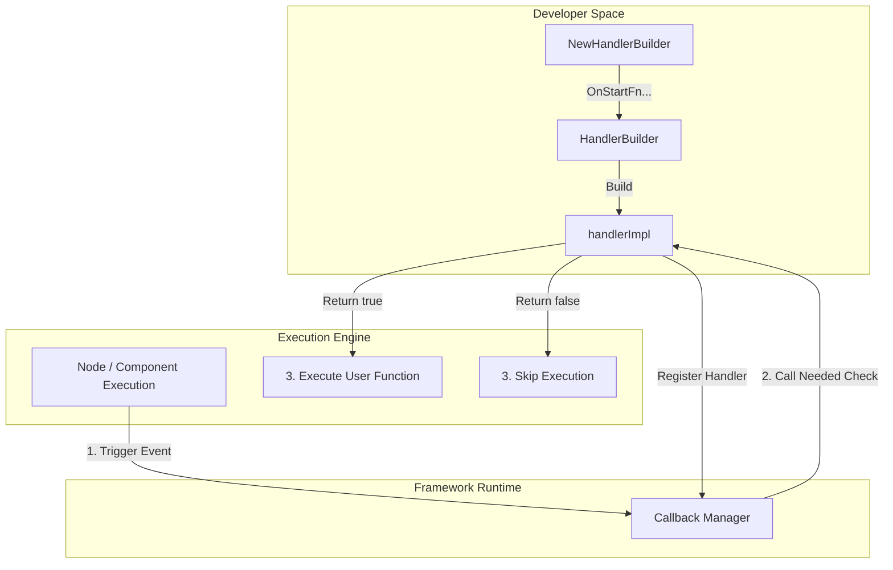

# `handler_builders` 模块深度解析

## 1. 模块存在的核心价值 (The Why)

在复杂的编排框架（如基于图的 Agent 引擎）中，生命周期回调（Callbacks）是实现可观测性、日志记录、链路追踪以及自定义拦截器的基础设施。然而，这也带来了一个经典的 API 设计问题：**庞大的接口与冗余的实现**。

一个完整的 Callback Handler 往往需要处理多种时机：节点开始 (`OnStart`)、结束 (`OnEnd`)、报错 (`OnError`)，以及流式输入/输出 (`OnStartWithStreamInput`, `OnEndWithStreamOutput`)。如果强制开发者为了监听某一个具体的事件（例如仅仅为了在 `OnError` 时打一条日志）而去实现包含上述 5 个方法的完整接口，会导致代码中充斥着毫无意义的“空方法”。

`handler_builders` 模块正是为了打破这种尴尬局面而生。它通过**流式构建器（Fluent Builder）模式**结合**函数闭包**，允许开发者像“自助点餐”一样，仅注册自己关心的回调时机。更巧妙的是，它不仅为了少写代码，还通过内部的 `Needed()` 机制实现了**零成本短路（Fail-Fast Optimization）**，避免了框架层面上无意义的接口调用和上下文切换。

## 2. 心智模型与架构流转 (Mental Model)

理解这个模块，你可以把它想象成一个**“机场安检通道的智能分流器”**。

在传统的接口实现中，所有的行李（请求上下文）都必须经过所有 5 个检查站（回调方法），哪怕其中 4 个检查站是关闭的（空方法），你也必须走完整个流程。
而 `handler_builders` 提供了一种机制：它在安检入口贴了一张清单（`Needed()` 方法），告诉调度员“我这个 Handler 只关心危险品（`OnError`）”。于是，常规行李直接跳过它，只有真正发生报错时，请求才会被引导至该 Handler。

### 架构依赖图



## 3. 核心组件深度解析 (Component Deep-Dives)

### `HandlerBuilder`：不可变快照的构建器
`HandlerBuilder` 是暴露给开发者的核心 API，它持有五个不同生命周期的函数指针。

**设计亮点与机制**：
- **链式调用（Fluent API）**：提供 `OnStartFn` 等方法返回自身指针，代码可读性极高。
- **构建时快照（Immutable Snapshot）**：当调用 `Build()` 时，代码为 `return &handlerImpl{*hb}`。这里使用了**值拷贝**将 `HandlerBuilder` 嵌入到 `handlerImpl` 中。这意味着 `Build()` 产出 Handler 之后，再去修改原有的 `HandlerBuilder` 不会影响已经构建出的 Handler，保证了运行时的线程安全与不可变性。

### `handlerImpl`：隐式强契约执行器
它是构建产物，实现了框架底层的 `Handler` 与 `TimingChecker` 接口。

**设计机制与隐含契约**：
它实现了各个回调的具体逻辑，例如：
```go
func (hb *handlerImpl) OnStart(ctx context.Context, info *RunInfo, input CallbackInput) context.Context {
        return hb.onStartFn(ctx, info, input)
}
```
**注意这里没有做 `if hb.onStartFn != nil` 的判断！** 
如果 `onStartFn` 为空，这行代码会直接引发空指针 Panic。为什么敢这么写？因为这里存在一个**严格的框架级契约**：
调度它的 `Callback Manager` **必须**在调用任何生命周期方法前，先调用 `Needed()` 方法。
```go
func (hb *handlerImpl) Needed(_ context.Context, _ *RunInfo, timing CallbackTiming) bool {
        switch timing {
        case TimingOnStart:
                return hb.onStartFn != nil
    // ...
        }
}
```
这种设计是一种**“性能优先”的权衡（Tradeoff）**：在核心执行链路（如高频度的流式响应输出）上，每次都做冗余的非空判断是不优雅的。通过前置的 `Needed()` 检查，不仅可以在更早的阶段（如 Manager 遍历 Handler 列表时）就直接剔除不相关的 Handler，还省去了无意义的参数组装开销。

## 4. 数据流与依赖关系 (Data Flow & Dependencies)

- **谁调用它 (Depended By)**：
  - **组件使用者 / 开发者**：在初始化 Model、Retriever 等组件，或者配置 Graph 运行选项时，通过它快速构建临时 Handler。
  - **Typed Templates (`utils.callbacks.template`)**：模块提供的更高级的强类型模板底层也会依赖类似机制构建执行单元。
- **它调用什么 (Depends On)**：
  - `schema.StreamReader`：流式输入输出需要依赖 schema 层定义的流式读取器结构。
  - `RunInfo` (`internal.callbacks.interface.RunInfo`)：这是所有回调都会接收到的参数，包含了当前正在执行的节点名称 (`Name`)、组件类型 (`Type`) 以及具体的组件实例 (`Component`)。

**数据契约 (Data Contract)**：
在它的 API 签名中：`func(ctx context.Context, info *RunInfo, input CallbackInput) context.Context`。
**上下文 `Context` 的流转是绝对核心。** 回调不仅是被动接收信息的观察者，还是**主动的数据修饰者**。返回的 `Context` 会接力传递给下游链路。这意味着你可以在 `OnStart` 中往 Context 塞入一个 TraceID 或者计时器，然后在 `OnEnd` 的 Context 中提取并计算耗时。

## 5. 设计决策与权衡 (Design Decisions & Tradeoffs)

1. **组合 vs 继承 (Composition over Inheritance)**
   - **选择**：使用函数指针的闭包组合，而非要求开发者定义一个实现了接口的空结构体。
   - **优势**：消除了大量样板代码。在 Go 语言中，匿名函数可以直接捕获外部变量（Closure），这比通过结构体字段传递状态要轻量得多。
   - **张力（Tension）**：Handler 本身失去了具体的“类型标识”（它只是个通用的 `handlerImpl`）。如果框架想要通过反射或者类型断言去区分特定类型的 Handler（比如 `if h, ok := handler.(*MyCustomLogger); ok`），这种模式是做不到的。

2. **泛型缺席下的 `any` (Type Erasure)**
   - `CallbackInput` 和 `CallbackOutput` 实际上是不带类型约束的泛型或接口（通常为 `any`）。因为框架是通用的，它不知道当前的回调是挂载在 ChatModel（输入是 Messages）还是 Retriever（输入是 Query）上。
   - **权衡**：开发者在编写自定义 `fn` 时，必须自己承担类型断言的责任与风险。

## 6. 避坑指南与最佳实践 (Gotchas & Workarounds)

### 🚨 必须返回 Context，不要返回 nil
**错误示范：**
```go
builder.OnStartFn(func(ctx context.Context, info *RunInfo, input CallbackInput) context.Context {
    log.Println("Node started:", info.Name)
    return nil // 致命错误！会导致下游组件丢失上下文甚至 Panic
})
```
**正确做法：**
如果不需要修改 Context，必须原封不动地返回传入的 `ctx`。

### 🚨 警惕类型断言陷阱
因为 `CallbackInput` 在不同组件（如 Model vs Graph Node）中类型不同，盲目断言会导致运行时崩溃。
```go
builder.OnStartFn(func(ctx context.Context, info *RunInfo, input CallbackInput) context.Context {
    // 最佳实践：结合 info.Type 做防护性断言
    if info.Type == "ChatModel" {
        if msgInput, ok := input.([]*schema.Message); ok {
            // 安全处理
        }
    }
    return ctx
})
```

## 7. 相关参考 (References)

- **内部核心抽象 (Core Abstractions)**: [`internal.callbacks.interface.RunInfo`](core_abstractions.md) - 定义了所有组件回调的基础上下文信息。
- **强类型回调模板 (Typed Templates)**: [`utils.callbacks.template.HandlerHelper`](typed_templates.md) - 构建于本模块之上的高级封装，为特定组件提供了强类型的回调开发体验。
- **Schema 核心流式定义 (Schema Stream)**: [`schema.stream.StreamReader`](schema_stream.md) - 用于 `OnStartWithStreamInput` 和 `OnEndWithStreamOutput` 方法中的流式数据操作。