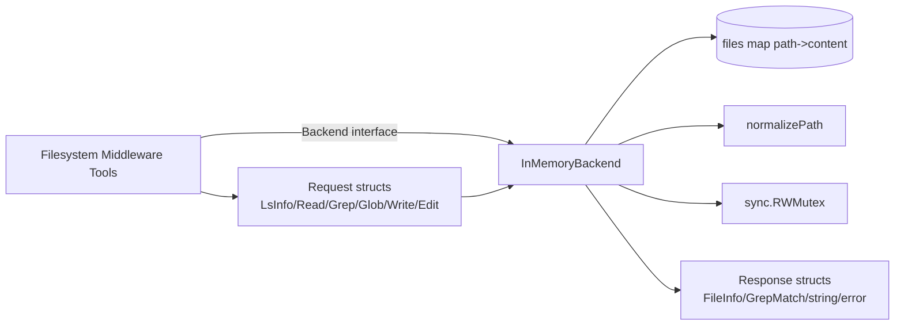

# in_memory_backend_implementation

`InMemoryBackend` 是一个“把文件系统假装成内存字典”的后端实现：它不触碰真实磁盘，只在进程内用 `map[string]string` 存文件内容，却对外暴露和真实文件后端一致的 `Backend` 接口。这个模块存在的核心价值，不是“再造一个简化版 fs”，而是给上层工具链（尤其是 filesystem middleware 与 agent tool surface）提供一个**可预测、低成本、可并发、便于测试**的存储替身。一个天真的做法是直接在测试中用真实文件系统，但那会引入权限、路径隔离、清理成本、平台差异（Windows/Linux path 行为）和执行副作用；`InMemoryBackend` 的设计洞察是：上层真正依赖的是“语义契约”（ls/read/grep/glob/write/edit），不是“磁盘本身”。只要守住契约，内存实现就能承担大部分开发与验证场景。

## 架构角色与数据流



从架构上看，它是一个非常典型的 **adapter + state holder**：上游通过 `Backend` 接口调用它，下游没有外部依赖（不调用 OS、DB、远端服务），所有状态都内聚在 `files` map 中。

数据流可以概括为三步。第一步，上游（通常是 filesystem 相关 middleware）把 tool 参数转换成 `*LsInfoRequest`、`*ReadRequest`、`*EditRequest` 等请求对象并调用接口。第二步，`InMemoryBackend` 先用 `normalizePath` 把路径规约到统一形式，再在 `RWMutex` 保护下读取或修改 `files`。第三步，它返回统一契约结构，如 `[]FileInfo`、`[]GrepMatch` 或格式化后的文本内容，错误也以接口语义返回（例如 `file not found`、`invalid glob pattern`）。

如果用类比来理解：它像一个“模拟仓库管理系统”。货架（`files`）在仓库内部，管理员（`RWMutex`）决定谁可以同时看库存、谁可以独占改库存，统一地址规范器（`normalizePath`）确保“1号库位”和“/1号库位/”不会被当成两个地方。

## 心智模型：这个模块“怎么思考”

读这段代码时，建议把它想成三个叠加层。

第一层是**协议层**：它并不定义自己的 API，而是实现 `Backend` 协议（`LsInfo`、`Read`、`GrepRaw`、`GlobInfo`、`Write`、`Edit`）。这意味着它的首要目标是“行为兼容”，不是“功能炫技”。

第二层是**状态层**：整个文件系统被压缩为 `map[filePath]content`。这天然意味着它只追踪“文件内容”，不显式建目录树、权限位、mtime 等元数据。目录概念是从路径字符串即时推导出来的。

第三层是**一致性层**：通过 `normalizePath` + `sync.RWMutex` 维持语义稳定。前者解决“同一路径不同写法”导致的键不一致；后者解决并发访问 map 的安全性与读写可见性。

## 组件深潜

### `type InMemoryBackend struct`

`InMemoryBackend` 只有两个字段：`mu sync.RWMutex` 和 `files map[string]string`。这个极简设计是刻意的：它把复杂度集中在方法语义，而不是数据结构层。代价是无法表达更丰富 fs 元数据；收益是可维护性高、行为可推断。

### `NewInMemoryBackend() *InMemoryBackend`

构造函数只做一件事：初始化空 map。这里没有配置项，体现了“零配置即用”的取向，适合作为默认测试后端或轻量运行时后端。

### `LsInfo(ctx, req)`

`LsInfo` 的关键并不是“遍历 map”，而是“模拟目录立即子项”。它会：

1. 规约 `req.Path`；
2. 遍历所有文件路径，筛选出在该路径下的条目；
3. 用 `strings.SplitN(relativePath, "/", 2)` 取第一段，构造 immediate child；
4. 用 `seen` 去重，避免同目录多文件导致重复目录项。

这说明它在无目录树前提下，通过字符串切分临时还原目录视图。你可以把它看成“按前缀聚类”的目录投影。

### `Read(ctx, req)`

`Read` 体现了两个契约决策：

- `Offset < 0` 归零；`Limit <= 0` 采用默认 200 行，防止无限制输出；
- 返回结果是带行号的字符串（`%6d\t...`），便于后续 agent/edit 工作流引用精确行。

注意它按 `\n` 分割后做行窗口裁剪，所以是“行分页”，不是字节分页。这更贴近人类编辑场景，但不适用于二进制内容。

### `GrepRaw(ctx, req)`

`GrepRaw` 是“路径过滤 + 文件名 glob 过滤 + 行包含匹配”的三段式流水线：

- 路径范围：默认根路径；
- glob：通过 `filepath.Match(req.Glob, filepath.Base(path))`，匹配的是 basename，不是完整相对路径；
- 内容匹配：`strings.Contains(line, req.Pattern)`，是字面子串，不是正则。

这个设计非常“工具导向”：实现简单、性能可接受、行为可解释。代价是表达力有限（无 regex、无大小写选项、无上下文行）。

### `GlobInfo(ctx, req)`

和 `GrepRaw` 类似，先做路径范围过滤，再对 `filepath.Base(normalizedFilePath)` 应用 glob。需要特别注意：虽然 `GlobInfoRequest` 注释常让人以为可做路径级 glob，但此实现只匹配文件 basename，因此像 `src/*.go` 这样的路径式模式在这里不会按预期工作。

### `Write(ctx, req)`

当前语义是“仅创建，不覆盖”：如果文件已存在直接报错 `file already exists`。这和很多人对“write 可覆盖”的直觉不同，但它与注释 “create or update” 存在张力。就实现事实而言，调用方如果要更新内容，需先 `Read` 再 `Edit`（或自行删除后重建，当前实现无 delete）。

### `Edit(ctx, req)`

`Edit` 体现了**安全编辑优先**：

- `OldString` 不能为空；
- 必须命中至少一次；
- 当 `ReplaceAll=false` 时，如果命中多次会失败，而不是“替换第一处后悄悄成功”。

这对 LLM 驱动的工具调用很关键：它防止模糊 patch 在多处重复代码块上误改。可以把它理解为“乐观但带歧义检测”的文本替换事务。

### `normalizePath(path string) string`

这是整个模块最容易被低估的函数。它做两件事：空串映射为 `/`，并保证路径以 `/` 开头后经 `filepath.Clean` 规约。没有它，`a/b`、`/a/b/`、`/a/../a/b` 可能变成不同 map key，导致读写错位。

## 依赖与契约分析

这个模块本身依赖很少，主要是标准库：

- `sync`：`RWMutex` 提供并发安全；
- `strings`：路径与内容匹配处理；
- `filepath`：路径清理与 glob 匹配；
- `fmt`：错误与读输出格式化；
- `context`：满足接口签名（当前实现未消费 context cancel/deadline）。

它对外实现的是 [backend_protocol_and_requests](backend_protocol_and_requests.md) 中的 `Backend` 协议，因此任何依赖该协议的上游都可以无缝替换到这个实现。根据模块树，最直接的上游场景是 filesystem middleware 配置项 `Config.Backend`。该配置注释还说明：若后端实现 `ShellBackend` 才会注册 execute 工具；`InMemoryBackend` 只实现 `Backend`，因此不会提供 execute 能力，这是一条重要能力边界。

换句话说，上游对它的隐式契约是：

1. 路径应按绝对路径语义传入（即便实现会宽容修正）；
2. `Read` 结果用于展示/编辑定位（带行号文本）；
3. `Edit` 可能因歧义拒绝修改，调用方需处理失败并重试更精确的 `OldString`。

## 设计取舍与背后原因

最核心的取舍是“简单确定性”优先于“完整文件系统语义”。

它没有目录实体、没有权限模型、没有符号链接、没有二进制模式、没有持久化，也没有 shell 执行。这样看似能力弱，但换来非常干净的测试属性：输入输出可预测，状态完全内存化，跨平台行为更一致。

并发策略上，使用单个 `RWMutex` 覆盖全局 map，是“低复杂度锁模型”。好处是实现正确性容易保证；代价是写冲突会串行化，且在超高并发下缺少分片粒度。

匹配语义上，`grep` 采用字面包含，`glob` 仅匹配 basename，这牺牲表达力换取可解释性与低认知负担。对 agent 场景来说，这通常是合理折中：模型更容易学会稳定调用方式。

## 使用方式与示例

```go
backend := NewInMemoryBackend()

_ = backend.Write(ctx, &WriteRequest{
    FilePath: "/app/main.go",
    Content:  "package main\n\nfunc main() {\n    println(\"hi\")\n}",
})

out, _ := backend.Read(ctx, &ReadRequest{FilePath: "/app/main.go", Offset: 0, Limit: 20})
// out 带行号，适合回传给工具调用者

_ = backend.Edit(ctx, &EditRequest{
    FilePath:   "/app/main.go",
    OldString:  "println(\"hi\")",
    NewString:  "println(\"hello\")",
    ReplaceAll: false,
})

matches, _ := backend.GrepRaw(ctx, &GrepRequest{Pattern: "main", Path: "/app"})
_ = matches
```

在 middleware 中使用时，直接把它注入 `filesystem.Config.Backend` 即可（接口兼容）。如果你需要 execute 工具，请改用实现了 `ShellBackend`/`StreamingShellBackend` 的后端；`InMemoryBackend` 不覆盖这部分能力。

## 新贡献者最该注意的坑

第一，`Write` 目前是“存在即报错”，不是覆盖写。很多调用方会误判这个行为，尤其从接口注释迁移时要特别核对。

第二，`GlobInfo` 与 `GrepRaw` 的 glob 都基于 `filepath.Base(...)`。如果你传了目录层级模式，结果可能与直觉不符。

第三，`Read` 是按行输出并附带行号格式，不是原始文件字节流。若把它再写回文件，需要去除行号。

第四，虽然方法都接收 `context.Context`，但当前实现没有在循环中检查 `ctx.Done()`。在超大内存数据集下，取消不会及时生效。

第五，路径规约依赖 `filepath.Clean`，它会处理 `..`、重复斜杠等；这提升一致性，但也意味着某些“原始路径字符串”信息会丢失。

## 扩展建议（面向后续演进）

如果后续要增强该模块，建议先明确目标是“测试替身”还是“轻量生产后端”。前者继续保持极简，最多补齐 `Delete`/`Overwrite` 显式策略；后者则需要引入更完整元数据模型、path-level glob 语义、context cancel 支持，以及可能的 snapshot/persistence 机制。

## 参考文档

- [backend_protocol_and_requests](backend_protocol_and_requests.md)
- [ADK Filesystem Middleware](ADK Filesystem Middleware.md)
- [Component Interfaces](Component Interfaces.md)
