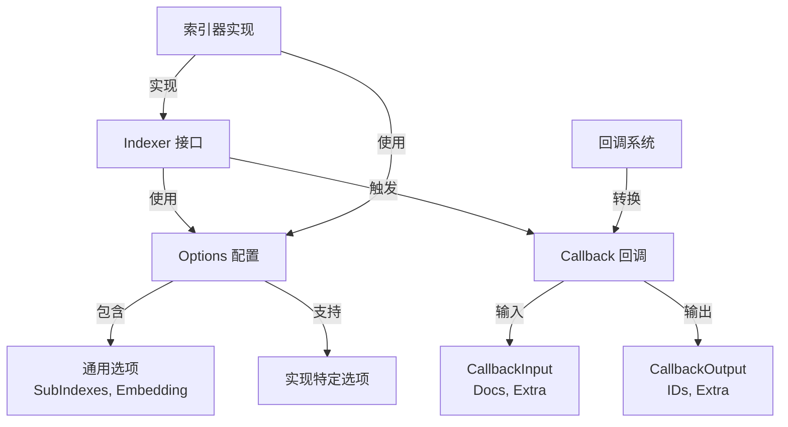

# indexer_options_and_callbacks 模块技术深度解析

## 1. 模块概述与核心问题

想象一下，你正在构建一个文档索引系统，需要支持多种索引后端（如向量数据库、全文搜索引擎等）。每个索引器需要处理的不只是简单的文档存储，还需要处理嵌入计算、子索引管理、以及执行前后的钩子逻辑。如果每个索引器实现都自己处理这些通用功能，会导致大量重复代码，且难以统一监控和扩展。

这就是 `indexer_options_and_callbacks` 模块要解决的问题：它为索引器组件提供了统一的**配置契约**和**回调契约**，让索引器实现者只需关注核心索引逻辑，而通用功能（如嵌入器选择、子索引管理、执行前后的钩子）则由基础设施统一处理。

## 2. 核心架构与心智模型

### 2.1 架构图



### 2.2 心智模型

可以把这个模块想象成**索引器的"操作系统接口层"**：

- **Options** 像是索引器的"配置面板"，既有所有索引器都需要的通用控件（嵌入器、子索引），也预留了给特定实现的自定义插槽。
- **CallbackInput/Output** 像是索引器执行的"信封"，封装了标准的输入输出数据，同时也预留了扩展空间。
- **回调转换函数** 像是"适配器"，让通用回调系统能理解索引器特定的输入输出格式。

## 3. 核心组件深度解析

### 3.1 Options - 索引器配置

#### 设计意图
Options 结构体定义了所有索引器实现都必须支持的通用配置。它采用了**函数式选项模式**，提供了灵活的配置方式。

#### 核心字段
```go
type Options struct {
    SubIndexes []string          // 要索引的子索引列表
    Embedding   embedding.Embedder // 用于将文档转换为向量的嵌入器
}
```

**SubIndexes** 字段允许索引器支持多租户或分库分表的场景，比如将不同类型的文档存入不同的子索引中。

**Embedding** 字段解耦了索引器和嵌入器，让同一个索引器可以使用不同的嵌入实现，也让嵌入器可以被多个组件复用。

#### 函数式选项

```go
func WithSubIndexes(subIndexes []string) Option
func WithEmbedding(emb embedding.Embedder) Option
```

这些函数返回 `Option` 类型，该类型内部包含一个 `apply` 函数，用于修改 `Options` 结构体。这种模式的优势在于：

1. **可选参数**：调用者可以只设置需要的参数
2. **向后兼容**：添加新选项不会破坏现有代码
3. **自文档化**：选项函数名本身就是文档

#### 通用与特定选项的分离

模块巧妙地将选项分为两类：

1. **通用选项**：所有索引器都支持的选项（SubIndexes、Embedding）
2. **实现特定选项**：特定索引器实现才支持的选项

```go
type Option struct {
    apply func(opts *Options)           // 通用选项应用函数
    implSpecificOptFn any                // 实现特定选项函数
}
```

这种设计让索引器接口保持统一，同时又允许特定实现可以有自己的扩展。

### 3.2 CallbackInput - 回调输入

#### 设计意图
CallbackInput 定义了索引器回调的标准输入格式，确保所有索引器的回调输入都遵循相同的结构。

```go
type CallbackInput struct {
    Docs  []*schema.Document // 要索引的文档列表
    Extra map[string]any    // 额外信息，用于扩展
}
```

**Docs** 字段是回调的核心数据，包含了即将被索引的文档。

**Extra** 字段是一个通用的映射，允许在不破坏现有接口的情况下传递额外信息，这是一种**前向兼容**的设计。

#### ConvCallbackInput 函数

```go
func ConvCallbackInput(src callbacks.CallbackInput) *CallbackInput
```

这个函数是回调系统的"翻译官"，它将通用的 `callbacks.CallbackInput` 转换为索引器特定的 `CallbackInput`。它支持两种输入类型：

1. 已经是 `*CallbackInput` 类型的直接返回
2. `[]*schema.Document` 类型的包装成 `*CallbackInput`

这种设计让索引器可以直接将文档列表作为回调输入，提高了灵活性。

### 3.3 CallbackOutput - 回调输出

#### 设计意图
CallbackOutput 定义了索引器回调的标准输出格式，确保所有索引器的回调输出都遵循相同的结构。

```go
type CallbackOutput struct {
    IDs   []string       // 索引器返回的已索引文档的 ID 列表
    Extra map[string]any    // 额外信息，用于扩展
}
```

**IDs** 字段是回调的核心结果，包含了索引器为每个文档生成的唯一标识符。这些 ID 通常用于后续的检索、更新或删除操作。

**Extra** 字段同样是一个通用的映射，用于传递额外的输出信息。

#### ConvCallbackOutput 函数

```go
func ConvCallbackOutput(src callbacks.CallbackOutput) *CallbackOutput
```

这个函数与 `ConvCallbackInput` 类似，将通用的 `callbacks.CallbackOutput` 转换为索引器特定的 `CallbackOutput`，支持两种输入类型：

1. 已经是 `*CallbackOutput` 类型的直接返回
2. `[]string` 类型的包装成 `*CallbackOutput`

## 4. 数据流与依赖关系

### 4.1 配置数据流

```
调用者 → Option 函数 → Option 结构体 → 索引器实现
         ↑
         └─ GetCommonOptions/GetImplSpecificOptions
```

当调用者使用 `WithSubIndexes` 或 `WithEmbedding` 等函数创建选项时，这些函数返回的 `Option` 对象会被收集起来，然后通过 `GetCommonOptions` 函数应用到 `Options` 结构体上。索引器实现会从这个结构体中读取配置。

对于实现特定的选项则通过 `GetImplSpecificOptions` 函数提取到特定类型的选项结构体。

### 4.2 回调数据流

```
索引器实现 → CallbackInput → 回调系统
         ↓
    CallbackOutput
         ↓
    回调系统处理
```

当索引器执行时，它会创建 `CallbackInput`，并通过 `ConvCallbackInput` 转换后传递给回调系统。执行完成后，索引器创建 `CallbackOutput`，同样通过 `ConvCallbackOutput` 转换后传递给回调系统。

### 4.3 依赖关系

- **依赖**：
  - `embedding.Embedder`：用于文档嵌入
  - `schema.Document`：文档数据结构
  - `callbacks.CallbackInput/Output`：回调系统接口

- **被依赖**：
  - 索引器实现：使用该模块定义的接口和类型
  - 回调系统：处理索引器的回调

## 5. 设计权衡与决策

### 5.1 函数式选项模式 vs 结构体配置

**选择**：函数式选项模式

**原因**：
- 灵活性：允许可选参数，调用者只需设置需要的参数
- 向后兼容：添加新选项不会破坏现有代码
- 自文档化：选项函数名本身就是文档

**权衡**：
- 代码稍显冗长
- 编译时无法检查所有必需参数

### 5.2 通用与特定选项分离

**选择**：在同一个 `Option` 类型中包含通用和特定选项

**原因**：
- 统一接口：调用者使用相同的方式传递所有选项
- 简化使用：不需要区分通用和特定选项

**权衡**：
- 类型安全：实现特定选项在运行时才进行类型检查
- 稍微复杂的实现

### 5.3 Extra 字段的存在

**选择**：在 `CallbackInput` 和 `CallbackOutput` 中添加 `Extra` 字段

**原因**：
- 前向兼容：可以在不破坏现有接口的情况下添加新字段
- 灵活性：允许实现可以传递特定实现的额外信息

**权衡**：
- 类型不安全：`Extra` 字段是 `map[string]any`，需要类型断言
- 可能被滥用：需要规范使用

## 6. 使用指南与示例

### 6.1 配置索引器

```go
// 创建索引器选项
opts := []indexer.Option{
    indexer.WithSubIndexes([]string{"index1", "index2"}),
    indexer.WithEmbedding(myEmbedder),
    // 实现特定选项
    myIndexer.WithSpecificOption("value"),
}

// 使用选项创建索引器
idx, err := NewMyIndexer(opts...)
```

### 6.2 实现索引器

```go
func (i *MyIndexer) Store(ctx context.Context, docs []*schema.Document, opts ...indexer.Option) ([]string, error) {
    // 提取通用选项
    commonOpts := indexer.GetCommonOptions(nil, opts...)
    
    // 提取实现特定选项
    specificOpts := indexer.GetImplSpecificOptions(&MySpecificOptions{}, opts...)
    
    // 使用 commonOpts 和 specificOpts 进行索引操作
    // ...
    
    return ids, nil
}
```

### 6.3 使用回调

```go
// 在索引器实现中触发回调
func (i *MyIndexer) Store(ctx context.Context, docs []*schema.Document, opts ...indexer.Option) ([]string, error) {
    // 触发前置回调
    cbInput := &indexer.CallbackInput{
        Docs: docs,
    }
    callbacks.OnStart(ctx, cbInput)
    
    // 执行索引操作
    ids, err := i.doIndex(docs)
    
    // 触发后置回调
    cbOutput := &indexer.CallbackOutput{
        IDs: ids,
    }
    callbacks.OnEnd(ctx, cbOutput)
    
    return ids, err
}
```

## 7. 注意事项与陷阱

### 7.1 必需选项

虽然函数式选项模式的灵活性也带来了一个问题：无法在编译时检查必需选项。索引器实现应该在运行时检查必需的选项是否已设置，否则会导致运行时错误。

### 7.2 实现特定选项的类型安全

实现特定选项在运行时才进行类型检查，所以需要确保传递的选项类型正确。

### 7.3 Extra 字段的使用规范

Extra 字段应该谨慎使用，避免滥用。最好在文档中明确 Extra 字段的使用规范，确保不同实现之间的兼容性。

### 7.4 回调转换

回调转换函数可能返回 nil，需要处理这种情况。

## 8. 相关模块

- [embedding_options_and_callbacks](embedding_options_and_callbacks.md)：嵌入器的选项和回调
- [retriever_options_and_callbacks](retriever_options_and_callbacks.md)：检索器的选项和回调
- [document_options_and_callbacks](document_options_and_callbacks.md)：文档处理的选项和回调
