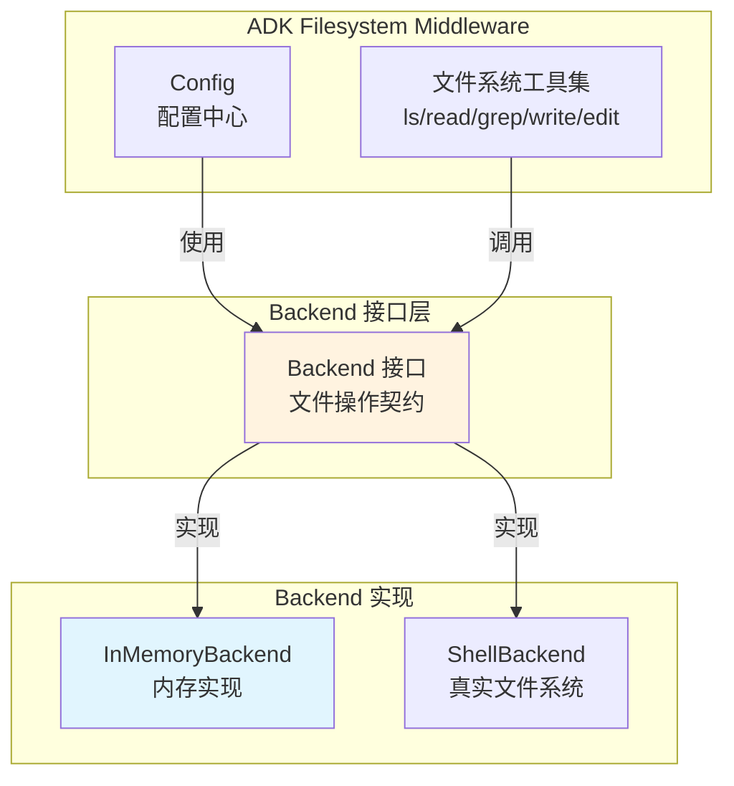

# InMemoryBackend 模块技术深度解析

## 概述：为什么需要内存中的"文件系统"？

想象一下，你正在开发一个能够操作文件系统的 AI Agent。这个 Agent 需要读取文件、搜索内容、修改代码——所有这些都是通过工具调用来完成的。现在，你需要测试这个 Agent，但直接让它操作真实文件系统是个糟糕的主意：测试会污染开发环境、并发测试会互相干扰、测试后的清理工作令人头疼。

`InMemoryBackend` 就是为了解决这个问题而生的。它是一个**完全在内存中模拟文件系统行为的后端实现**，实现了 [`Backend`](../adk.filesystem.backend.Backend.md) 接口定义的所有文件操作契约。它的核心价值在于：

1. **隔离性**：每个测试用例可以拥有独立的"文件系统"，互不干扰
2. **可预测性**：没有磁盘 I/O 的不确定性，测试速度快且结果稳定
3. **安全性**：Agent 再怎么"折腾"也不会删除你的重要文件
4. **可观测性**：你可以随时检查内存中存储的所有文件状态，便于调试

这个模块的设计哲学是：**在保持接口行为与真实文件系统一致的前提下，用最小的复杂度实现核心功能**。它不是要替代真实文件系统，而是要成为开发和测试阶段的可靠替身。

## 架构定位与数据流

### 模块在系统中的位置



`InMemoryBackend` 在架构中扮演着**可插拔实现**的角色：

- **上游调用者**：[`Config`](../adk.middlewares.filesystem.filesystem.Config.md) 通过 `Backend` 字段持有它的引用，文件系统工具集（ls、read、grep、write、edit）通过接口调用它
- **下游依赖**：仅依赖 Go 标准库（`sync`、`strings`、`filepath`），没有外部依赖
- **接口契约**：严格遵循 [`Backend`](../adk.filesystem.backend.Backend.md) 接口定义的 6 个方法

### 核心数据结构

```go
type InMemoryBackend struct {
    mu    sync.RWMutex
    files map[string]string // map[filePath]content
}
```

这个设计极其简洁，但蕴含了几个关键决策：

1. **`map[string]string`**：文件路径到内容的直接映射。没有复杂的目录树结构，所有路径都是归一化后的绝对路径。这种扁平化设计牺牲了某些目录操作的效率，但换来了实现的简单性和可预测性。

2. **`sync.RWMutex`**：读写锁的选择反映了对并发场景的考量。读操作（`LsInfo`、`Read`、`GrepRaw`、`GlobInfo`）可以并发执行，只有写操作（`Write`、`Edit`）需要独占锁。在测试场景中，虽然并发不是主要诉求，但这个设计保证了它在并发测试环境中的安全性。

3. **没有元数据**：注意 `FileInfo` 只包含 `Path` 字段，没有大小、修改时间、权限等信息。这是有意为之的简化——对于 Agent 测试场景，文件内容本身才是核心，元数据是次要的。

## 核心组件深度解析

### 1. InMemoryBackend 结构体

**设计意图**：提供一个线程安全的、内存中的文件存储容器。

**内部机制**：
- `files` map 的键是归一化后的绝对路径（始终以 `/` 开头，没有 trailing slash）
- 值是文件的完整内容（字符串）
- 所有对 `files` 的访问都必须通过锁保护

**关键设计决策**：

为什么选择 `map[string]string` 而不是更复杂的树形结构？

这是一个典型的**简单性 vs 功能完整性**的权衡。树形结构（如 `map[string]*Directory`）可以更高效地支持目录操作，但会显著增加实现复杂度。考虑到这个模块的主要使用场景是测试，而测试中的文件数量通常有限，O(n) 的遍历操作完全可以接受。更重要的是，扁平结构让代码更容易理解和维护——新加入的开发者一眼就能看懂数据存储方式。

### 2. 路径归一化：`normalizePath`

```go
func normalizePath(path string) string {
    if path == "" {
        return "/"
    }
    if !strings.HasPrefix(path, "/") {
        path = "/" + path
    }
    return filepath.Clean(path)
}
```

**为什么需要这个函数？**

这是整个模块的**隐形守护者**。想象一下，如果没有路径归一化：
- `/foo/bar` 和 `foo/bar` 会被视为两个不同的文件
- `/foo/../bar` 和 `/bar` 也会被视为不同
- 路径中的 `./` 和多余的 `/` 会导致重复存储

`normalizePath` 确保所有路径在进入 `files` map 之前都被转换为标准形式。它做了三件事：
1. 空路径视为根目录 `/`
2. 相对路径转换为绝对路径（添加前导 `/`）
3. 使用 `filepath.Clean` 清理 `..`、`.` 和重复的 `/`

**潜在的陷阱**：这个函数假设所有路径都是 Unix 风格的。在 Windows 上运行时，`filepath.Clean` 的行为可能会有所不同，这是一个需要注意的边界情况。

### 3. 读操作：`Read`

```go
func (b *InMemoryBackend) Read(ctx context.Context, req *ReadRequest) (string, error)
```

**设计意图**：模拟文件读取，支持分页（基于行号的 offset 和 limit）。

**内部机制**：
1. 获取读锁（`RLock`）
2. 归一化文件路径
3. 检查文件是否存在
4. 按行分割内容
5. 根据 offset 和 limit 截取行范围
6. 格式化输出（每行带行号）

**关键设计决策**：

为什么返回带行号的格式化文本，而不是原始内容？

这是一个**面向 Agent 体验**的设计。Agent 在读取文件时，通常需要知道它正在查看的是文件的哪一部分。行号提供了上下文定位信息，让 Agent 能够准确地说"在第 42 行修改..."。如果返回原始内容，Agent 需要自己计算行号，这会增加出错的可能性。

**默认行为**：
- `offset < 0` 视为 0
- `limit <= 0` 默认为 200 行

这个设计防止了 Agent 意外读取超大文件导致上下文爆炸。

### 4. 写操作：`Write`

```go
func (b *InMemoryBackend) Write(ctx context.Context, req *WriteRequest) error
```

**设计意图**：创建新文件（如果文件已存在则报错）。

**关键约束**：如果文件已存在，返回错误。这是一个**保护性设计**，防止意外覆盖。如果需要修改现有文件，应该使用 `Edit` 方法。

**为什么这样设计？**

这反映了两种不同的操作语义：
- `Write` = "创建新文件"（类似 `touch` + 写入）
- `Edit` = "修改现有文件"（需要指定要替换的内容）

这种分离让 Agent 的意图更加明确，也减少了误操作的风险。

### 5. 编辑操作：`Edit`

```go
func (b *InMemoryBackend) Edit(ctx context.Context, req *EditRequest) error
```

**设计意图**：精确替换文件中的字符串。

**内部机制**：
1. 获取写锁（`Lock`）
2. 检查文件是否存在
3. 验证 `OldString` 非空
4. 检查 `OldString` 是否存在于文件中
5. 根据 `ReplaceAll` 标志决定替换行为
6. 如果 `ReplaceAll=false`，确保 `OldString` 只出现一次

**关键设计决策**：

为什么 `ReplaceAll=false` 时要求字符串唯一？

这是一个**安全性 vs 便利性**的权衡。如果文件中有多处匹配，而 Agent 只想修改其中一处，它需要提供更精确的 `OldString`（包含更多上下文）。这个约束迫使 Agent 提供足够的上下文来唯一标识要修改的位置，从而减少误修改的风险。

**潜在问题**：这个检查有一个边界情况——代码先找到第一个出现位置，然后检查后面是否还有。但如果 `OldString` 是空字符串（已被前面的检查排除）或者 `NewString` 包含 `OldString`，可能会导致意外行为。

### 6. 列表操作：`LsInfo`

```go
func (b *InMemoryBackend) LsInfo(ctx context.Context, req *LsInfoRequest) ([]FileInfo, error)
```

**设计意图**：列出指定路径下的直接子项（文件或目录）。

**内部机制**：
1. 遍历所有文件
2. 筛选出在指定路径下的文件
3. 提取直接子项（不是递归的）
4. 使用 `seen` map 去重（因为目录是从文件路径推断的）

**关键设计决策**：

为什么目录是"推断"出来的？

因为 `files` map 只存储文件，不显式存储目录。目录的存在是通过文件路径推断的。例如，如果有文件 `/foo/bar/baz.txt`，那么 `/foo` 和 `/foo/bar` 都被视为存在的目录。

这种设计简化了数据结构，但带来了一个限制：**无法创建空目录**。如果你需要目录结构，必须先在其中创建文件。

### 7. 搜索操作：`GrepRaw`

```go
func (b *InMemoryBackend) GrepRaw(ctx context.Context, req *GrepRequest) ([]GrepMatch, error)
```

**设计意图**：在文件内容中搜索字面量字符串（不是正则表达式）。

**内部机制**：
1. 遍历所有文件
2. 根据 `Path` 和 `Glob` 过滤文件
3. 逐行搜索 `Pattern`
4. 返回匹配的行（包含文件路径、行号、内容）

**关键设计决策**：

为什么使用字面量匹配而不是正则表达式？

这是一个**安全性 vs 表达能力**的权衡。正则表达式功能强大，但也更复杂、更容易出错（特别是对于 Agent 生成的模式）。字面量匹配简单、可预测，对于大多数"查找 TODO"、"查找函数名"的场景已经足够。

### 8. 通配符匹配：`GlobInfo`

```go
func (b *InMemoryBackend) GlobInfo(ctx context.Context, req *GlobInfoRequest) ([]FileInfo, error)
```

**设计意图**：根据 glob 模式匹配文件路径。

**内部机制**：
1. 遍历所有文件
2. 使用 `filepath.Match` 匹配文件名
3. 返回匹配的文件信息

**注意**：这里的 glob 匹配只针对文件名（`filepath.Base`），不是完整路径。如果需要路径匹配，应该结合 `Path` 参数使用。

## 依赖关系分析

### 上游依赖（谁调用它）

1. **[`Config`](../adk.middlewares.filesystem.filesystem.Config.md)**：通过 `Backend` 字段持有 `InMemoryBackend` 的引用
2. **文件系统工具集**：ls、read_file、grep、glob、write_file、edit_file 等工具通过接口调用它
3. **测试代码**：单元测试和集成测试中广泛使用

### 下游依赖（它调用谁）

1. **Go 标准库**：
   - `sync.RWMutex`：并发控制
   - `strings`：字符串操作
   - `filepath`：路径处理
   - `fmt`：格式化输出
   - `context`：上下文传递（虽然当前实现没有使用）

2. **接口定义**：
   - [`Backend`](../adk.filesystem.backend.Backend.md)：必须实现的接口契约
   - [`LsInfoRequest`](../adk.filesystem.backend.LsInfoRequest.md)、[`ReadRequest`](../adk.filesystem.backend.ReadRequest.md) 等：请求/响应数据结构

### 数据契约

所有方法都遵循严格的输入输出契约：

| 方法 | 输入 | 输出 | 错误条件 |
|------|------|------|----------|
| `LsInfo` | `*LsInfoRequest` | `[]FileInfo, error` | 路径无效 |
| `Read` | `*ReadRequest` | `string, error` | 文件不存在 |
| `GrepRaw` | `*GrepRequest` | `[]GrepMatch, error` | glob 模式无效 |
| `GlobInfo` | `*GlobInfoRequest` | `[]FileInfo, error` | glob 模式无效 |
| `Write` | `*WriteRequest` | `error` | 文件已存在 |
| `Edit` | `*EditRequest` | `error` | 文件不存在、OldString 为空或不存在 |

## 设计权衡与决策

### 1. 简单性 vs 功能完整性

**选择**：优先简单性

`InMemoryBackend` 有意省略了许多真实文件系统的特性：
- 没有文件权限
- 没有修改时间
- 没有符号链接
- 没有空目录
- 没有原子操作

**理由**：这个模块的主要用途是测试，而不是生产环境的文件系统模拟。添加这些特性会增加复杂度，但对测试场景的价值有限。如果需要更完整的模拟，应该使用 [`ShellBackend`](../adk.filesystem.backend.ShellBackend.md)。

### 2. 性能 vs 正确性

**选择**：优先正确性

`LsInfo`、`GrepRaw`、`GlobInfo` 都采用 O(n) 遍历所有文件的方式，而不是使用索引或树形结构加速。

**理由**：测试场景中的文件数量通常有限（几十到几百个），O(n) 完全可以接受。更重要的是，简单的实现更容易验证正确性，减少 bug 的可能性。

### 3. 并发安全 vs 性能

**选择**：优先并发安全

使用 `RWMutex` 保护所有对 `files` map 的访问。

**理由**：虽然测试场景通常是单线程的，但并发安全让模块可以在更广泛的场景中使用（如并发测试）。读锁允许多个读操作并发执行，减少了不必要的阻塞。

### 4. 严格验证 vs 宽松容错

**选择**：混合策略

- `Write` 严格：文件已存在时报错
- `Edit` 严格：`OldString` 必须唯一（当 `ReplaceAll=false`）
- `Read` 宽松：offset/limit 超出范围时返回空或部分结果，不报错

**理由**：写操作的严格性防止意外数据丢失，读操作的宽松性让 Agent 更容易处理边界情况。

## 使用指南

### 基本使用

```go
import "github.com/cloudwego/kitex/ADK/filesystem/backend_inmemory"

// 创建内存后端
backend := filesystem.NewInMemoryBackend()

// 写入文件
err := backend.Write(ctx, &filesystem.WriteRequest{
    FilePath: "/test/hello.txt",
    Content:  "Hello, World!",
})

// 读取文件
content, err := backend.Read(ctx, &filesystem.ReadRequest{
    FilePath: "/test/hello.txt",
    Offset:   0,
    Limit:    10,
})

// 列出目录
files, err := backend.LsInfo(ctx, &filesystem.LsInfoRequest{
    Path: "/test",
})

// 搜索内容
matches, err := backend.GrepRaw(ctx, &filesystem.GrepRequest{
    Pattern: "Hello",
    Path:    "/test",
})

// 编辑文件
err := backend.Edit(ctx, &filesystem.EditRequest{
    FilePath:   "/test/hello.txt",
    OldString:  "World",
    NewString:  "ADK",
    ReplaceAll: false,
})
```

### 在测试中使用

```go
func TestAgentWithFilesystem(t *testing.T) {
    // 为每个测试创建独立的内存后端
    backend := filesystem.NewInMemoryBackend()
    
    // 预置测试文件
    backend.Write(ctx, &filesystem.WriteRequest{
        FilePath: "/src/main.go",
        Content:  "package main\n\nfunc main() {\n\t// TODO: implement\n}",
    })
    
    // 配置 Agent 使用内存后端
    config := &filesystem.Config{
        Backend: backend,
    }
    
    // 运行测试...
}
```

### 与真实后端的切换

```go
// 测试环境
backend := filesystem.NewInMemoryBackend()

// 生产环境
backend := filesystem.NewShellBackend("/")

// 通过配置注入
config := &filesystem.Config{
    Backend: backend,
}
```

## 边界情况与陷阱

### 1. 路径归一化的边界情况

```go
// 这些路径都指向同一个文件
"/foo/bar"
"/foo/../foo/bar"
"/foo/./bar"
"foo/bar"  // 相对路径会被转换为绝对路径
```

**陷阱**：如果你直接操作 `files` map（不应该这样做），可能会因为路径格式不一致而找不到文件。始终通过接口方法访问。

### 2. Edit 操作的唯一性约束

```go
// 文件内容："foo bar foo"
// 这个 Edit 会失败，因为 "foo" 出现多次
backend.Edit(ctx, &EditRequest{
    FilePath:   "/test.txt",
    OldString:  "foo",
    NewString:  "baz",
    ReplaceAll: false,  // 会报错
})

// 正确做法：提供更多上下文
backend.Edit(ctx, &EditRequest{
    FilePath:   "/test.txt",
    OldString:  "foo bar foo",
    NewString:  "baz bar foo",
    ReplaceAll: false,
})
```

### 3. 空目录问题

```go
// 这个操作不会创建目录
backend.LsInfo(ctx, &LsInfoRequest{Path: "/empty"})  // 返回空列表

// 要"创建"目录，需要在其中创建文件
backend.Write(ctx, &WriteRequest{
    FilePath: "/empty/.gitkeep",
    Content:  "",
})
```

### 4. 并发修改的可见性

虽然 `InMemoryBackend` 是线程安全的，但读操作获取的是数据的快照。如果在读操作执行期间有写操作，读操作不会看到部分写入的状态，但可能看到写入前或写入后的状态（取决于锁的获取时机）。

### 5. 不支持 ShellBackend 接口

`InMemoryBackend` 只实现了 `Backend` 接口，没有实现 [`ShellBackend`](../adk.filesystem.backend.ShellBackend.md) 的 `Execute` 方法。这意味着：

- 无法执行 shell 命令
- 配置中的 `Execute` 工具不会被注册

如果需要命令执行能力，应该使用 [`ShellBackend`](../adk.filesystem.backend.ShellBackend.md) 或 [`StreamingShellBackend`](../adk.filesystem.backend.StreamingShellBackend.md)。

## 扩展点

### 实现自定义 Backend

如果需要特殊行为，可以实现 `Backend` 接口：

```go
type CustomBackend struct {
    // 自定义字段
}

func (b *CustomBackend) LsInfo(ctx context.Context, req *LsInfoRequest) ([]FileInfo, error) {
    // 自定义实现
}

// 实现其他方法...
```

### 装饰器模式

可以在 `InMemoryBackend` 外层包装自定义逻辑：

```go
type LoggingBackend struct {
    backend *InMemoryBackend
}

func (b *LoggingBackend) Write(ctx context.Context, req *WriteRequest) error {
    log.Printf("Writing to %s", req.FilePath)
    return b.backend.Write(ctx, req)
}

// 委托其他方法...
```

## 相关模块

- [`Backend`](../adk.filesystem.backend.Backend.md)：接口定义
- [`ShellBackend`](../adk.filesystem.backend.ShellBackend.md)：真实文件系统实现
- [`Config`](../adk.middlewares.filesystem.filesystem.Config.md)：配置中心
- [`toolResultOffloading`](../adk.middlewares.filesystem.large_tool_result.toolResultOffloading.md)：大结果卸载机制（使用 Backend 存储）

## 总结

`InMemoryBackend` 是一个典型的"简单但正确"的设计。它没有试图模拟真实文件系统的所有特性，而是专注于提供核心功能的可靠实现。这种克制的设计哲学让它成为了测试和开发场景中的理想选择——足够简单以至于不容易出错，足够完整以至于能够支持大多数测试场景。

对于新加入的开发者，理解这个模块的关键是认识到它的**定位**：它不是要替代真实文件系统，而是要成为开发和测试阶段的可靠替身。理解了这一点，很多设计决策（如省略元数据、使用扁平存储结构、严格的编辑约束）就变得顺理成章了。
