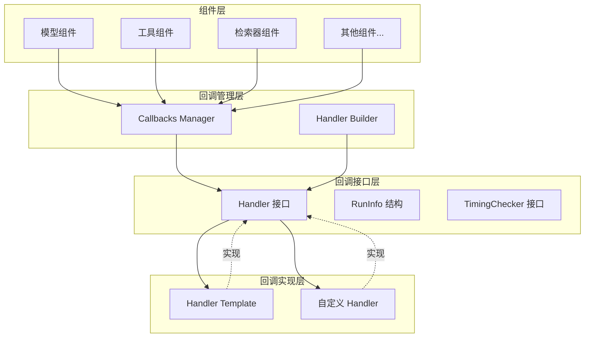
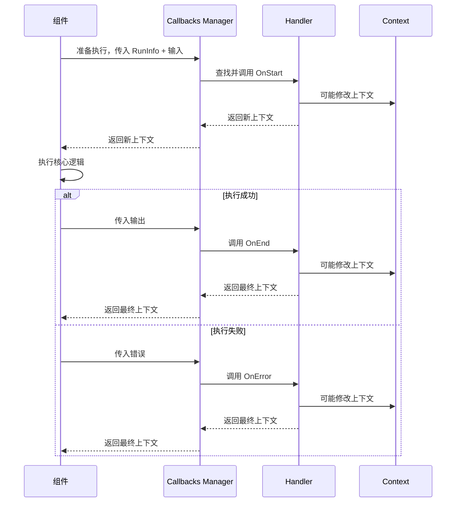

# Callbacks Interface 模块技术深度解析

## 1. 模块概述

**Callbacks Interface 模块** 是整个系统中回调机制的核心抽象层，它定义了回调处理的基本契约和数据结构。这个模块存在的意义是为系统中的各个组件（如模型、工具、检索器等）提供一个统一的、可扩展的观测点，让开发者能够在不修改核心业务逻辑的情况下，插入自定义的观测、监控、调试或增强逻辑。

想象一下，如果没有这个抽象层，每个组件都需要自己实现一套回调机制，代码会变得重复且难以维护。而有了这个接口定义，就像给所有组件安装了一个标准的"插座"，任何符合接口规范的回调处理器都可以"插"到任何组件上，实现灵活的功能扩展。

## 2. 核心组件解析

### 2.1 RunInfo 结构体

`RunInfo` 是回调系统中的核心数据结构，它承载了当前运行组件的关键信息：

```go
type RunInfo struct {
    // Name 是图节点的显示名称，不唯一
    // 通过 compose.WithNodeName() 传递
    Name      string
    Type      string
    Component components.Component
}
```

**设计意图**：
- `Name` 字段用于人类可读的标识，它不要求唯一，因为同一个组件类型可能在图中出现多次
- `Type` 字段标识组件的类型（如 "model"、"tool"、"retriever" 等）
- `Component` 字段持有实际的组件实例，让回调处理器可以访问组件的具体信息

### 2.2 Handler 接口

`Handler` 是回调系统的核心接口，定义了回调处理器必须实现的方法：

```go
type Handler interface {
    OnStart(ctx context.Context, info *RunInfo, input CallbackInput) context.Context
    OnEnd(ctx context.Context, info *RunInfo, output CallbackOutput) context.Context
    OnError(ctx context.Context, info *RunInfo, err error) context.Context
    OnStartWithStreamInput(ctx context.Context, info *RunInfo, input *schema.StreamReader[CallbackInput]) context.Context
    OnEndWithStreamOutput(ctx context.Context, info *RunInfo, output *schema.StreamReader[CallbackOutput]) context.Context
}
```

**设计意图解析**：

1. **生命周期方法**：接口定义了组件运行的三个关键生命周期节点：
   - `OnStart`：组件开始执行前
   - `OnEnd`：组件成功执行后
   - `OnError`：组件执行出错时

2. **流式处理支持**：特别提供了 `OnStartWithStreamInput` 和 `OnEndWithStreamOutput` 方法，专门处理流式输入输出的场景，这对于大语言模型等需要流式处理的组件至关重要。

3. **上下文传递**：所有方法都接收并返回 `context.Context`，这使得回调处理器可以：
   - 从上下文中提取信息
   - 向上下文中注入新的信息
   - 控制执行流程（如取消、超时等）

### 2.3 TimingChecker 接口

```go
type TimingChecker interface {
    Needed(ctx context.Context, info *RunInfo, timing CallbackTiming) bool
}
```

**设计意图**：
这个接口提供了一种动态决定是否需要触发回调的机制。通过实现 `Needed` 方法，开发者可以根据上下文、运行信息或时机类型来灵活控制回调的触发，避免不必要的性能开销。

## 3. 架构角色与数据流向

### 3.1 架构位置

Callbacks Interface 模块在整个系统中处于**核心抽象层**的位置，它：



这个架构图清晰地展示了 Callbacks Interface 模块在整个回调系统中的核心位置：

- 向下：被 [Callbacks Manager](manager.md) 模块使用，管理回调的注册和触发
- 向上：被各种具体的回调处理器实现，如 [Handler Template](template.md) 中定义的各种处理器模板
- 向外：被系统中的各个组件（模型、工具、检索器等）调用，触发相应的回调事件

### 3.2 数据流向

典型的回调触发流程如下：



具体步骤：

1. 组件（如 ChatModel）准备执行
2. 组件调用 Callbacks Manager，传入 `RunInfo` 和输入数据
3. Callbacks Manager 查找注册的 `Handler` 实现
4. 调用 `Handler.OnStart` 方法，传入上下文、`RunInfo` 和输入
5. `Handler` 处理后返回新的上下文
6. 组件执行核心逻辑
7. 如果成功，调用 `Handler.OnEnd`；如果失败，调用 `Handler.OnError`
8. `Handler` 处理后返回最终的上下文

## 4. 设计决策与权衡

### 4.1 接口设计的灵活性 vs 复杂性

**决策**：定义了一个包含 5 个方法的完整接口，而不是多个小接口。

**权衡分析**：
- **优点**：提供了完整的回调生命周期支持，满足各种复杂场景的需求
- **缺点**：对于简单的回调需求，实现者可能不需要实现所有方法

**缓解措施**：系统提供了 [Handler Template](template.md) 模块，包含了默认实现的模板，开发者可以只重写需要的方法。

### 4.2 上下文的传递与修改

**决策**：所有回调方法都接收并返回 `context.Context`。

**权衡分析**：
- **优点**：
  - 允许回调处理器在不修改组件逻辑的情况下传递信息
  - 支持上下文的链式修改
  - 符合 Go 语言的惯用法
- **缺点**：
  - 可能导致上下文的滥用，过度依赖上下文传递数据
  - 上下文的修改可能带来不可预期的副作用

### 4.3 流式处理的专门支持

**决策**：为流式输入输出提供了专门的回调方法。

**权衡分析**：
- **优点**：
  - 明确区分了普通处理和流式处理的场景
  - 让回调处理器可以针对流式数据做专门的优化
- **缺点**：
  - 增加了接口的复杂度
  - 实现者需要理解两种不同的处理模式

## 5. 使用指南与最佳实践

### 5.1 实现自定义 Handler

如果您需要实现自定义的回调处理器，建议遵循以下步骤：

1. 嵌入 `HandlerHelper`（来自 [template.md](template.md)）以获得默认实现
2. 只重写您需要的方法
3. 确保在方法中正确处理和传递上下文

示例：
```go
type MyHandler struct {
    template.HandlerHelper
}

func (h *MyHandler) OnStart(ctx context.Context, info *callbacks.RunInfo, input callbacks.CallbackInput) context.Context {
    // 自定义逻辑
    log.Printf("Component %s starting", info.Name)
    return ctx
}
```

### 5.2 使用 RunInfo

`RunInfo` 是回调处理器获取组件信息的主要途径：

- `info.Name`：用于显示和日志记录
- `info.Type`：用于根据组件类型做不同处理
- `info.Component`：可以类型断言为具体组件类型，访问其特定方法和属性

### 5.3 上下文的使用

在回调方法中使用上下文时，请注意：

- 总是返回修改后的上下文（即使没有修改，也返回原始上下文）
- 使用上下文传递请求范围的数据
- 不要在回调中阻塞太久，以免影响组件的性能

## 6. 注意事项与常见陷阱

### 6.1 性能考虑

回调处理器会在组件执行的关键路径上被调用，因此：
- 避免在回调中执行耗时操作
- 如果需要执行耗时操作，考虑使用 goroutine 异步处理
- 使用 `TimingChecker` 接口来动态控制回调的触发

### 6.2 错误处理

- `OnError` 方法接收的是组件执行过程中发生的错误
- 回调处理器本身的错误应该如何处理？通常建议在回调内部处理，不要影响组件的正常执行流程
- 不要在 `OnError` 中再次抛出错误，除非您确实想改变组件的错误处理行为

### 6.3 流式数据处理

在处理流式数据时（`OnStartWithStreamInput` 和 `OnEndWithStreamOutput`）：
- 注意流的消费：如果您消费了流中的数据，可能会影响组件的正常处理
- 考虑使用流的包装或 tee 机制，同时保留原始流的完整性
- 流式数据通常是一次性的，处理时要特别小心

## 7. 与其他模块的关系

- **[Callbacks Manager](manager.md)**：依赖本模块定义的接口，负责管理回调的注册和触发
- **[Handler Template](template.md)**：提供本模块接口的默认实现模板
- **[Handler Builder](handler_builder.md)**：帮助构建符合本模块接口的回调处理器
- **各个组件模块**：使用本模块定义的接口来触发回调事件

## 8. 总结

Callbacks Interface 模块是整个回调系统的基石，它通过清晰的接口定义和数据结构，为系统提供了灵活、可扩展的观测点机制。理解这个模块的设计意图和使用方法，对于有效使用和扩展整个系统的回调功能至关重要。

该模块的设计体现了"接口与实现分离"的原则，通过定义抽象接口，使得回调处理逻辑与组件核心逻辑解耦，为系统的可观测性、可调试性和可扩展性提供了强有力的支持。
