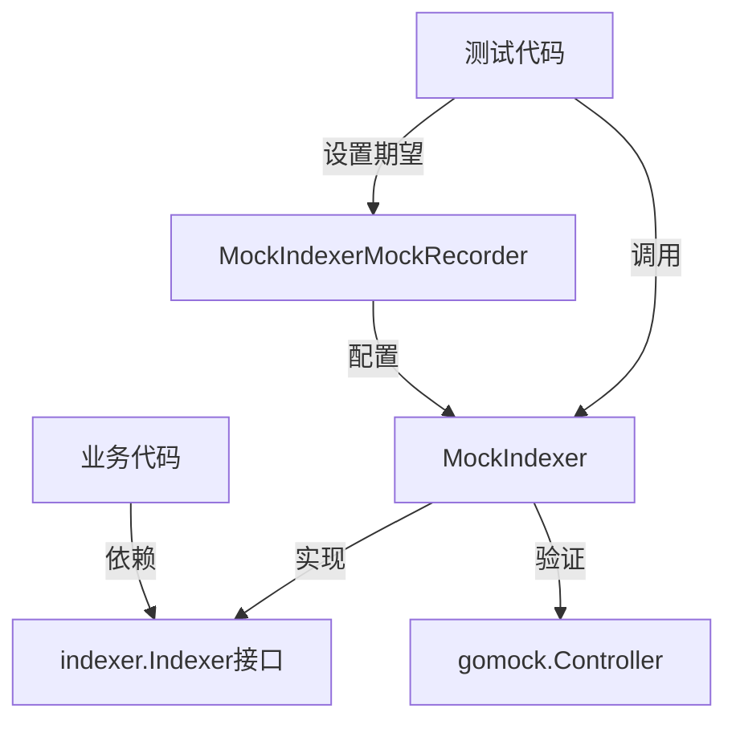

# indexer_component_mocks 模块深度解析

## 1. 模块概览

`indexer_component_mocks` 模块是 eino 框架中专门为测试目的设计的组件，它为 `indexer.Indexer` 接口提供了 mock 实现。这个模块使用 GoMock 工具生成，主要解决的问题是：**在没有真实索引系统的情况下，如何可靠地测试依赖 Indexer 接口的代码？**

想象一下，在开发一个需要将文档存入知识库的功能时，你不想每次运行测试都启动一个真实的向量数据库——这个 mock 组件就像一个"数字替身"，能精准模拟 Indexer 的行为，让你可以专注于测试业务逻辑，而不用处理基础设施的复杂性。

## 2. 核心组件分析

### 2.1 MockIndexer 结构体

**作用**：实现了 `indexer.Indexer` 接口的 mock 对象，能够记录和验证方法调用。

```go
type MockIndexer struct {
	ctrl     *gomock.Controller
	recorder *MockIndexerMockRecorder
}
```

**内部结构解析**：
- `ctrl`：GoMock 的控制器，负责管理 mock 对象的生命周期和验证调用
- `recorder`：调用记录器，用于设置对方法调用的期望

**关键方法**：

1. **NewMockIndexer** - 工厂方法
   ```go
   func NewMockIndexer(ctrl *gomock.Controller) *MockIndexer
   ```
   这是创建 mock 实例的标准方式，需要传入 GoMock 控制器。

2. **EXPECT** - 期望设置入口
   ```go
   func (m *MockIndexer) EXPECT() *MockIndexerMockRecorder
   ```
   返回一个记录器对象，用于设置对 mock 方法调用的期望。这是链式调用的起点。

3. **Store** - 接口实现
   ```go
   func (m *MockIndexer) Store(ctx context.Context, docs []*schema.Document, opts ...indexer.Option) ([]string, error)
   ```
   这是对 `Indexer` 接口核心方法的实现。它不是真正存储文档，而是：
   - 标记测试辅助函数
   - 收集所有参数（包括可变参数 opts）
   - 通过控制器调用预先设置的期望行为
   - 返回预设的结果

### 2.2 MockIndexerMockRecorder 结构体

**作用**：提供类型安全的 API 来设置对 MockIndexer 方法调用的期望。

```go
type MockIndexerMockRecorder struct {
	mock *MockIndexer
}
```

**关键方法**：

```go
func (mr *MockIndexerMockRecorder) Store(ctx, docs any, opts ...any) *gomock.Call
```

这个方法：
- 记录对 `Store` 方法的调用期望
- 接受与原方法相同的参数模式（可以是具体值或匹配器）
- 返回一个 `*gomock.Call` 对象，允许进一步配置（如设置返回值、调用次数等）

## 3. 设计理念与架构

### 3.1 设计思想

这个模块体现了测试替身（Test Double）模式中的 Mock 对象模式。它的设计遵循以下理念：

1. **接口隔离**：完全依赖 `indexer.Indexer` 接口，不关心具体实现
2. **行为验证优先**：不仅能提供预设返回值，还能验证方法是否被正确调用
3. **类型安全**：尽管是 mock 实现，但保持了 Go 的类型安全特性

### 3.2 在测试架构中的位置



在这个架构中：
- **测试代码**使用 `MockIndexerMockRecorder` 来设置期望
- **业务代码**依赖 `indexer.Indexer` 接口，并与 `MockIndexer` 交互
- **MockIndexer** 由 `gomock.Controller` 管理，负责验证交互并提供预设行为

## 4. 使用指南与最佳实践

### 4.1 基本用法

在测试中使用 `MockIndexer` 的标准模式：

```go
func TestSomethingWithIndexer(t *testing.T) {
    // 1. 创建 GoMock 控制器
    ctrl := gomock.NewController(t)
    defer ctrl.Finish() // 确保所有期望都被满足

    // 2. 创建 MockIndexer 实例
    mockIndexer := indexer.NewMockIndexer(ctrl)

    // 3. 设置期望
    expectedDocs := []*schema.Document{...}
    expectedIDs := []string{"doc1", "doc2"}
    
    mockIndexer.EXPECT().
        Store(gomock.Any(), expectedDocs, gomock.Any()).
        Return(expectedIDs, nil)

    // 4. 将 mock 传递给被测试代码并执行测试
    result := YourFunctionThatUsesIndexer(mockIndexer)
    
    // 5. 断言结果
    assert.Equal(t, expectedResult, result)
}
```

### 4.2 高级配置

你可以进一步配置期望调用：

```go
// 期望调用恰好一次
mockIndexer.EXPECT().
    Store(gomock.Any(), gomock.Any(), gomock.Any()).
    Return(nil, nil).
    Times(1)

// 期望调用至少两次
mockIndexer.EXPECT().
    Store(gomock.Any(), gomock.Any(), gomock.Any()).
    Return(nil, nil).
    MinTimes(2)

// 设置错误返回
mockIndexer.EXPECT().
    Store(gomock.Any(), gomock.Any(), gomock.Any()).
    Return(nil, errors.New("storage failed"))

// 使用自定义参数匹配器
mockIndexer.EXPECT().
    Store(gomock.Any(), gomock.AssignableToTypeOf([]*schema.Document{}), gomock.Any()).
    Return(expectedIDs, nil)
```

## 5. 设计权衡与决策

### 5.1 代码生成 vs 手动实现

**决策**：使用 GoMock 代码生成。

**理由**：
- **维护成本低**：当 `Indexer` 接口变化时，只需重新生成 mock 代码
- **一致性高**：确保所有 mock 实现遵循相同的模式
- **功能丰富**：自动获得完整的 mock 功能，包括调用记录、验证等

**权衡**：
- 失去了一些手动实现的灵活性
- 生成的代码可能比手动编写的更冗长

### 5.2 行为验证 vs 状态验证

**决策**：优先支持行为验证。

**理由**：
- Indexer 接口本质上是关于交互的（Store 操作），而不是关于状态的
- 在测试中，更关心的是"是否正确调用了 Store 方法"，而不是"mock 对象内部状态如何"

**权衡**：
- 对于简单场景，可能显得有些过度设计
- 需要更多的设置代码

## 6. 注意事项与常见陷阱

### 6.1 忘记调用 ctrl.Finish()

**问题**：如果不调用 `ctrl.Finish()`，设置的期望不会被验证。

**解决方案**：始终使用 `defer ctrl.Finish()`。

### 6.2 参数匹配过于严格

**问题**：如果参数匹配设置得太严格（例如要求完全匹配某个具体值），即使代码逻辑正确，测试也可能失败。

**解决方案**：
- 使用 `gomock.Any()` 匹配不关心的参数
- 使用 `gomock.AssignableToTypeOf()` 进行类型匹配而非值匹配
- 对于复杂参数，考虑使用 `gomock.Cond()` 创建自定义匹配器

### 6.3 过度 mock

**问题**：mock 掉了太多东西，导致测试没有验证真正的逻辑。

**解决方案**：
- 只 mock 外部依赖，测试核心逻辑
- 考虑使用真实实现（如果它足够轻量且确定性）与 mock 结合

## 7. 依赖关系

- **上游依赖**：
  - `github.com/cloudwego/eino/components/indexer` - 定义了被 mock 的接口
  - `github.com/cloudwego/eino/schema` - 提供了 Document 类型
  - `go.uber.org/mock/gomock` - 提供 mock 框架
  
- **被依赖**：主要被测试代码依赖，用于隔离和验证与 Indexer 接口的交互。

与本模块相关的其他 mock 模块：
- [embedding_component_mocks](internal-mock-components-embedding_component_mocks.md) - 类似的 embedding 组件 mock
- [retriever_component_mocks](internal-mock-components-retriever_component_mocks.md) - 类似的 retriever 组件 mock
- [chatmodel_component_mocks](internal-mock-components-chatmodel_component_mocks.md) - 类似的 chatmodel 组件 mock

## 8. 总结

`indexer_component_mocks` 模块是 eino 框架测试基础设施的重要组成部分。它通过 mock 模式，让开发者能够在没有真实索引系统的情况下，可靠地测试与索引功能相关的代码。

这个模块虽然简单（实际上是生成代码），但它体现了良好的测试实践和设计理念，是构建可测试、可维护系统的重要工具。
