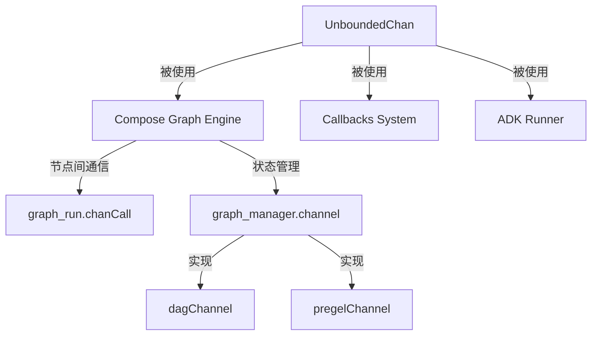
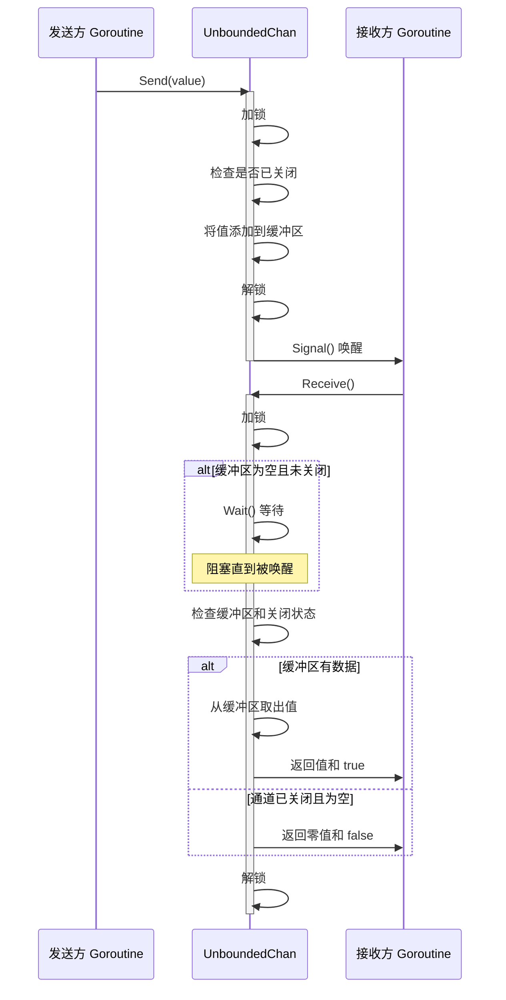

# internal_channel 模块技术深度解析

## 1. 模块概述

`internal_channel` 模块提供了一个无界通道的实现，解决了 Go 语言内置通道容量有限的问题。在复杂的并发系统中，特别是在需要处理不确定数量消息的场景下，固定容量的通道可能导致发送方阻塞或消息丢失。`UnboundedChan` 的设计目标是提供一个可以无限增长的通道，同时保持与内置通道相似的使用体验。

想象一下，你正在经营一家邮局，传统的邮箱有固定的大小，如果邮件太多就装不下了。`UnboundedChan` 就像是一个可以无限扩展的邮箱，无论有多少邮件都能装下，而且邮递员和取件人可以同时工作，不会因为邮箱满了而耽误事情。

## 2. 架构与数据流程

### 2.1 组件架构

虽然 `UnboundedChan` 是一个相对独立的底层组件，但它在整个系统中扮演着重要的角色。以下是它可能的使用场景和与其他组件的关系：



### 2.2 数据流程

`UnboundedChan` 的数据流程非常简单直接，但设计精巧：



## 3. 核心组件解析

### 3.1 UnboundedChan 结构体

`UnboundedChan` 是一个泛型结构体，使用类型参数 `T` 来支持任意类型的数据传输。

```go
type UnboundedChan[T any] struct {
    buffer   []T        // 内部缓冲区存储数据
    mutex    sync.Mutex // 保护缓冲区访问的互斥锁
    notEmpty *sync.Cond // 等待数据的条件变量
    closed   bool       // 指示通道是否已关闭
}
```

**设计意图解析**：
- **泛型支持**：通过类型参数 `T`，使通道可以处理任意类型的数据，提高了代码的复用性。
- **切片作为缓冲区**：使用切片 `buffer` 作为内部存储，利用切片的动态扩容特性实现无界容量。
- **互斥锁保护**：使用 `sync.Mutex` 确保对缓冲区的并发访问安全。
- **条件变量同步**：`notEmpty` 条件变量用于协调发送和接收操作，当缓冲区为空时，接收方可以等待直到有数据可用。
- **关闭状态跟踪**：`closed` 字段用于标记通道是否已关闭，防止在关闭后继续发送数据。

### 3.2 NewUnboundedChan 函数

```go
func NewUnboundedChan[T any]() *UnboundedChan[T] {
    ch := &UnboundedChan[T]{}
    ch.notEmpty = sync.NewCond(&ch.mutex)
    return ch
}
```

**设计意图解析**：
- 初始化一个新的 `UnboundedChan` 实例。
- 重要的是将条件变量 `notEmpty` 与互斥锁 `mutex` 关联起来，这是条件变量正确工作的关键。

### 3.3 Send 方法

```go
func (ch *UnboundedChan[T]) Send(value T) {
    ch.mutex.Lock()
    defer ch.mutex.Unlock()

    if ch.closed {
        panic("send on closed channel")
    }

    ch.buffer = append(ch.buffer, value)
    ch.notEmpty.Signal() // 唤醒一个等待接收的 goroutine
}
```

**设计意图解析**：
- **互斥锁保护**：确保在修改缓冲区时不会有其他 goroutine 同时访问。
- **关闭检查**：在发送前检查通道是否已关闭，如果已关闭则 panic，这与内置通道的行为一致。
- **动态扩容**：使用 `append` 向切片添加元素，利用 Go 切片的自动扩容机制实现无界容量。
- **条件变量通知**：使用 `Signal` 唤醒一个等待接收的 goroutine，告知有新数据可用。选择 `Signal` 而不是 `Broadcast` 是因为每次只添加一个元素，只需要唤醒一个接收者。

### 3.4 Receive 方法

```go
func (ch *UnboundedChan[T]) Receive() (T, bool) {
    ch.mutex.Lock()
    defer ch.mutex.Unlock()

    for len(ch.buffer) == 0 && !ch.closed {
        ch.notEmpty.Wait() // 等待直到有数据可用
    }

    if len(ch.buffer) == 0 {
        // 通道已关闭且为空
        var zero T
        return zero, false
    }

    val := ch.buffer[0]
    ch.buffer = ch.buffer[1:]
    return val, true
}
```

**设计意图解析**：
- **互斥锁保护**：确保在读取和修改缓冲区时不会有其他 goroutine 同时访问。
- **条件等待**：使用 `for` 循环而不是 `if` 语句来检查条件，这是条件变量使用的最佳实践，可以防止虚假唤醒。
- **关闭处理**：当通道已关闭且缓冲区为空时，返回类型的零值和 `false`，这与内置通道的行为一致。
- **元素移除**：从缓冲区头部取出元素，并通过重新切片的方式移除该元素。这里需要注意的是，这种方式不会立即释放切片的底层数组内存，但在大多数情况下，Go 的垃圾回收机制会处理好这个问题。

### 3.5 Close 方法

```go
func (ch *UnboundedChan[T]) Close() {
    ch.mutex.Lock()
    defer ch.mutex.Unlock()

    if !ch.closed {
        ch.closed = true
        ch.notEmpty.Broadcast() // 唤醒所有等待的 goroutine
    }
}
```

**设计意图解析**：
- **互斥锁保护**：确保在修改关闭状态时不会有其他 goroutine 同时访问。
- **幂等性**：只在通道未关闭时执行关闭操作，确保关闭操作是幂等的。
- **广播通知**：使用 `Broadcast` 唤醒所有等待接收的 goroutine，告知它们通道已关闭，这样它们可以正确处理关闭状态。

## 4. 设计决策与权衡

### 4.1 无界 vs 有界

**决策**：实现无界通道。

**权衡分析**：
- **优点**：
  - 发送方永远不会因为通道满而阻塞，这在某些场景下是至关重要的。
  - 简化了发送方的逻辑，不需要处理通道满的情况。
- **缺点**：
  - 可能导致内存使用无限增长，如果发送方速度远快于接收方，可能会导致内存溢出。
  - 没有背压机制，接收方无法控制发送方的速度。

**适用场景**：
- 发送方和接收方速度大致匹配的场景。
- 消息数量有合理上限的场景。
- 需要确保发送方不被阻塞的场景。

### 4.2 使用切片作为缓冲区

**决策**：使用切片作为内部缓冲区。

**权衡分析**：
- **优点**：
  - 实现简单，利用 Go 语言内置的切片功能。
  - 自动扩容，不需要手动管理内存。
- **缺点**：
  - 切片的扩容策略可能导致内存浪费，因为它会预留额外的空间。
  - 从切片头部移除元素时，不会立即释放底层数组的内存。

**替代方案**：
- 使用链表作为缓冲区，可以更精确地控制内存使用，但实现会更复杂，性能可能稍差。

### 4.3 条件变量 vs 其他同步机制

**决策**：使用互斥锁和条件变量的组合。

**权衡分析**：
- **优点**：
  - 经典的生产者-消费者模式实现，易于理解和维护。
  - 条件变量提供了高效的等待和通知机制。
- **缺点**：
  - 需要正确处理条件变量的使用，否则可能导致死锁或饥饿。
  - 互斥锁的使用可能会成为性能瓶颈，特别是在高并发场景下。

**替代方案**：
- 使用 `sync.Pool`，但它不适合作为通道使用。
- 使用无锁数据结构，实现复杂，容易出错。

### 4.4 关闭时的行为

**决策**：
- 向已关闭的通道发送数据会 panic。
- 从已关闭的通道接收数据会立即返回零值和 false。
- 关闭操作是幂等的。

**权衡分析**：
- **优点**：
  - 与 Go 内置通道的行为一致，降低了学习成本。
  - 幂等的关闭操作简化了使用逻辑。
- **缺点**：
  - 发送方需要确保不会向已关闭的通道发送数据，否则会 panic。
  - 没有提供一种安全的方式来检查通道是否已关闭（除了尝试发送或接收）。

## 5. 使用指南与最佳实践

### 5.1 基本使用

```go
// 创建一个无界通道
ch := internal.NewUnboundedChan[int]()

// 发送数据
go func() {
    for i := 0; i < 10; i++ {
        ch.Send(i)
    }
    ch.Close()
}()

// 接收数据
for {
    val, ok := ch.Receive()
    if !ok {
        break
    }
    fmt.Println(val)
}
```

### 5.2 最佳实践

1. **确保关闭通道**：使用完通道后，记得关闭它，否则可能导致接收方永远等待。
2. **避免向已关闭的通道发送数据**：在发送前，如果不确定通道是否已关闭，可以考虑使用额外的同步机制来检查。
3. **监控内存使用**：由于是无界通道，要注意监控内存使用情况，防止内存溢出。
4. **考虑背压机制**：如果发送方速度远快于接收方，可以考虑在应用层实现背压机制，例如限制发送速度或在缓冲区达到一定大小时暂停发送。
5. **不要在 Receive 中持有锁执行长时间操作**：Receive 方法会持有互斥锁，直到返回，所以不要在 Receive 中执行长时间操作，否则会阻塞其他操作。

### 5.3 常见陷阱

1. **忘记关闭通道**：这会导致接收方永远阻塞在 Receive 调用上。
2. **向已关闭的通道发送数据**：这会导致 panic，所以发送方需要确保通道未关闭。
3. **在多个 goroutine 中关闭通道**：虽然关闭操作是幂等的，但最好由一个 goroutine 负责关闭通道，以避免逻辑混乱。
4. **假设 Receive 一定会返回数据**：即使 Receive 返回了，也需要检查第二个返回值，以确定是收到了数据还是通道已关闭。

## 6. 依赖关系分析

### 6.1 被依赖关系

虽然 `UnboundedChan` 是一个底层的并发原语，它主要被以下模块使用：

1. **Compose Graph Engine**：在 [Compose Graph Engine](compose_graph_engine.md) 中可能使用 `UnboundedChan` 来实现节点之间的通信和数据流，特别是在处理大量数据传递时需要防止阻塞的场景。

2. **graph_run.chanCall**：在图运行时的通道调用结构，可能使用 `UnboundedChan` 来传递消息。

3. **graph_manager.channel**：图管理器中的通道接口，其实现如 [dagChannel](compose_graph_engine.md) 和 [pregelChannel](compose_graph_engine.md) 可能使用 `UnboundedChan` 作为内部实现的一部分。

### 6.2 数据契约

`UnboundedChan` 是一个相对独立的组件，它不依赖于其他复杂的模块，只使用 Go 语言标准库中的 `sync` 包。这使得它非常灵活，可以在任何需要无界通道的场景中使用。

## 7. 总结

`internal_channel` 模块提供了一个简单但强大的无界通道实现，解决了 Go 内置通道容量有限的问题。它的设计遵循了 Go 语言的并发哲学，使用了经典的互斥锁和条件变量组合，实现了一个高效、易用的并发原语。

虽然它有一些局限性，特别是在内存使用和背压方面，但在适当的场景下，它是一个非常有用的工具。作为一个底层组件，它为更高层次的抽象提供了基础，使得构建复杂的并发系统变得更加容易。
