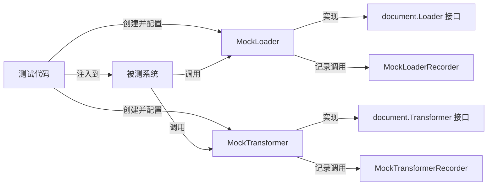

# document_component_mocks 模块技术深度解析

## 1. 模块概述与问题空间

### 1.1 问题背景

在构建涉及文档处理的复杂系统时，文档加载器（Loader）和变换器（Transformer）是核心组件。然而，在编写单元测试和集成测试时，使用真实的文档处理组件会带来几个问题：

- **测试速度慢**：真实的文档加载可能涉及文件系统、网络或其他外部资源
- **不可预测性**：真实组件的行为可能受外部环境影响，导致测试不稳定
- **难以控制**：很难精确控制真实组件返回的结果以测试各种边界情况
- **依赖复杂**：真实组件可能依赖复杂的配置或环境

`document_component_mocks` 模块正是为了解决这些问题而设计的。它提供了 `Loader` 和 `Transformer` 接口的完整 mock 实现，使测试变得快速、可控且可靠。

### 1.2 模块定位

本模块位于 `internal_runtime_and_mocks` 包下，属于测试基础设施的核心组成部分。它不是为生产环境设计的，而是专门为测试文档处理流程的组件提供支持。

## 2. 核心组件与设计意图

### 2.1 MockLoader

`MockLoader` 是 `document.Loader` 接口的 mock 实现，用于模拟文档加载行为。

**设计意图**：
- 完全遵循 `Loader` 接口契约，确保可以无缝替换真实实现
- 提供灵活的行为配置，允许测试者预设加载结果
- 支持调用验证，确保被测组件按预期调用加载器

**核心方法**：
- `Load(ctx context.Context, src document.Source, opts ...document.LoaderOption) ([]*schema.Document, error)`：模拟文档加载方法
- `EXPECT() *MockLoaderMockRecorder`：返回录制器对象，用于设置预期行为

### 2.2 MockLoaderMockRecorder

`MockLoaderMockRecorder` 是与 `MockLoader` 配套的录制器，用于配置和验证 `MockLoader` 的行为。

**设计意图**：
- 提供流畅的 API 来设置预期的方法调用
- 支持参数匹配，允许精确控制何时触发特定的 mock 行为
- 支持返回值配置，允许测试者完全控制 mock 的输出

### 2.3 MockTransformer

`MockTransformer` 是 `document.Transformer` 接口的 mock 实现，用于模拟文档变换行为。

**设计意图**：
- 与 `MockLoader` 类似，但针对文档变换场景
- 可以模拟文档的拆分、合并、转换等各种处理操作
- 支持验证变换操作是否按预期被调用

**核心方法**：
- `Transform(ctx context.Context, src []*schema.Document, opts ...document.TransformerOption) ([]*schema.Document, error)`：模拟文档变换方法
- `EXPECT() *MockTransformerMockRecorder`：返回录制器对象

### 2.4 MockTransformerMockRecorder

`MockTransformerMockRecorder` 是与 `MockTransformer` 配套的录制器。

## 3. 架构与数据流程

### 3.1 模块架构关系



### 3.2 典型使用流程

1. **创建控制器**：测试代码首先创建 `gomock.Controller` 实例
2. **创建 mock 对象**：使用 `NewMockLoader` 和 `NewMockTransformer` 创建 mock 实例
3. **配置预期行为**：通过 `EXPECT()` 方法获取录制器，设置预期的调用和返回值
4. **注入依赖**：将 mock 对象注入到被测系统中
5. **执行测试**：运行被测系统的业务逻辑
6. **验证交互**：mock 框架会自动验证所有预期的调用是否按预期发生

## 4. 设计决策与权衡

### 4.1 使用 MockGen 生成代码

**决策**：使用 Go 官方的 MockGen 工具自动生成 mock 代码，而不是手动实现。

**原因**：
- **一致性**：确保 mock 实现与接口定义完全一致
- **维护性**：当接口变更时，只需重新生成 mock 代码
- **完整性**：MockGen 生成的代码包含完整的调用验证和参数匹配功能
- **标准化**：团队成员熟悉 MockGen 模式，降低学习成本

**权衡**：
- 生成的代码看起来比较冗长，但这是为了提供完整功能
- 依赖 MockGen 工具链，增加了开发环境的依赖

### 4.2 严格的契约遵循

**决策**：mock 实现严格遵循原始接口的契约，不添加额外的公共方法。

**原因**：
- **可替换性**：确保 mock 可以在任何接受原始接口的地方使用
- **测试真实性**：避免测试代码依赖 mock 特有的功能，导致测试通过但生产代码失败
- **接口隔离**：保持接口的纯净性，mock 只是实现，不改变契约

### 4.3 录制器模式

**决策**：使用独立的录制器对象来配置预期行为，而不是直接在 mock 对象上配置。

**原因**：
- **API 清晰度**：将 mock 对象的使用接口和配置接口分离
- **流畅性**：录制器可以提供更流畅的链式调用 API
- **关注点分离**：mock 对象负责在测试中扮演依赖角色，录制器负责设置行为

## 5. 使用指南与最佳实践

### 5.1 基本使用示例

```go
func TestDocumentProcessing(t *testing.T) {
    // 1. 创建 mock 控制器
    ctrl := gomock.NewController(t)
    defer ctrl.Finish() // 确保所有预期都被验证

    // 2. 创建 mock 实例
    mockLoader := document.NewMockLoader(ctrl)
    mockTransformer := document.NewMockTransformer(ctrl)

    // 3. 配置预期行为
    expectedDocs := []*schema.Document{
        {Content: "test document 1"},
        {Content: "test document 2"},
    }
    
    // 设置 Load 方法的预期调用
    mockLoader.EXPECT().
        Load(gomock.Any(), gomock.Any(), gomock.Any()).
        Return(expectedDocs, nil)
    
    // 设置 Transform 方法的预期调用，带参数匹配
    mockTransformer.EXPECT().
        Transform(gomock.Any(), expectedDocs, gomock.Any()).
        Return(expectedDocs, nil)

    // 4. 创建被测系统并注入 mock
    processor := NewDocumentProcessor(mockLoader, mockTransformer)
    
    // 5. 执行测试
    result, err := processor.Process(context.Background(), "test-source")
    
    // 6. 断言结果
    assert.NoError(t, err)
    assert.Equal(t, expectedDocs, result)
}
```

### 5.2 高级使用技巧

**精确参数匹配**：
```go
// 只在特定源时返回特定结果
specificSource := document.NewFileSource("/path/to/specific/file")
mockLoader.EXPECT().
    Load(gomock.Any(), specificSource, gomock.Any()).
    Return(specificDocs, nil)
```

**多次调用返回不同结果**：
```go
mockLoader.EXPECT().
    Load(gomock.Any(), gomock.Any(), gomock.Any()).
    Return(firstBatch, nil).
    Times(1)

mockLoader.EXPECT().
    Load(gomock.Any(), gomock.Any(), gomock.Any()).
    Return(secondBatch, nil).
    Times(1)
```

**验证调用顺序**：
```go
firstCall := mockLoader.EXPECT().Load(...).Return(...)
secondCall := mockTransformer.EXPECT().Transform(...).Return(...)

gomock.InOrder(firstCall, secondCall)
```

## 6. 注意事项与常见陷阱

### 6.1 控制器生命周期

**陷阱**：忘记调用 `ctrl.Finish()`，导致预期调用验证不执行。

**解决方案**：始终使用 `defer ctrl.Finish()` 确保验证执行。

### 6.2 过度指定

**陷阱**：在测试中指定过多不必要的细节，导致测试脆弱。

**解决方案**：只指定与测试目的相关的行为，使用 `gomock.Any()` 匹配不关心的参数。

### 6.3 测试实现而非行为

**陷阱**：测试代码过度关注 mock 的调用方式，而不是被测系统的实际行为。

**解决方案**：专注于验证结果，只有在调用顺序或调用次数对业务逻辑至关重要时才验证交互。

### 6.4 忽略上下文

**陷阱**：在 mock 设置中完全忽略 context 参数，可能错过重要的取消或超时行为。

**解决方案**：如果 context 对测试很重要，可以创建匹配特定 context 值的匹配器。

## 7. 依赖关系

### 7.1 被依赖模块

- `github.com/cloudwego/eino/components/document`：定义了 `Loader` 和 `Transformer` 接口
- `github.com/cloudwego/eino/schema`：定义了 `Document` 数据结构
- `go.uber.org/mock/gomock`：提供 mock 框架核心功能

### 7.2 典型依赖者

任何测试代码，只要需要测试依赖 `Loader` 或 `Transformer` 接口的组件，都可能使用本模块。这包括但不限于：
- 文档处理流水线测试
- 索引构建器测试
- RAG（检索增强生成）系统测试

## 8. 总结

`document_component_mocks` 模块是一个精心设计的测试基础设施组件，它通过提供 `Loader` 和 `Transformer` 接口的完整 mock 实现，解决了文档处理组件测试中的核心痛点。

该模块的设计体现了几个重要原则：
- **契约优先**：严格遵循原始接口，确保可替换性
- **工具驱动**：利用 MockGen 生成代码，保证一致性和可维护性
- **关注测试体验**：提供流畅的 API 来配置和验证行为

对于新加入团队的开发者，理解这个模块的设计意图和使用方法，将帮助他们编写更高质量、更可靠的测试代码。
