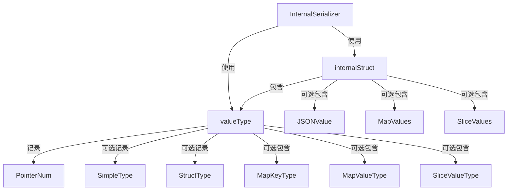

# Internal Serialization Engine 技术深度解析

## 1. 模块概述

### 问题空间

在构建一个复杂的工作流编排系统时，我们面临一个核心挑战：如何可靠地序列化和反序列化各种类型的数据，同时保留它们的完整类型信息？标准的 JSON 序列化存在几个关键缺陷：

1. **类型信息丢失**：当序列化为 JSON 时，`int` 和 `int64` 都会变成 JSON 数字，`map[string]any` 和自定义结构体都会变成 JSON 对象，反序列化时无法精确还原原始类型。
2. **指针层次丢失**：`*int` 和 `**int` 在 JSON 中都会被序列化为相同的值，反序列化时无法重建指针链。
3. **接口类型处理困难**：当序列化 `interface{}` 类型的值时，标准 JSON 序列化只能保存值的内容，无法保存其实际类型信息。

### 设计洞察

`InternalSerializer` 的核心思想是：**在序列化数据时，同时保存数据的内容和完整的类型元数据**。这就像给每个数据对象贴上一个详细的"标签"，不仅描述它是什么值，还描述它是什么类型、有多少层指针、如果是容器类型还描述其元素类型等。

## 2. 核心架构

### 数据结构关系图



### 核心组件职责

- **InternalSerializer**：对外提供统一的 Marshal/Unmarshal 接口，协调整个序列化流程
- **internalStruct**：序列化过程中的中间表示，同时保存类型信息和数据内容
- **valueType**：类型元数据的载体，完整描述一个值的类型信息（包括指针层次、容器元素类型等）

## 3. 数据流转

### 序列化流程

当调用 `InternalSerializer.Marshal(v)` 时，数据经历以下转换：

1. **类型提取**：通过 `internalMarshal` 分析输入值的类型和内容
2. **中间表示构建**：将值转换为 `internalStruct` 格式，同时构建对应的 `valueType`
3. **最终序列化**：使用 sonic 将 `internalStruct` 序列化为 JSON 字节流

关键路径：
```
输入值 → internalMarshal → internalStruct → sonic.Marshal → JSON 字节流
```

### 反序列化流程

当调用 `InternalSerializer.Unmarshal(data, v)` 时，数据经历以下转换：

1. **中间表示解析**：使用 sonic 将 JSON 字节流解析为 `internalStruct`
2. **类型重建**：根据 `valueType` 信息恢复原始类型
3. **值填充**：通过递归的 `internalUnmarshal` 将数据填充到目标对象中

关键路径：
```
JSON 字节流 → sonic.Unmarshal → internalStruct → internalUnmarshal → 目标对象
```

## 4. 核心组件深度解析

### 4.1 valueType 结构体

**设计意图**：`valueType` 是整个序列化引擎的核心，它的职责是完整记录一个值的所有类型信息。

**内部结构**：
- `PointerNum`：记录指针的层数，例如 `***int` 的 `PointerNum` 为 3
- `SimpleType`：对于基本类型，记录其注册的类型键（如 "_eino_int"）
- `StructType`：对于结构体类型，记录其注册的类型键
- `MapKeyType/MapValueType`：对于 map 类型，分别记录键和值的类型
- `SliceValueType`：对于 slice/array 类型，记录元素的类型

**设计亮点**：采用递归结构，能够描述任意复杂的嵌套类型，例如 `map[string][]*int` 这样的类型也能被完整记录。

### 4.2 internalStruct 结构体

**设计意图**：`internalStruct` 是序列化过程中的中间表示，它将类型信息和数据内容结合在一起。

**内部结构**：
- `Type`：指向 `valueType` 的指针，保存类型元数据
- `JSONValue`：对于基本类型和实现了 json.Marshaler/json.Unmarshaler 的类型，直接保存 JSON 格式的数据
- `MapValues`：对于 map 和结构体类型，保存键值对形式的数据
- `SliceValues`：对于 slice 和 array 类型，保存序列形式的数据

**设计决策**：
- 为什么需要三种不同的数据存储方式？因为不同类型的数据有不同的最佳表示方式：
  - 基本类型和自定义序列化类型：直接用 JSON 最有效
  - Map 和结构体：键值对形式最自然
  - Slice 和数组：序列形式最直观

### 4.3 InternalSerializer 结构体

**设计意图**：提供简洁的对外接口，隐藏复杂的序列化实现细节。

**核心方法**：

#### Marshal 方法

```go
func (i *InternalSerializer) Marshal(v any) ([]byte, error)
```

**参数**：`v any` - 要序列化的任意值
**返回值**：序列化后的 JSON 字节流和可能的错误

**内部流程**：
1. 调用 `internalMarshal` 将输入值转换为 `internalStruct`
2. 使用 sonic 库将 `internalStruct` 序列化为 JSON

**设计亮点**：将复杂的类型处理逻辑封装在 `internalMarshal` 中，对外保持简洁的接口。

#### Unmarshal 方法

```go
func (i *InternalSerializer) Unmarshal(data []byte, v any) error
```

**参数**：
- `data []byte` - 要反序列化的 JSON 字节流
- `v any` - 目标对象（必须是非 nil 指针）

**返回值**：可能的错误

**内部流程**：
1. 先将 JSON 解析为 `internalStruct`
2. 调用 `internalUnmarshal` 根据类型信息恢复值
3. 使用递归的 `set` 函数处理类型转换和指针解引用，将值赋给目标对象

**设计亮点**：`set` 函数是一个精妙的设计，它能够处理：
- 指针的自动解引用和创建
- 可赋值类型的直接赋值
- 可转换类型的自动转换

## 5. 类型注册机制

### 设计意图

为了能够在序列化和反序列化过程中正确识别和重建类型，系统需要一个类型注册表，建立类型和字符串键之间的双向映射。

### 核心实现

```go
var m = map[string]reflect.Type{}  // 键到类型的映射
var rm = map[reflect.Type]string{} // 类型到键的映射
```

### GenericRegister 函数

```go
func GenericRegister[T any](key string) error
```

**参数**：
- `T any` - 要注册的类型（通过泛型参数指定）
- `key string` - 与该类型关联的唯一字符串键

**返回值**：如果键或类型已注册，返回错误

**设计亮点**：
- 使用泛型提供类型安全的注册方式
- 自动解引用指针类型，确保 `*int` 和 `int` 注册为相同的类型
- 双向映射确保可以从类型查键，也可以从键查类型

### 预注册类型

在 `init` 函数中，系统预注册了所有基本类型，使用 "_eino_" 前缀避免命名冲突：
- 整数类型：`int`, `int8`, `int16`, `int32`, `int64` 等
- 无符号整数类型：`uint`, `uint8` 等
- 浮点类型：`float32`, `float64`
- 复数类型：`complex64`, `complex128`
- 其他：`bool`, `string`, `any` 等

## 6. 关键算法解析

### 6.1 internalMarshal - 递归序列化

**核心逻辑**：`internalMarshal` 是一个递归函数，它根据值的类型选择不同的序列化策略：

1. **空值处理**：如果值是 nil 或者是零值（且不是接口类型），直接返回 nil
2. **指针解引用**：循环解引用指针，记录指针层数
3. **类型分支**：根据值的种类（struct/map/slice/array/basic）选择不同的处理路径

**结构体处理**：
- 如果实现了 json.Marshaler/json.Unmarshaler，直接使用 JSON 序列化
- 否则，遍历所有导出字段，递归序列化每个字段

**Map 处理**：
- 将键序列化为字符串
- 递归序列化每个值
- 保存到 `MapValues` 中

**Slice/Array 处理**：
- 遍历每个元素，递归序列化
- 保存到 `SliceValues` 中

**基本类型处理**：
- 直接使用 JSON 序列化

### 6.2 internalUnmarshal - 递归反序列化

**核心逻辑**：`internalUnmarshal` 是 `internalMarshal` 的逆过程，根据 `internalStruct` 中的信息重建原始值：

1. **类型明确 vs 类型不明确**：
   - 如果 `Type` 为 nil，说明类型是明确的（目标类型已知），直接按目标类型处理
   - 如果 `Type` 不为 nil，说明类型是不明确的，需要根据 `Type` 信息重建类型

2. **类型分支**：
   - 基本类型：直接使用 JSON 反序列化
   - 结构体类型：创建结构体实例，递归设置每个字段
   - Map 类型：创建 map，递归设置每个键值对
   - Slice/Array 类型：创建 slice/array，递归设置每个元素

### 6.3 自定义序列化类型检测

```go
func checkMarshaler(t reflect.Type) bool
```

**设计意图**：检测一个类型是否实现了自定义的 JSON 序列化接口。

**实现逻辑**：检查类型是否实现了 `json.Marshaler` 和 `json.Unmarshaler` 接口（包括指针接收器的情况）。

**设计决策**：为什么需要同时实现两个接口？因为如果一个类型只有自定义序列化而没有自定义反序列化，或者反过来，会导致序列化和反序列化不对称，可能引起数据丢失或错误。

## 7. 设计权衡与决策

### 7.1 类型安全 vs 灵活性

**决策**：通过类型注册机制，在保持灵活性的同时提供类型安全。

**权衡分析**：
- ✅ 优点：可以处理任意注册的类型，包括自定义结构体
- ❌ 缺点：需要预先注册类型，增加了使用成本

**为什么这样设计**：在一个工作流系统中，类型的数量是相对有限且可预测的，预先注册的成本是可控的，而类型安全带来的好处是巨大的。

### 7.2 性能 vs 完整性

**决策**：优先保证类型信息的完整性，其次考虑性能。

**权衡分析**：
- ✅ 优点：可以完美重建原始类型和值
- ❌ 缺点：序列化后的 JSON 体积更大，序列化/反序列化过程更复杂

**为什么这样设计**：在工作流编排场景中，数据的正确性和完整性比性能更重要。较大的 JSON 体积和稍慢的速度是可以接受的权衡。

### 7.3 sonic  vs 标准 encoding/json

**决策**：使用 sonic 库而不是标准库的 encoding/json。

**权衡分析**：
- ✅ 优点：sonic 是一个高性能的 JSON 库，比标准库快很多
- ❌ 缺点：增加了外部依赖

**为什么这样设计**：虽然增加了外部依赖，但性能提升是显著的，特别是在处理大型数据结构时。sonic 已经是一个广泛使用的成熟库，风险可控。

## 8. 使用指南与最佳实践

### 8.1 基本使用

```go
// 创建序列化器
serializer := &serialization.InternalSerializer{}

// 序列化
data := map[string]int{"foo": 42, "bar": 123}
bytes, err := serializer.Marshal(data)

// 反序列化
var result map[string]int
err = serializer.Unmarshal(bytes, &result)
```

### 8.2 注册自定义类型

```go
// 定义自定义类型
type MyStruct struct {
    Field1 string
    Field2 int
}

// 注册类型
err := serialization.GenericRegister[MyStruct]("my_struct")
if err != nil {
    // 处理错误
}

// 现在可以序列化和反序列化 MyStruct 类型了
```

### 8.3 实现自定义序列化

如果你的类型需要特殊的序列化逻辑，可以实现 `json.Marshaler` 和 `json.Unmarshaler` 接口：

```go
type CustomType struct {
    // 字段
}

func (c CustomType) MarshalJSON() ([]byte, error) {
    // 自定义序列化逻辑
}

func (c *CustomType) UnmarshalJSON(data []byte) error {
    // 自定义反序列化逻辑
}
```

**注意**：必须同时实现两个接口，否则自定义序列化不会被使用。

## 9. 边缘情况与陷阱

### 9.1 未导出字段

**陷阱**：`internalMarshal` 只会处理导出字段（首字母大写），未导出字段会被忽略。

**后果**：如果你的结构体包含未导出字段，序列化后这些字段的信息会丢失。

**建议**：确保需要序列化的字段都是导出的，或者实现自定义序列化接口。

### 9.2 接口类型

**陷阱**：序列化接口类型的值时，必须确保该值的具体类型已经注册。

**后果**：如果类型未注册，序列化会失败。

**建议**：在使用接口类型之前，先注册所有可能的具体类型。

### 9.3 循环引用

**陷阱**：当前实现不处理循环引用。

**后果**：如果数据结构包含循环引用，序列化会导致无限递归和栈溢出。

**建议**：避免序列化包含循环引用的数据结构，或者在序列化前打破循环引用。

### 9.4 非字符串键的 Map

**陷阱**：虽然代码尝试处理非字符串键的 map，但 JSON 只支持字符串键。

**后果**：非字符串键会被序列化为 JSON 字符串，反序列化时再转换回原类型。对于某些复杂类型，这可能导致信息丢失。

**建议**：尽量使用字符串键的 map，或者考虑使用 slice 代替。

### 9.5 零值处理

**陷阱**：对于非接口类型的零值，`internalMarshal` 会返回 nil。

**后果**：零值和 nil 在某些情况下可能会被混淆。

**建议**：了解这个行为，确保你的代码能够正确处理这种情况。

## 10. 总结

`InternalSerializer` 是一个精心设计的序列化引擎，它解决了标准 JSON 序列化中类型信息丢失的问题。通过同时保存类型元数据和数据内容，它能够完美重建原始值，包括复杂的嵌套类型和指针链。

虽然它有一些限制和使用成本，但在工作流编排这样的场景中，它的设计权衡是合理的。类型安全和数据完整性是首要考虑，而性能和使用便利性是次要考虑。

对于新加入团队的开发者，理解这个模块的关键是把握"类型元数据+数据内容"的核心思想，以及递归序列化/反序列化的算法设计。
