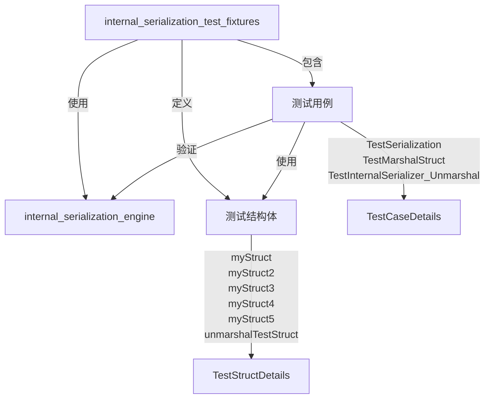

# internal_serialization_test_fixtures 模块技术深度解析

## 1. 模块概述

### 问题空间

在构建复杂的运行时系统时，序列化是一个核心挑战。特别是当涉及到：
- 自定义接口类型
- 指针和多级指针
- 嵌套的复杂数据结构（映射、切片、结构体）
- 自定义序列化/反序列化方法

简单的 JSON 序列化无法处理这些复杂场景，因为它缺乏类型注册机制和对接口类型的支持。`internal_serialization_test_fixtures` 模块正是为了验证和测试内部序列化引擎能够正确处理这些复杂场景而设计的。

### 核心功能

这个模块提供了一套全面的测试基础设施，用于验证 `InternalSerializer` 的正确性和鲁棒性。它包含各种精心设计的测试结构体和测试用例，覆盖了序列化引擎可能遇到的各种边界情况。

## 2. 架构与依赖关系

### 模块定位

```
internal_runtime_and_mocks/
├── internal_serialization_engine/         (被测试的核心引擎)
└── internal_serialization_test_fixtures/  (本模块 - 测试基础设施)
```

### 架构图



### 依赖关系

- **依赖**: 依赖于 `internal_serialization_engine` 模块中的 `InternalSerializer` 和 `GenericRegister`
- **被依赖**: 通常被集成测试和回归测试套件使用

## 3. 核心组件深度解析

### 3.1 测试结构体设计

#### myStruct 和 myInterface
```go
type myInterface interface {
    Method()
}
type myStruct struct {
    A string
}
func (m *myStruct) Method() {}
```

**设计意图**: 这是一个简单的接口实现对，用于测试接口类型的序列化。`myStruct` 实现了 `myInterface`，这样我们可以验证序列化引擎是否能正确处理接口类型的值。

#### myStruct2 - 复杂性的集中体现
```go
type myStruct2 struct {
    A any                    // 任意类型
    B myInterface            // 接口类型
    C map[string]**myStruct  // 多级指针映射
    D map[myStruct]any       // 结构体作为键的映射
    E []any                  // 任意类型切片
    f string                 // 未导出字段
    G myStruct3              // 嵌套结构体
    H *myStruct4             // 指针结构体
    I []*myStruct3           // 指针切片
    J map[string]myStruct3   // 结构体映射
    K myStruct4              // 自定义序列化结构体
    L []*myStruct4           // 自定义序列化指针切片
    M map[string]myStruct4   // 自定义序列化结构体映射
}
```

**设计意图**: 这是一个"瑞士军刀"式的测试结构体，几乎包含了所有可能的复杂场景：
- 任意类型字段 (`any`)
- 接口类型字段
- 多级指针
- 结构体作为映射键
- 未导出字段
- 嵌套结构体
- 自定义序列化类型

**为什么这样设计**: 通过一个结构体就能测试多种复杂场景的组合，确保序列化引擎在处理真实世界的复杂数据结构时不会出现问题。

#### myStruct3 - 简单嵌套结构体
```go
type myStruct3 struct {
    FieldA string
}
```

**设计意图**: 提供一个简单的嵌套结构体类型，用于测试基本的结构体嵌套序列化场景。

#### myStruct4 - 自定义序列化实现
```go
type myStruct4 struct {
    FieldA string
}

func (m *myStruct4) UnmarshalJSON(bytes []byte) error {
    m.FieldA = string(bytes)
    return nil
}

func (m myStruct4) MarshalJSON() ([]byte, error) {
    return []byte(m.FieldA), nil
}
```

**设计意图**: 测试序列化引擎对自定义 `MarshalJSON` 和 `UnmarshalJSON` 方法的支持。注意这里的实现非常简单直接，只是将字段值作为 JSON 字节流处理，这有助于验证引擎是否正确调用了自定义方法。

#### myStruct5 - 另一种自定义序列化
```go
type myStruct5 struct {
    FieldA string
}

func (m *myStruct5) UnmarshalJSON(bytes []byte) error {
    m.FieldA = "FieldA"  // 忽略输入，总是设置为固定值
    return nil
}

func (m myStruct5) MarshalJSON() ([]byte, error) {
    return []byte("1"), nil  // 总是序列化为 "1"
}
```

**设计意图**: 与 `myStruct4` 不同，这个结构体的自定义方法有"副作用"——反序列化时忽略输入，总是设置为固定值。这用于测试更复杂的自定义序列化场景，特别是当自定义方法不完全对称时。

#### unmarshalTestStruct - 基础测试结构体
```go
type unmarshalTestStruct struct {
    Foo string
    Bar int
}
```

**设计意图**: 提供一个简单的、用于基础反序列化测试的结构体。它在 `init` 函数中就被注册，确保在测试运行前已经准备好。

### 3.2 测试函数解析

#### TestSerialization - 全面序列化测试
这个测试函数是模块的核心，它：
1. 注册了多个自定义类型
2. 创建了一个包含各种复杂场景的测试值切片
3. 对每个值进行序列化和反序列化循环
4. 验证原始值和反序列化后的值是否完全相等

**测试的关键场景**:
- 基本类型（整数、字符串）
- 结构体和结构体指针
- 多级指针
- 接口类型
- 切片和映射
- 嵌套数据结构
- `myStruct2` 的完整复杂性

#### TestMarshalStruct - 自定义序列化测试
专门测试 `myStruct5` 的自定义序列化行为，验证：
1. 直接序列化和反序列化 `myStruct5` 实例
2. 在 `map[string]any` 中序列化和反序列化 `myStruct5` 实例

这个测试特别验证了自定义序列化方法在嵌套场景下的正确性。

#### TestInternalSerializer_Unmarshal - 反序列化专项测试
这是最详细的测试函数，分为两个部分：

**成功测试用例**:
- 简单类型
- 结构体类型
- 结构体指针
- 指针到值的转换
- 值到指针的转换
- nil 指针
- 可转换类型（如 int32 到 int64）
- 指针到指针的目标
- 反序列化到 `any` 类型

**错误测试用例**:
- 目标不是指针
- 目标是 nil 指针
- 类型不匹配
- 不可转换类型

## 4. 数据流与执行流程

### 典型测试执行流程

```
1. 类型注册
   ↓
2. 创建测试值（包含各种复杂场景）
   ↓
3. Marshal: InternalSerializer.Marshal(value)
   ↓
4. 生成序列化数据（[]byte）
   ↓
5. Unmarshal: InternalSerializer.Unmarshal(data, &target)
   ↓
6. 比较原始值和目标值
   ↓
7. 断言相等
```

### 关键数据转换路径

以 `myStruct2` 为例，数据流如下：
1. 原始 `myStruct2` 实例包含多个复杂字段
2. 序列化时，引擎遍历每个字段，处理特殊情况（接口、指针、自定义方法）
3. 生成包含类型信息的序列化数据
4. 反序列化时，引擎根据类型信息重建复杂结构
5. 最终得到与原始实例完全相同的副本

## 5. 设计决策与权衡

### 5.1 测试结构体设计策略

**决策**: 创建一个极其复杂的 `myStruct2` 结构体，而不是多个简单的测试结构体。

**权衡**:
- ✅ **优点**: 单个测试就能覆盖多种组合场景
- ✅ **优点**: 能发现单独测试时不会出现的交互问题
- ❌ **缺点**: 测试失败时难以定位具体是哪个字段出了问题
- ❌ **缺点**: 结构体过于复杂，维护成本较高

**为什么这样选择**: 对于序列化引擎这样的核心基础设施，完整性比可调试性更重要。后续有更细分的测试（如 `TestInternalSerializer_Unmarshal`）来帮助定位具体问题。

### 5.2 自定义序列化测试设计

**决策**: 创建两种不同的自定义序列化实现（`myStruct4` 和 `myStruct5`）。

**权衡**:
- ✅ **优点**: 测试了自定义序列化的不同行为模式
- ✅ **优点**: `myStruct5` 的"不对称"序列化能发现更隐蔽的问题
- ❌ **缺点**: 增加了测试的复杂性

**为什么这样选择**: 真实世界中的自定义序列化方法往往不是完美对称的，测试这些场景能提高引擎的鲁棒性。

### 5.3 测试注册策略

**决策**: 类型注册分散在 `init` 函数和测试函数中。

**权衡**:
- ✅ **优点**: `unmarshalTestStruct` 的早期注册确保它随时可用
- ✅ **优点**: 测试内部的注册展示了动态注册的能力
- ❌ **缺点**: 注册位置不统一，可能导致混淆

**为什么这样选择**: 既测试了静态注册（`init` 函数）也测试了动态注册（测试函数内）的场景。

## 6. 使用指南与最佳实践

### 6.1 如何使用这些测试夹具

虽然这些结构体主要用于内部测试，但它们也可以作为参考：

1. **参考设计**: 当你需要创建自己的序列化测试时，可以参考这些结构体的设计思路
2. **类型注册示例**: 展示了如何使用 `GenericRegister` 注册自定义类型
3. **测试模式**: `TestInternalSerializer_Unmarshal` 展示了如何组织全面的表驱动测试

### 6.2 扩展测试夹具

如果你需要添加新的测试场景：

1. **添加新的测试结构体**: 遵循现有命名模式（`myStructX`）
2. **在适当的测试函数中注册和使用**: 简单场景用 `TestInternalSerializer_Unmarshal`，复杂组合场景用 `TestSerialization`
3. **保持独立性**: 新的测试结构体应该专注于测试特定的新场景

## 7. 注意事项与潜在陷阱

### 7.1 未导出字段
注意 `myStruct2` 中的字段 `f string` 是未导出的。序列化引擎通常不会处理未导出字段，这个字段的存在是为了验证引擎能正确忽略它们。

### 7.2 自定义序列化的不对称性
`myStruct5` 展示了自定义序列化方法可能不对称的情况。在使用自定义序列化时要特别小心，确保这是你真正想要的行为。

### 7.3 结构体作为映射键
`myStruct2` 中的 `D map[myStruct]any` 字段测试了结构体作为映射键的场景。不是所有序列化引擎都支持这个特性，使用时要确保你的引擎支持。

### 7.4 多级指针
`myStruct2` 中的 `C map[string]**myStruct` 字段测试了多级指针。虽然在实际代码中多级指针很少见，但在某些边缘情况下可能会出现，测试这些场景能提高引擎的鲁棒性。

## 8. 相关模块

- [internal_serialization_engine](internal_runtime_and_mocks-internal_serialization_engine.md) - 被测试的核心序列化引擎
- [runtime_callbacks_and_execution_context](internal_runtime_and_mocks-runtime_callbacks_and_execution_context.md) - 运行时回调和执行上下文
- [interrupt_and_addressing_runtime_primitives](internal_runtime_and_mocks-interrupt_and_addressing_runtime_primitives.md) - 中断和寻址运行时原语

---

这个测试夹具模块是确保内部序列化引擎质量的关键基础设施，它的全面性和深度直接关系到整个运行时系统的可靠性。
